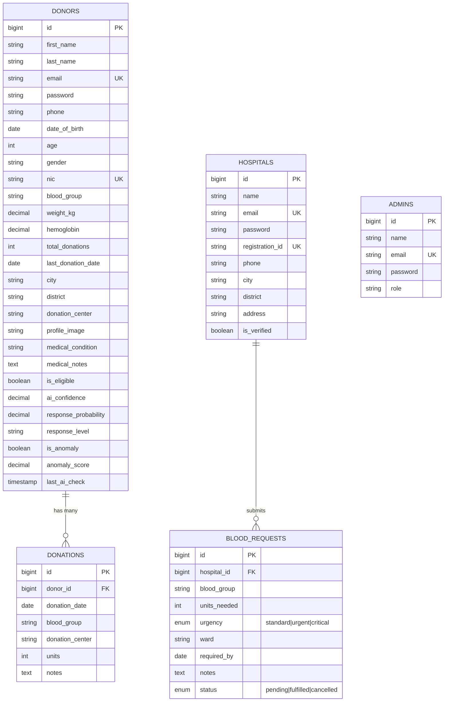
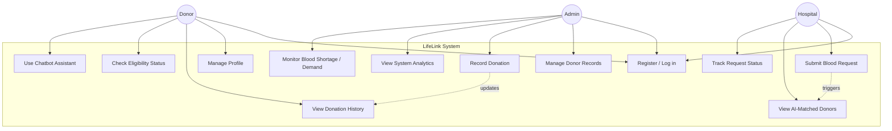
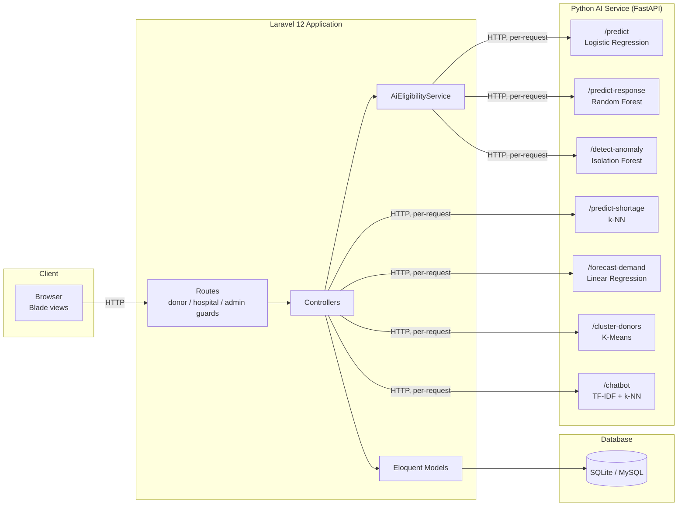

# LifeLink — Updated System Diagrams

These reflect the **actual implemented system**, superseding the proposal's pre-implementation (conceptual) diagrams. Use these for the thesis's System Design chapter.

---

## Figure A — Entity-Relationship Diagram

**Note vs. the proposal's ER diagram:** the proposal's conceptual diagram included an `AI_PREDICTION` table linking donors and requests. In the implemented system, matching is computed **at query time** (an exact blood-group filter, sorted by `ai_confidence`) rather than persisted as a stored prediction record — there is no `AI_PREDICTION` table. This is a deliberate implementation simplification worth discussing in the System Design chapter: it trades away an audit trail of *which* donors were shown for *which* request, in exchange for simplicity.

`ADMINS` has no foreign-key relationship to any other table — admin actions (toggle eligibility, record donation, delete donor) modify `DONORS`/`DONATIONS` directly rather than being logged against the admin's own record.

---

## Figure B — Use Case Diagram

**Note vs. the proposal's use-case diagram:** the proposal names "AI System" as a fourth actor. In strict UML terms this is debatable — an actor is normally an external entity that *initiates* interaction with the system, whereas the AI service here is a backend collaborator invoked *by* the system in response to donor/hospital actions (it never acts independently). The diagram above reflects this by showing the AI's involvement as a system-internal trigger (`UC6 -.-> UC7`) rather than a fourth actor. This distinction is worth a sentence of critical commentary in the report — it's a legitimate architectural point, not just a diagramming nitpick.

---

## Figure C — System Architecture Diagram

**Note:** this architecture diagram makes explicit something the report's Analysis chapter should discuss critically — of the seven AI endpoints, only `/predict` loads a model that was trained offline and persisted to disk (see the AI Model Evaluation Report). The other six either train in-memory at process start or retrain from scratch on every single request. This is an architectural weakness worth surfacing visually as well as in prose: the diagram treats all seven endpoints uniformly, but their underlying reliability is not uniform at all.
