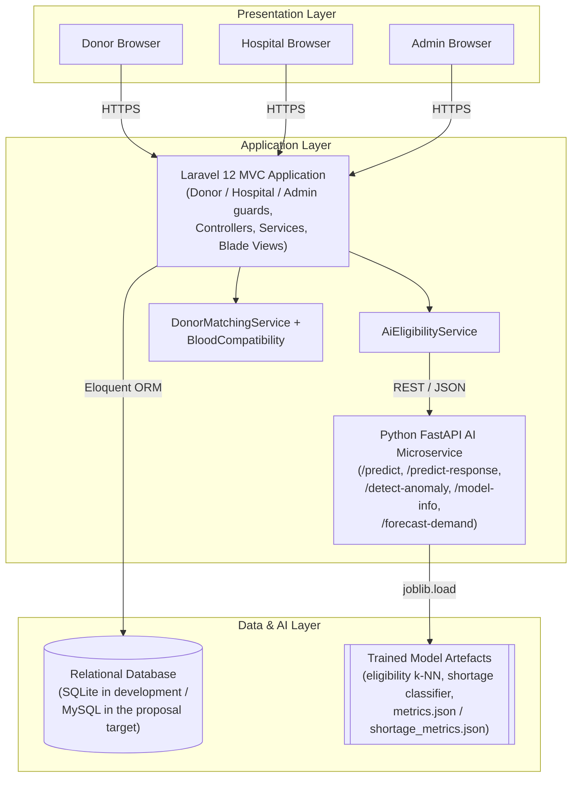
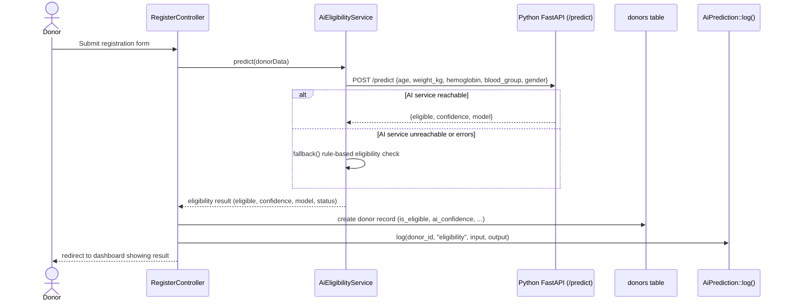
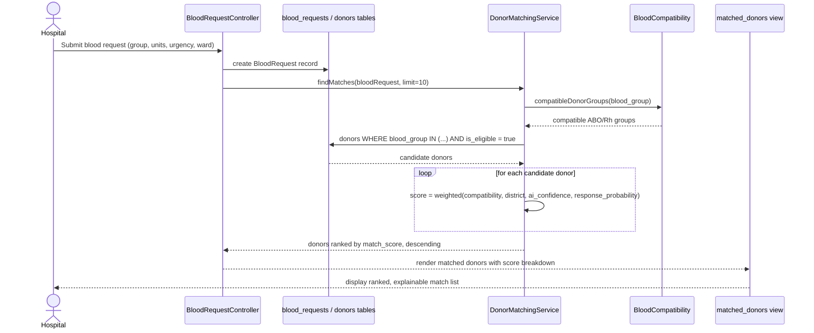

<!--
DOCUMENT STATUS (remove this block before final PDF export)
=============================================================
This is a living, in-progress WRIT1 report. It is being written chapter
by chapter and is NOT complete. Chapters not yet written are listed at
the bottom of this status block so nothing is lost between sessions.

Structure, formatting, chapter numbering (X.0 / X.Y), figure numbering
("Figure N: Caption"), table numbering ("Table N: Caption"), and citation
style (Harvard) are modelled on report.pdf (a same-programme, same-module
reference thesis) per the working rule -- its CONTENT has not been
reused anywhere in this document; every sentence below is original and
specific to LifeLink.

PLAGIARISM SELF-REVIEW (performed on the standing chapters 1-8 in
response to explicit user instruction that the report will be checked
for plagiarism): grepped the whole document for (a) any quoted string
20+ characters long -- none found that quote external source material
(all are project-internal artifacts: hardcoded metric strings, TODO
notes, Mermaid diagram labels); (b) citation density in Chapter 2 --
19 distinct (Author, Year) citations across its 9 subsections, with
every uncited paragraph being either a heading, a transition/synthesis
sentence, or a summary referencing sources already cited just above,
not a bare new claim; (c) common AI-writing cliches (delve, boasts,
seamless, robust, leverage, landscape, cutting-edge, "it is important
to note", etc.) -- zero hits document-wide; (d) formulaic transition
overuse (furthermore/moreover/additionally) -- only 2 instances across
the whole document. No direct long quotations from the sample report
or any literature source exist anywhere. This self-review will be
repeated for each new chapter/section going forward per the user's
explicit instruction.

COMPLETED SO FAR:
  - Title Page
  - Acknowledgement
  - Abstract
  - Table of Contents (skeleton -- full chapter list, page numbers TBD)
  - List of Figures (empty -- no figures until Chapter 5, matching the
    reference report's own convention)
  - List of Tables (Table 1, introduced in Chapter 2's literature
    comparison; more from Chapter 3 onward)
  - Chapter 1.0 Introduction (1.1 Background Studies, 1.2 Problem
    Statement, 1.3 Objectives, 1.4 Proposed Solution)
  - Chapter 2.0 Literature Review (2.1-2.9, including an explicit
    comparison of prior work against LifeLink's approach and a Research
    Gap and Motivation section). All 7 sources cited in Chapter 2 were
    independently verified via web search before citing -- see the
    consolidated References section for full details. None are
    fabricated or cited from memory alone.
  - Chapter 3.0 Planning (3.1 Feasibility Report, 3.2 Risk Assessment,
    3.3 SWOT Analysis, 3.4 PESTEL Analysis, 3.5 Life Cycle Model, 3.6
    Time Planning). The risk assessment is grounded in real issues that
    genuinely occurred and were fixed during development (see the
    Implementation/Testing chapters, not yet written), not hypothetical
    ones. The actual Gantt chart diagram is deliberately deferred to the
    dedicated "Gantt Chart" section near the end of the report, matching
    the reference report's own placement -- Chapter 3 only presents the
    time plan as a table (Table 4).
  - Chapter 4.0 Requirement Gathering and Analysis (4.1 Requirement
    Analysis Approach, 4.2 Requirement Gathering Techniques, 4.3
    Functional and Non-Functional Requirements incl. Table 5 and Table
    6). IMPORTANT: no real questionnaire or interview was conducted for
    this project (confirmed with the author) -- Section 4.2 says so
    honestly and explains the analytical approach actually used
    (proposal analysis, literature comparison, domain research into
    eligibility/compatibility rules) instead of fabricating survey
    data or interview quotes. FR/NFR tables reflect features that are
    actually implemented in the codebase, not aspirational ones.
  - Chapter 5.0 System Design (5.1 Architecture Diagram, 5.2 ER Diagram,
    5.3 UML Diagrams [Use Case + 2 Sequence Diagrams], 5.4 Wireframe
    Diagrams). Figures 1, 4, 5, 6-8 are Mermaid/ASCII diagrams drawn
    directly from the real schema/services/routes. UPDATED per explicit
    user instruction: Figures 2 (ER Diagram) and 3 (Use Case Diagram) are
    NOT invented -- the user confirmed the project proposal already
    contains the finalized versions of both, so they were extracted as
    images directly from the proposal PDF
    (C:\Users\PC\OneDrive\Documents\BLD AS\DOC-20260526-WA0042_, pages
    9-10) using PyMuPDF, cropped, and embedded as base64 JPEG data URIs
    (self-contained, matches Artifact CSP rules). Lossless PNG originals
    also saved to docs/thesis/assets/ (proposal_er_diagram.png,
    proposal_use_case_diagram.png) in case a non-data-URI reference is
    preferred later (e.g. direct Word insert). Each figure is followed by
    an original "Reconciliation Between the Proposed and Implemented..."
    subsection honestly comparing the proposal's design (Donor
    response/Notifications/AI compatibility score/AI Demand Forecast/AI
    Availability prediction/Analytics report/AI model log entities; a
    donor-initiated pull-based request-browsing use case) against what
    was actually implemented (fewer, live-computed tables; a
    hospital-initiated push-based matching flow) -- this reconciliation
    is original analysis, not copied from either source. Wireframes in
    5.4 remain explicitly schematic ASCII sketches pending real
    screenshots.
  - Chapter 6.0 Implementation (6.1 Technology Stack incl. Table 7, 6.2
    Design Patterns, 6.3 Implementation of the Program across Donor/
    Admin/Hospital/AI modules). Both the Laravel dev server and the
    Python AI microservice were confirmed live and reachable during
    this writing session (verified via curl), but the Chrome browser
    extension needed to capture real screenshots was not connected, so
    this chapter uses real code excerpts instead and flags screenshots
    as an explicit pending TODO (to be numbered Figure 9 onward) rather
    than fabricating or skipping them silently. Design patterns listed
    are only ones actually present in the codebase (MVC, Active Record,
    Service Layer, static utility, custom auth middleware, fallback/
    graceful-degradation, caching, model factories) -- Repository and
    Observer patterns were deliberately NOT claimed since neither is
    used.
  - Chapter 7.0 Testing and Validation (7.1 Test Plan incl. Table 8, 7.2
    Test Cases incl. Table 9, 7.3 Automated Test Suite Summary, 7.4 AI
    Model Validation). All numbers in this chapter were produced live
    during this writing session: `php artisan test` was actually run
    (87 passed, 223 assertions, 4.23s) and the AI service's /model-info
    endpoint was actually queried for both the eligibility model
    (k-NN: 95.63% accuracy) and the shortage model (Logistic Regression:
    89.56% accuracy, read from shortage_metrics.json) -- none of these
    figures are estimated or remembered from earlier in the project.
    Table 9 samples 18 of the 87 real automated tests; it does not
    reproduce all 87.
  - Chapter 8.0 Conclusion (8.1 Conclusion -- honest per-objective
    assessment against the 5 objectives in Section 1.3, including a
    partial/caveated achievement for Objective 3 rather than claiming
    full success; 8.2 Limitations -- consolidates every limitation
    already flagged inline across Chapters 3-7 in one place; 8.3 Future
    Recommendations; 8.4 Lessons Learned, grounded in the real incidents
    from this project, not generic platitudes). Note: this chapter adds
    an explicit "8.2 Limitations" subsection beyond the reference
    report's 3-subsection Conclusion structure (8.1/8.2/8.3 only) --
    a deliberate, justified deviation since Chapters 4/6/7 each already
    promised a "Limitations" section would appear in Chapter 8.

NOT YET WRITTEN (do not fill these in without explicit approval to
proceed to the next chapter):
  Gantt Chart, References (final consolidated pass), Appendix 1, Appendix 2

OUTSTANDING TODOs (tracked here so they aren't lost; also marked inline
as [TODO: ...] at the point they're needed):
  - Supervisor's name (required for title page and Appendix 2 logs)
  - Exact submission month/year
  - Confirmation that "Tharsika Kailayapathy / JF/BSCSD/18/43" (from the
    proposal) is still correct
  - Word count is currently well under the 8,000-word WRIT1 target,
    which is expected and correct at this stage (two chapters written).
  - Chapter 2 currently cites 12 sources (5 from the proposal + 7 newly
    sourced). If a specific minimum reference count is expected for
    WRIT1 beyond "a range of credible sources", confirm and I will
    source further as later chapters are written.
=============================================================
-->

# Cardiff Metropolitan University
### Cardiff School of Technology
#### BSc (Hons) Software Engineering

<br>

# LifeLink: An AI-Based Blood Donor Management System with Donor Eligibility Prediction and Blood Matching

<br>

Submitted in [TODO: Month Year]

By

**Tharsika Kailayapathy**
Student ID – JF/BSCSD/18/43

<br>

*This dissertation is submitted in partial fulfilment of the requirements for the degree of Bachelor of Science (Honours) in Software Engineering (BSc SE)*

Supervisor: [TODO: Supervisor's Name]

---

## Acknowledgement

I would like to express my sincere gratitude to my supervisor, [TODO: Supervisor's Name], for the guidance, feedback, and patience provided throughout the development of this project. Their direction was invaluable in shaping both the technical implementation and the critical evaluation presented in this report.

I am also grateful to the academic staff of the BSc (Hons) Software Engineering programme at the International College of Business and Technology, delivered in partnership with Cardiff Metropolitan University, for the knowledge and skills that made this work possible.

Finally, I would like to thank my family and friends for their continued encouragement, and to acknowledge the wider motivation behind this project: the donors, hospital staff, and blood transfusion services in Sri Lanka whose day-to-day challenges this system was designed to address.

---

## Abstract

Blood donor management in Sri Lanka remains largely dependent on manual coordination and fragmented record-keeping, which slows the process of matching eligible donors to urgent hospital blood requests and leaves demand planning reactive rather than proactive. This project presents LifeLink, a full-stack, AI-assisted blood donor management system built as a Laravel web application backed by an independent Python machine learning service.

LifeLink allows donors to register and maintain a health profile, hospitals to submit blood requests and receive a ranked list of compatible donors, and administrators to oversee donors, hospitals, and system-wide analytics. Three machine learning capabilities support these workflows: a donor eligibility classifier trained on donor health and demographic data, a donor-hospital matching mechanism that combines ABO/Rh blood compatibility, geographic proximity, and each donor's predicted reliability, and a short-term blood demand forecasting model. Each AI component was evaluated on held-out test data using standard classification and regression metrics, and the evaluation process itself surfaced and corrected genuine methodological issues in the initial implementation, including a mislabelled classification target and a data-cleaning step that had silently discarded the majority of the available training data.

The current implementation covers donor, hospital, and administrator functionality, is supported by an automated test suite, and has been verified through live end-to-end testing rather than through automated tests alone. This report documents the problem context, the design and development process, the implementation, and a critical evaluation of the system against its original objectives, including an honest account of what has and has not yet been achieved.

**Keywords:** Blood Donor Management, Artificial Intelligence, Machine Learning, Donor Eligibility Prediction, Donor-Patient Matching, Blood Demand Forecasting, Laravel, Healthcare Logistics, Sri Lanka

---

## Table of Contents

*Page numbers to be finalised once the report is complete and paginated for submission.*

- Acknowledgement
- Abstract
- **1.0 Introduction**
  - 1.1 Background Studies
  - 1.2 Problem Statement
  - 1.3 Objectives
  - 1.4 Proposed Solution
- **2.0 Literature Review**
  - 2.1 Overview of Blood Donor Management Systems
  - 2.2 Artificial Intelligence in Healthcare
  - 2.3 Machine Learning for Donor Eligibility Prediction
  - 2.4 Blood Demand Forecasting
  - 2.5 Donor Matching and Recommendation Techniques
  - 2.6 Hospital Blood Inventory Management
  - 2.7 Comparison with the LifeLink Approach
  - 2.8 Research Gap and Motivation
  - 2.9 Summary
- **3.0 Planning**
  - 3.1 Feasibility Report
  - 3.2 Risk Assessment
  - 3.3 SWOT Analysis
  - 3.4 PESTEL Analysis
  - 3.5 Life Cycle Model
  - 3.6 Time Planning
- **4.0 Requirement Gathering and Analysis**
  - 4.1 Requirement Analysis Approach
  - 4.2 Requirement Gathering Techniques
  - 4.3 Functional and Non-Functional Requirements
- **5.0 System Design**
  - 5.1 Architecture Diagram
  - 5.2 ER Diagram
  - 5.3 UML Diagrams
  - 5.4 Wireframe Diagrams
- **6.0 Implementation**
  - 6.1 Technology Stack
  - 6.2 Design Patterns
  - 6.3 Implementation of the Program
- **7.0 Testing and Validation**
  - 7.1 Test Plan
  - 7.2 Test Cases
  - 7.3 Automated Test Suite Summary
  - 7.4 AI Model Validation
- **8.0 Conclusion**
  - 8.1 Conclusion
  - 8.2 Limitations
  - 8.3 Future Recommendations
  - 8.4 Lessons Learned
- Gantt Chart *(not yet written)*
- References *(not yet written — will consolidate every citation used across all chapters)*
- Appendix 1 — Requirements Evidence *(not yet written)*
- Appendix 2 — Supervision Meeting Logs *(not yet written; [TODO: attach signed logs as they occur])*

---

## List of Figures

Figure 1: System Architecture Diagram .......... (Section 5.1)
Figure 2: Entity Relationship Diagram .......... (Section 5.2)
Figure 3: Use Case Diagram .......... (Section 5.3)
Figure 4: Sequence Diagram — Donor Registration and AI Eligibility Check .......... (Section 5.3)
Figure 5: Sequence Diagram — Hospital Blood Request and AI-Assisted Matching .......... (Section 5.3)
Figure 6: Wireframe — Donor Dashboard .......... (Section 5.4)
Figure 7: Wireframe — Hospital Matched Donors Page .......... (Section 5.4)
Figure 8: Wireframe — Admin Dashboard .......... (Section 5.4)

*Consistent with the reference report's own convention, no figures appear before Chapter 5. Further figures (implementation screenshots) will be added from Chapter 6 onward as real screenshots become available.*

## List of Tables

Table 1: Comparison of prior work with the LifeLink approach .......... (Section 2.7)
Table 2: Risk Assessment .......... (Section 3.2)
Table 3: SWOT Analysis .......... (Section 3.3)
Table 4: Project Time Plan .......... (Section 3.6)
Table 5: Functional Requirements .......... (Section 4.3.1)
Table 6: Non-Functional Requirements .......... (Section 4.3.2)
Table 7: Technology Stack .......... (Section 6.1)
Table 8: Test Plan .......... (Section 7.1)
Table 9: Test Cases .......... (Section 7.2)

*Further tables will be added from Chapter 8 onward if required.*

---

# 1.0 Introduction

Blood transfusion services depend on a continuous, reliable supply of voluntary donors, yet the process of connecting an available donor to a patient in need remains, in many healthcare systems, a manual and time-sensitive undertaking. In Sri Lanka, this challenge is compounded by rising demand from surgical procedures, road traffic accidents, and chronic conditions such as thalassaemia, alongside donor coordination methods that have not kept pace with that demand. LifeLink is an AI-assisted blood donor management system developed to address this gap. The system uses machine learning to predict donor eligibility, to rank donors against a specific hospital blood request by compatibility and reliability, and to forecast short-term blood demand, all delivered through a three-role web application for donors, hospitals, and administrators. This report documents the problem this project addresses, the design and development of the system, and a critical evaluation of what has been built against what was originally proposed.

## 1.1 Background Studies

The National Blood Transfusion Service (NBTS) of Sri Lanka coordinates blood supply nationally, but day-to-day donor identification and communication still rely heavily on manual and informal channels (National Blood Transfusion Service Sri Lanka, 2022). When a hospital faces an urgent requirement, particularly for a less common blood group, staff frequently resort to phone calls or social media appeals to locate a compatible donor, an approach that is slow and difficult to verify. The World Health Organization has repeatedly identified reliable donor recruitment and retention as a foundational requirement for a safe and sufficient blood supply (World Health Organization, 2021), and the literature on donor behaviour suggests that retention of existing donors is generally more effective, and less costly, than recruiting new ones (Gillespie and Hillyer, 2002) — a pattern that is difficult to act on without infrastructure to track individual donor eligibility and history over time.

Outside of blood services specifically, machine learning has already been applied to related healthcare logistics problems. Hosseini-Motlagh, Cheraghi and Ghatreh-Samani (2020) discuss supply chain frameworks that incorporate planning criteria beyond simple stock counts, while Jain, Singh and Sharma (2019) demonstrate that demand forecasting and donor management can be approached directly as machine learning problems rather than purely operational ones. LifeLink builds on this general direction — applying classification models to donor eligibility and matching, and a forecasting model to demand — but does so for the specific, under-served context of Sri Lankan blood donor coordination, where no equivalent integrated tool currently exists.

## 1.2 Problem Statement

The current approach to blood donor management in Sri Lanka exhibits several specific limitations:

1. Donor records are typically kept in handwritten registers or disconnected spreadsheets, with no shared digital system allowing donors to be searched in real time by blood group, location, or current eligibility.
2. When a hospital has an urgent blood requirement, locating a compatible donor depends on informal, manual outreach — phone calls or social media — which is slow and unreliable, particularly for rarer blood groups such as AB− or O−.
3. Existing systems provide no forward-looking view of donor availability or blood demand, so stock management remains reactive. Given that donated blood products have a limited usable shelf life, this contributes to both wastage and shortage.
4. Without automated eligibility tracking or personalised engagement, donors who give once are frequently not followed up with, contributing to low rates of repeat donation.

Taken together, these limitations point to a need for a digital platform that can track donor eligibility continuously, rank and surface compatible donors quickly when a request is raised, and provide administrators with a forward-looking view of demand — the gap LifeLink is intended to close.

## 1.3 Objectives

This project set out to achieve the following objectives:

1. **Donor eligibility prediction** — to design, train, and honestly evaluate a machine learning classifier that predicts whether a donor is currently eligible to donate, based on health and demographic attributes such as age, weight, hemoglobin level, and donation history.
2. **Donor–hospital matching** — to implement a mechanism that, for a specific hospital blood request, ranks compatible donors using blood group and Rh compatibility, geographic proximity, urgency, and each donor's predicted eligibility and reliability.
3. **Blood demand forecasting** — to build a forecasting capability that estimates near-term blood demand per blood group from historical hospital request data, to support proactive rather than reactive planning.
4. **A three-role web portal** — to deliver donor, hospital, and administrator interfaces covering registration, profile management, blood request submission and tracking, and system-wide oversight.
5. **Rigorous, honest evaluation** — to evaluate every machine learning component against held-out data using standard metrics (accuracy, precision, recall, F1-score, and MAPE where applicable), and to report the real performance and limitations of each model rather than an assumed or aspirational one.

## 1.4 Proposed Solution

LifeLink is implemented as a Laravel web application backed by an independent Python microservice that hosts the machine learning models, the two communicating over a REST API. This separation allows the donor eligibility, matching, and forecasting logic to be developed, retrained, and evaluated independently of the web application itself.

Donor eligibility is predicted from six features — age, weight, hemoglobin level, total prior donations, blood group, and gender — using a classifier trained on a donor dataset and evaluated on a held-out test split. Donor–hospital matching does not rely on a single machine-learning classifier in isolation; instead, it combines a deterministic ABO/Rh compatibility check, a district-based proximity signal, and the donor's own eligibility and reliability predictions into a single, explainable match score that is recalculated for every hospital request, rather than reusing a single static per-donor figure. Blood demand forecasting uses each blood group's recent request history together with the number of currently eligible donors to produce a short-term estimate of upcoming demand.

The web application itself is organised around three role-specific portals — Donor, Hospital, and Administrator — each with its own authentication and access controls, so that a donor cannot access hospital functionality and vice versa. The system is developed and tested incrementally, with an automated test suite alongside manual, live verification of each feature against the running application, and is documented further in the Implementation and Testing chapters of this report.

---

# 2.0 Literature Review

This chapter reviews existing work relevant to LifeLink across six areas: blood donor management systems generally, the wider application of artificial intelligence in healthcare, machine learning approaches to donor eligibility prediction specifically, blood demand forecasting, donor matching and recommendation techniques, and hospital blood inventory management. Each section is used to identify what has already been established, and where LifeLink's approach agrees with, departs from, or extends it. The chapter closes by comparing prior work directly against LifeLink's implementation and identifying the specific gap this project addresses.

## 2.1 Overview of Blood Donor Management Systems

A substantial body of prior work has focused on digitising the basic connective function of blood donation — helping a donor and a blood bank or recipient find one another. Chaurasia et al. (2026) describe a web-based platform, coincidentally also named LifeLink, that centralises donors, recipients, and blood banks so that blood availability can be searched by location and blood group and emergency requests can be placed directly. This is a useful point of comparison precisely because it is representative of a common pattern in this literature: most published blood donation platforms prioritise directory-style functionality — registration, search, and request logging — over predictive intelligence. Similar systems built for mobile and web platforms typically add features such as GPS-based donor location and SMS notification, but treat eligibility as something the donor self-reports rather than something the system predicts, and treat donor selection as a search-and-filter operation rather than a ranked recommendation.

This pattern is consistent with the situation described in the LifeLink proposal for the Sri Lankan context specifically (see Chapter 1): digital tools that reduce friction in locating a donor already exist in various forms internationally, but they do not, by themselves, address predictive eligibility, compatibility-aware ranking, or forward-looking demand planning. LifeLink is positioned to extend this connective baseline with the three AI capabilities described in Section 1.4.

## 2.2 Artificial Intelligence in Healthcare

Artificial intelligence has been adopted unevenly but increasingly widely across healthcare. Ali et al. (2023), in a systematic review synthesising 180 studies, organise AI's healthcare role into four dimensions — benefits, challenges, methodologies, and functionalities — and find that AI-enabled functionality spans clinical decision-making, diagnosis, treatment planning, patient monitoring, and administrative processes, with consistent evidence of AI improving accuracy and efficiency relative to manual processes in the domains studied. Their review also documents recurring challenges: data quality and availability, integration into existing clinical workflows, and the need for models whose outputs can be explained and trusted by the people using them, not only measured statistically.

Blood donor management sits at the intersection of clinical and administrative healthcare AI — donor eligibility prediction is closer to the clinical/diagnostic use of AI that Ali et al. (2023) describe, while demand forecasting and matching are closer to the administrative and logistics functions. However, relatively little of the AI-in-healthcare literature specifically addresses blood donation as a use case, which is itself part of the gap this project responds to (see Section 2.8).

## 2.3 Machine Learning for Donor Eligibility Prediction

Several studies have applied machine learning specifically to blood donor prediction problems, although most frame the prediction target as donor *behaviour* — whether a donor will respond, return, or continue donating — rather than *medical* eligibility to donate at a given point in time. Kauten et al. (2021) used a Random Forest classifier on regional blood centre data to predict donor retention, reporting a Matthews correlation coefficient of 0.851, and found that recency, frequency, and volume of past donations were the strongest predictors. Wu et al. (2022) took a similar behavioural framing during COVID-19 donor recruitment campaigns in China, comparing seven machine learning models across 95,476 SMS-based recruitment attempts; XGBoost and Support Vector Machine models performed best (AUC 0.809, F1-score 0.843 for XGBoost), with donation interval, age, and donation frequency again emerging as the strongest predictors.

This is a useful point of contrast for LifeLink. Both studies above predict whether a donor *will* donate again — a behavioural, response-oriented target — using donation-history features almost exclusively. LifeLink's eligibility classifier instead predicts medical eligibility at the point of registration or profile update, from age, weight, hemoglobin level, blood group, gender, and donation history, against a rule derived from standard donation criteria (minimum age, weight, and hemoglobin thresholds). This is a related but distinct classification target from either of the studies above, and the distinction matters: a system could correctly predict that a donor is *likely to respond* to outreach while being medically ineligible to donate, or vice versa. LifeLink treats these as two separate predictions for this reason — an eligibility classifier and a separate response/reliability model — rather than conflating them into a single score, which is a design decision this literature does not directly address but which the distinction between the two studies above helps to justify.

## 2.4 Blood Demand Forecasting

Forecasting blood demand has been studied as a supervised learning problem more directly than eligibility prediction has. Jain, Singh and Sharma (2019) frame blood demand forecasting and donor management jointly as machine learning tasks rather than purely operational planning exercises. Ben Elmir, Hemmak and Senouci (2023) go further, proposing a machine-learning-based platform that forecasts blood supply chain demand to reduce the uncertainty that otherwise causes both wastage and shortage, using historical collection and demand data as its primary input.

A recurring feature of this literature is that the forecasting models are typically trained on multi-year historical datasets enriched with contextual variables — population figures, hospital admission counts, seasonal or weather effects — which is feasible for the large, established blood services these studies are conducted within. LifeLink's blood demand forecasting was originally designed with a similarly rich feature set in mind, but during development this was found to be infeasible: no equivalent contextual data (population statistics, admissions data) exists anywhere in the LifeLink application, and fabricating placeholder values for a real forecasting model would have produced confident-looking but meaningless predictions. LifeLink's forecasting was therefore deliberately re-scoped to use only the features the system can genuinely observe — historical weekly request counts per blood group and the number of currently eligible donors — which is a smaller feature set than the literature typically uses, and is discussed critically, including its limitations, in Chapter 7.

## 2.5 Donor Matching and Recommendation Techniques

Framing donor selection as a ranking or recommendation problem, rather than a simple filtered search, appears less often in the blood donation literature than the eligibility and forecasting problems above, but is not absent. Sivaramakrishnan et al. (2018) propose a blood and organ donation recommendation system for hospital management that calculates donor-to-recipient distance using the Haversine formula and ranks candidate blood banks using the TOPSIS multi-criteria decision-making method, combining proximity with other suitability criteria rather than returning a single nearest match.

LifeLink's donor–hospital matching engine shares the same underlying idea — that a hospital blood request should return a *ranked* set of candidates rather than an unordered list — but differs in two respects. First, geographic proximity in LifeLink is approximated at district level rather than by geographic coordinates and Haversine distance, since no donor or hospital location data more precise than a district name exists in the system; this is a narrower proximity signal than Sivaramakrishnan et al. (2018) use, and is an explicit, acknowledged limitation rather than an oversight. Second, LifeLink's ranking combines a deterministic ABO/Rh blood compatibility check with each donor's own machine-learning-derived eligibility and response predictions, rather than applying a single external multi-criteria ranking method such as TOPSIS to a homogeneous set of already-compatible candidates. This design choice, and the reasoning behind it, is discussed further in Section 2.7 and in the Implementation chapter.

## 2.6 Hospital Blood Inventory Management

A separate and long-established strand of research addresses blood inventory management at the level of the blood bank or hospital itself, rather than donor-facing coordination. Meneses, Marques and Barbosa-Póvoa (2023) study ordering policies for hospital blood banks under supply and demand uncertainty, addressing the core trade-off in this literature: holding too little stock risks shortage, while holding too much risks wastage, given that blood products have a limited usable shelf life. Hosseini-Motlagh, Cheraghi and Ghatreh-Samani (2020) similarly examine blood supply chain management, incorporating social and environmental planning criteria alongside the operational ones.

This body of work operates at a different point in the blood supply chain than LifeLink does. LifeLink does not manage physical stock levels, ordering decisions, or wastage directly; it manages the donor-facing side of the chain — eligibility, matching, and demand visibility — which is intended to reduce the *uncertainty* that inventory-management research treats as an input, rather than to replace inventory management itself. This is a genuine scope boundary rather than a gap, and is stated explicitly here so that the two are not conflated.

## 2.7 Comparison with the LifeLink Approach

Table 1 below summarises how the literature reviewed above compares with LifeLink's actual implementation.

**Table 1: Comparison of prior work with the LifeLink approach**

| Area | Representative prior work | Typical prior approach | LifeLink's approach |
|---|---|---|---|
| Donor platforms | Chaurasia et al. (2026) | Directory-style search and manual request logging | Adds predictive eligibility and ranked matching on top of the same core donor/hospital/request model |
| Eligibility/behaviour prediction | Kauten et al. (2021); Wu et al. (2022) | Predicts behavioural willingness/retention from donation history | Predicts medical eligibility from health and demographic data, kept as a distinct model from response/reliability prediction |
| Demand forecasting | Jain, Singh and Sharma (2019); Ben Elmir, Hemmak and Senouci (2023) | Rich, multi-year, contextually-enriched datasets (population, admissions) | Deliberately re-scoped to only the features genuinely available (request history, eligible donor counts), acknowledged as a limitation |
| Donor matching | Sivaramakrishnan et al. (2018) | Coordinate-based distance and external multi-criteria ranking (e.g. TOPSIS) | District-level proximity combined with the system's own compatibility rules and eligibility/response predictions |
| Inventory management | Meneses, Marques and Barbosa-Póvoa (2023); Hosseini-Motlagh, Cheraghi and Ghatreh-Samani (2020) | Physical stock ordering policy under uncertainty | Out of scope; LifeLink addresses the donor-facing uncertainty this literature treats as a given input |

The overall pattern is that no single prior system reviewed here combines eligibility prediction, compatibility-aware ranked matching, and demand forecasting into one evaluated, end-to-end platform — each has typically been studied, and built, in isolation. LifeLink's contribution is not a novel algorithm within any one of these areas individually, but the integration of all three into a single system for a specific, currently under-served context.

## 2.8 Research Gap and Motivation

Drawing the sections above together, three gaps motivate this project. First, existing blood donation platforms (Section 2.1) provide connectivity but little predictive intelligence, while the machine learning studies that do exist for donor prediction (Section 2.3) and demand forecasting (Section 2.4) are largely standalone research contributions rather than components embedded in a deployed, donor-facing system. Second, donor matching framed explicitly as a ranking or recommendation problem (Section 2.5) is comparatively rare in the blood donation literature specifically, most of the relevant technique having been developed and validated in the adjacent context of organ allocation rather than blood. Third, and specific to this project's context, none of the literature reviewed is set in Sri Lanka; the operational description of manual, phone- and social-media-based donor coordination in Section 1.2 is corroborated by the National Blood Transfusion Service's own reporting (National Blood Transfusion Service Sri Lanka, 2022) rather than by an existing academic study of the Sri Lankan case specifically.

LifeLink is motivated by, and positioned to address, this combination of gaps: an integrated system, rather than isolated components, applied to a specific national context in which no equivalent tool currently exists.

## 2.9 Summary

This chapter has reviewed blood donor management platforms, artificial intelligence in healthcare generally, machine learning approaches to donor eligibility and behaviour prediction, blood demand forecasting, donor matching and recommendation techniques, and hospital blood inventory management, comparing each against LifeLink's own design and implementation. The review shows that LifeLink's individual techniques are each grounded in an existing research direction, while its combination of eligibility prediction, compatibility-aware matching, and demand forecasting into a single evaluated system, for the Sri Lankan context, is not directly addressed by the literature reviewed. The next chapter sets out how this project was planned, including its feasibility, risk assessment, and development timeline.

---

# 3.0 Planning

This chapter sets out how the LifeLink project was planned before and during development: its feasibility across technical, economic, time, and operational dimensions; the risks anticipated and, in several cases, actually encountered; a SWOT and PESTEL analysis of the project's position; the development methodology followed; and the time plan against which progress was tracked.

## 3.1 Feasibility Report

**Technical feasibility.** LifeLink was built entirely from open-source, well-documented technologies — Laravel for the web application, Python with scikit-learn for the machine learning components, and FastAPI to expose them as a REST service. Each of these is mature and widely used individually; the technical risk in this project was less about any single technology and more about integrating a PHP web application with an independently-running Python service reliably, including when that service is slow or unavailable. This risk was real rather than theoretical: during development, the admin dashboard was found to take approximately 33 seconds to load whenever the AI service was unreachable, because it attempted the same failed network call repeatedly across multiple blood groups. This was resolved by short-circuiting further attempts within a single request once one call had failed, which is discussed further in the Implementation chapter. Technical feasibility, in other words, has been demonstrated in practice, not only argued in advance.

**Economic feasibility.** The entire technology stack is free and open-source, and the system can be hosted at no cost during development using local or free-tier infrastructure. No proprietary licences, paid APIs, or paid datasets were required at any point.

**Time feasibility.** The project was planned around the phased schedule set out in Section 3.6, allocating time for requirement gathering, design, AI development, front-end development, integration and testing, and report writing across an academic year. Development in practice proceeded iteratively rather than in strict sequential phases, discussed further in Section 3.5.

**Operational feasibility.** LifeLink requires nothing beyond a standard web browser and internet connection for donors, hospitals, and administrators; no client software installation or specialist technical knowledge is required to use the system, which supports the goal of making it accessible to both urban hospitals and donors in less connected areas.

## 3.2 Risk Assessment

Table 2 sets out the risks identified for this project. Several of these are not hypothetical: they describe issues that were genuinely encountered during development and subsequently corrected, which are discussed in more detail in the Implementation and Testing chapters. Presenting them honestly here, rather than only listing generic risks that did not materialise, is intended to reflect what actually happened during the project.

**Table 2: Risk Assessment**

| # | Risk | Likelihood | Impact | Mitigation |
|---|---|---|---|---|
| 1 | The Python AI service becomes slow or unreachable, degrading or blocking core features | Medium | High | Implemented graceful fallback logic and a short-circuit so repeated failed calls do not compound within a single request |
| 2 | Data preprocessing errors silently reduce the quality or size of training data | Medium | High | Actually occurred (a data-cleaning step was found to discard the majority of usable training rows) and was corrected once identified through careful evaluation |
| 3 | A machine learning model appears to perform well due to a flawed evaluation setup (e.g. a leaked label) rather than genuine predictive power | Medium | High | Actually occurred for one model and was identified and corrected before being reported as a result |
| 4 | Reliance on synthetic or simulated training data limits how well models generalise to real-world donor populations | High | Medium | Acknowledged explicitly as a limitation rather than presented as a solved problem; evaluated on held-out data rather than assumed |
| 5 | Academic time constraints leave insufficient time to implement every feature promised in the original proposal | Medium | Medium | Core AI and portal features prioritised; lower-priority features (e.g. the Notification Module) explicitly scoped as future work rather than left ambiguous |
| 6 | Donor and hospital data, including health information, is sensitive and requires careful handling | Low–Medium | High | Passwords hashed, CSRF protection applied, and access restricted by role; full security auditing explicitly out of scope for this academic prototype |

## 3.3 SWOT Analysis

**Table 3: SWOT Analysis**

| Strengths | Weaknesses |
|---|---|
| Three machine learning capabilities (eligibility, matching, forecasting) genuinely implemented and evaluated on held-out data, not only planned | Training data for the eligibility and response models is a simulated dataset rather than real Sri Lankan donor records |
| An automated test suite alongside live, manual verification of features against the running application | Some proposal features (donor-facing notifications, request visibility) are not yet implemented |
| A donor-hospital matching engine that combines real medical compatibility rules with machine-learning-derived signals, rather than a single opaque classifier | Geographic matching is limited to district-level proximity rather than precise location data |
| Open-source, zero-cost technology stack | No production security audit or penetration testing has been performed |
| **Opportunities** | **Threats** |
| Integration with the National Blood Transfusion Service or individual hospital systems for real donor data | Existing informal coordination methods (phone calls, social media groups) are free and already familiar to users, creating adoption inertia |
| Extension to a mobile application for donors with limited desktop access | Health data sensitivity raises the compliance bar for any future real-world deployment |
| Multi-language support (Sinhala/Tamil) to widen accessibility across Sri Lanka | Dependence on the continued availability and compatibility of third-party open-source packages |

## 3.4 PESTEL Analysis

**Political.** Blood donation in Sri Lanka is coordinated nationally through the National Blood Transfusion Service, which sets eligibility and operational standards that any future integration of LifeLink would need to respect rather than override.

**Economic.** The project was completed at zero cost using open-source tools, but any future real-world deployment would need to budget for hosting, and potentially SMS or email delivery costs for the notification features not yet built.

**Social.** Public trust in a digital platform to handle health-adjacent information is not guaranteed, particularly among donors used to informal, personal request channels; user-facing communication about how eligibility predictions are used (and their limits) would be important in any real deployment.

**Technological.** Rising smartphone and internet penetration in Sri Lanka makes a browser-based platform increasingly viable for both urban and rural users, and the availability of free-tier cloud hosting supports low-cost deployment.

**Environmental.** A digital donor record system reduces reliance on physical, paper-based registers, though this was not a primary design driver for this project.

**Legal.** Donor health data (weight, hemoglobin, medical conditions) is sensitive, and any real deployment would need to address data protection obligations explicitly; this project's own Limitations (discussed further in Chapter 8) already note that AI-predicted eligibility is intended as a pre-screening convenience rather than a replacement for clinical judgement at the point of donation, which has legal as well as ethical weight.

## 3.5 Life Cycle Model

LifeLink was developed using an iterative, feedback-driven approach broadly consistent with agile software development principles (Beck et al., 2001) rather than a strict, single-pass waterfall model. In practice, this meant that individual features and AI components were implemented, tested, and verified against the running application in short cycles, with issues found during one cycle — such as the data-cleaning and label-leakage problems described in Section 3.2 — feeding directly back into the next cycle's work rather than being deferred to a separate, later testing phase. This approach was chosen because a project combining a web application with several independently evaluable machine learning components benefits from being able to correct a flawed model or a slow integration as soon as it is discovered, rather than only at a single final testing stage.

## 3.6 Time Planning

**Table 4: Project Time Plan**

| Phase | Activity | Planned Timeline |
|---|---|---|
| 1 | Project proposal writing | Apr 2026 |
| 2 | Requirement gathering and analysis | May 2026 (early) |
| 3 | Database design and system architecture | May 2026 |
| 4 | Project setup and initial model creation | Jun 2026 (early) |
| 5 | AI matching and prediction module development | Jun 2026 |
| 6 | Front-end development (Donor and Hospital modules) | Jun–Jul 2026 |
| 7 | Admin panel and analytics dashboard | Jul 2026 |
| 8 | Integration and system testing | Jul 2026 (late) |
| 9 | Report writing and documentation | Jul–Aug 2026 |
| 10 | Final submission | Aug 2026 |
| 11 | Presentation preparation and delivery | Aug 2026 |

[TODO: this table restates the phased plan from the original proposal in summary form. Once the project and report are both finished, replace this with an honest planned-vs-actual comparison if supervisor feedback requests one — the current git history is not granular enough to reconstruct exact per-phase actual dates earlier than this report-writing phase.] A visual Gantt chart corresponding to this table is presented in the dedicated Gantt Chart section near the end of this report, consistent with the reference report structure this document follows.

---

# 4.0 Requirement Gathering and Analysis

## 4.1 Requirement Analysis Approach

The requirements for LifeLink were derived analytically rather than through a formal field study. LifeLink is an academic, individually-developed project with no direct access to a hospital's blood bank department or a donor recruitment programme during the requirement-gathering period, so no structured questionnaire or interview process with real donors, hospital staff, or National Blood Transfusion Service (NBTS) personnel was conducted for this stage of the project. [TODO: if a real conversation with a hospital blood bank contact, donor, or NBTS representative takes place later in the project — even informally — record who, when, and what was said here, and cite it as evidence in Appendix 1.] Instead, requirements were built up from three analytical sources, described in Section 4.2, and were then structured into the functional and non-functional requirement tables in Section 4.3.

## 4.2 Requirement Gathering Techniques

### 4.2.1 Techniques Used

Three complementary techniques were used in place of primary field research:

1. **Analysis of the project proposal.** The original LifeLink proposal, submitted before development began, already set out the intended user roles (donor, hospital, administrator), the core AI capabilities (eligibility prediction, matching, forecasting), and the high-level modules expected (registration, dashboards, blood request handling). This proposal was treated as the primary source of requirements, consistent with the project's own working rule of using the proposal as the requirements source of truth.
2. **Comparative analysis of existing systems and literature.** The systems and techniques reviewed in Chapter 2 — commercial blood bank platforms, published donor-eligibility and demand-forecasting models, and donor-matching approaches — were used to identify requirements that recur across comparable systems (for example, blood-group and location-based filtering, and dashboard-level visibility of blood stock status) and to surface a functional gap that existing systems do not clearly address: a single system that predicts eligibility, ranks compatible donors, and forecasts demand together, rather than as separate tools.
3. **Domain research into blood donation eligibility and compatibility rules.** Requirements for the AI eligibility and matching components were informed by publicly documented donor-eligibility criteria (age, weight, hemoglobin level, donation interval) and standard ABO/Rh blood-group compatibility rules, rather than by interviewing a clinician. This is acknowledged here, and again in the Limitations section of Chapter 8, as a simplification: real donor eligibility screening also depends on a clinical interview and point-of-care testing that this system does not replace.

### 4.2.2 Rationale for Not Conducting a Questionnaire or Interview

A structured questionnaire or interview study was considered but not carried out, for two reasons that are recorded honestly here rather than presented as a completed study. First, the project's individually-developed, academic timeline (Section 3.6) did not include a distinct primary-research phase separate from proposal writing. Second, distributing a questionnaire to genuine blood donors or approaching a hospital blood bank for interview would, if done properly, require ethical consideration of how respondents' health-related opinions and any hospital operational information are collected and stored, which was judged to be disproportionate to what a requirements-gathering exercise for this prototype needed. Requirements were therefore treated as derivable from the sources in Section 4.2.1, with any requirement whose correctness genuinely depends on real user or clinical input flagged with [TODO] rather than asserted as validated.

## 4.3 Functional and Non-Functional Requirements

### 4.3.1 Functional Requirements

Table 5 lists the functional requirements actually implemented in LifeLink at the time of writing, organised by the module each requirement belongs to.

**Table 5: Functional Requirements**

| Module | ID | Requirement |
|---|---|---|
| Donor | FR-01 | Donor can register, providing personal details, blood group, weight, hemoglobin level, and district |
| Donor | FR-02 | System runs an AI eligibility check (k-NN classifier) at registration and stores the resulting eligibility flag and confidence score |
| Donor | FR-03 | Donor can log in and log out |
| Donor | FR-04 | Donor can view a dashboard showing their eligibility status, AI confidence, and live AI model metrics |
| Donor | FR-05 | Donor can edit their profile; the system re-runs the AI eligibility check on update |
| Public | FR-06 | Any visitor can browse a "Find Donors" page, filtered by blood group, district, and minimum donation count |
| Public | FR-07 | Any visitor can view an About page showing live AI model information and donor/hospital counts |
| Hospital | FR-08 | Hospital can register with organisation name, district, and contact details, pending admin verification |
| Hospital | FR-09 | Hospital can log in and log out |
| Hospital | FR-10 | Hospital can edit its profile |
| Hospital | FR-11 | Hospital can create a blood request specifying blood group, number of units, urgency level, and district |
| Hospital | FR-12 | System generates a ranked list of matching donors for a blood request, combining ABO/Rh compatibility rules, district proximity, and AI-derived confidence and response-probability signals |
| Hospital | FR-13 | Hospital can view its own list of blood requests and each request's matched donors |
| Hospital | FR-14 | Hospital can mark a blood request as fulfilled |
| Admin | FR-15 | Admin can log in and log out |
| Admin | FR-16 | Admin can view a dashboard showing live AI model metrics, shortage risk prediction, per-blood-group demand forecast, and a district breakdown of recent requests |
| Admin | FR-17 | Admin can view a list of all donors and each donor's detail page, including their AI prediction history |
| Admin | FR-18 | Admin can manually toggle a donor's eligibility status and record a donation against a donor |
| Admin | FR-19 | Admin can delete a donor record |
| Admin | FR-20 | Admin can view a list of all hospitals and toggle a hospital's verification status |
| Admin | FR-21 | Admin can delete a hospital record |
| System/AI | FR-22 | System logs every AI prediction made for a donor (eligibility, response likelihood, anomaly check) to an audit table, recording the model used, its input, its output, and its confidence |
| System/AI | FR-23 | System predicts national/regional blood shortage risk using a trained classifier evaluated on held-out data |
| System/AI | FR-24 | System forecasts blood demand per blood group from recent donation counts and the number of currently eligible donors |

### 4.3.2 Non-Functional Requirements

Table 6 lists the non-functional requirements, again reflecting properties that were actually built and, in several cases, corrected during development rather than only planned.

**Table 6: Non-Functional Requirements**

| Category | Requirement |
|---|---|
| Performance | Pages must not cascade into multi-second load times if the AI service is slow or unreachable; a single failed AI call within a request must short-circuit further AI calls in that same request rather than retrying per blood group (the root cause of the ~33-second admin dashboard regression identified and fixed during development) |
| Security | Passwords are hashed (Laravel's default bcrypt hashing); all forms are protected by CSRF tokens; donor, hospital, and admin sessions are isolated by separate authentication guards so that one role cannot access another role's protected routes |
| Usability | A consistent visual style and navigation pattern is used across the donor, hospital, and admin portals; interfaces are responsive for both desktop and mobile browsers |
| Reliability | The system degrades gracefully rather than failing outright when the AI service is unavailable, returning a clearly labelled fallback result instead of an error page; behaviour is checked by an automated test suite covering authentication, registration, and matching across all three roles |
| Scalability | The Laravel application and the Python AI service are independently deployable processes communicating over HTTP, so the AI service can be scaled, restarted, or have its models retrained without redeploying the web application |
| Maintainability | AI integration is isolated behind a single service class (`AiEligibilityService`) rather than scattered across controllers; model training scripts write a versioned `metrics.json`/`shortage_metrics.json` artifact each time a model is retrained, so the currently-deployed model's real accuracy is always inspectable rather than hardcoded |
| Compatibility | The system runs in standard modern desktop and mobile browsers with no client-side plugin or app installation required |
| Availability | Core donor, hospital, and admin functions (registration, login, browsing, request creation) remain available even when the AI service is down, with AI-dependent features (eligibility scoring, matching ranking, forecasting) falling back to clearly labelled default behaviour rather than blocking the page |

[TODO: the project proposal specifies MySQL as the target database; the current development environment uses SQLite. This is tracked as a known discrepancy — confirm before final submission whether a MySQL non-functional requirement (e.g. "System must run against a MySQL 8+ database in production") should be added here, and whether a migration to MySQL will actually be demonstrated.]

---

# 5.0 System Design

This chapter presents LifeLink's architecture, database schema, behavioural (UML) diagrams, and screen wireframes. Every diagram in this chapter is drawn directly from the system as implemented — the database columns, service classes, and control flow shown here match the actual codebase, not an idealised or aspirational design.

## 5.1 Architecture Diagram

LifeLink follows a three-tier architecture, with the Laravel application and the Python AI microservice deployed as two independent processes that communicate over HTTP rather than sharing a process or database connection. This separation is what allows the AI models to be retrained or the AI service to be restarted without redeploying the web application (Section 4.3.2, Scalability).

**Figure 1: System Architecture Diagram**



The Application Layer is where LifeLink's own contribution sits: `AiEligibilityService` is the single point of contact between Laravel and the Python service (Section 6.3), and `DonorMatchingService` combines the AI service's outputs with deterministic ABO/Rh compatibility logic rather than depending on the AI service for a matching decision directly. This means a hospital can still create and view blood requests, and the matching logic will still run using each donor's most recently stored `ai_confidence` and `response_probability` values, even if the Python service is temporarily unreachable when a request is created.

## 5.2 ER Diagram

The Entity-Relationship Diagram for LifeLink was finalised during the proposal stage, before implementation began, and is reproduced below exactly as it appears in the project proposal (Section 5.2). It is presented here as the authoritative design artifact this project was planned against, rather than being redrawn to match the implementation after the fact.

**Figure 2: Entity Relationship Diagram (as finalised in the project proposal)**

![Figure 2: Entity Relationship Diagram, reproduced from the project proposal](data:image/jpeg;base64,/9j/4AAQSkZJRgABAQAAAQABAAD/2wBDAAYEBAUEBAYFBQUGBgYHCQ4JCQgICRINDQoOFRIWFhUSFBQXGiEcFxgfGRQUHScdHyIjJSUlFhwpLCgkKyEkJST/2wBDAQYGBgkICREJCREkGBQYJCQkJCQkJCQkJCQkJCQkJCQkJCQkJCQkJCQkJCQkJCQkJCQkJCQkJCQkJCQkJCQkJCT/wAARCAK0BEwDASIAAhEBAxEB/8QAHAABAAMBAQEBAQAAAAAAAAAAAAQFBgMHAgEI/8QAXRAAAQQBAgIFBgUMDwYFBAEFAQACAwQFBhESIRMxQVFhBxQiMnGBFYKRstEWIzRCUlZicpShsdIXJDM1NlNUVXR1kpOVorM3Q0RzwdMlJmNko4PC4fBFZYS0w/H/xAAWAQEBAQAAAAAAAAAAAAAAAAAAAQL/xAAqEQEAAgEEAQMDBAMBAAAAAAAAAREhMUFh8AJR0eEScZEigaHxMkLBYv/aAAwDAQACEQMRAD8A/qlEXzJI2JvE87DcDf2nYIPpERAREQEREBERAREQEREBERAREQEREBERAREQEREBERAREQEREBERAREQEREBERAREQEREBERAREQEREBERAREQEREBERARfhe1vW4D2lGva7qcD7Cg/UREBERAREQEREBERAREQEREBERAREQEREBERAREQEREBERAREQEREBERAREQEREBERAREQEREBERAREQEREBERAREQEREBERAREQEREBERAREQEREBERAREQEREBERAREQFHv/Y3x2fPCkKPf+xvjs+eEEhERAREQEVRktU4/HTmqDNcuD/hajOlkHtA5D3kKN8Jamuj9qYarTB5h12xuSPFrBuCg0CLP9HrF43M2DjPc1spH51+cesYjxOhwlhg+1Y+RjnfKNkGhRZ46slouAzOHu0Gn/fMAnhaPFzer5FeVbde7A2etNHNE/m18bg4H3hB1REQEVHdz1mxckx2DrMtWYuU08p2grnucRzc78Ee9chpWa+3fN5e5d39aGF3QQ/I3n790FzNkadd3DNbrxO7nyAH85Xx8MY0//wAhU/vm/SoMOjdOwt4fgalL4zxiV3yv3K6fUlp7+YcV+SR/Qgs45WStD43te09rTuF9Khk0Rhg/pasU9CYerJVnfHw+xu/D+Zc3R6hwZL45hm6beuN4DLLR4OHovPt2QaJFExeVq5io21UkLmElrmuGzmOHW1wPMEdyloCIiAii3MrQx5AuXqtYnq6aVrN/lKr36z0+w7HK1z+KS4fKAgukVVDqvAz+rl6IJ6g+YNJ9x2Vox7ZGh7HBzTzBB3BQfqIiAiIgIiICIiAiIgIiICIiAiIgIiICIiAiL8c4NBc4gAcyT2IP1FVzapwdckPy9Hcci1szXEe4c1xbrPT7jt8KQDxduB8pCC6RRKeXx2QcW079Sy4cy2KVriPcCpaAjnBrS5xAAG5J7EWe1Hx5PJY/A7kVrPHNb2OxdEwD0PY5xAPgg/XZ+9l3vi0/UZJECWm/ZJbDv+ABzk92w8Ubpm5bbvls9fsE+tHWPm0fu4fSH9oqDqTVNnS+Yo1YMe2fHeavlnEbmsMDWvjaHAHrA4/VCqKPlWdDQimvY2WVuxiNiJ7Wh9jhLhGGE7gcI9Y8t0jMXCzFNMNDYI/utWWwe+exJIflcSh0Ngx+4156x769mSM/5XBZ6x5SL081apVw7687LkNa+ZJmObWLpgwtG3r78+Y6lc6r1fZ01ksdE3HC1UnjnlszCUNdAyMNJcAesAOJPsVrF99U3p3dpzI0274nPXIiPViuAWI/z7P/AMy/Y9Q2cbNHWz9RtXpDwsuQuL67z2AnrYT3O5dxKz0nleqxyTSuxFv4Pha1zrfSN2IeJDHs3rIcIyd+zcK80pqWpr3BTTyUHRRFxhlhlBc1wIB5EgcQ2I7OvcdilE4aQHfmiodLySVpMhh3vdI3HTBkL3Hdxic0OaCe3bct9yvkBEUO3msZQfwW8jTrv+5lma13yE7oJiKlOtNPtO3wpAfZuR8uy7wamwllwbFlqJc7kGmZocfcTugs0QEEbgogIiICIiDjWidEZiZOPjkLh+CO5dlwqxMiM3A/j4pC534J7l3QEREBERAREQEREBERAREQEREBERARcLeQp0Gh9y3XrNPUZpAwH5VWyax0/GdjlazvxHcQ+UboLlFUxatwE3Vl6Tf+ZKGfO2VnDNFYjEkMjJI3dTmOBB94QfaIiAiIgIhIHMqtsalwlVxbLlqLXN5FvTNLh7gd0FkipRrTT5O3wpAPbuB+hTambxd9/R1MjTsP+4jma53yA7oJqIiAiIgIiICIiAiIgIiICIiAiIgIiICIiAiIgIiICIiAiIgIiICIiAiIgKPf+xvjs+eFIUe/9jfHZ88IJCIiAqDK2bWVynwHQsOrMjYJbtlnrsafVjYexztt9+we1X6zuM/aGsMxBP6LsgIrUB7HtbG2NwHiC3fbuIQSYX4TS0lHFQtZWkuuc2GNjC50haN3FxAPf1u71KkzuOiybMY+y0W5Bu2PY8+vt6uwqh1voyXUlyjfrMp+dUYphE6fcHjdwFuxAJA9EgnxVHV0zldPWoNQ5UMmMDnSTV8fHJYfu4u5MAbu7biHZ2KXmLJ0w9HMjGuDS5oceoE8yvwTxEbiRhG+2/EOtYC3gBrjKR6lp1H1bNUMhruydSSGWItcS4hrgDwncDcdfNUON8i97zO1DkPgwiWaSeKKMngikc1g4hwsaN/RJ323G/WetIvdcPXRLG4tAewl3UNxzVBksK/EySZfBMbFOPTsVG8o7bR1jbqa/bqcPesdV8k9/H6toZKtPA3H1LDnxQxy8BrR9IXcLQY3Egg7EBzQV6Xkb8GMoz3LLg2KFhc4n9HtPUtbWm79oXYclSguV3cUU7BIw9uxG/PxUDVd+bG6ft2K7uCbZsbH/cF7gzi93Fv7l86QozY7TtOCw0slIdK5h62cby/h93Ft7lNyuOiy2OsUZtwyZhbxDraesEeIOx9ygYrGV8RQipVWcMcQ28XHtce8k8yVJlkEMT5Hb7MaXHbr5Klw2ceJG4nL8NfKRjbnyZZH3cZPXv2jrBV51qTwQ8yreWiS7Rls1tNWHuZI7hD5nRsdGGucXcT4x6WzfVAPWOa73PK6+ka0dnCiKaW2assYtcboubQ142YQQeMesW8wRuVr6uj9PUTMa2Fx8PTuL5eCBo43Hfcnv33Pyr9s6R0/dtR2rOFx81iJxeyR8DS5pO3MHbwHyK7iBoXPWdQULVmw8uDJg2PiaA4NMbHc9uRO7itKuFOhUx8Zjp1oa7Cdy2NgaCdgOzwAHuS5erY+u+zbnjghYN3PedgFZFLaiGK1bSsQeizKNfBYjHU57Gl7ZPbsHA9+47loVnsUyfOZZucnilgqQxmKlFI3he7i9aVwPVuAAB17b960Kgg5fMQYeu2SVskssjujhgiG8kz/ALlo/wCvUO1VjcVmcyekyt99GB3q06LuEgfhydZPs2CUWC7rLJzz+k6hFFBAD1MD28TiPEnYb9wWhQVFHSOCxwd5vi6wLubnPZxknv3durJlSvGNmQRNHcGALzzM4rP5DV+Tt0p5Ya9PoyJfhCdnAOjJLWwAdG/fvJVXHrjVeJoV6123j2yhzXNsS1JHCcGNrm1x6X7odz6fVy9VSJsmHqU2KoWP3alWk/Hiaf8Aoqk6Kx1d75cU+xiZ3HcvqSEBx/CYd2u9hCwOX8omssXQtWnxUAJntdATWLRTZxuaRIXSAPPogb7t6+1enafvzZTCUbtmOOOaeFr3tjeHNBI7COWyvjmLgnE0rosxkMJPHWz4ikgkcGRZGFvCwk9TZG/aE945E9y0K43KkF+pNUsxtkhmYWPY4ciCqzSFiWxp+uZnukfE6SDpD1vDHuYHe8NBQXKIiAiIgIiICIiAiIgIiICIiAiIgIiqdWXZsdpvJW67uGWKu9zD3HbrQR7WavZK1LQwMcZMLuCe9OCYYndrWgeu78w7e5fP1F0rhD8zPZy8oO+9l+zGnvaxuzQpZrs05pqSKg0HzOs4x8XPicGk7nvJPM9+681PlI1fTzUuNtR41xZUa8v6IM2JaHdMGGQucxu53bt9qeal5rvcLXe/d6pBh8dW26GhVj2Gw4Ymj/ouzqtd44XQROHcWAry6h5VMl5tA2SbHZCeeQx1nVoXtbc4Xua4sBJ25AHmeW/aq7H+VbU1mnSlnfi2GS+IJBGxj5XMIHoNjEvWCeZ3J/BSJvvNJONXqN7SmCyTAyzi6rwDuC1gad/a3YqI7CZXEbSYXIyTxt66V5xexw7mv9Zvh1jwUHA5XJWfJ8+9dtMuX2xz8b2RmP0mucANgdwRsByVVoPU2Uz2qbTLt2F0cVMftKKJ7XVHce20hJIc4jY78uRV/wBp8ScRbZ4bNw5dkjejkrWoDwT1pfXid/1B7CORUTUdSzHPSzNKN001Bzukgb1zROGzgPwhyI9i55tgpagw1+EbTWJTSlA+3jLXOG/4pb+daBBRSYrTesvMctNUrX31SXV5Xj0onbgkbdh3A3B7Qv36h9NecusnC0uldXNUu4OuI9bV93tMV5rT71GxPjbr/XmrEASfjtPou9pG/iuDJdV0BwzV8dlWjnxwvNeQ/EduP8ycD4k8numxFUFbFVa01BpFKZsfEa7t9w4A8iQefPfmo8uiLORqSx5jOz5KxwOZWsvqwsfV428L+HhaAdxy57qQ7VORhlZFPpnIRySbljRNC8u269tn+K6DUWWkP1rSuRcO980LP0vSc4kjGYR63k509XyoyT6Mc8rKkVKESDcQxMa5uw9ocd91LhrYHQeJeyrAynWLy5sMW7nSPPY0EkknuC5vOq74DWNxuJYTzc4usSbd3COFoPjuVKx2mqtK0L08s9+/twizZcHOaO0NAADR7AFbHxpqjZhjtZC9H0VvIy9PJFvv0TQ0NYz2hoG/juu2YzjMY+KtBA+5fsb9DWjOxcB1ucftWjtJ/OrNea5LVcmn58lmZOhD5rlikHysc7bomjoo27fdEuO3aVmZpYi5pqRp7IZUF+dycrmu/wCDpuMUIHcT6z/edlNo6XwmOjEdXF1I2g784w4/KdyvPMhq3VzoLTnSVAJS51PoqsjXVy1xb6Z4/T79tgParbQusctltQzYrIW6d2KOlFKySrDt6Ra3iLzxktJJOwLR7Sr4/q07uzM03oqwNGwhjA7g0KNYwmMtBwnx9WQOGx4om7/LssVqjVuqMNmci+nDVsY+vEWRVvN3dK6Toi/jMnEBwju294WYp+VrVkkmHa6njpmz8fG5jo2i4Q7YNYelPA4dw4+sdSkTeFnGXpA0bXoAuwduziX778ET+OInxjduCutDOW61yLGZyGOGzLygsw79BZI7Bvza78E+4leVSeUzVFKSexDcoXRNbjY6Uw9HBX+tgmDZ8gAfuSC4E8wfRV7j8xkNYZbMVsldhhjiomVlWJjmux8rZCWl7ySHP5BwcAOSsZPLGXqiKDgrsmRwtC5M3gksV45XN7iWglTkBERBwqthaZuidvvIS/wd2ruuFUwkzdCNiJCH+Lu1d0BERAREQEREBERAREQEREBERBFyeTrYim+3beWxt2AAG7nuPU1o7Se5U7audz31y3Zkw9N3q1q5HTuH4cn2p8G9XeV9WWNva1rQTjijpUzaiaeoSueWcXtDRy7tyr6Tkx23cUkVFLR2CoyOlZjoZJn+vLP9ce895Lt+as46VaEbR14WDuawBZPycZLOWar6uamjsFleCeGVsTmuDX8XovJJ4nDh6+XX1KgzuutTYeTKyST0WVy+dlI+ZOJhMczYx0jjIGu4g7ff0QNknC09ImxtKx+7U68n48TT+kKql0ViBM6zSilx1l3XNTkMZPtA5EeGywFPXuuMrUrWawxddssTQ4S05HEP6EyudyftseHhA/C33O2xutBa8zmpdT5GhkalavXjZxxxAtEsPVycOIl2+++5a3bxVrP0szNRbQHJZXTZHww4X8duB59EzhfD4ysHLb8JvV2jtWiY9sjQ9jg5rhuCDuCEexsjHMe0Oa4EEEciO5UWkB5vUu45pLoKFySvASd9o9muDfY3i4fiqKvlSX83anuSYzCQMntR7dNYl36Ctv2O25ud+CPeQrDL2pKWKu2otjJDBJI3fvDSR+hRNKU46Wn6TWbudLE2eR7ju573jic4ntJJQRDo6G+A7O3LOVceZZI7ghB8I27BWlfCYyo1rYMfVjDRsOGJu/y7LLeVTV2S0liqs2KfC21NNsGywdI14A5tHptAPdzJPYCslY1/nn5u5L8K0acTYOAskqyOZjd5CA+YcQ4yQBttw7cQUtaxb181YHDhMMZHcWhQLul8LkYzHaxdSRp5n62Gn5RsV5TP5QdYYnTta3E+nLF9Zh6aeAghxZxF7nPkaNneqB2eKlZLyn6igOYDJcVC6uyGSIcLZGRAkBzXP6QcTzvyB4R3EpE2no3ztO38UA/A5OWNreqnbcZYXDuBPpM9xU3D5xuSklqWIHU8hX26as87kA9Tmn7Zp7CPzKTiLjshi6lt7XNdNCx5Dm8JBI7ueyqtUtFSxispENrMVyOvy63xyuDHNPeOYd8VamKmkibi2gREUUREQEREBERAREQEREBERAREQEREBERAREQEREBERAREQEREBERAUe/9jfHZ88KQo9/7G+Oz54QSERcrNqClC6ezNHDEwbufI4NaPaSg6qDl8NXzMDGTF8csTukhniPDJC/vaf8Ap1FVp1e207hxOLyGSG+3Ssj6OLf8Z+248QCF+m7qqb1MVjK3/Mtuk/Q0IPgZXN4RvBlKEmShbyFui3dxHe+LrHiRuFKrawwNoHbKVoiORbO7ojv7HbLh02rY+bquHmH3LZHsPyndR7WRtnhOY0i6Zo+3rOjsho8Q4NPyAoL+PIUpW8Uduu9ve2QEfpXGfP4iqdp8pRjPc6doPybqkx+M0bnnONajSfK3m+J0ZjkZ7WHYj5FcV9OYeqAIcZTZtz36JpPykIID9ZVbLuixFO5lZd9vrMZbG0/hPdsAPHmoOOjsZrPzQ6h4WzUuCetRj5w7Hqk3+3cDy58gVrg0NAAAAHIAdiptSY2eeOHJY8f+I0CZIhvsJWn1oz4OH5wEFyii4rJ18xQhvVXcUUrdx3tPUWnxB3B9ilIIuSxdLL1jWvV2Txb7gO62nvBHMHxHNVBwOYx5HwTnHuib1V77OlHsDxs4D5VoUQZSDP6mZlLGOmw9C1LBGyUur2iwEO329ceCmDL6jfybptkZ+6feYQPkCV/R11db91joH/8AySD/AKK/QZ4w6uuei6ziscw8w+Jjp3jw2ds1d6mlasdhlu/NPlLbObZLTuJsZ/AZ6rfk38VdIgIiIKHMUrdDItzuNhdYkEfRWqrTsZ4xzBb+G3nt3g7KxxeZo5mEyU52vLeT4zyfGe5zTzB9qmrJasoVMjeiqUINs5I3dtqFxjfVZ1GRzh8gB6yg1qLNQYPUmMrsjp6j894AG7ZKuHk+JczhJK6gayYNnPwMh72xyt/NxFBoE6lnug1jKdnXsJAw9ZjryOePZu/b8y/TpI3htmstdyTe2IkQxEdxYzbf3oPzI5yXKSPxWAeJZ3ejNdaOKKqO079Tn9zR29aucdQhxdGClXBEUDAxu/XsO/xX3WqwUoGwVoWQxMGzWMbsB7l1QEREBERAREQEREBERARQstl6mGrdPac70jwxxsaXPld2Na0cyVVhmpMyeN00eEqkco2NEtg/jE+i32AEjvQaFc3WIWO4XTRtPcXDdUT9C4m0P/ETcyR7DbsPft7BuNl9s0HppjeFuHrbewn/AKoL4EEbg7hFnRoDTsTjJWompL2S15XscPYQV9Ow2cxvp4vMvssH/DZEdID37SDZwPt3CDQLlarRXa0tadofFKwse09oI2KrsXqBtyy6hdrvoZFo4jXkO4e37pjupw/OO0BWyDLV7jcLCMDqDfzXh6OvecSI5mdQa932rwOXPr233Vg3SWDIDm1SQeYInk5/5lbTQRWYnRTRskjeNnMeNwR4gqi+pBlLc4XI3MVz36OJwkiHf9bfuEEl2kcI5zneYhpc4uPBI9oJJ3J2B718/UfhP5G7++k/WUfzbWEJ4Y8hhrDB9tPWka8+3hdt+Zfp+rFw2DsCw95ZK783EEHCXya6Xlui6/HzGcEODhcnA3HV6PHt+ZTX1cDpYG88tqkgsBdK9xd4BpJ3PsG6jnFanuMIt5+CpuNtqNUD87y4j3KLo7G0+OeS5E+bN1H9DYmsvMjz2tc0nqa4cxt7EE3GQW8zk2Zq9C+tBEwspVpBs9od60j+5xGwA7B7VfoiAiIgoZj5zrevH/JKD5PYZHhv/wBivln8P+2NVZ2weYi6Csw+AZxH87loEBERAWdvR2dOZOfK1oH2cfa2dchiG74njl0rR2jb1h18t+9aJUuosnYhEOMxpByV3dsZ6+hYPWlPgOzvJCCxx+Sp5WsLNGzFYhPLijdvse49x8CuOawOP1DUFTIxSSQhwftHM+I7jxYQfzqrh0HiKkMQpecUrDG8Js1pSySQ9ZLyOTtzzO6+nY3VNQbVM5UtjuvVOr3xlu/vQW2KxVTC0Y6NFj468W/C18jpCNzv6ziSfeVLWf8A/OLeRdgXH7oMlA+TdRb9jUVKEy5POYPHV99ukiruL9+4cbiCfcg1L3sjY573Naxo3c5x2AHeVmb1x2ry/F43iONceG5dHJr29scZ+2J6i4cgPFU7ITl5GPfj83qDY8TZLzhWq7jtDOXzVfMm1SWNZBjMRTY0bBjp3SAD4rWoNAxjY2NYxoa1o2AHUAv1UHnOrYeb6OJsj7mOd8Z+Ugr8dqa7SP8A4pgL0DBzdNWIsRtHu2d8jUGgRRMbl6GXiMtG1HO0cnBp5sPc4dYPgVLQcKskchm4GcHDIWu8T3ruuNaUymbePg4JC38bxXZAREQEREBERARFSXdQyyW5Mdhqnn1uPlLI53DBAe5zu0/gjn37ILtfjnNYN3ODR3k7Kgbp7J3hxZbO2iT/ALmj+142+G49Ij2lfg8n2mePpH4uOWTtfI9znH27lBfMnikOzJWPPc1wK+1QS6B0zM3hfh6xHhuP0FfjdF0qg/8AC7d/Gbeq2vO7g38WO3BQaBFnTb1Bgt3XY2Zim3rmrs4LDB3uZ1O+Lt7Cruhfq5OrHbpzMmgkG7Xt/wD3kfBBW57G23z1srjA03qm7TG47NsRH1oyew8gQewjxXfEZ+lmGlsTnRWWfutWYcMsR7i3/r1KyVdldP47Mlj7dcGaPnHMwlkkZ7w4cwg553S2K1KIhk4JpRCSWdHZli23/EcN/erCpVio1YqsDS2KJoYwOcXEAdXM7k+9Uhwmcp/vdqGR7B6sV6ESj3vGzj8q/A3WTB6UuAl/FilZ+lxQaFFkcZd1jlm2HCfBVmw2Za52gle70Hbbg8e35lOOl7V4EZfOXbkZ64YtoIz3ghnMj2lB0ymovrxxuHa27knciGneOv8AhSOHVt3dZU7C4tuHx8dUSOmfu58srhzlkcd3OPtJK7UMdUxddtalXjrwt6msG3//AFSEH49jZGOY9oc1w2IPUQsxStu0cRjcjx/BfERUunm2JvZHIezbsd1Ed2y1C/HxslY5j2tc1w2LXDcEIPyORk0bZI3texw3a5p3BHeCvrlvss1f03Qw1exfo37OEZGDLIYH7xeJMbt2kqpwWM1nLM7Ny38bJJZYGRMuV3h8UO+7QQxwaHHrPLwQbtFn/wDzi7kHYFp+6LJSPk3X4Mdqm0NrWcp1B/7GpzPvkLkF1eyFXG13WLliOCJvW57th7PE+CpKTbOpMlBkp4X18bVJfVikbs+aQgjpXDsaATwjr579yk0tKY+tabcn6a/bb6s9uQyOb+KDyHuCuUBFzs2YKcL57M0cMTBu58jg1oHiSqM6vZadw4jGX8mOrpY4+ji/tP23Hi0FBoEVAbuqpv3PE42t4y23SfoaE6bV0fN1bDzD7lsj2H5Tugv0VA7UGXqbG/puxw/d0p2zho7yDwn5AVOxeoMbmC5lSyDK3m6GRpZKz2sdsR8iCxREQEREBERAREQEREBERAREQEREBERAREQEREBERAREQFHv/Y3x2fPCkKPf+xvjs+eEHxlslDh8dPenDiyFu/C0bueeoNA7ySAPaqqhgH5GRmS1A1ti1xccVY84ancAOouHa4+7ZfeswWYYWuEvjqWIrMrAN942uBd8g5+5XcUrJ4mSxPa9jwHNc07gg9RQQps3jat9uOktRMsGJ0vBxD0GN23J+56x1ruMhTL2sFqAue3ja3pBuW9459XivJc7pHKW9Q5C5Hh45Y3mQsfJUc59rie13RzEcnRDh4QBvyK+K2jrtYNtMxEjMg1u0cgo7thbwvBjZudxHu/q7gs3NLMReHrsOQp2OAw268nSEhnBIDxEde2x5rjezNLGtnfbmELII+ke9/Ju3PkD2nl1LyrR2BtaMlZksjgMhefAZnRRU6Qe6J0hG/Bvw9g6wB1rrqqjkNaTyZCrp28wPi8381y9E8I5EdJsCfSG+7T37qzeKPGrm3pV/DY7UEENlzHNl4Q+C1EeCWLcci13WPZ1d644PIXGW5sPlHB9yuwSMnaNhZiJ2D9uxwPIjv2ParDExuhxdON7XNcyFjSHDYgho6wqpzxb1tEITv5lSeJ3D7UyOaWtPiQ0n3DvWp1wzF1lfoiKKzZB0zntxyxeUk59ja9jv8A/5w8VpFGyeOr5ahNRtM44Zm8LgDsR4g9hHWFXabyM8jZ8VkHb5GgQyR223TMPqSD2jr8QUF0iIgoR6Gu3H7vGNHySu+lXyoLHoa4qH7vHyj5Ht+lX6AiIgIir83mI8PWa7gdPZmd0deuz1pnnsHh2k9gQcM/nXY0RU6cYs5S2S2vBvy8Xu7mDtPuXXBYZuIge6SQ2Ltg9JZsOHOV//QDqA7AuGAwb6LpchkHtsZW0B00oHJjeyNnc0fn61coCIiAiIgIiICIiAiIgIiICIiAiIgwkuo6lLP5HJ5CGed1Zr46rWAERRsexjyNzyc57+vuaF9nypV4wyaXCZOOqXN47BMZbGxznNY4gO32cWO7N+XNfOoNOYiHNed52iLOLnmEzJuN7RUn5b8fCRvG4taee4Dhz611ynk1x2YzeIycNsw0qLW7VI28TJgHFzfS4urdx6wfDZPRZqkGn5ZcdkKcdqnib9hu73SiN8ZEUTWtcZCeLYjZ45Dc9mynu8qFKGF9qzisjXpEvEFlwYW2OHiA4QHbgktcACAeXiranoTTtCvJXgx/1p4e0tkmkkAa8AOA4nHYHhHIcuSh3PJxhZpmPqwsqNfbZbstAL+mLCXNaOI7Rji9L0QN+femES9UalOnsXTyT2COF8zROHjdzI+BznbbHr9FZ+h5ZcJdqCc1bcZO4a30XcbuJo4WkHZx2dxcuwHtCuYdL5S3ad8P5qvl6AJdHV8wbFwO5gHiDiTsCR1dq619AaarNptbjA8UZzZr9NNJKYpC3hJBc49nLbq8EGSdrunrxkMeNjdWmrulmZM4hz43MjL2Oa5p22dsQWnnseYW707nqmocXWu1rEMhkia57Y3b8DiOYI6+tZexgcNTmfhNNVdr8hd0spmklZSY8cL3HicQ0lpIDQtBY0fipWQmFklOxAxscdms/glAA2G5Hre8FWa2SL3XaLOecaiwY/bELc3VH+8gAZYaPFnU73HdWWK1Bjszu2rYHSt9eB44JGe1p5qKsUREBZ7ULHYe9BqKHfo4h0N5gHrwk8n+1h5+wlaFfMkbJo3RyNDmPBa5pHIg9iD9Y9sjGvY4Oa4bgjqIX6s9pyR2JuTacnc4iBvS0nuP7pAT6vtYeXs2WhQERcb1gVKViweqKN0nyAn/ogp9IfXa+Qufym/PID+CHcI/Qr5U2jYeh0vjQeuSESn4/pf8A3K5QEROpBFymSr4ijLcsu4Y4x1Drcexo7yTyAVdpzG2GGbLZJgGSu7F7RzEEY9WIezt7zuotYfVVmBde1r8TQf8AtUdk845GTxa3qHjuVpUBERBW57LnEU2Oii6e1PI2CvDvtxyO6t+4DrJ7golHA1aMjclmLEdzJO9E2Z9g2Mn7WNp5NH5z27rjqiaOhlcDkLDwyvFafE9xPqmRha0+zf8ASpOqNOM1LBUrymLooZxM4SN4t9mkAgd4JBHsUkWXwlSLOPzyvw8fR8XSt24vuevr8F0nsQ1ojNPLHFGOt73BrR7yvHXeSDMY3A3GN+DslN6ZZDM572v3aB0rWhreGYbcj4ncrRZuaxrzDP05BgMrTnYGubYylUxV92Hbk4cW57gWkFD5baPOYuV72MyNQuZJ0Lh0reT9geHr69iOXiulTKUb0AsVbkE0JJAeyQEHYkdfuPyLzDIeSHM2+jibawwZ52y3JMIOGVzwGAn1SPtCNht19fYpdfyY5iqG1YXYRtBxDpY2NkYXcJl4QNhsNxJ6R7xyVkbO9g6GYIyWOsNrXmgiO7VIJPg7bk9u/WCu+Ays2QhmguxNhv039FYY31Sdtw5v4LhsQoOgtO3NLadixl2Wu98b3Fra49CNpPJoPC3f2kdq+8Q5tzU2YuwEGuxkNQuHU+RnEXH3cQb7lZSFzXkleZelZw8MhDeXW3vXZcq/Tby9Ntt0h4PxexdVFEREBERAREQVGq789DCymq/gszOZBE/7lz3Bu/u3JVdmr8OgsJQFOrNLX86jgeyGF00rw4+k4Nbzc4nnvzVzncWMzip6XH0b3jdkg+0eDu0/KAqeOWLVEUWPyMkuOytKVsr4Y3AOLm9T2b+sw9YPyp6GyoxvlTjsdI6bF5B0bbL2PeIOidWj6To4+kY8h3E53LYDx5L6g8rVKxXhmjxN54c6QzNY+JxrRs24nybO5bb+r63gpNnyWYm3djuzXci6xHI6VrxNt6bjuSQBsefMb77HmNlC/YXwQfWIu5MtryumHHZc57nnb1nE7uby9U7hI1yTw4P8rzaFO7bu4qZ1WtK2Ns4lij6UHiJIa52/LbbbrK02L1FLe05fysgY0wPs8HC3f0Y3O4dxvzOwG/MKjueRrT99xdYsZIk9fDYLN+vkeHblzO47V+zeTnMMldXx+s7lTESE9JRNSOQvDvXHSHmOLc+zdFjGqbp3W1jP5yCnHQliovqSyi1IGgTvY5jTwgOJABcQd/cpzYhh9XRxV/Rr5WGSSSMdTZo+H0wPwg7n+KFCxOh8Ho7Iz59tyzG/ojHI6xPvGGHbqB5DmB1dZU3ECXO5f4elikhqRROgpMkHC54cQXyEdm/C0Adw37VdoRoURFAREQUmlP3HJf1la+eVdqk0p+45L+srXzyrtAREQERU2o8lYhbDjMcf/EbxLI3dYhZ9tKfAfnOyCJZP1U5o02knF46QGzy5WJhzbH4tb1nx2HYtIomKxsGIoQ0q4PBE3bidzc49rie0k8ypaAiIXBoJJAAG5J7EBRcpkoMRj571gno4WFxDRuXdwA7STyVXZ1dWdOauJrzZazvsRW26Nn40h9EfnVTqGpn5cW/IZKaDoq80Fg0asfFsyOVr3EuPNzuFp5bbILOhgZMnJHk9QBtixv0kNQ84ag7AB9s8drj7tloQA0AAAAdi+IZo7ELJontfHI0Oa5p3Dgeor7QcLV6vTH16VrXFpc1m/pP2G54R1n3LlSzFDIxukrW4ZAx3A8B43Y77kjsPgsxrLRFvUWVjuVvgtwNd1cyXI3OkrdfpQkdRO+x37AqKh5O7GO1DjKwrxCq2eS5bnrxcLJ2gtdG157Xh46vud08c6rOIw9QVdlsBQzIa6xEWzxneKxEeCWI97XDmFYoiKTCZC5Fcmw2Ue2W3AwSxWGjYWIidg4jscDyI9/artZ61+3ta0WwH9760r7Dh/wCpsGtPjyJ2WhQEREBERAREQEREBERAREQEREBERAREQEREBERAREQFHv8A2N8dnzwpCj3/ALG+Oz54QSHAOBaQCDyIPas4Mdk9NvccQxt3Gkl3mD3cL4e09E48tvwT7iFo0QUdfWWIe4R25n42fqMV5hhIPcCfRd7iVcR2YJWh8c0b2nmC1wIKWIoJYyLDI3s258YBH51m5dNaIklc99DDNkJ5ubwNd8oKDTGWMdb2j3hV17U2GxziyzkazZB/umv4pD7Gjcn3BVsOjtH29wzG4+z4EiT825VxQwuNxbAyjQrVmjqEUYagqnZfL50dHh6clGu7kb9xmx2744jzJ/G29hUXGYjP6VjkZVdWzMMjzLI+Y9FZkcetznD0XH3BaxEFDBrLHiQQ5GOxiZzy4LrOBpPg8btPyq8jkZKwPje17T1OadwV+TQRWIzHNGyRjuRa8bgqjdo2lXcZMRYs4iQ89qr9oyfGM7t/Mgv1RalpWInQZvHsL7lHfiiH/EQn12e3tHiPFc22NT4oftmtWzMQ+3rHoZdvxHEtPucPYu1XWOInf0NiZ1Cx2w3WGF3u4uR9yC0o3YMlThuVZBJDM0PY4doK7rI0cvjtPZx1Ft+ocbkHOlgLZm8Nebrezr5B3rDx3HatD8OYr+c6X9+36UFbkfR1rhj93Utt+QxFX6y2Uy+NOqcHK3IUy1sdlriJm8twzx8FefDmK/nOl/ft+lBNRQvhzFfznS/v2/SuF3VGEx9SW1YytJsUTS5xEzSfcN+ZQd8vl62FpOtWS4gENZGwbvkeeprR2kqFhcXYdYdmMqAchM3hZGDu2rH9w3x7z2nwVThrdTLX25/MXqcbwD5lTdOz9rMP2zuf7oe3uHLvWprZCnccW1rdedwG5Ecgdt8iDuiIgIiICIiAiIgIiICIo2QydLFQGe7Zirxjte7bf2d6CSm6znwxmc2C3DUfM4D1Xb7SNx3si5OPtOwX79RscjhZny2UfkQOVsTlpb4Bg9Hbw2QaJFnBez+CB+Eawy1Vv/E028MzR+FF9t7Wn3K2xmax+YiMlKzHLt6zQdnMPc5p5g+1BNREQfj2NkYWPaHNcNiCNwQqB2lX48ufgMhNjdyXGuQJIHH8Q+rufuSFoEQUDbmq6o4Zsbjb5+7gsOh/yuDv0p9UGXbydpi5xfgzxkfLur9EFD8K6knG0On68IPU+xdHL2ta07/KvkYXOZL99syIYj1wY5hiDh4vJLvkIWgRBFx2Lp4isK1GvHBEOfC0dZ7yesnxKlIiAq3K6dxuZ4XW6wMzDuyZhLJGHvDhzVkiDO9BqPCHeCZmapj/AHU5DLDR4P6ne8b+KmY3VGOyMvmxe+pcHXVtN6OQewHk72jcK2UPJ4ihmIOhv1YrDBzHGObT3g9YPsQTEWd+Cc3hnB2Jv+fVh/wd9xLgO5kvWPjA+1daur6Rm81yccuJtdXR29mtd+K/1Xe4oOmpsbPZrRXqPLIUHdNBz24/uoz4OG49uyn4vIwZfHwXq53jmbxAHrae0HxB3C+PhzFfznS/v2/Ss7WzOM09qJ1ZuQqeYZVxkj2maRDY23cOvkHDn7Qe9Br1S6zmdBpjIlnrviMbR3lx4f8Aqpvw5iv5zpf37fpVHqvM4yeHHVG5Gmenvwh20zfVa7iPb3NQaSrXbUqw12erExrB7ANl1UL4cxX850v79v0p8OYr+c6X9+36UE1Z/UFqbJW2aeoSFkszQ+5K3rgg6j8Z3UPeV0zescTiKDpxeqTTPcI4YmzN3kkPJo6/lPYFX4zK4vTtTitX2ZDK3HdLP5oOmklf3Na3c8LeQHcEGnqVIKFWKrWjbFDE0MYxo5NA7F0e9kbS97mtaOsk7ALPm9qXLN2pUIcTEeqa6ekk27xG0/pd7l9N0dWtEPzNq1lnjnw2HbRA+Ebdm/Lug+rGscf0hgx7LGVsDlwUmcYHtfyaPlXMx6oyx9KWrha5+1jHTz/2j6I+Qq+grw1o2xQRMijaNg1jQAPcvtBRRaKxHE+S5FJkJ3tLHTXJDI4g9YG/Ie5cY2ZnTQ6KOKTM41vJjQ4edQju58pAPaD7Vo0QU1XWGEtOEbrzK0xO3Q2gYX7+x+2/uVs2aJ3NsjD4hwXxao1brDHZrxTMI2IkYHD86pjoLS+5c3B0Y3HrMcfCT8iC8M0beuRg9rgqu5q3CUnGN+QhlmH+5r7yyf2W7lR/qB0ueb8JSkI7ZGcf6Vb08dTx8YjqVYYGN5ARsDdvkQUr5s1qJvRwQy4ai715pdvOZG9zWjkzfvO58ArrH4+ti6cVOpE2KCIcLWj/APeZ8VIRByrslYZelfxbyEs8G9gXVca0TojMXScfHIXD8Edy7ICKmyOqaVKbzSu2XIXeytUbxuH4x6mjxJCjDH53Nu4slaGMqH/habt5XfjS9nsaPeg0W+6LOfUzdxDQdPZKSFreZq3HOmhf7CTxNPiDt4LpFqsVJW1s7Tkxcx5NlceOB58JByHsOxQX6L8Y9sjA9jmua4bgg7gr9QFAy2Do5qNjbcO74zxRysJbJGe9rhzC7XclSxxgFy1DXNiUQQiR4b0kh6mt7ye5SUGf+DtS447UcrXvwjqjvxHjA7g9m2/tcCvr4Y1DEPr2m2vHfXutfv7i0K+RBQDP5mTlHpi0Hf8Aq2I2j5Ruudn6qsrC+AVsZjY5Glj3PlfO/Y8vR4Q0A/KtGiDAtwljTdqKxqGe3qGhFsY7c3M0z1buiHIj8IDfv71uq9iG1CyevIyWKQcTXsO4cO8FdCARsRuFlLVQYHLNjwFusyzYa6xJh5JABOwEBz4x9odyOfUd+aDVoqjH6rxV6M9JZZTnYeGWtacI5IndxB/SORUr4cxX850v79v0oJqKF8OYr+c6X9+36U+HMV/OdL+/b9KCDpT9xyX9ZWvnlXazGlszjGQ5HiyNMb5KyRvM3n6ftV18OYr+c6X9+36UE1FC+HMV/OdL+/b9KfDmK/nOl/ft+lB0yOQr4ulNcsv4Iom8RPae4DxPUqzTeOsF02ZyUXBkboG7N9+giHqxj2b7nvJUSF7NX5cTsc2XD46T0CObbNgfbeLWfO9ivMjlqOJh6W9aigZ2cbuZ9g6yglrnYswVIXTWJo4Ymjdz5HBoHvKoPhnNZphGGx/mcJ6rmQaW+9sXrH37LtBpGrJMy1lppctaYeJrrP7mw/gxj0R+nxQczqifJPMWAx8t3s86m3irt9hPN3uG3ivwaWmynp6iyD74J381iBirt+KObvjFaINDQAAAB1AIg5160NSFsNeKOGJvJrGNAA9wXQgEbEbgoiDO/BmS049zsK1tvHklxx8j+F0RPM9E7qA/BPLuIXaDWeIc7o7ssmMnHIxXmdEQe4OPou9xKupJWQsdJI9rGNG5c47Ae9Z+zqvG3CYKNKzmT1fteDji37jI70R8qC9jtQTND45ontPMFrgQV9mWMdb2j3hYZ+mo7shmj0DjIHu5l1mdjHfLGHL5Oj3DnNozBTt+5Fxzz8j2AINXe1Lhsc7gs5KsyTsiDw6Q+xo3J9wUB2YyubaY8NSkpwu5efXmcPLvZH6xP4223cVCo3q+n2cL9HWsbCD69WFkw39kZLh7wtDjM1j8xGX0bcU/Dyc1p9JvtHWEH5h8PXw1Z0UJfJJI4yTTSHd8zz1uce/9CnIiAiIgIiICIiAiIgIiICIiAiIgIiICIiAiIgIiICIiAo9/7G+Oz54UhR7/ANjfHZ88IJCz0uYyObnlrYARRwRu4JMjM3iZxDrEbftyO/qXbWE0rcOa0Mjon3Zo6vSNOxY17tnEHsPDv7ysje1pf09NlcVXpwRVKkza9OZjmkx7MjcWGPbcjZzvS36yixFtU3RdGw4SZSxdycw+2nncGjwDG7N28DupA0fpwf8A8Bij4mpGT8uyyo8q0r42iPBB00zenrMN1gbJBwvcXOdt6Dto3ehz7OamYDXNvUeoqsMNNtfFy153se+VrpJXsMY5t23YBxHtO6sRMzSLqbROnZhs3E1q/jVBgPys2K4Pw+Zw+0mIyTrkLeulfPFuO5sg5t9+6q815QrOn8xkoLeMbLQrmKOCWKb65JK+Muaws27SNgd+tVt/yxOxtYy2dPyNdJL0VZjbPSGQh7mO4uBhLNi07cjuotS3GGzcGZheWRyQWIXcE9aUbSQu7iO49YPUQrBZGS/HPPp/U0EMtV2QLKs0UrS1xZI0locD2tcP0rV9NH92z5QrMVhIm32i+OniH+8Z/aC/DZgHXNH/AGgoOizPlGrQWtKzsnhjmb00HKRocP3Zg7VoPPKw67EP9sLP68tV36Zna2eJzjNX2AeCT9eYgn/Uhpz+YMT+Rx/Qn1Iac/mDEfkcf0K3CHqQZ1mH0VJedj2Y/TrrjfWriGEyD2t23Uv6kNN/zBiPyOP6F5pf0vn5dR5P4NwD6985o5Gtl5Wx9F0Qh4eHiB4zueXCRso8GH8o9+oWGzqKnCGveBLbjE/TCDn6QJ+tmX1R3dwUibi1mM09T+pDTn8wYj8jj+hDo/TZGx0/iD//AGcf0Ly+3V8pl/PX2Miy9KnLBBFxR2W7cYfHxvjJd6JLePqA28V7JBF0ELIuN7+BobxSO4nHbtJ7StVi2bzSs+pDTn8wYn8jj+hVdLFUMXrssoUatRr8Zu5sETYw49KeZ2C1SyGYr25tbtfVyUlHo8UXOLIWScQ6U/dBRWvReV4XykVs9ZwlanqbL9NmpbEVdkmNgaWGHfi4/uRy5de62/wNnPvnsfkcP0JyL1FR/A2c++ex+SQ/QnwNnPvnsfkkP0ILxFR/A2c++ex+SQ/QnwNnPvnsfkkP0ILxFR/A2c++ex+SQ/QnwNnPvnsfkkP0ILxQ8nmaGHiEt61HAD6ocfSd4ADmfcquxg9QvgkbDqqZkhaQ1xpwkA/IqfGRfUtYM+exklid3J2YjLpwfFwPpR+7cILUZHO51v8A4bV+Cqrv+Kus3lI72xfrFSsfpahSsC5OZL97+U2ncbgfwR1N9wVfqdt3UNbD/AGQnFZ95rrM9KcNPQhj993d3Fw7gc15t5h5UxgLz57OYkvMvsdHWh5dK0cXEBJ0u4jPo9W223Ukd/j3Wu/l7ki8Q6byiZTJZuTESZZprzTQy8dhpgLR0e0cAJ3Eg9P0jy5jmp9fEeUOcR2G2s7BHAeOpDPZYZHNNgbNsbHZ56Pi7erbnukZrlmZp64LEJnMAlj6YN4zHxDiDerfbr2VZldO4vJWGTytNa7/ALuzA/o5flHrew7heMSab8oTbWWyXR6gbkvNIYDO2Vj/ADh7bEjnMi2e0siLS3tBHNazWuE1ffZpfKYyG8zKVaVhkrIbALYp3xN4S/iPpDcOG/PnspE4iWq/VTX9PqHAg9PEM5Ub/vIAGWWjxZ1P92xVnis/j8y0+aWAZG+vC8cMjPa08wqDQLsrRw1yXPPv164sF1YZWZr7EcXCN+kcCR62+3PqXLLTVdVygYfEyW54/UyZcYGRHva8ek/2Dl4rUxTMTbaIsDqG9k9A6Wdl87qq9PFXLWyGtQie70nbDYHmQN+sndfun8/NqbM5bE47VF90+K6Lp3voQhh6RvE3hO3Pl19xUjKt6io/gbOffPY/JIfoT4Gzn3z2PySH6EF4io/gbOffPY/JIfoT4Gzn3z2PySH6EF4io/gbOffPY/JIfoT4Gzn3z2PySH6EF4io/gbOffPY/JIfoT4Gzn3z2PySH6EF4io/gbOffPY/JIfoT4Gzn3z2PySH6EF4s35Q68NnStiOeKOVhlh3a9ocP3VvYVI+Bs5989j8kh+hUessXl4cDLJPqCexG2WEuiNWJod9dby3A3CC1fitER3hQfR0424equ6KESHt9XbdSYtK6XsRtliweFkjcN2ubViIPiDsvLtS6Nz1vyi5K5BiLk1excpzwythgELhG3ZxdKT0rNu5o2PbyJX5Qw3lJxsdKlj471aWCqxtcmVnmUbBE7iZI3fcy9Jw7EDbbtUif02sx+qnqculdMQxuklweGjY0buc6rGAB3k7L9bpLTL2tc3A4dzSNwRUjIPj1LyHMYbyh5LT89V8GpJaM7ZY21X2ovOjKYWjeR3FsYOPi9Hffn1LW6lw2snVawwc9ys+pgi2OKOYNjdbHAAHDfmeHi27N+1Wcd4me/dIzXd4bL6kNN/zBiPyOP6E+pDTn8wYj8jj+heN5mbyiYXC4y1fu5wM6SCNkkTms6FzrTWltgFzi8FhAB3PuU7IDyqW8XLFXgy1aSDoopHmRhfNtJIXPi4Xg9Rj6yCQE2vmiHqr9JaZY0vfgcO1ree7qkY2/Mqqpisdi/KDEMfRqVGyYiQuFeJrA769HsTsOa891Dp7ygZb4VoTSZe9Xnx8Luka8V2tmZwEtiaHkEuId1gbHtK3Ninds6yxjKl+xj5G4V/EXxskefrsfJ3FuN+8hWkvv490rRGosvnMlqStl4K9c47ICvBFCeLhjMTHDid2u9I/oWsWZq6TyFGe1YrZ58MtuQSzvbShBleGhvEeXXsAPcpXwNnPvnsfkkP0KbR+y7yvEVH8DZz757H5JD9CfA2c++ex+SQ/QgvEVH8DZz757H5JD9CfA2c++ex+SQ/QgvEVH8DZz757H5JD9CfA2c++ex+SQ/QgvEVH8DZz757H5JD9CfA2c++ex+SQ/QgvEVH8DZz757H5JD9Cqs1prUVkxuOZOUqNB6WhIBW6b47B+YjZBPl1NSp2ZqmObNlrj5C50NUcQjJ+6f6rR7Svz4GzGb9LM3vNKzv+CouI3Hc+TrPsG3tTAZ/DR7Yxlb4HsMPB5pMwM3P4Lup/uO60aCLj8ZSxMAr0a0VeMc9mDbc95PafEruJ4nSuhEjDI0BxYHDiAPUdvcvKstFr+tqXUE1CPL26HHFNW+uNZ6IeziiiaX8J3bxcyGnsVJ8E+USTOR5OKlm692zGxol84jETGNmlJZM3i9LZjm7bb7FSJupWYq3uMkrImOkke1jGjdznHYAd5K+HebXYnRu6GeJw2c07OaQR2heNUtPeUmvA177ubne5nC+KxaZI08VZ3FuD3S8O3d7Fxdp3XWGkmkx0edksS5Rth8QnAgnjdFGObg8Fga4O32BHgrGZruqTiL7o9PfpWTGuMunrrseSdzWfvJXf8U+r8X5EZqqXHSCDUFGSgTyFpn1ys7445t9jgtCN9hv1qszGexmLZ0VyUPkkGzazG9JJJ4Bg3J/Qgoda6XGqbOmsnQZBYlx2ThtCYy8mwgnjLewk8lsVh6WnstZvtu4gSaXqOdxSQkiV0/iYjuxh+Uq8+Bs5989j8kh+hNqJzNrxFR/A2c++ex+SQ/QnwNnPvnsfkkP0ILxFR/A2c++ex+SQ/QnwNnPvnsfkkP0ILxZKzpJ/7JlHVFevEIxj56tmUv8ATLi6MsAB7Nmu6lY/A2c++ex+SQ/QnwNnPvnsfkkP0JGJvvobUrrWHxuT8oE/n2PqW+HFxEdPC1+311/eFb/Uhpz738R+Rx/QqjEVLlTXlttzIvvOOMiIc+JkfCOlfy9Ec1rUFE/T2kYnPa/E4JjmFrXB1eIFpd1A8uW/Z3rt9SGm/wCYMR+Rx/QvOdY6H1Pk9S5q/j3ysqTWsbIyuI4i2yIyS5xcfSbw+G26gT0vKY/DZE9JnmWm9EXMErHecTiR5f0HC8GOEt4R1gjuU8ZuMrMZepS6V0vXjdLLg8LHG0buc6rEAB3k7L9ZpTTEgJZg8M4A7HapGdj8i8kbJ5QczlcvDT+FQ+s0xSxvsMfWbvXYRGwO5mQSHfc8tt+a+vgTX2Fssp4qnnHB2aktTWXWw6OSFz2kjh4x6PDxdYPPs7Vd45Ta3rMWldMTxiSLB4aRh6nMqxkH3gL7+pDTn3v4n8jj+hRtBY61idJ0aV2EwWI+k44yQdt5HEdXgQr9JSNGA0TXz1vTVSrSFXD0WGRolAEkrxxu9VvqtHt5rU43S+Nx0/nZjfaunrtWndJJ7ifV92yzujMVl5tOVpINQzwRudIWxirE4NHG7luRuVefA2c++ex+SQ/QirxFR/A2c++ex+SQ/QnwNnPvnsfkkP0ILxFR/A2c++ex+SQ/QnwNnPvnsfkkP0ILxR8jfgxdGe7ZdwwwML3Ht2Hd4qr+Bs5989j8kh+hU+qsVl6+Kbas5ye5Wq2YLE8JrRt4o2Stc71Rv1An3ILGrg5s+W3tQt42E8cOO3+tQjs4x9u7v35DuV+x0MbhXYY2lrQRG3YbN6uruX1G9srGvY4OY4AtcDuCFitS4rJs1ZFna09mvWqwRtkLZmsic3pCX9ID1gN5803iEnETLbovM9dZvK6hONdoXLx3ooJj538GzCVzCR6BeGvbu3r5E8+5fEeE1tFcN51/MyuEzJTX84a2Jw6Rwc0N7Bwbcu/n1qWr0uWzBC5rZZo2Of6oc4Au7OXyj5VX5XTtHKPFjhdWutH1u3AeCVnv7R4HcLzHA4nXV4s+F6t8wNuslYy1KHuYwPid1lzjy2f29nV1L2JarApsJk7Zsz4nKcBvV2h7ZWDZtiInYPA7DvyI7D7VcrPXP21rbHNgPpVKsr7BH3L9gxp94J2WhUBERAREQEREBERAREQEREBERAREQEREBERAREQEREBR7/2N8dnzwpCj3/sb47PnhBHz+LdmMVPUjkEUx2fDIRvwSNIc0+zcDfw3VLh6en8zfs2reGow54MEV1skTelPVz3+2YdhsfYtUq/K4GjmDHJOx7LEX7lYhcWSx+xw7PA7jwQRJNE6ZlgsV34HGuhtTizMwwN2klHU8jbmfFfF3RmOksTXsYBh8lOA2S/Shi6Z7Rt6JL2uG3IdnYvgUdU48ltbI0slF2C5GY5Gj8Zm4cfEgL6OX1HH6LtNslP3Ud5gB+UboOY0RUmNWW9cs3bMM0c0lmVkTZLPRkmNry1g3a0ncbbL8i0BpapTvRT4qlMy5I6a3JYjaTMeIu3eduexPJdTb1Xa/ccbjaQ/9xYMh93ANl+M0rLfIfn8lLkwDxCu1vRQe9gPpe87eCCvgxlDVVirDHShOnMYCyCNzPrdiQDhBaPuGDfY9p6upWR0FpY9eAxp/wDoNV6xjY2NYxoa1o2DWjYAdy/UGf8A2P8ASn3vYz+4avoaC0sOrT+N/uGq+UXI5Sniaxs3rEcEQ7XHrPcB1k+AQVo0NpgdWBxw/wDoNWY1tidOU6PmWLwtefLmWGSOCnAHStDZGuLjt6o2B5lX4nzWpgPNxLhscTzle39szN/Bb1Rg953PgrfFYWjhYTFSgDOM7vkJ3fIe9zjzJQVH1XW/vXzf92z9ZPqvufevm/7DP1lpEQZL6vZfhHzD6mM30/RdNt0bPV32+671J+q+396+b/u2frLs/lrlnjjT/qK7E8TpnQiVhlaA4sDhxAHqO3cgzv1XW/vWzf8Ads/WXG9ryXHVZLVjTOcbFGN3OEbDsO/1upatfMkbJo3RyNDmPBa5p6iD1hBnG6xtPaHN0xmnNI3BDGbEf2lHx8lzNamlty4u7QhOPNcOstA3cX78tiewqVgJHYPIP05YcTEGmXHvcSeKHtYT3s/QQtGpMXgiaeXaX8iEWm8/j8u3MvndScHCMwbA+i8O258ty8H3L1FEVsEREBERAREQEI360RBR29JVHWH3MbLLi7ruZlrHZrz+Gz1Xe8b+K4HNZbCNAzdE2oB13aDC4DxfH6zfduFo0QRcfkKOSg84o2IZ4nc+KMg8/Hx9qlKmyGlqVuw65WdLj7x/4mqeBzj+EOp3vCq2X9VtyMmDacbPKyFsvwg4FoDSSOcY63cuw7INPbuVqMDp7U8UETeZfI4NA+VUf1RXsxuzT9AyR9Xn1sGOEeLR6z/dsPFfsOnsdFchkzN0ZLIuBdH504BvLmTHF1Db3kd6va9iC1C2avLHNE71XxuDmn2EIKSDScdiRljOWpMtYaeINlHDBGfwYxyHtO58VfNaGgNaAAOQA7F+ogodbaVZrPAvxEljoI3yxyOdwcW4a4Et237dtlUeTzybN0HPfmGSfeddazjc+PhPE1zzuTud/WA9y2qJGNCciIiAiIgIiICIiAiIgKj1tWsW9OWYqsD7E3FG4Rs9Z20jSdvcFeIgzf1XW/vXzf8Ads/WT6r7f3r5v+7Z+stIiDNfVdb+9bN/3bP1lxn11LWmrwy6azTX2HmOMdGz0iGl23rdwK1apM7+/Gn/AOmSf6EiCI7Vlp42dpXNEdxjZ+sv36rrf3rZv+7Z+svzH6usXdd5DTT8ZJXgqU2WWWpHbGcueWnhb9yNuvtWmTazemb+q+396+b/ALtn6yqPqiMWsoMnksVkcZS+D5KxsWIvQa8yMcAS0nhGwPMrdr8c1r2lrmhzSNiCNwUFZn86zD6cvZqBjLjatZ9hjGvAEvCN9g7n196yGjfK5FrDUlLDQ4t0AsYkZGWUzB3QyEtBh225kBwO/wCZW+b0HHZx9yrh7TsfHcjdHNVHOCRpGx2b9ofFvyKh0ppvTujtQG1ZpW8RkpA9gfLNx1pePg34X7bfaDYHYjmnj/lnT+/j8E6Y1/r5/L0pEBBAIO4PaiAiIgIiICIiAiIgr5sfjctBYrWKsdiIyESMkbuOLluQq34DyuF2dhL5nrt66N5xe3buZJ6zffuFd1ZI5DN0bOHhkLXeJ713QUVTVlU2BTycE2KtnkGWRsx5/AePRd8u6vQQQCNiuNunWvwOr2oI54X+syRocD7iqM6dyGIIfp/IGOIHc0bZMkR8Gu9Zn50GiVVlNS47FSCCSR09p3qVa7TJK74o6vaVBFHUWZO2QtRYqr1GCk7jlf7ZD6o9gVri8Jj8NGWUarIi7m9/W9573OPM+9BVmLUWcIMsgwdM9ccZEll48Xeqz3bnxCscVp/HYbjdVgHTSc5J5CXyyHvc48yrFEBERAREQEREBERBlMpYu4rWD8hHiL16vLQZDxVg08LxI47HcjsIXf6r7n3r5v8AsM/WWkRBm/qvt/evm/7tn6y/Pqut/etm/wC7Z+stKiDNDVtppJGlc0Cev62zn/mT6rrf3rZv+7Z+stKiDK3NdTUKstqxpnNshhaXvd0bOQHX9surdY23NDhpfNkEbj0GfrKZrL+C2U8a7grWvygjH4I/Qgp9FVp6emqkNmF8EzeMujeNi3d5P/VXiIgIiICIiAvxzWvaWuAc0jYgjcEL9RBm2UsnpdzhjYTkcV1ipxATVvCMnk5v4J2I7D2KXT1Zhsg4wGy2CYj0q9tpikA8Wu2Vyo93HUslF0V2pXtR9fBNGHj5Cg+q0dVjS6syENd2xgbH5F2VBJoTT8jtxRfEPuYLEsTfka4BfP1BYDf7Htn23pz/APegtLmaxuOY59u9Wga3r45ANvcqp2ob2Y3iwFF/AeXn9thZC3xa07Ok92w8VPo6YwuOkbLVxdSOZvVL0YMn9o8/zqzQV+Gw0WHhkAkfPZnd0lixJ68r+89w7AOoBWCIgIiICIiAiIgIiICIiAiIgIiICIiAiIgIiICIiAiIgKPf+xvjs+eFIUe/9jfHZ88IJCIiAiIgIiICOcGglxAA5knsVVltR1MXI2s1slu9J+51K44pHeJ+5HidgoIwWQzzul1BMGVTzbja7jwf/Ud1vPgNh7UH1PqWbJTPqadrtuPaeF9yTcVoj7RzefBvyrvjdMRQWW38jO/JZEDlPMPRj8I2dTR+dW8EEVaJsMMbI42DZrGDYNHcAvtAREQEREFBNy1zB445/wDqBVmD0zPjPKRnswIZjWv1IB08knFxSNLt2jnuABty6uas7HLXFPxx8vz2q/TezahERBWahxL8rSHm8nQ3a7xNWl+4kHf4HqPgV94LLNzNBtjgMMzSY54T1xSDk5p//epWCzeVadOZcZyJu1G0WxZBrR6p6mTe7qPhsexBpEQEEbg7gogIiICIiAiIgIiICIiAqKD+Glv+gRfPcr1UVf8Ahpc/oEPz3oMZ5XNMaiy+fwWX09R85sY2Cw0O4g0DpHRscOZ6yzj+RaTyVafs6V0Hi8LbhdDLUa+MscQTtxu2PLvGx961iJGCciIiAiIgIiICIiAiIgIiICIiAiIgIiICpM7+/Gn/AOmSf6Eiu1SZ39+NP/0yT/QkQTGYOkzOPzYY7z2Ss2q53EdujDi4Dbv3J5qeiICIiAudmrBchdBYiZNE8bOY9oIPuXREGdOAyGDPHp+0DAOvH2nF0fxHdbPzhScdqirasCldilxt/wDk9nlx/iO6nD2c/BXKi5HF0svWdWvVo7ER+1eN9j3juKCUiznwfnNPu4sbOcrRA+w7T/rzB+BIev2O+VT8TqOjlnOhY59e2z90q2G8ErPceseI5ILRERAREQEREHGtKZTNvHwcEhb+N4rsuNeSV5l6RnDwyFreXW3vXZAREQEREBERAREQEREBERAREQEREBERAREQUus/4L5Dxj2+UhXEQ2iYPwR+hU2tP4M3fEMH+dqumcmD2IP1ERAREQEREBERAREQEREBERAREQEREBERAREQEREBERAREQEREBERAREQEREBERAREQFHv/Y3x2fPCkKPf+xvjs+eEEhERAVLe1TXitOo4+vPk7rTs6KsPRjP4bz6LVzz1ixeyNbAVJXwGxG6ezOzk6OFpALWnsc4nYHsAJVhHXqYDFvbUrNjgrxueI2ct9hv19526ygrHRasvjfzjG4lh5jhYbEg8DuWt+RfkmnM1ZicyfVdxrnDbirwMj28R1rrNrPD0cdjbuRsimMjG18TC1zyNwCd+EHYDcbuOwHeo83lH0xBFZmfkXmOrJ0UrmVpXgHnzGzTu3kfSG4G3Wk4wI2O0TksIx4xeonRukPFJJZqNmfIe8u3BKnec6pxw3np0spEPtqzzFKfHhd6PuBUKPyn6ee+wXWHxw13PY5zopON7muDfQYGkvB36xurHG630/l8qcVRyLZ7YYH8LY38JBaHcnkcJPCQdt90jOglYrUNLLudFGZILTBu+rYb0crPa09niNwrJVuawVfMRNc4mC3D6Ve1Hykhd3g93eOor507k5snjybTWtt15X17Ab6vSMOxI8DyPvQWiIiAiIgoLfLW+P8AGjP89iv1QXuWtsX40rPzo1foCIiAvieCOzC+GZgfHI0tc09RB6wvtUeoLNqzcq4SlK6CS010k87fWihbsDw/hOJAB7OZ7EFPi9RSYWzY01FWt5aeoR5u+AcQ6I9TZHnk0t6ufZsrNzNWZAbiXG4lh5jZpsSDwPU35CvijndP4K5Hp6EsrzGXoooYmPkLjsCXPIb6PX1uPPvVjndSYvTUMU+UnfBFK7ga5sL5Bv48IOw8TySM5OEJuAzUg3saosl3/o12Rj5Oa/HYLPxj9raokH/Ppsk/QQvy35QdNUq7rEuS4o2gucYoJJC0BxaSQ1pI5g/Io8nlHw1aWwbLy2pBGJPOIWvl3BOwBa1vEO/wQSun1TjhvNWo5WMct4HmGU+PC70fzqbitRUss90Delr22Dd9Wwzo5W+PCeseI3VEfKfhjJchj43zV3N4W8LmtlY7h9IPI4ep2+2+6mNtYDXkEpoWi+xSf6Fhkbo5IH9jmlwBI9m4KQW0iKq05krGQpSMuBou1JXVrHANmue3b0h4EEH3q1QEREBERAVFW/hpe/oEPz3q9VFV/hpf/oMHz5EF6iIgIiICIiAiIgIiICIiAiIgIiICIiAiIgKkzv78af8A6ZJ/oSK7VJnf340//TJP9CRBdoiICIiAiIgIiICgZXBY/NMa25AHPZzjlaeGSM97XDmFPRBnCc/p7cu4s5RHVsA21GP0SfmKtcVm6GZiL6c4e5vrxuHC+M9zmnmFOVXldN0crK2yWvr3WfudqB3BK33jrHgUFoizZyea08NsrAcnTH/GVGfXGDvkj7fa35Fd4/JU8rXFmlZjsRH7Zh32Pce4+BQSUREHKv028vTbbdIeD8XsXVcq7JWGXpXcW8hLPBvYF1QEREBERAREQEREBERAREQEREBERAREQEREFHrX+DVrxfCP/lYrwcgqLW38HJh3zVx8s7FeoCIiAiIgIiICIiAiIgIiICIiAiIgIiICIiAiIgIiICIiAiIgIiICIiAiIgIiICIiAiIgKPf+xvjs+eFIUe/9jfHZ88IJCIiDO5WT4G1LUys2zaViE05pD1RP4g6Nx7mn0hv3kK9swMt1pYHEhkrCwlvXsRsv2xXhtwPgnjZLFI0tex43DgewhULcTmMFyw9iO5SHVStuIdGO5knd3B3V3pIrj5NI5aUFS1qHMWGQxmuC7oml1cgB0J4WDdp4Rz9bxUfK+STH5ei/HWMxlTR6Quiql0bo4mkkloBYd+ZJBO7h2EK6GsWVn9HlMTk6BHrSOh6SEfHbuCujNc6dk6spCPxmuH6Qk5FU/wAmFESCeDK5OCxFv5vMx0ZMBJBJaC0g9Xbv1lWGG0NjcHNBLVlsnoJDK1r3gguMQiO/LuG/tXR2utPNdwjIse7sDI3uJ+QL4bqe9kN2YrA33nq6W4PN4x3Eb83D2BWJmNCl3cuV8fVltWpWxQxNLnvceQCqdJQTClYvTxuifkLL7QjcNnMY7bhB8dgPlXzX07ZvWGXNQWmXHxu44qsTS2vCew7Hm8jvd8ivlAREQEREFBkOWtcP407f6Ylfqgyf8NMGf/a3B+eFX6AiIgLPZqX4Iz1HLyg+ZyRup2JOyHchzHHubvuCfELQr4mhjsRPhmY2SN4LXMcNw4HsIQZTN+T6nlslFl2zzOsQT+eRREsDHygDYcfAXNadhvwlRM3o3IeUCvHW1RDDjoa7+ONuPtdOJSRt6QkiGxHYRzVuMPlsEf8AwSzHYpDqo23H0B3RycyB3A8vFfv1YCq/o8ph8nQI9aQw9LCPjt3CRjBOVLlPI/hMpDkon278bMjMyaZocxzfRaRwhrmkbEuc7v3O42TI+R/DZGg+k69kGRyNDXgOY4OaOwgtIPycjzCvma507J1ZSEfjNcP0hfjtdada7h+EmOd2BjHuJ+QKUtqmPyWY1u8UmSyUtQAcFZ7mcDHBobxDZu+5aNuvZSNKaIwvk5rZCerMI4Jfrkj5Y42dG0b7DdrQSB47lSxqi5eJZisDkJT/ABtpvm8XgQXcyPYF9Q6etZGdlnUNqO1wOD4qcLS2vGR1E783kd55eCrNRo+9JxyyVreTlifEcjYdYjjeNnNj2DW7jvIG/vV4iIoiIgIiICoqn8NMj/Qa/wA+RXqoqf8ADTJf0Gt8+VBeoiICIiAiIgIiICIiAiIgIiICIiAiIgIiICpM7+/Gn/6ZJ/oSK7VJnf340/8A0yT/AEJEF2iIgIiICIiAiIgIiICIiAqW/patNZffx8smMyDhzsV+Qk8Ht6nD2q6RBnW6gv4Uti1DUAi6hkKrS6E+L29bPzjxV9Xsw24WzV5WSxvG7XsduD710IDgQQCD1gqgsaW81lfawNk4uw48To2t4q8p/Cj7PaNkFzWidEZS6Tj45C4fgjuXZZmjqP4MnkrZ2A0ZZJCRYB4qz3dwf9qfB2y0rXNe0OaQ5pG4IPIhB+oiICIiAiIgIiICIiAiIgIiICIiAiIgIiIKLW3PAlv3VmsP/nYr0Kh1pzxETfurlcf/ACtV8EBERAREQEREBERAREQEREBERAREQEREBERAREQEREBERAREQEREBERAREQEREBERAREQFHv/Y3x2fPCkKPf+xvjs+eEEhERAREQF8viZJ67Gu9o3X0iD8axrBs0Bo7gNl+oiAiIgIiICIvmSRkTC+R7WMbzLnHYBBR5Mf8AnHBH/wBvbH+kr5YvJapx79S4y5A21ZpVI7DJ7cEDnwxF3Btu4D8E9XUtbSv1MjA2xTsRWIndT43BwQd0REBERAREQfL4mSeuxrvaN1+tY1g2a0NHcBsv1EBERAREQEREBERAVFS/hnlP6FW+dKr1UVH+GeV/oVX50qC9REQEREBERAREQEREBERAREQEREBERAREQFSZ39+NP/0yT/QkV2XBoJJAA5knsWOz2pqL8xinVRYux0rL32ZasLpWQNMT2+kQNutw5BBsUUahkqeTgE9KzFYjP20bt/l7lJQEREBERAREQEREBERAREQEREEWOtVmjsRFrZo5HnpWPG4J7QQVTHTVzCky6btiCPcl1CwS+B34p62H2cvBXlUwkzdCCCJDx/jdq7oKSjqmCSwKWTgkxd4nYRTn0JD+A/qd+Y+Cu1HvY+pk6z612vHYhf1skbuFlspPPokNdTyTbVbqbjLLi+Z3hE4bu9gII8Qg2KKjwur6GXEccsdjG3Ht4jTvM6KUewHkfdurxAREQEREBERAREQEREBERAREQERCQ0EkgAdZKCh1lzoU2/dXq4/zq+WN1fqGnOKlWgJslYguRSyxUozKWMaeZJHILQYzUWMy+7atpplHrQyAskae4tOxCCyREQEREBERAREQEREBERAREQEREBERAREQEREBERAREQEREBERAREQEREBERAREQEREBR7/wBjfHZ88KQo9/7G+Oz54QSEREBERAREQEREBEUXJZSlh6rrV+zHXhaQOJ56yeoDvPgEEpcbdytQhdPanigib1vkcGgfKqIZjNZsEYih5jXPVcvt2JHeyMcz7Tt7F3qaSqCdlvJzS5W23qltbFrPxWeq1Bx+qW7liWafxzp2dXnlreKD2t+2f7gvqPSYvObLqC5JlJAdxCRwV2+yMdfxt186t1RZ05Ji61HFDI2slYNeKI2BC1pDHP3LiD2N26lDxflS01fr0jYuClatRlxrSAuMRHEC1zgOEH0XbAkE7cksayOKOGNscbGsY0bBrRsAPYqa7pOlNO63RfLjLjuZnqHh4j+E31Xe8b+KgR+VHSMuNkyceX4qcUjYpJRXl2YXN4mkjh3DSOfEeXio+N8rOl78s0Ulx1V8d59FgmieOkc0gcW/DsG7kDc8vFK273JynnJ53Bt2ydL4Trt/4qiz0wO90X6pKtsZmaGYjMlG1HMB6zQdnN9rTzHvXDB6nxOpPOTirXnLa0phkcI3taHgkEAuADuYPMbhfmT0xjcpM2y+J0FtvNtqu4xyt946/fugtUWd49R4PfpGszlRvawCOy0ez1X/AJirHEahx+b6RlSYieHbpq8jSySLfq4mn9PUgsUREBERAREQEREBERAREQFRUP4ZZf8AodX50qvVRUP4Y5f+iVf0yoL1ERAREQEREBERAREQEREBERAREQEX45wa0ucQABuSexZ92q35Nxi07TdkT1G048FZh/G63fF+VBoHvbGwve5rWtG5c47ABUEurG25nVsFUkykw5OlYeGvGfGQ8j7BuvyPS0uRcJdRXXZBwPEKzAY67D+L1u9rir+KGOCNsUUbI42jZrWDYAeAQZ8aZt5U9JqHIOssJ3FOtvHA3wP2z/fy8FfVqsFOBkFaGOGJg2ayNoa0D2BVd7V+Ext6ejbu9HPXg84lHRPLWR95cBtv4b7nuUOLyi6Xmmqwsyg6S03ijBhkGw3I9IluzDuCNnbFBLv6Uo2rDrtUyY68f+Jqngc4/hDqd7wopyecwTdspT+E6w/4ui30wO90XX72kqNj/Kdp7I3ZK8c8ob07K8D+gkJnc5gduG8O4aOIekeXitYgiY3L0cvD0tG1HO0dfCebfAjrHvUtVGT0vQyM/nbRJUuj1bVZ3Rye8j1vfuofnmoMENr0HwzVH+/qtDZ2j8KPqd7tvYg0aKFiczQzdd09Cw2ZjHcDxsQ5ju1rgeYPPqKmoCIiAiIgIiICIiAiKry+o6GHkZXlc+a3K3iiqwN45ZB3hvd4nYIJtWSOQzdGzh4ZC13ie9RMtqLHYbZliYvnd6laFpfK/wBjRzWOzOd1fcybaNPFGvD0XnM8VewxtkRk7D0iCOM7H0Rz5dasaOotEacdcjitsinrkCzI6OR8rnE7bcWxLzvyIbvseSWLDfUWeA4dsFTPXuBJZePms/OVPxWnMdiHumghL7L/AF7Mzi+V/tcefuHJVTfKfpF0QlbmGlpeGDaCXckt4t9uHfbbnv1cjz5Ltkdf6fxormS6ZPOJugb0UbnbHj4CTsOQDuRKULfJYmjl4Ogv1YrEfWA8blp7wesHxCqPgjM4Qh2Iu+e1W/8ABXXEuH4kvWPY7f2r8h8oembAi6LJF5lm83Y1teUuL/Zw78P4Xq+Kl5DV2FxV6Sjcu9FPFAbMg6J5ayMdpcBwj2E7lB8UNWU7E4qXopsZd326C2OHi/Ed6rh7CrtZS1rPRuXigq27kM8dpjnsZNA8bAb+tu30DyOwOxPYqrF5ykLsNTSufNjpI+kZj70UvRlvcyRzQWnbqaSeXPZB6Aio6WrK77cePydebF3pHcMcU/qzH/03jk72cj4K8QEREBERAREQERVGU1TjsZZNLeW3f4Q4VKzOOXY9W46h7yEFuo1/J0sXD0121DXZ3yOA39nf7lkdVag1Dj8Day80TMVUgaD0TPr1l5JAA32LWdfcdlwxeZ0PUe63Pd85vseyKSay2SaTjPUGkt2I3B9Jo25daC8Go7+VJbg8VLJH2W7m8MJ8QPWcPYF+t0tPkfSz+Tmvb8/N4frMA9wO7vefcubfKPpV0TZRlRwvm6AbwSb8XXvtw78P4Xq+K/ZPKJpmJ88b8i8SQSthezzWbi4iSBsOHdw5HmNxy60F9UpVsfA2vUrxV4W9TI2hoHuCi5TAYzMhpu1I5Hs9SUejIz8Vw5j3FVmM8oOAyt5tCCxOLT55IGROrSAksOzjvw7Ab9RJAK+Mp5Q8FicwcXYsEPiY99h/Rv4YQ1oO2/Ds4nccmknn1IOvwVnsS7ixmSberj/hr/Nw/FlHP5QfavqHV8EMor5ipYxEx5AzjeJx/BkHon8yjWfKbpKo2IzZcN6WLpmgQSk8O5HMBu4O7XDhPPkeS/bvlA0nGJ4LeQaWNgFh4dWkcx8Z25g8OzvWHIbnn1INLHLHMxskb2vY4bhzTuD7CvpecTZXTkOQxkOmcnap28pIOjZXY/odiHHiex7eEH0SOE7HwWl+GM5hxtlcYLsI67WP5kDvdGefyE+xBokULE5vH5yB02PtMnax3C8Dk5ju5wPMHwKmoCIiAiIgIiICIiAiIgIiICIiAiIgIiICIiAiIgIiICIiAiIgIiICIiAiIgKPf+xvjs+eFIUe/wDY3x2fPCCQiIgIiICIiAiIgKPfx1PKVXVb1aKzA/1o5WhwKkIgzpwGUxGzsFkiYW/8FeJkj27mv9Zv5x4L7h1bDXmbWzVWbEzk7NdNzhefwZBy9x2Pgr9fE0MViJ0U0bJY3jZzHjcEeIQUeptLx6p+DrEWUt4+ehObFexU4HHcsLTye1wI2cexUI8jeEY9jYruRjrlrDYrh7eGzKzi4ZXkt34gXb8iByHJXj9KSY8mXT1+THO3382eOkru8OA+r8Uj2INT2cY8RZ/HPpt6hbhJlrn2kc2+8KUts9mvIrhM3Q8xmyOTjhc2Br2sewh4iiEbdwWkb7DffrBJ22X5Y8ieBs5OG/NZtTGGy6yyKaOKRg4uEubs5h5EtB36weorfQW69qAWIJ4pYSNxIxwLdvaqazq6u+c1cRXmy1kHY+b/ALkw/hSH0R+davNpOYpx0roWjpPI5a/Vnmklykolka5rGMYQSeTWNA7TuTuT3qXkNVUKc3msHSX7vZWqN43j8Y9TR4khRhg8vmCXZvI9DXd/wVEljfY6T1ne7ZXGPxdLEwCvRqxVouvhjbtue8958SocqfzPUOaO9yyMPUP+4qu4pz+NJ1N+KPerPE4HHYRrxSrNjfKd5ZT6Ukp73OPMn2qeiAiIgIiICIiAiIgIiICIiAqLH/wwzH9Fq/pkV6qLHfwvzP8AR6v/APsQXqIiAiIgIiICIiAiIgIiICIiAiIgEBwIIBB5EFZ+TSMdJ7p8BakxMzjxGOMcVd5/CjPL3jYrQIgzv1S3MQWx6goOhZ1ee1gZID4uHrM9/LxV7Wt17sLZ600c0TuYexwIPvXUjfkVRWtJwNlfaw9iTEW3cy6AAxvP4cfqn8x8UFXqbyYYnVmWmyORnnPS1XVOiYyMANPbxcPEevfYkjwXxivJVhsXjH49s07opODj4WRx8XDI543DGgcy47nZWXw9k8LszO0TJCORvUml8ftez1mfnCuqWQqZGuLFOzFPEft43Aj/APCRgmbYuTyR0J2Qts5fI2OjsRzh0jYS7620MY0Hg3aAGjmNj4redQVHb1ZWE5qYuCXK2xyLK23Az8d/qtXEYPLZkl2cv9DXP/A0XFrdu58nrO92ytiRe1XSrzmnTbLkro/4eqOIt/Gd6rR7So/wXnM07iyl74Pqn/g6LiHkdz5ev+zt7SrqhjqeLrtr0q0VeJvUyNoA9viVIUETGYmjhq3m1CtHXi34iGD1j2kntPiVLREBERAREQEREBERAVbltO43NOZLag/bEQ2isRuLJY/xXjmFZIg87yultRm8+5FlMhPAxprSCs5kVmaHfcAucC13MnYjhdz6194LTmnb98PhyWRbLXk6SHHWtmOqEu4nbAt4jxO5kknwK3lczEy9MBt0h4PxexRspg8fmWNbdrNkczmyQejJGe9rhzHuSicxUsnkfJgyxbx7qWUt1IYYfNp3NLC98QjcwNG7SOfEdz192y6nyWY82JJPhTJCIu3ih4mcEILw9wb6O5BI7SevkrPzTUODcXVLAzNMdUFghk7B4SdTveB7VLxmqMfkpfNi59S4Ourab0co9gPX7t1bWZtkK3kPwVSo2pDanZC2y2z6NeBrt28gOIM35d++/irrUXk5xups0zK3bNlr2V3QNZEGN2BBG/Hw8Xbvtvtv2K/ymax+HjD7tlkRd6rOt7/BrRzKqfPdQZ4ftCsMPUd/xFtvFM4fgx9nxj7lO/8AEUmV0ViKDfOs1qXIubLsbImfGPPHjcMJAbvu3fkG7DvBVZU0O+/qmLUmErPoObG2PzrI12Oc/ZnAHsZtxg7AdbgPBbrHaXx9Cx53I19y722rTuOT3djR4ABW6RjQnOqmoaVp1rMd65JNkr7ObbNo8RYfwB1M9wVyiICIiAiIgIiICq8npnGZWdtqaAx22jZtqFxjlaO4OHP3K0RBkstg8+aMtIW25elJw7slIisNAcDyeBwu6u0D2qlxGH09FkWNyFvKU7Ebi2tTyHCxsMZ4t443AbOb6R57k9XNejrjbpVr8DoLdeKxE7rZK0OafcUovFMNhvI/isEzixOTu0pC8npq7IWPdEQN4yQzm07DmefLrXKTyKYiVuRDsnfc7ISMkmfIyF7jwuc4cyzr9Lbi6+Q5rRu0rNj93YDJz0Oe/m8u80B8OEndvuPuX4dR5HFbNzmJkbH1G3S3miHi4es0e0IK5vkwoNylC8cjeeKE7p4YnCM8Jd2cfDx7e/n2pn/JdjdRz3HXb941rPG7zQcBijkcGgvG7dyfRHIkjwWqoZSllIempWobDO0xuB29o7PeomT1Li8S7op7IfY7K8I6SVx7g0c0FHifJjicRVighmn2j4Du1kcYJaXkHha0DrkO+wVefJXgMXk3ZqzlbbC2MRgzPjAY0EHbi4dyPRHInl2K+NvUmZb+06sWGgd1TWx0kxHhGOQ95XavpCgJm2ci+bK2W8xJcdxtafwWeqPk38U3tKZCHEVJ8vBa058MXmwz+cPBLIqksgDgHue5vE7YOI9Dw3WqGAyuU3OayzxGf+Fobws27i/1nfKB4LQgBoAAAA6gESMRSzmblExmIoYaDzfH1Ia0ZO5bG3biPee8+KloiAiIgIiICIiAiIgIiICIiAiIgIiICIiAiIgIiICIiAiIgIiICIiAiIgIiICj3/sb47PnhSFHv/Y3x2fPCCQiIgIiICIiAiIgIiICIiAhAcCCAQeRB7URBjMjpbEv1bSrCsYq9ivNLNXieWRSuaWbFzRyO25+VUXlhp5KlHpmbT1W3/4ddfaMNJrgHNZGTwuDeWx5jY9pWxv8tbYnxpWvnRK/UmB575EamWp6XvNzXnfncuSnnd5zxbjjDXbDi+1BJA7OS9CRFqQREUBERAREQEREBERAREQEREBUWO/hdmf+RW/+9Xqosb/C3Nf8mt+h6C9REQEREBERAREQEREBERAREQEREBERAREQFjtSabxT81h9q3Qi9afHZbC8xtnaInu2cG7b82grYqg1Bzzumx/7yU//AASfSglwZHA4uvJBDdxtWGtK2CRjZWNEUh22Y7nycdxyPMq0XgOqfJPqrJ6jy1itQjdQu5duScOlYC90b29G7bf7ku/sr31o2AVrFk60/URFAREQEREBERAREQEREBERByrtlaZeldxAvJZ4N7Auq414nRGXifx8chcPwR3LsgKHk8Pj8xCIr9WKdo9UuHNviD1j3KYhQY/R9TDYvEY/IW5IGXrp6Nti3LvJK8kgNaXHr2HUO5amrfqXul81tQWOheY5OieHcDx1tO3UfBeWat0nltWaG0uzD12TWaFs3GlzmtDHsZJwO5/hFo96u/I9pHKaQxeVhysAinuX33CQ8O4i9oLjyPY4ke5WIuJ76fJ5Yqt/n4b9ERQEREBERAREQEREBERAREQEREGQ1lgMe6TH2YoTWsTXY4XzVnGJ72O33BI69/FXdfH4TS1OSw1lTHwMG8tiVwby73Pd/wBSomr/AFcQO/JQ/oconlR09Z1XoTKYWpAJ5bbY2dGXBvE3pGl3M8vVBQho4chTsWJK0NqCWeJrXvjZIC5gd6pIHMA9neu68w8lGi9Qadz+YyuegYya/WghMjHhwd0Tnsb1H+LDD716egIiICIiAiIgIiICIiAiIgIiICIiAiIgIiICIiAiIgIiICIiAiIgIiICIiAiIgIiICj3/sb47PnhSFHv/Y3x2fPCCQiIgIiICIiAiIgIiICIiAiIgoMjy1rhvGnb/TEr9UGSH/nPCH/2lz9MKv0BERAREQEREBERAREQEREBERAREQFRYz+Fmb/5Vb9Dleqixf8ACvOfiVvmuQXqIiAiIgIiICIiAiIgIiICIiAiIgIiICIiAqHO89Q6dHdPMf8A4XfSr5UOa56m0+O585/+MoL5ERAREQEREBERAREQEREBERAREQcasTYjNwycfHIXH8E9y7LhVZC0zdE7i3kJf4O7Qu6AhRCgpNF/wYof8s/OKu1SaL/gxQ/5Z+cVdoCIiAiIgIiICIiAiIgIiICIiAiIgoNXf/ww78nD+hyv1Qat9fCDvykPzXq/QEREBERAREQEREBERAREQEREBERAREQEREBERAREQEREBERAREQEREBERAREQEREBERAUe/9jfHZ88KQo9/7G+Oz54QSEREBERAREQEREBERARFSZXLW5LvwRh2xuu8AfNPIN46rD1Ej7Zx7G+HPkgtbd2tRiM1qxFBGOZdI4NH51TP1viCdqvnl4djqlWSVh+M0bfnX7U01iY5G270oylwP4fOLbg/hfv1Mb6rDv2Abq9AAGw2A8EGNt5y1Y1Bjr8en8w6CvBYje4xNB3eY9uRO/wBqVZjW1BhAs08rVPaZaUnC32uAIHyq+EjDIYw9vGBxFu/Pbv2X1yKCHj8zjsszjoXa9kdX1t4O3uUxVeS01ispIJ56rG2QNm2YT0crfY9ux93UoMd6/py1HWys5uY+eQRw3S3Z8Tj1Nl25HfscNufIhBokREBERAREQEREBERAREQEREBUWK/hTnPxa/zSr1UWJ/hRnfZX+YUF6iIgIiICIiAiIgIiICIiAiIgIiICIiAiIgKgy3PVeCHc2wf8o+lX6oMnz1hhR3Q2T+ZiC/REQEREBERAREQEREBERAREQEREHCqYSZuhBB6Q8f43au64VZI5DN0bOHhkLXeJ713QEKIUFJov+DFD/ln5xV2qTRf8GKH/ACz84q7QEREBERAREQEREBERAREQEREBERBn9W/uuB/rWL5j1oFn9W/u+A/raL5ki0CAiIgIiICIiAiIgIiICIiAiIgIiICIiAiIgIiICIiAiIgIiICIiAiIgIiICIiAiIgIiICj3/sb47PnhSFHv/Y3x2fPCCQiKtz2X+B6bXxxGezPI2CvCDt0kjuoHuHaT3BBKvZCpjIDYu2Yq8Q5cUjgAT3DvPgqf6rJLjuHE4XI3Wn1ZnsEMJ+M7n/lXKPG4/F2K17P247uVne2GOSQeixzjsGRM+1bv29faSr/AM8rbNPnEOzncIPGOZ7vagpvPdVT82YnHVvCW0ZPmtCeeaqh5vxeNseEVlzD/mBVpYy9Crt0tuFpL+jDeMEl+xPCB38jyXRl+s+PpOmY0BocQ9waWg9W4PV70FKdVWabuHK4HIVW9bpoQLETR4lvpf5Vb4/KUsrD01G1FYYORLHblp7iOsHwK6y2YoazrBJdG1vFuwcW48NutUF3H4vJ5NxxtoUs3HEJRNAOfDvyEg6nDfsPNBpEVZgctLkoJorcTYL9STobMbTu0O23Dm/guGxHtVmgKg0jwkZZ7/so5GUT94I2DR7ODhV+qLJ427RyDsxh2NkmkAbaqOdwiy0dRB7HjsJ5Ecig8/kwmqjlb8NGnlGxtyEllvnTmGsXGYujfEN9xyJLt1+RM135vEeDU3RGXaBr5IumbPws3dNz51+LpNh17bcl6TjtTY3Iv6HpTWttHp1bI6OVvuPWPEbgq15JGIpZm5t5npS3aweocjkdW2p8f0sDa/nGUsRshlkEsjiIOfqcJbyKhTWszBnZY8Tk7boc1kJHRyGw2SIVwxr+mh239EcLmHxcF6pYq17bQ2xDFMBzAkYHbfKv1leCMNDIo28A4W8LQOEdwS0eJG15QrunKtzFuz72SPY+R04DpnOMZ9KMNcN4uLbkSN16vnxx6Pu+fEF/mTi8kbenwb77dh4ttvFS8hmsZhogbdqGEdTY+tzj3NaOZPgAqnoLurJYn3K8lLDxvEgryjaW04HdpePtWb8+HrPbt1K7UTmbXeKdI7GVHTFxlMLC/i6+LhG6lIigIiICpbmr8bXldXrdPkrLTsYaMfSuB7ifVB8CVAdIdWzWDLa6DBwPdDwMfwuuOadnFzuyMdWw6/Yratdw2LdBjq761Zr2joWNAax/I8mnqJ2aSghDMahsgGvp1kLHdTrVtrXD2tAP6V+9Pq0c/NMQR9z0r9/l2V7FNHOwSRSMkYepzSCCokGax9mzYrxWonSV3NZIN+Qc4bgb9RO3cgrDm8/VBda04ZI29ZqWmyOPsYQP0qRQ1ZjLsza0j5aNt3IV7jDE8nuG/Jx9hKsnXarQ8usQgRnZ+7x6J8e5Qrb8Jmopqdp9K2xrxFJG9zTwuIBA8DsQUFmiyVTKt03nosI68blKYAR9I4ukqOJ2axzu1pI2G/MHwWtQEREBUWH/AIT572wfMV6qLDfwmz/40H+mgvUREBERAREQEREBERARF8ySshjdJI9rGNG5c47ABB9IqB2rWW3lmFx9vK9hliAZCP8A6jtgR+LuvxztXWhvG3DY/wAH9JYP5uBBoEWc801n/O2C/IJf+6vtsurag+uV8TkB2mJ7659wPF+lBoEVDDq6vHK2DLU7WJlcdmmy0dG4+EjSW+4kHwV81wcAWkEHmCO1AREQFQZDnrXDjuqWj+eP6VfrP3eeucUO6haP+eFBoEREBERAREQERcrVuvSgfYszRwxMG7nyODQPeUHVFnxqqa+7hwuIt3mHkLEm0EPyu5keLWkI5usLPpMkwtH8BzJLH5wWfoQaBFnPNNZ/ztgvyCX/ALq6C1qqmPr1DG5Bo5l1eZ0Tj7GuBH+YIL9FSVNWUpZ21bsVjGWnHZsVxnDxHua8btd7iVdoCIiDjWl6UzfW+DgkLfxvFdlxrySSGXpGcHDIWt5dY712QEKIUFJov+DFD/ln5xV2qTRf8GKH/LPzirtAREQEREBFFyGUpYqDp71mKvH2F7ttz3AdpVQ3U9y+f/CcDdnYeqaztXjP9r0v8qDQos+Rq+wN2uwtPwLZJ9vztXz5lrHb9+cPv/QH7f6iDRIs+Pqvr83HC3fBokg3/O5fjtUW6J2y2Cu1mDrng2sRj+z6Q9pag0KKNj8nSysAno2YrEf3Ubt9vb3KSgIiICIiDPau+yNPf1tF/pyLQrP6t+ydPf1rH/pyLQICIiAiIgIiICKkt6spsndVoQ2MraYdnR02hwYe5zzs1p8CVzNnVdwfWaOMx7TzBnldM4e1rQB/mKC/RZzzTWf87YL8gk/7q+2jWFb0nvwt/wDBaySv+cl6DQIs/wDVVLRdw5rE26Derzhu00Pt4m82jxcArytZhuQsnrysmieN2vY4EEe1B0REQEREBERARFndc6rfpPExTVaZvZG5YZTpVQ7hEsz+rc9jRsST3BBokXnzcN5WJmiR+qtN13O5mKPGPe1ngCZNz7V+/AXlV+/HT/8AhLv+4g9ARef/AAF5Vfvx0/8A4S7/ALifAXlV+/HT/wDhLv8AuIPQEXn/AMBeVX78dP8A+Eu/7ifAXlV+/HT/APhLv+4g9ARef/AXlV+/HT/+Eu/7ifAXlV+/HT/+Eu/7iD0BF5/8BeVX78dP/wCEu/7ifAXlV+/HT/8AhLv+4g9ARef/AAF5Vfvx0/8A4S7/ALifAXlV+/HT/wDhLv8AuIPQEXn/AMBeVX78dP8A+Eu/7ifAXlV+/HT/APhLv+4g9ARef/AXlV+/HT/+Eu/7ifAXlV+/HT/+Eu/7iD0BF5/8BeVX78dP/wCEu/7ilaY1LqGnqQ6V1dHSfclrutUr9JpZFaY0gPaWEkte3cHr2IKDbIiICj3/ALG+Oz54UhR7/wBjfHZ88IJCz2pXCplsFfm5VobD4pHdjDIwtaT3Dflv4rQrjcpwX6stWzE2WGVpY9juogoPPNeaatZbU0FqGpxtY2La35s981XhLiehIG3pcQ35j1Qs9U8n7jA8XMUGuZG/zeKHHyGOCbhjaJm7jk88BcSO13WetejsdmdNN6PoZszjm+o6MjzqJvYCDykA79wfaplPVuEuODG5CGGUnbobB6J+/dwu2J9yRjRbeTxaEyDszcydrHskdNYZM1goPDd2mT0+TBs7Z47Xcx1rtDoOWRz4b2OM1d3AJZPMJHSXWhzTwzAjYhvDs3r9y9oDmkbggg9xQuA6yAkYSc6vOo8n5tpt2k2YXUAk6J1dk7MXJ0DAd+Hn2NA2HuX35OdN2cPnL1iajFAJK4j6dtd8cloh5PHKXDYv57ct+pa67qrCUHFkuRgdKOXRRO6ST+y3c/mVDmrGp9QV2zYSGbFQREuf5xsJrTNubWN+0Pc4n3JGtpWKWmIcLeqMxcgINdjIapcOp8rOIuPu4g33K/VVpebGy4WuMUzo67AWdGRs+Nw9Zrt+fFvvvurVFEREETI4fH5eIRX6cFlrTu3pGAlp7wew+xVg0fBByo5TMUWn7WK0Xj/5A5XyIMbYx2Xg1DTxrNTZHoJ68sri5kZdu0tA58P4R7FafUm6UcNrPZqyw9bDO1gP9hoP51+X+WtcT40rPzo1foK3G6bxOJlM1SlG2cjYzv3fK4eL3buPyqyREBERAX5IC5jgOsghfqIPH8ZoLKZ3ENoGbHNpxOcyzHKXmUTBjY3sc3bbhIZvvvzDlZWfJJJ53DJDFiZK1eSQwVnhzGxMcZdg0hp4SBINth2FXNqC/l8/JkNMTsrRQODbcjyeiyD29UY26tuovHs5q2i1hXrv6HM1bGJm323mbxQu8WyN5beJ2TamvqlmsA+xojCR6Wt43KzyuDgyfGUHS14Wv5AdI1rQSOsnhCqIvJBlGRvHQ6dbxuAELWydGw9G1nnI9H92BBcPxjz7V6pUyFO/H0lS1BYZ91FIHj5QV33Ct5vdnTEPKsj5ILjqdqKi/EmS61wtmWPY2HGZzw9xLHDiDSBuWntCgSeRHJiOqGWMaXRSxySOY4xOe4RMZxcXRu9IFnokbHYnmF63cydHHM47tytWb3zStYPzlVL9WsuP6HB0rGTlPLpQ0xwM/Ge4fNBUiaWZtiJdEXMHJda/4O84yroqteavxGxYeJeMzTEgekG77kbr1ZU+Kwk0Vt2Uys7LWRc0saWAiOuz7iMH85PMq4SMREeibzIiIgKhwv8ACTP/AI8H+mFfKhwn8I9Qf82H/TCC+REQEREBERAREQEREDqWYp1fqxldkL4LsU15bUqH1Jg07dLIPttyOTTyA5rR2Iungki4i3jaW7js3GyptG2WvwsdJ4EdmgTWni6ixzf+hGxB7d0FzJJBTgMkj44IYxuXOIa1o/QAoz85i44mSuyNMMkY6Vjumbs9jetw58wO8KFrHHOy2nrVFsHnHTcIMfCHBw4gSCD1jYLzexoLJSTCOLExtpu4geKu3pa7eJxDIdjs1p4tnDt2WZmdliIejVtZ4i5lKuNrTOnmtsfLEY28THRtDSX7j7X0hse1SclqPHYeOeS9OK7IS0EvIHGSNwG/dHwC87wWJyGjrjMxNpi1embCYBFjqzOJnEIx6PE4bN+tnt7Vw1Bgszq+3LlYMBLW85AjNfK12udCBtu9oa4gSejyO/USteX/AJSOXrT44rcBZLG2SKRuxY9u4cD2EFZ7on6QvV2wPc7C2pBCYnHfzORx9EtP3BPLbsJG3JaKEEQsBBBDRuD7FRaulbYip4mM8Vq5ZiLWjraxjw97z3AAdfeQkpF1loEREUVBaG+usd4Y6z+eSL6Ffqhn565qeGOm/PIz6EF8iIgIiICIiDnZsRU68tiZwZFEwve49gA3KoMXin558WazUfFxbSVKT+bKzftXOHbIesk9W+wXPX7rl3DPwWMc1t/KNfCxzupjAN3uPu5e1wVxgslDlcVXswkjdoa9h9aN45Oae4g7hBMnnhqwumnkjiiYN3Pe4Na0eJPUuRyFQUnXvOYTVawyGYPBZwgbk7jlsoWqcGNR4K1inGMNsBod0jeJpAcCQR277LM7OwlO3pNmAy1mC26YMs1ajPNIWTFxDebxyaHbHYdnJNsaq10Wbxc1OO7HkKjq0jeJkvSt4XDv338QuseSpTTsgjuVnzSM6RkbZWlzmfdAb7keK8jn8nOWdFZhix9Z7aklGGrBLCBVc5r4zPKGA7mN3A3ft5FXOn/JVewuqKOXffgmigaC+Nrns4HbOHCwDlwelyBPYFqoSdHol2jWyNZ9a5BHPC8bOZI3cFUlF8+nctDiZZZJ8fb4vM5JHcT4XgbmJxPWNubSefLbmtEs/npBfzeIxcPpSxTi9MR/uo2Agb/jE7D3rI0CIiDjXMxMvTDYCQ8H4vYuy5V2zNMvSu4gZCWeDewLqgIUQoKTRf8ABih/yz84q7VJov8AgxQ/5Z+cVdoCIiAq3PZZ2JptdBD09qeRsFeLfYPkd1bnsA5knuCslQ6qk8xOOyz2ccFCzxz+juWRuaWF49nFufDdBwxtDE07wnyeTq38yXBjpJpW7xuPUyNhPoDuA5lWl3UWJoUbF6fIVRBXJbI4StPC4Dct6/W5dXWsda8ltPJ2bWQbJRMtuWWdlhsO7wXyMc1wd3tDSAfHkqyfyRZJ9KaNs+DMjgYGxvquML2FpHTPbvzn7eL2qZpYq+HoUmpMXGxrvO43uc+NhYwhz2F/q8TRzbv4qfJZhhO0s0bDtxbOcBy6t/zrzCn5Lr+CydvKut+eRte2djIuJ00nCQ4s4Ts0nlsOfLkrLK4qbykTU520MrghTmDbLcjXa11qu7m5jeF5+2a07nuRPu2ozONLS4ZCmWtk6Inpm7B/3PX1+C5jUGMIMgu1zAGlxsCRvRDY7bF++2+/YvPcF5HZsfOXXp6V2OOZ8jGycbg/eORoLgeTXAv33HPl19S/KvkmysGOgjfcxM8tYkx1Z4HSViCfVcORcOe/PtAV9BsL+Lx1vIPnw96tTzbWCTeF7fro7OlYD6TT39nYVZ4LLHL0TLJEYLET3Qzwk79HI3rHiO0HuIWW095PotMX4srLZqmSFrumn6Lhe5nRgcJd9yCDsO7ZXmky61HfyfRGKK9adLCC3YujADQ4+3bf2bIkL1ERFEREGf1Xzt6e/rRn+nItAs/qr7O08P8A+pN/05FoEBERAREQFitQ6hrXNQV8FYszV6T5TDJ0JIfYkDOMtLgfQja3Yud4gd60ucy7MNQdPwGaZxEcEIPpTSH1Wj/96l57Nouxnn2MRlLVZuWikmutlfFxCRszR6n4LXAtI7tu9Fhv617B42lFHWt46tVEfHGGSsazgH2w57beKkOy+OYdnX6gPRdNzmb+5/d9fq+PUvO7HkhsWsVcY+xj4rs4Y6MQQlkMBExkdGzrIjO4G3gviv5KctSrGKtZw3G+uGumnhfNKxwYW9G17uYiIO/VuCk7o9Cn1Fhq0AsS5WiyIxumDzO3ZzG9bhz5gd4Ul16qyn56+zC2rwh/TOeAzhPUeLq2XllfyN5OKvVruv48NjrzwSydG5xeH8WzeEjbhBd18jyV5cku6hxjNMs09cqTVwzae3Tb8GymPb0SA8uMZ25DbuSeDvs00WrcFLSFs5SpHEY3TfXJWtPACQXbE77cjzVTadUxMk2X07YgkbGBNex8EjS2SM8+kDQfRftz3+27VlJvI5lbU1Ppr+K6GtVfCI21yGkuDgW7drQTuOa7UNE2ND28rmbdmCw21A+CCGEvDnyybARhnURuNh1kBPHOqS9QgnjswRzxOD45Gh7HDtBG4K+1DwtR9DEUqkp3khgZG7Y9oaAVMRRERAREQFhvKN+/2hv67H+jItysN5Rv3+0N/XY/0ZEG5HUiDqRAREQEREBERAREQEREBERAREQFhtRf7WNH/wBEyHzY1uVhtRf7WNH/ANEyHzY0G5REQFHv/Y3x2fPCkKPf+xvjs+eEEhERAUe5jaeQYWW6sM7SNtpGB3JSEQZ79j7S7SXMw1aNx6zHu0/mKHyfaXfsZMPXlI6jJu79JWhRBFpYqhjWBlOnBXDRsOjYApSIgzmWx9jCZB+exUb5GvA8/ps/37R/vGj7sD5Ry7le0rkGQqxWq0jZYZW8TXDtC7LNXmP0lbkyVZjn4qd3FcgYN/N3H/fNHd90Pf3oNKi+YpY54mSxPa+N4Dmuadw4HqIX0gIiIKDI8ta4bxp2/wBMSv1QZIf+dMIf/aXP0wq/QEREBERAWbv3Z9SXZMPjZXR1ITw3rbP9Jh+6PaeweK/cxk7WWvuwGGkdFIADdutG4qsP2re+Qjq7usq6xuNq4mlFTpxCOGIbAdp7yT2k9ZKDpUqQUa0VWtE2KGJoYxjRsGgLo9jZGlj2hzT1gjcFfqIKW7ovTmRl6W1hqUj/ALrowD+ZcPqA031HGRlv3Je7b5N1oUQU9DR2n8Y8vp4elC49ojBP51btaGNDWgADqA7F+ogIiICIiAqHB/wi1D/zof8ASCvlQ4L+EGov+fD/AKTUF8iIgIiICIiAiIgIiICqMrgX2LQyONs+Y5JrQzpeHiZK0dTZG/bD847CrdEGe+qW5jTwZrEWYQOXnNRpnhd7m+k33jYd6l1dV4G47ggy1Nz+1hlAcPaD1K2Ua3jKN9vBbp17De6WMO/Sg/TkKQG5t19u/pG/Sq+zq/AVXFkmVqmTsjjfxvPsaNyV8jRWmQ7jGn8UHd/mrN/0Kzq0KlJgZVqwwNH2sbA0fmQUNrUOZyVaUadwzy/hPBYyO8EW/wCL6594A8U0eKk/nFqWaWbMnZl3zgBssRHUwN6ms7tuR6+a0qqMzgRekbfoyinlIm7RWQNwR9w8fbNPd2diC3RU+GzxuTOx+QhFPKRDd8BO7Xj7uM/bN/OO1XCAqGTnrmH8HHP/ADyN+hXyohz1x7Md+mT/APCC9REQEREBCdkVLqu3KyjHj6j+G5kX+bREdbAR6T/it3PyIOGABy2Vu55/OInzWn4RtPpOH4zt/cAu1/BWYbkmSwlhlW3JsZopBvDY27XAcw7b7Ye/dWtKnDj6cNSuzghhYI2N7gBsuyDPjVjqR6PNYu5QcOXSsYZ4XeIewch+MAptTU+EvH9rZWlKfwZm7qzUO5hsbkRtcx9Sx/zYmu/SEHR2SpMbxOt12jvMg+lVs+s8DA4sGShnlH+6r7yyH2NbuSv1mi9NRu42afxTXd4qsB/QrSCrXqsDIIIomDqaxoaB8iCj+Fc1mQWYvHux8J/4y+3Y7d7Igd9/xttu4qxw+Fgw8cnA+SexMQ+ezMd5JnbdZPd3AcgrBEBERBxrxPiMvE/j45C4fgjuXZcKsTYjMWycfHIXH8E9y7oCFEKCk0X/AAYof8s/OKu1SaL/AIMUP+WfnFXaAiIgL8c1r2lrgHNI2II3BC/V+SSNiY6R7g1jQS4nqAHagx1yC/pfJ0qOmzHYjtue52NsOIjhYBu57H9bBvsNtiNyrJusI6p4Mtjchjn9XE6IyRnx42bjb27Jphj8lPa1DOCDc+t1WuHOOu0+j/aO7veFoOtBV1tUYO3+4Zak/wABKN1L+E6O2/ntbbv6Vv0r5tYjHXedqhVnP/qRNd+kKH9R+nN9/gLGb9/mzPoQfdnVWDqcp8tSYe4yjc+5Qzq9to8GIxeQyL+riERiiHte/YbezdWtXE4+l9i0asH/AC4mt/QFLQZ0YHIZuRsuoLEfm7XBzcfWJ6PcdXSO63+zkPBaIANAAAAHIAIiAiIgIiIM/qj98NPD/wDqIP8A8b1oFQam/fPTw/8Af7//ABvV+gIiIC+ZJGQxukkcGMYC5znHYADtX0s3l3HUmSOChO9CHZ2RePtu1sI9vW7w5dqD9w8L9QZL4ftR7V4uJmNjd2MPJ0pHe7s7h7VZZjCQZdkbjJJXtQEugsxHZ8TvDvB7QeRVgxjY2NYxoa1o2AA5AL9QZ4ZfNYcBmWxrrsTeu5Qbxcu90R9IH8Xi9y719ZYGw4R/CcEMp/3U56KQe1rtiFdLlYqV7bCyxBFMw9bXsDgflQfDcjSe3ibbrkd4kH0qHa1Rg6J2sZalET2GZu5XJ+i9MyO436fxTnd5qs3/AEKdTw+Oxw2p0Ktcf+lE1v6AgqjquS8ejwuKuXXdXTSsMELfEucNyPxQV1x2CsPuMyeastt3Wb9CxjeGGtv18A7Tt1uPP2K7RAREQEREBERAWG8o37/aG/rsf6Mi3Kw3lG/f7Q39dj/RkQbkdS4zXqld/BNZgjd18L3gH867DqWMGCxWa1/mvhPG07vRUafB5xC2Tg3dNvtuOXUEGp+Fcf8Ay6r/AHrfpT4Vx/8ALqv9636VWHQ2lWgk6dw4A6yakf0KNT03oXIOeynitPWXR+uIYYnlvt26kF58K4/+XVf71v0p8K4/+XVf71v0qpfo7R8bwx+BwjXOOwaa0YJPXt1eC+26I0o9oc3TuHcDzBFSMg/mQWfwrj/5dV/vW/Su0NmCyCYJopQOsscHbfIqf6hdK/e5iPySP6FA0rjqWK1LqKtQqQVIA6uRHCwMaCY+Z2CDVoiICLPZ/W1DT+UrYuSnlLtyzE6dkVGm+chjSAXO4eobkKVkdW4PE1JbV3J1YWQlrZQ6RvFGXODQCN9wdzsgt0VNS1hhb+R+DI7sbLvAZBBIQ15bxFoIG/MEg7d6uU5BERAWG1F/tY0f/RMh82NblYbUX+1jR/8ARMh82NBuUREBR7/2N8dnzwpCj3/sb47PnhBIREQEREBERAREQF+OaHtLXAEEbEHqK/UQZGWzH5Ppw2UvOAsycMQa0vdTldz4QBuSxx3226jyUv8AZBwH8dc/IZ/1F96z381xu3X8JV/nL5x+v9PZPMyYevcl87ZJJD9cryMje+P12te4BriO4FODl+fsg4D+OufkM/6ifsg4D+OufkM/6ivfO63C13TxbOOzTxjYnwUe/nMZjGNfcuwQh0zIBxPHORx2a32koMnd1ph5dTYu2x10ww17LHv8xm2aXGPhHqdvCfkVv+yDgP465+Qz/qK5qZGrdhjlikIEoLmtkBY4gHY+iefYvm9l6GOx1jI2LLG1a7S+WRp4g0Dr6kFR+yDgP465+Qz/AKifsg4D+OufkM/6itxlqbpmRiXfjjMoeAeDhBA5u6h19W6+Y83jJrk9OO9A6xXjZLKwPHoNdvwk+3YoKr9kHAfx1z8hn/UUWxrJmdsNw+nXy+ezML3zzQPjbWi32L9nAbnsA71qfOIOMM6aPjI3DeMbkKi4g7XjS07g4vkQf/VKC0w+Iq4Si2pVaeEEue9x3dI89bnHtJU1EQEREBERAREQFQ29c4Ojcnpy2JzPXdwSNjrSyBp2323a0jqV8vPKmu8FprUefoZOzPFM+3054K8kjY4+FreN7mtIa3fludkGg/ZBwH8dc/IZ/wBRP2QcB/HXPyGf9RXwt1yCRPGQAHH0xyB6igswHg2mjPSep6Y9L2d6Ch/ZBwH8dc/IZ/1FT4fWuHr5nNzSuutjnnjdE40ZvTAjaCfU7wVtvOYOAydNHwA7F3GNgfahtVw17jPEAzk48Y2b7e5BQ/sg4D+OufkM/wCon7IOA/jrn5DP+or8WIHP4BNGXbb8IcN9u9fPndbha7p4tnnZp4xzPggov2QcB/HXPyGf9RWGF1JjdQGcY+d8jq5aJWvifG5vENxycAeeynG1Xbx7zxDo/X3ePR9vcqPDHfWGodjuOjp/Neg0KIiAiIgIiICIiAiIgIiICIiCvzODrZmJgl4op4TxwWIztJC7vB/SOoqkZrL4CsjF6lDo7fCXwz14XyMssB24gGglpG43B9y1azl3+HmN/oM/zmoH7IOA/jrn5DP+oqdmtcONWSWy670BotjD/MZti7jJI9Tu2W4dNEyQRukYHu6ml3M+5Q72exmNERtXYozNJ0MbeLcvfsTwgDrOwPJBV/sg4D+OufkM/wCon7IOA/jrn5DP+ou1DWmFyeVkxdWeZ9qJrHSN6CQNj4m8QDnEbA7c9idwrc3KwDSbEWzgS08Y5gdeyCi/ZBwH8dc/IZ/1E/ZBwH8dc/IZ/wBRWGN1HisvGZqVtssAY14mG4jcHEgbOPI9R6lP84h4yzpY+MDfh4hvt3oKD9kHAfx1z8hn/UXLTlyDVOYtZ6EudVq8VGrxsLTuD9ddsdiNyAOfY1aWOWOZnHFI17T1Oa7cLPaI/cMx/W9v56DSIiICIiAiIgIiICIiDhVZEwzdE7iJkJf4O7Qvu1Zip1pbM7wyKFhke49jQNyV8VTCTN0IO/SHj/G7VC1T/BnLf0Ob5hQVzfKJp57WvbYtOa4bgilMQR/YX1+yDgD/AL65+Qz/AKi8+8oeO1LnKOnosFTsTNxVAZQvbM+JrpmhojaCAeN23F6HLfdXHnuo6eltR5GhWvQWp8i2Vm8Bklihc2PjdHGQeItHFsNjzHUpE33mI9/wTiu8+35WmltbYajgKVew+7HKxhDmmjNuPSP4Ctf2QcB/HXPyGf8AUXn1jVXlAbYrNrMykh6FhgbJiw1tthD+OSU7Hont2bszcb8uXNQrOo/KThcLayVvI3ZWw03vd0+PjYGONXpOMkNHqybt26uw80vEz6LEXMR6vTv2QcB/HXPyGf8AUX5+yFgP465+RT/qLzQ6z1/5lQNZmasdLfHRWZMcGdNXJZxCRgjJaRu/Y+huBvuVUxx6ur04RbfqB76t1r5bjaBfPHtak34Rw/XGhpDuojmtUzeLexfshYD+OufkU/6iptS63xWTrw4uCS+IbcgbZlbSmHRwjm4ep1u9X3lYSaTWuUbXu3sXbdZEJeSKhb0pNaQDjaORJPD6PYTspOPyeuMJlmURkLb/AIVy76jY7VYDzdpax7ZIyR6TAxrwRzAJCkZ8vp7rSziL7v7PVcJqfDZaY0MdK/pIYg7onwPj4WdQ24gOXYrlZ4/w9b/Vf/8AtWhQEREBERAREQfE8zK8Mk0ruGONpe49wA3JWdZ5RNOysa9li09jhuHNpTEEeB4FcZ395Mh/RpfmFcNLc9N4vcn7Fj+aEED9kHAfx1z8hn/UX5+yFp/+OufkU/6i81y1TV7teZbUMeNuux1wWcO0NkfxiJsPoPEW2wBkadn78+JSdYYpk0WkBmsRlL1aLCzRvZDXlldHZMcYZxBnNrtwdiepSJxE93n/AJH5Ws13aO/ZptQ66wc2TwTmzW9o7hc7enMOXRu/AV5+yDgP465+Qz/qLywZXyotdYpWIpGS0a0DYHGqZn8W0bTKxxYWuf6UnFu89XUFPm1D5Q8ZSu+cy5i2XxPbBLFj2NdDI2wWNcdo3bhzAHH0T3jYKykPRP2QcB/HXPyGf9RP2QcB/HXPyGf9Redwah8p80cN9jLZc6FsZpPota0vNUuLy7YOBEnLbq35bLSeSH4Vm+qC3lJMnM6xcieya/WNd8g6BgdszYAAOBHIditZmPQnSJ9Vtf8AKBQsNio4d00mTuv6Cq2atJGzj2JLiXNA2ABPuV/hcTFhqDK0bjI8kvlld60sh5uefElVGq/360t/WTv/APHlWlUBERAREQEREBERAREQEREBERAWG8o37/aG/rsf6Mi3Kw3lG/f7Q39dj/RkQbkdSzWL/h/nv6FS+dMtKOpY6zct4TWmUuHD5G5XtVKzGSVmBw4mGXiB3I+6CDUZOJ82NtxRtLnvhe1rR2ktOwXiWi9N6op6bp4qCnmcRaEkLLU0WPr1HCINfuGysJMnPh5uG/Neo/VnL97We/uG/rJ9Wcv3tZ3+4b+spWe7LeKeWu0rrmzPcE7c06zkK9bpZnSM6NpFaVjtufov4+HcjvV95MZ9Qt1I3BWr152PxeOhnlitPa6aKWRgb0Em33PAXj8ZbT6s5fvazv8AcN/WXwzVpje97NLZtrnndzhXYC72+lzWompmfVmYvv29moWdwn8LdR+2t/pr4+rOX72s9/cN/WXzpZ9i3m81kJaFulHZMPRtss4XHhZseontUVp0REGC1z5P7upNUYzOVTjZRSrvgMNwzN5ue1wc0xOH3O2x3Cpcp5EzfZalZNjG2bDp5XufXJbI99hkzOPtcGhpb7+S9XRIxXA8jd5KrOEttyrYat6xu3gFavtJDL5yZGOaSRswBxDvABeuIikRQIiKgsNqL/axo/8AomQ+bGtysNqL/axo/wDomQ+bGg3KIiAo9/7G+Oz54UhR7/2N8dnzwgkISGgkkADmSVwvXYMbTmuWniOGFhe93cAqCPF2dRx+fZ574KLhxxY5ruANb1gzOHrHt26h4oJVrWWJgkdDBJNfnb1xUYnTOH9nkuf1R5ab0qulshJH2GWaKE/2XO3V1Tr1a1dkdOKGKDbdrYWgN28NuS7dSDP/AA9nu3SVsDt2uQH/AO5fg1nWgdw5HH5PHAetJPWd0Q+ONwtDuCNx1L5iljnYHxSNkYdwHNO4O3JByp5CpkYRNUsRTxn7aNwcB9C+J8tj6u/T3qsW3Y+Vo/6qj1DoHEZwcbGOo2weNstZxYHH8NrSA8d+646cxOHfJPRuYOhDkqZHSAxh7ZGn1ZGF254Tz9hBCCwl1tp+J3B8JRSP7GxAvJ+QLl9WUcx2qYfNWe5zajmtPxnbBX0MEVdnBDEyNvcxoA/MvtBiNR5bK3Bimz4GanX+Eq5Mss8ZPrfctJKorvkt1Fkm26UmRx9Wn57bv1p4HyGYvlBDWuBADQNzuQTutXrWWzblxuKxkcU2QNllvgkds1kUZ3LnEdQ32A711841n/IcL/fyfQg8/f5DrlyF/nPwLXHDKYKldrzDUkd0XC+PcAg/W3OJ2HN3JflvyLZrIZe/kbsmDsOmt1rLYywhkpil4t3gM5EtJG+7jv27Feg+caz/AJDhf7+T6E841n/IcL/fyfQnoXimCq+RjNQT1S+9jJDExoFs9J09cASAxR8tujfxgu3I7eRVziPJTNh9KZ/A1paMLMpVhiY2IODGyNiDJHkfhEb8uauZc1rCLK18ecdhuOeKSUO6d+wDS0EdX4QUvzjWf8hwv9/J9Ct68npwxVryLzujyNaF1DzCeOZkNRsj4ms43xvHMNcAN2EkbEHfqUN3kUywkZZccBblMFVliKaNzI7BiL943BrNujIc09XWwcl6D5xrP+Q4X+/k+hPONZ/yHC/38n0LNYpbecZXyU5HAabnnrk5HUG9SKjbrROdLCWjhcCT1R7E+4Ddb/E42LD6pp46H9zrYVkQPftJtupHnGs/5Dhf7+T6F+4nH5uTULsploqUQFTzdra73O+34tzuFq9eWa0aNERRRERAREQEREBeR2NH5zNaw1XbxcuNbXuxnGT+cueHxghri9oaCHcj1Ehetuc1jS5xAaBuSewLDYKTUcs2TyWKp491LIW3TQusyua9zAA0O2A5A8O6UtsxJ5EsjLZsMfbxz67iQ6d3GZ7kZkjcGTcttmNYQ3Yn1uxdD5GMlDYqtrWcWK0Em8JcHh+PaJzJ9YAGwLmnhPVy7+pbnzjWf8hwv9/J9Cecaz/kOF/v5PoT0ThRxeS6NmiMZpt8dB3QXIrVz0D0dnhdu7cbcyRt19yzbvIhf+Ds9XfPWsy3rDZoDJZLYzwyF7TIzoiCWggbHjBHLkvQPOdZ/wAhwv8AfyfQodLN6vu3L9ZmPwwdSlbE4md/Mlgdy5dzkrv49lvvfuwMXkl1FlcvlXyz08fK360zJxxuZPY3qtjLG7DboeLc8u0HkpjfIfcsQvNg4au4NndWq12vMFKVxj4XR7gEH0HEnYc3clvvONZ/yHC/38n0J5xrP+Q4X+/k+hWJqbZrFMBmvIvmMjZzRq3KFepftR2TXMnEZ3Bzi7pHmIkA7jZp4wCFtNFY44jMZTHukfIa1ShCXPfxk8MbxzdsN/bsFJkta1ZG5zMfhXuAJDeneNz3dS5aGN/IyX89fZWidfELBDC4kxGMOa4O37dz+ZSMRSzmbatERAREQEREBERAREQEREBERAWcu/w9xn9Bn+c1aNYzIzZXI6wbZwVerPHjq7680lh5awyPIPC3brIA5926CBq7yYz6k1V8PRWKsE0YqNrzEO6WDo3yGQtI6uIPHyc1mo/IfkXQQumGC6avKxzY2h/RzERyMdO8lu/Su6QE7fcjmvQ/ONZ/yHC/38n0J5xrP+Q4X+/k+hSsUszeWBqeQ7IVa9gRZCjXsztDXWIWuDz+1eh5nbn6W59h719SeR/OTy4Ybacp1aNgzmCpG9oiBcOJrC5pJBbvuAWDc9RW8841n/IcL/fyfQotfM6ws37lNuPwwfV6PiJnfseIE93grOZue0k6V3LB1fIdlaNKOvGcFNDE2BnmMvSCvYDBIOKTZvremHDkeYVlB5FrEVllqezUtWeAwyzuc9kssJpiHgLwCQOMcXby27VtPONZ/wAhwv8AfyfQnnGs/wCQ4X+/k+hFvNufk40vd0fpeLEXZKrnRSPMba4HCxhPJu4a3iPeeEbrpof9wzH9b2/np5xrP+Q4X+/k+hcNEPs0Z8pi8pHFDkHW5bobGSWPjkduC0nmdjyPcVZm8sxFNWiIooiIgIiICIiAiIg4VZIpDN0bOHhkLXeJ71C1T/BnLf0Ob5hU6tL0pmHR8HBIW/jeK45qnJkcPepxFoksV5Iml3UC5pA/Sg56f/eLHf0aP5oVgsrRbrKjSgqtp4VzYY2xgmaTnsNt+pfl7K6tx1Oa5Yp4RkMLC956d/UB7EGkv2xQo2LZikmEEbpOjjG7n7DfYDtK8/r+VnF5+rVrOwU9ptxj3XK/SRSCrCHBpMoJ2PN3Ng3I2PJXMFvWWUxrHT4rDxtsxbuidYkBAcOokDr2VHH5PZYhVA0rp13mkzp4i+xM4h5IJJJ3LuYHJ245JGudDbGrrH5YajjXhgwOQc+3JE2iwPjHnETy9okHpeiAWHk7Yq40N5Rsdrua9HSrWYRUdydIN2yt3I3BHVzHV1qoo6IuY2wbFXTGnIpTYFriE8p2kG+xG/VtxO5Dlz6lLxWF1BpuO4/EYPCQusOMz422peF7+Z5A7hu5PZsOasck8Nyo02NpWLsF6apBJarBwhmcwF8Qd6waesb9uyzOJzmrcvQiuQ0MM0P3DmOnfxRuB2LTy6weSl+caz/kOF/v5PoUH27+Hzf6r/8A9q0KzeJx+bk1C7KZWKlE0VfN2trvc77fi3O4WkQEREBERAREQQs7+8mQ/o0vzCuGlf4NYv8AosfzQpmSruuY61WYQHzQvjaT1blpCzWNi1jjcfWpMp4Z7YImxhxmfudhtv1IPvym6iyGl9Iz5LFlotieCJpMBn2D5WtOzAQXHYnYbqnreUw4vzWllK1+5M1kRuWzUFTzcyuLYg6Fzi4Ekdm+3WV31TY1GcUG5LDYO5GZ4uigM8npy8YLNuXWHbH3L8yOl8rlstBl72ntPT3oG8Eczp5dwOe246jtudtwduxT3J0QW+XHFRT0I72JyFQW64tEktkMUTgSxxDSeR4T7O1d7PlhrUcRUyV7C3KrbM8cQikni6TgfwlsgAceIHiHIcwvsaRyYs07LdPYBstKHzeAtszANj2I4CBycOZ5HdUeT0LDh6dQSaP055u200AizMOjLyBu477lu4byPIcuS13+fYWVryuzS5GOhjsHM6cZeLHSxzzMbII3FwMnBvuAeHlv17r0pedfUPdMs8ztOYF8tiaOxI91udzi9h4mEEnlsTvsNgtD5xrP+Q4X+/k+hSNOfiPknV+ar/fvSv8AWTv/APHlWlWIy1bV1q7ir02NxsseOsmw6KvO7pHjo3s2bxDbf0t/ctLiNQUMyCyB7o7DB9crTN4JY/a0/pG4QWSIiAiIgIiICIiAiIgIiICIiAsN5Rv3+0N/XY/0ZFuVhvKN+/2hv67H+jIg3I6kQdSrsrqDHYfZtqwOmd6kEY45X+xo5/8ARBYqFk8zj8PEJL1qOEH1Wk+k7wA6z7lU9NqPOj6xG3B1HfbzASWXDwb6rPfuVOxmmMdjJjabG6xcd61qw7pJT7z1e7ZBCGsmxbTXMRkqdF3qWpIuXtc0ekweJCvKlytfgbPVnjnid1PjcHBfU88NdnFPLHEwkN3e4AEk7Ac+9U9vSVUzPt4uaXE3HczLW5Ncfwmeq5BeIs58NZjCANzVHzquOXntBpdsO98fWPaN1c4/KUstB09G1FYj6iWO32PcR1g+BQSkREBERAREQEREBYbUX+1jR/8ARMh82NblYbUX+1jR/wDRMh82NBuUREBR7/2N8dnzwpCj3/sb47PnhBU609HERySc60dqB9gf+mJBvv4A7H3KB5R6eVyGEZFi4shZY8uEsWPsCGZ4LSG7OLgOEOIJG/Md61U8EVqCSCeNskUjSx7HDcOaRsQVnYzktJt6EwT5TEt5RuiHFYrN+5Let7R2EcwOvvUmLWJqbY2HT+tXymkZMxWj6Nkcs0V1rYei3ZwthaDuyRoB4nbDfn17qLl8Fr21eqUo2ZY0mVZYZpfPz9eaQ8N3PSD0+beZaT28Q6l6jjtQYvKgeaXoJHnl0fFs8HuLTzVgkxaeOHjdXFeUOHIXWzfDRx3RM4YYrAEj4xwegyQzbMkAD+YaN9/W6lpMHnqWE0mzT8t6GLUDYpWsx0t1gtF7nOcxpcD65BHPfr7V6ByUe1PTpjprUkEI+7kIb+cqzNxSRFZh5v5OsHqutna+Q1FFlDtXsQtM1rjawF7HND2mRxJ5O2O56uxbGYiTXFURevFQl6Yjsa57eEH2kEj2FfMmqH5Jxr6equvSHkbTwWVo/Eu+2Pg1T8JhW4mOWSWY2btlwfZsuGxkdt2DsaOoDsVmbiIKWSjZLIQYqjNdsO2jhaXHbrPcB4k8gpKzZI1RndvWxmKk909kfpDPnexRUrTeOnY2bK5FoGQvEPe3+Jj+0iHsHX4kq6REBERBQ3j/AOdMWP8A2dn50avlQXv4bYr+hWfnRq/QEREBERAREQEREBERARFGyeQgxVCe7YJEULC47cyfAeJ6ggp9SSuylqDTld7mmy3pLb2cjHXB5jfsLj6I96v4omQRMijaGMY0Na0dQA6gqjTOPnhry5G+0DIZBwlmH8W37SMeDRy9u6uUBERAWf03zzGpXf8Av2ge6CJaBUGl+d7Pv+6yJ/NGwf8ARBfoiICzjP8Ay9qUs9WjmHcTe6OyBz/tgfKFo1BzeKZmcZNTc7ge4cUcg645Bza4ew7IJyKr05lX5XGh1hnR3IHGCzH9xK3kfceseBCtEBERAREQEREBERAREQERQc1losPSdYe0ySOIZDC31ppD6rR7UELUGTn6SPDYx4GSttJD9txWj+2kP6AO0qxxeNr4ihFSrNIjjHWeZcesuJ7STuSoWnsRNRikuX3Mlydsh9mRvUO5jfwWjkPeVboCIiAqTFfwlznsrfMKu1SYr+Euc9lb5hQXaIiAqjUWJluxw3aJDMlSJkruPIP+6jd+C4cvkKt0QQsNlYszj4rkTXR8W4fE/wBaJ45Oa7xBU1ZvJsOmcqczC1xoXHNZfYOqJ3U2bb8zvDY9i0jXBwDmkEHmCO1AREQEREBERAREQca8kkhl6RnBwyFreXWO9dlxrmYmXpRsBIQz8XsXZAWezh+GczUwTRxQM2uXD2cDT6DD+M7n7GlXdy3DQqTWrDgyKFhe9x7ABuqnSdScU5cndbw3Mk/ziRp642faM+K3b37oLxERAREQZyTbTeohLvw4/LvDXD7WKztyPxwNvaB3rRqJlsbDl8fPSn3DJW7cQ62HscPEHYqFprJTXKklW9sMhRf0FgD7YjqePBw2KC4REQEREBERAREQERRslfhxdCxdsO2igYXu93Ygp5uHM6sjh9avh2dK/uNh42aPcwk/GC0Kp9K0JamLE9kftu482p+/idz29w2HuVwgKBn8aMvhrlH7aWMhh7njm0+4gFT0QV+n8h8K4ancO/HJGOMHscOTh8oKsFn9O70MrmMS7kxkwtwD/wBOXmfkeHrQICrstp+hmOB9iItnj5xWIjwSxnvDhzViiDNm5nNOj9uxvzFAH7IgZtYjH4bOp/tbz8FdY7KUstXFijYjnjPLdp5g9xHWD4FSlTZHTFW1YdepySY7IEfZNfkX+D29Tx7UFyizn1QX8G5sWoa31nqGRqtJhP47etn5x4rQQWIrUTZoJWSxvG7XsduCPAoPtERAREQEREBERAREQFhvKN+/2hv67H+jItysN5Rv3+0N/XY/0ZEF7qqrnbVaEYWyyINdvYYDwySs26mPIIafHb5FA03awFCc1zUkxmTk/dG3v3aU94kO4f7itWOpRr+Np5Wu6teqxWYXdbJGhwQSVQa5p5a/pyethZbEVySSEB9eXo5Gs6RvHs7s9HiXwcFlcOQ7B5AyQDrpXnF7PY2T1m+/ddK2rIGTNq5evLibJ5AWNujefwZB6JQiaecO0tr+1nMnDdnt2sZHdrvrRyvD2SRMlY4Oa50hIc1oO/ojfvK9lXKa1BXgM800ccQG5ke4Bu3tVGdT2Mm8xafx77g6jbm3jrj2OPN/xQkT+mPEnW2ge9kbS97mtaOZJOwCxGVfjctedJp2nZmyY9E3qTuhjZ+PJ6rh4bOVuzSjsgRLqG9Jknb7+btHR1m/EHrfGJ9iv4oo4I2xxMbGxo2a1o2AHsQQ8HDk4MZDHl7MNm6B9cliZwtd7lOREHmflT8peT0TmKtOkaUcUlKWyXWKk05kka9rWxgxkBnEXbcTuQK+r3lnpCezjKdcjKVXwslbLsYuIvY2Ro4Tvu3i7QAduW62mY0nhc/LJLkqLLLpar6T+InnC8gubyPeBz61Ai8nOmoenDaD+CxwGSN1iQscWEEO4S7bf0Rz6z2pG19z7d9Xlx3veMxk/LRDHbNLHYe3NPFddUsEuieIgInv4xwv2PqHluCpUPllxLafTz08hJEyuXutRQtET5hEJXQtBduHcPPny7N1bQ+SvSUEUkUeMeGvkEh/bMpIIDgADxchs9w2HLYr7Hkw0kJXyDEt9ODzcs6V/Bw8AZuG77B3CAOLbfbtUjSe7Li++qqZ5YsWZaNeXF5SrPbtyUyywI2CB7OEnjcX8PMPaQAST3KDjfLCLNaBt2hPUtdO1rz0PFHPEXSDij9Pcfue27u3sWrt6A09ecDNSeW+c+duY2xI1j5fR9JzQ7Z3qt5HlyXOz5O9OzQBjMeyN8bOGJ4c49Gd3EHbfnsXuPvSb2I5T9MagbqfERZOOjbpRzAOZHaDQ9zSAQ70SRsQQe9ZzUX+1jR/9EyHzY1odJaYq6QwNXEU3ySRwMDS+R7nFztgCeZOw5dQ5DsWe1F/tY0f/RMh82NWdUhuUREBR7/2N8dnzwpCj3/sb47PnhBIREQV+R0/isuS67Qgmk226Qt2eB4OHMfKq8aKowDalbydJvdBbft/m3WgRBQfUgxw2lzWcmb2tfbOx+QBdK2isBWk6T4Ojmf18Vhzpuffs8kAq7Vfl85Vw7WNlEk1iblDWhbxSynwHd4nYDvQT2tDGhrQAANgB1Bfqz/Rany3pPsV8LAeYZE0TTj2ud6A9mx9q/fqPgmH7cyeXtE+sH3Htafit2AQddSZGeNkOLx7wMjeJZGf4ln20p8Gj85CsMZjoMTQhpVwRHE3hBPW49pPiTzKpv2PdOifzgUnCfh4OlEz+Pbr233XT6khAN6OZzFV49X9smVrfiP3CC/RZ4y6lwwLpWQ5us3tiaIrAHft6rj7OFWuLy9PMV+nqS8QaeF7HDhfG7ta5p5g+BQTEREFBf8A4bYj+h2vnRK/VBkP4bYf+h2/nRK/QEREBERAREQEUDL5uph42dMXyTSnaGvE3illPc1v/XqHaq7g1NlvSMtfCQHqaxomse8n0B7Nj7UGgRUH1IQzD9uZXL2nH1uK25rHfFbsAvz6hMF1irIHfdCd+/y7oNAs3Z/8yahbUHpY/FPEk/3Mtjraz4o9I+JC6/Ui2Eb0sxmKrx6v7adI1vxH7j8yj16+e02x4igq5aqXukeImCGwSTuXbeo8k/ioNOihYrMU8zXM1V5JaeGSN7S2SJ33LmnmCpqAiEgDcnYBUEmo7OSmfX0/TbbDDwvuTO4a7D2gHreR4cvFBfqg0nzdmH/dZGX82w/6L8bp/LXPSyeoLWx64aLRAwexw3f8rl8x6BwjeIyMtzue4vc6a1I4uJ6ydz1oNEioBojFR/Yzr1U99e3Iw/mK/HYHMUjxYzUFhwHVDfYJ2H2u5P8AzoNAioYNST0rDKmep+YveQ2Oyx3HXkd3cXW0nud7iVfIM7kf/L+fiyo9GlfLa1vuZJ1Ryf8A2n2haJV2on40YeyzKyNZUlb0bt+sk9QaOsu36tue6ocLNq7I4uCJ8VfGCMcBsWQZJpmjkHhgOzCRsfSJ9iDXoqAaUfON7+czFp/bw2Ohafix7Bfn1CYI831pXu+6dO8n5d0GgRUA0bUi+xchlqu3UIrr+EH8UnYr8801NizxQX6+XhHMxWmCKU+AewcPyt96DQIqzE6grZSR9Yxy1LsQ3lqTjaRg7+5w8QSFZoCIiAiLm6zAw7Pmjae4uAQfs00deJ80r2sjY0uc5x2AA6ys/hYJM/ebqG7C6OJnE3HwP62MPXKR907s7h7VwuW6+rMo7HssM+C6Ug86cHjazKOYiHe0ci7v5DvWpaW8I4dtuzbqQfqIiAiIgKkxX8Jc57K3zCrouDRuSAO8qgxdqu3UucJniHKt9uPuCg0CLmyzDIdmTRuPcHArogIiIPmaJliJ8MrA+ORpa5p6iDyIWfwcsmCvHTtpznQhpfj5nncvj7YyfumfnGy0Srs9h25ikI2v6KzC4TVpgOcUo6nezsI7QSgsUVZp/LuytMiwwQ3q7uitQA/ubx3eB6we4qzQEXN9mGM7Pmjae4uAX555WP8AxEX9sIOqL8Dg4bggjvC/UBERByrtmaZelcCDISzwb2LqoUtqHEV7Nq9ZYyEPLuJx9UHqHt8FVjI5/NDfG1I8ZWJ5WLzS6R472xgjh8C4+5Az++ZylPAsP1rcW7m38W0+iw/jO29wK0IGwWUoaDfHYt28jn8rctWpA574pfN28IGzW8LNuQH6Spf1CYN3OSvNI77p87yfl3QaBFQDRlKL7Fu5Wr3CG7IG/JvsV+eYalxpDquThykQ5mG7GI3nwbIwbD3tKDQIqrFahgyE7qc0MtG+wcT6s42dt900jk5viPfsrVAWd1C04W9DqOLi6KNogvNbz4oSeT9u0sPP2Eqfls/XxT2V2xy27so3iqQDeRw7z2NHidgoEtDUeZY9tu7WxVeQEGGswTSEHls57xw/I33oNCx7ZGNe0hzXDcEdRC/VnK+hcfDXjrvuZWeKNoa1klx/AAO5oOwX39QmCHNlaVjvumzvB+XdBoEVAdKPgG9DOZiq/s4rHTNHxZNwvk3NRYUF12vFl6zeuWo3gnaO8sJ2d7iPYg0KKNjslUy1VtqnM2WJ3LcciD2gjrBHcVJQERN0BZ7UO2WydDBAcUb3ed2h2dEwjZp/Gdt7gVePuVmb8diJu3Xu8DZZ/SliDISXc66aMuyEm0ALhuIGbhny83fGQaVE3RAREQUGYJx2o8TkRyjsF1CY/jekz/M3b3q/VTqqi+/grTIh9fjb00RHWHsPENvk/OpmLvsymNrXY9uGeNsg27Nx1IJSIiAiIgEBwIIBB5EHtWfn0u+jK61p618HSuPE+AjirynxZ9r7W7LQKsy2fr4t7KzIpbl6Qbx1K43e4d57Gt8SQEEOtqptew2lnKxxllx2ZI47wTH8B/V7jsfar9Zq1ic/qCF8WRtVMfUkGxrQRCZ5Hc57xt8jRt3r8peT/GU6sdXzzLTQxjZsct6QsHsbvsAg0yLP/UJghzZWlY77pk7wfl3X6dKSQDehncxWf2cdjp2jw4ZNwgv0WeN3UOGaXXq8WWrDrlpt4JmjvMZOzvikeAVxjslUytVtqnM2aJ3LcciD2gg8wR3FBJREQEREBYbyjfv9ob+ux/oyLcrDeUb9/tDf12P9GRBuR1Ig6lW5fPVsR0cRZLZtzfuVWAcUknu7B4nYILJcrNWC7C6CzDHNE8bOZI0OafcVR+b6myvpS26+GhPVHXYJph7XuHD7g33r6Ojq0o/beRy9on1hJceGk/iggBB+w6HwcM7ZPNXysYd44JZXPijPgwnZXzWhrQ1oAA5ADsWf+oTBDm2tK133TZ3g/Luv06TMI3o5vMVXjq3smZo+K/cIL9FnjZ1HhgXWYYczWb1vrN6OwB3lhPC73EexW+MylTL1hZpzCRm+xG2zmHta4HmCO4oJSIiAiIgIiICIiAsNqL/axo/+iZD5sa3Kw2ov9rGj/wCiZD5saDcoiICj3/sb47PnhSFHv/Y3x2fPCCQiIgIiIPmWQRRPkPU0Fx9yodI1RZpjP2NpLuSYJi8/7uI82Rt7gAR7TuVfyMEjHMdzDgQfYs9pu38Elum7x6OesOCq93JtmEeqWntc0ciOvlv2oM/q3yjZLFX5K+MxT5IYHPjM7+EiaRvBuxo4twfT6zyWtxufGQwb8oac8L4xKJKx2dI1zCQ5vIkE7jsXGxorT9vKS5WfGRSXJQA+Qudz6uzfbf0Rz235KJa0vlnXneYZ9lLFSOLpKDaLHcfESX/XCeIcRJO46t0/1iNze1DF5XOngdbjwjzWZVdPITciBY8SBvAeewO3NdsN5Vosq6xK/EWIajIWzQyiRjukHRcbgQDy229iuD5NdKOrsruxDSxm+xM0nHzcHH0uLiJ3A578l+zeTXSdiAQSYaExjgHCJHj1QQ3qdz5E+3tTY37w+9Oayg1Fk8hQZVlrSUi3lM9vG9p+24AdwPE9a/NRQjDXK+oKoEbhIyC6B1TQuPCCe9zSRsfarDGaZxOGuWLtGoIrFkASSGRziQOoDiJ2HgNgq3KTjUuRixFM8dWtM2W9MObPRO4hB7XE7E9wCeiQ0qIiKoMj/DXC/wBDt/phV+qDJfw1wn9EufphV+gIiICIiAvxzuFpJ7Buv1CA4EHqKDEUcu2ji4NVTUpb9/MzRxQsjLQ6KJ59BgLiAABzPed/BQK3lqxlyr08OMtlvnDIS4yMDGtdvs9z99h6p9Hr6u9WFagYW1tL2bQpy0ZhLj5nRBzZ4278Abvy42b7EeG/auDfJLQ4TG69K6F0wndEA4NLh4cewHM8urwSOR2PlPY+V8MGCvyzSyOjpMEkY884SQ8tJds0Dbf0tt+xc2+VavIbEkeEyL68UDpGTBzNpXtaC5gG+4235kjbkV8HyQY0MuRttO6O5J0kodHudw4kbHiHDtv9rspb/JwySua5yAbGQW7R1wwgEAHYtII5ADl3LMX9PK78OOJ8rOKy2co4iKvJ0luNri9kjZGxvcCQ08PX6p3cOQKstS6ufgMnDTiqTXp7EJdDWiDWl7+MD13EAbDfrVVH5LRSlhs4zLupXK0fRwTMg4gwc+tpds88zzduea6WfJ1ezETm5/UIyjyAxrzRZCWt332BYQesb7rXlnRIxq/I8hIcBiNbuYyG0+KI32xjYSxOIBBHaWk7j3963Kx3mUFqCnpHH7TU6XB57K1u0bGMO4i/GJA5dgHNbFa8pifKZjRPGJiItQamL79zHYIPdHFeMklhzTsXQxgcTAeziLmj2bqxvWq2Aw81kQ8NenCXCKIAcgOTQOrwUHUlexDJTzNSF1iXHufxwsG7pIXgB4b+ENmkd+23ap8M+P1DjHFjo7VOwwscOwg8i0jsPeOtZlWa01ri/l8y/FXMJYqz8cznAvjIrxs4AA8hx4nEu+1X3qzygjTWRkxzMXLZn80dZiLpmRtlcN9mN4juTy7OpSxoipiqLotMvjwtvYtba6LzhwaSC4EPPPfYdZ7F8V9C1bZbY1HK3N5AMdF5w6Mwt6M7jbo2u4d+Z9LbdJzGCMaqO35WnQ5N2Lhwc0txjoQ5gsxEcL3Na48jyI4uo9an5Dyn0qLa7jj7JZM+JrnvexjIhI3cFzidh7O1WEfk50rDJJIzERh0hBcTI88wQ4bely5tB5dy/G+TbSjGOjbiWtY+bp3NE0mzn+Ppcx4Hl4K+iNBaqwXq0lazEyaCVpa9jxuHA9ip9MSTVZb+FnkdL8HyN6GRx3c6B43YCe0jZw9gCs8lk6mHputW5RHE3kO0uPY1o7SewBV+m6doC3lL0ZitZCQSdEeuGMDZjD4gbk+LiOxRWWzeqq+Nzk2VyNOe3WpOljrhhaGVhG0dJKQTzcXODRtzAHiV91PLBj7TaTzjbMTbAl4nvkYGscwb8IO+zyfwe9WNqjQxmbsx5evG/HZIuMNh/qxPeAJI3HsDtgQe/fwUh/k5026tHDFTe3oWPbC51iWToy4Hns5xBPPlvupFrKri8qsMkDHuwWRjkDRPPEXxkwVy1rhKTxbEbPHoj0vBfP7KT5683m+nr5suLvNInSRftlgL2l+/Fs0Axu5O2KtKHkz0vRxtKicZHM2o5sjXve4uc8ADcnfmDwj0Ty5dSm3dEadyNbzazi4nxbbABzmkDiLuRBBHNzj7yr5Rio73vE73vzkcV5Z6dprar6Fie8K8R2hLQJZ3NYSwAn0ebxsXHZazTWoLOT007K36wgna+cPg4gCzgkc0NJ3232b177LmfJ7pgmU/BTAJYRA9jZZAwsAAHoh2wI2HMDfl1qIdE3axbRx2Zjp4ADgdi/MmyBzD64MjncXpEk79fNXymJuu97zIiY173vGdZrY62midjsVLUs047MzLnTsf0MkXAeD0T6TXh+xXo+NuDI4+tca3hE8TZOHfq3G+yx17T+CwpjxOnsfG3LStexm0j3mvHI0NfI8knlwtG2/WQNls6NRlClBUi3LII2xtJ6yANkxUK7KhsagtZCzJTwFZll0ZLJbkrtoInd245vcO4e8hferrM8WLZWrSGKW9PHVEg62NcfSI8eHi28dla0qcGPqxVKsTYoYmhrGNHIBQUrdLWLjd8xmr9tx644HmtEPYGHi+VxX19QmmHfuuDo2HfdzxCVx97tyoWsNZSaWstLKc1webmUxM2a0em1vE52xIA37AVY5PUjaWmxmq9bz3jjY+OGOQDpC8gABx5bc+tCcauY0DpNvq6cxLe3dtVgP5gn1G0YPSx9rI453Ya9l3CPiO3b+ZZc+WKLgye2HeH0SQ0OmIbIWu4XDi4NgQd9gN9x3KZiPKFZ1DmsTFTx/Q46013STvkaXOeIw4sDesAb+t1FSJvME41XBtZ7ANL7zW5em3mZq8fBPG3vMfU/bvbz8FeU7lfIVo7VWZk0Mg3a9h3BXZZ6lGMRq2alXAbVv1zbMY6mTNcA4gdnEDufEeKour16tjaslq3M2GGMbue4//ALzVI2xn8+0PqNbhqTjyknZx2JG94Z1M9+58Ema3MaxdUsN4q+LrxWWRnmHyyOeA4/ihh28Xb9inajzT8DjfO4qb7srpY4Y4GvDC9z3Bo5nkOZSZoiLRfqMoTc8hZyGRf2mzZdwu9rG7N/Mn1A6U3J+pzEknrJqsJPv2WTseWYVIYzZ0/ZhnmcDFEZg7jj58Tt2tOxBaQBtz5KXZ8q4hZkHNwk/FUfFwxyyFj3Rv/wB44cB4Wjw4uvsQaH6hNMtH1rCUq7vu68YicPe3Yr5dpi1SbxYfNXarh1RWXGzEfaHHi+RwVDL5WIfhebGVsa23KY2vquitDhnc4gbEluzRz69z1di+sN5V6+YztPEjE2YnTtAkduX9C87+idm7EcvW3SMpM0v62fs07UdHPVm1ZZCGxWY3cUEzu4E82u8D7t1eqPfoV8nTlqW4xJDK3hc0/pHj4qt0jcns4p0FqQyz0p5Kb5T/ALwsdsHfJsirpEVPqy1PXxBirSGKe3KysyQdbON2xcPEDfbx2QU1+ezb1KLGl4Y5bTB0F+eXdtctHUCRzc9p6gOrfY7bqxbpi1dbxZjN3rTj1xVnGtEPYG+l8rlcY+hXxlOGnVjEcMLeFrR/+9apdVaxZpa3j4p6bn17bnCSyX8LIANuvkdyd+Q5dR5qWU6fUJpl37thKVh33diMSuPvduU+oLSnZpzEg94qsB/QsrV8sRyEHHS09Ymf0rhsZujb0QaXF/E5oG+zT6I37Oa1elNQ2c/j7Vy1TZUbFZkjjAlDuKNvU49xPcqW/PqMx8PpULGQxzuw1rLuEexjt2/mXM2M/gWufbDczSbzMkEfBYjb4s6n+7Y+CosD5T59Q6iixNbExtY2Z8c8vnIcGtDOJrm+iOLfu+Qlb9Whwo3q2Sqx2qkzZoZBu17T/wDvNd1noIhiNXOgr+jWycD7D4h1NmYWguA7OIO5+LQtCoMtj6bczqbITWT0tTGzhteM+r0xaC55HeNwB3cyrbUmbbp3C2so6tLaFdocYotg53MDrPIDnzJVSyaPTOfu2ZZCcZk5Wl8p9WrYAAId3NcNuferfP4hmoMVJQdN0cU23E5u53b17bgg+8FSb2WOWaZ5UK8sT54cRcnrNjYOnikjcx1hwBEIPF1+kPS9XxUa95Xq1GCWSXC3WGDgimD5YmiOd0jmdETvsTux3pDly61IPksoF3EZKxPm/m32KP3Pu9br/C9bxXX9jav8HuxwswtrPaxjmtrbEhhJb6QdxbguJ3335nmrPe995He99rSbVMM2jzqKt0kcTq/TtD493NHi0kbqJpbWFnUmauQGhJUpR12TV3SlpdMC97ePkTsPR6jzUcaKzgiFE6oY/EhvR+ZPxzHeh9yXl3EfaVY6Z0bV0zbuWoHRGS3t0hbFwbkEnvOw3J5DYc1rFpmoTdQYhmVpcTHdFcr7y1bA9aKQDkfYeojtC51s+2TSgz0kR9GmbT4weotZuW/KCF+ahzJqRjH0WifKWgWQwjnwA8jI/uYOvft6gu9fBV4tOtwbi59fzXzVzu1zS3hJ9p5rKsNgNYnH1pLLsDfu5HISkMsNfGPPXtJDw0l3oNZsQA7bkOXWpkvldriRzq+Bydiq1of5w0xgbDhL+Rdv6PGPb2Jh9JaauPt4rM4mEZb0emJc9vnLW+rLHseQPLfh2577rUnSeDLHM+Da4a5pYWgEDYhoI/yt+RI5J14Zi35Wa9TH2r0uGtxxxDji6WaJnTx8bmFzd3cti08jzV9pDVEmqa9uyaD6kMUwZC5z2uMrSxruLYdXrbbKBU8lml4aT61igLTpZDLJK+R7XOdu48tnch6RGw2B3XW1o69Um30zmY8FA8N6aFtJs4kc0BoO7ncvRAHJI5J4V8XlSiszS16+FuTWo7EkTq7ZY+kbGwbukcCRsAPtTzPYv39lGAua1uFvu6d4NU8UYFiHiIdKPS9EDbqOx8FZnyc6YkicyfGMmdJKJ5HvkkLnP269+LcDr9HfbwUunozT+Psy2auLgjlllEznDc+kN+oE7AczyGwTve/Ce9775DTetaGayrczi6slWKe0yndjcQWy8Y2ilBHLi3Gx7djz7F6Q5zWNLnODWgbkk7ABYnEYLEy5dtfBV3RYunY85sy9K97JpwDwsZxE8mk8R25bgBXGp2+f2cbhXEiC7K51gA7ccTBuWe8loPhurKQ+Dm8lnS5mAhjjrA8JyNpp4Hf8tnIv9u4HivsaSbaAdlcrkr7+0dOYYx7Gs25eBJVZrXUmS01kcLFQrsNJwldOxpYC8NDWsjG/qgue3mOoKuu+Vt1GGV0uAlbJBtHO02WlrJi8tEYLWniHIniA2WbWYppToPSzvX0/jZT2ukga9x9pI3QaC0qwehp7FxkdRjrtaR7CByVFX8qQtwTWocLK2rFF6Us87YtpuEO6PhcOLbYjZ23PuUA+WJ89GOerhNnzVpZYjNZ4WPlY4t6Np4OfNvWdusckmasiLas6QhrAuxmSyWPf2BtgyM9ha/cbeA2XwcvlcAB8Oxx2am+xyFVpaGeMkfMtHiCR37L7zmon4jTtfKzsdG5zoOkZHs8jicARz9vWo+jtRXtSPyZv0mVGRPjEUHSNkPA+MOBLhyO+/V2dS1U54S4qJ9WljkZNG2SN7XscA5rmncEd4X0s9pthxuUyuFjJ81rmOes3+LbICSweAIO3tVjmc3Bh4mcUclizMeCCtCN5JXdwHcO0nkFFWCz+BMOna1jH3bFetDFYkNbpJWt3iceIciezcj3L8bh8zlz0mWyT6cLuqnRdw7D8KTrd47bBSK2jtP1h6OJqyHffinb0rvlfuUH0/V2BY7hOWp7/APMBUiDUGIs7dFk6byeQAmbufduu7MbSjbwsp12t7hG0D9CjWNN4W0SZ8TQkcftnQN3+XbdBYggjcHkUWfdo+KmC7CX7eLk6+FrzLET4seTv7iF90s5bqXI8bnYI4Z5eUFqLfoJz9zz5tf8Agnr7EFnlrwxmNtXXDi6CJ0m3eQOQUDTOLNOiLlk9LkbrWzWpiObnEb8I/Bb1AeCschTjyNGxUl5MnjdGSOzcbbqq01lHCJuGyJEeTpsDHNP+/YBsJWd4I6+47oM7S8oOVGo8tQs4axYgr2zFF5v0e8ULQ0GR2793bud1AbhS9NeUV2pspUqV8RLDFK2YzPfOwugLCNg5oO4J36uzZXN3Ren8jYZYtYyKSVkzrAdxOB6Q7bk7Hn1DkeXJQpdBUaVZp085uIvRvc+O45hsubxcnAh7ue4HaeXYpGF8qmZp3zmtamClsxzVrEprtic7o9vS4w8gDc/+mflCzsvlQtl2P6LA22z2JWxSUnvjL2Bxj2dxh2xPDIDwj82yvINB0rj4rmo3RZrJxAsFsw9Buw77AsaeE7bnmefNTrOjcBc/dsZE47g7guBBHDtsQeXqN+RajE5Rz0jquHVtKezFXdWdDM6F0T5Gue0j7oN9U+B5rlkIG4TUFPIVvQiyM3m1uMeq95aSyTb7ocOxPaCO5WOG0/jNPQyxY2t0DZXmSQl7nlzu8lxJVY6yNTZys2p6eOxkpmksD1ZZ9i1rGntDdySerfYKDSIiICIiAsN5Rv3+0N/XY/0ZFuVhvKN+/wBob+ux/oyINleuR4+jYuS79HXidK7br2aCT+hVWlccY6nwrcDX5LINEs8nXwg82xt7mtB5D2lW9mvHcqy1pm8UUzDG9ve0jYhUum776nDp/Iu4b9RnDG53IWoh1Pb38usdhCC/Wc1zrWtobFMyVqu6xGZAxzGSsY4DtIDiOL2BaNVOodKYXVUUUWZoMuMhcXMDnObw7jY82kciOsdRUm9lit3m7PLblYsrM2zpib4OhkukyxzML3MhDOHYE9Z4uftHcV6tjrMtyjBYnrPqyyMDnQvc1xjJ7CWkg+5UU3k20nYmdNLhYHSOe6Qnifzc5oa47b7cw0A+xaRrQ1oa0bADYBaxUJm36s5m42YTMUcxWHB53YjpW2N5CYPPCxx/Ca4jn3EhaNZq5OzU+YrUqv1yjjp22bM49R0rDuyNp7SHbE92wHaoNKiIg848rHlMs6Du4WvUNQCd7p7hsNcf2u0tDgzb7Yl3LflyKgz+WLKVc7Zryablkxte1bYbEczOJ8UMLX7gE9Z4t/YQF6Le0/i8lLPLcpRTyWKzqcrnjfjhcdyz2FVcvk30nPIZJMNC5znB59N/MhnR9W/3PI9/akafnv7LLIZHyt5LH5SMfA074Ru+xT+tiWKMVhNuH8fC7YHc/IFKz3llgrYGW9h8XYuWD0ogY9zWtd0Zj3J3PVtKCPYtNlfJ3pXNu48hhq87uJr+IlwO4YGDqI+1AHsXy/ybaSktWrTsHW6W3E6GYguAcxwAI232G4aOY26giRsi6P8AKRR1hl7+LrVLMMtEek9+xa4g8LhuOoh2459fWFr1U4bSuG0/YsWMZTFaSzt0vDI8h23UdiSAfEDmrZNoBYbUX+1jR/8ARMh82NblYbUX+1jR/wDRMh82NBuUREBR7/2N8dnzwpCj3/sb47PnhBIREQEREBRMniaWYreb3YGys34m78ix3YQesHxClogz4x2ocUdqGRhyNcdUN8ESDwErf0uBK/HaizFYhlnS1+R3a6pNFIz5XOafzLQogz31WT9Q03nC77nomfp49l+tz+bt8qumLMJ771iONv8AkLytAiDP/AuZypIzGUbFXPXVoNMYcO50hPEfdsCrmlRrY2syrTgjggjGzWMGwC7ogIiIKHJD/wA5YT+iXP0wq+VFkR/5wwp/9rb/AEwq9QEREBERAREQRcli6eXqmregZNETvs7raR1EHrB8QqkYzUGKO2OyUd6uOqDIAl4HcJW8/e4FaBEGfdqHMVjw2dLXZHfdU5o5WfK4tP5l+fVZP1DTecLvueiZ+nj2WhRBn25/NWvRq6YtRO77tiOJv+QvP5k+CM3lSfhbKMr1z11seCziHc6Q+kfi7brQIgj0MfUxdVlWlXjggZ6rGDYBSERAVLd0xE+0+9jLU2MuyHd8kGxZKfw2Hk729aukQZ8XNUUG7WMfRyTRzMlWUwvPxHbjf4y/Bqu43910vnI/Hhid815WhRBnjqu479y0tm5PHhiaPzvC/TZ1TfG0FKhi2n/eWJDM8D8RuwB95WgRBT0NNQwWmXr9ibJXmerPPttH+Iwei33DdXCIg52a0NyB9exEyWKQcLmPG4cPEKiGn8lidvgLJ8EA5CndaZYmjua7cOb7NyPBaFEGfdnM9TG1vTctj8KhYZJv7n8G351+DVlgcn6azjXfc9FGfzh+y0KIM83UmVnPBX0rkmuPU6zJFGz3kOcfzL9NTUuUO1q7WxVc9cdMGSU+HSOGw9zd/FaBEEHFYWlhoXR1IiDI7ikke4ufI7vc48yVOREFdqDFHMYySvHJ0U7XNmgkPUyRjg5pPhuOfhuueFz0eS4q1hhqZGHlPVk5OB+6b9009hCtVAyuCoZkRm3DvLFzimY4skiP4LhzCDnmdNYfUMfBlcfBbbtw/XB2b77bjxAKr4NKW2XB0+dnsYpp9DGPqwCJjR6rQ4N4tm7Dbn2L7+DNR4937Ry8F6EdUV+PZ/8AeM/VX78KakrjabT0Vg99W43b/PwpGCc6vy15P9LXZbc1jCU5JLjxJO5zT9ccDuCefXupFPR2n8fko8nVxFSG5FEIWTMZs5rBy4R4LgM1qCTk3S00Z75bkO3+Ukr8fHq26A3pcVjG/dMD7DyO7Y8IB+VIxoTlcX8jUxdZ1m5PHBC3rc87e4d58AqnBwWcjkZs9chfX6SIQVYH8nsh33LnDsc47HbsAC60tLVILTLtyafJXGc2TWnB3Rn8BoAa33DfxVygoMzFPiMozP1YHzxmIQXYoxu90YO7XtHaWku5docVZRSY7PVI5o3QXK/E2Rjh6QDmncHwIKmqluaWqyWZLlCefGXJDu+Wq4ASHvewgtd7SN/FAvaK07k4GwW8PUljaQWtLNttiSOrxJ+VcJfJ7padthsmEqPFlzHTbg+mW+rvz7F+tbq2mNi/E5Nu+/EeOu7bu2HED8oX6c3qBnJ2lp5D3xXIdv8AMQUELM+THTeVp3oYaEFGe60NksQRji2G3YdwRyHLZSMJ5PsBg246SKkyW3j4RDFaeNpNufdy7T2Lr8KalscodPw1z32rjdv8gcvz4K1FkHft/MRUoT1w4+L0x/8AVf2fFCRjQpJzeeZjy2nUZ53k5htDWZzP4z/uWDtJ93Nd8DivgbFxVHSdLKN3yyH/AHkjju53ylfWLwlDDMeKcAY+Q7ySuJdJKe9zjzJ9qnICgZ3FnMYuao2TopTs+KTbfgkaQWn2bgb+CnogqMJnm3yaVxnmmUhG01Z3Lf8ADZ90w9hHvXbJ6dxOZtVLWQoQ2ZqbuOB8g36M8uY+QL7yuEoZljBcgDnxnijlaS2SI97XDmPcq34K1FjnftDMRXYB1Q5CP0/71nZ8U+1B2paK07jnTOq4irEZnOfJs31i4EE+8EqJZ0hYZbfJh81Nh60ruOarXqwuZM7qLiXtJ3IAHIrt8Kalr8ptPw2D31bjdv8AOGoM3qB/Julp4z3y3Idv8pJQfeN0PpvESRyUMNTrvjl6ZjmM2LX7Ebj3EhWt6/VxtZ9m5PHBCwbl7zsFTObq26OEPxOMb18TeOw/bu2PCAfeV2qaVqx2Y7l+exk7cfNktpwIjPexgAa327b+KDlhYrOVykmetQvrxGLoKcDxs8Rkgue4dhcQOXYAO9X6IgixxVbEdmLo2vY97myteNw49vIqo+pu9itvqfyXm0I6qdpplgH4vMOb7AdvBXVWSJ5m6NnDwyEO8Xd67oM+7NZ+mP23p02ezioWGv3+K/h2+Ur8GrLA9fTWcY7u6OM/nDyFoUQZ4alycx4INK5QOPU6d8UbPeQ8kfIv11fVGTO01mniID1trAzTe57gGj+ytAiCBicHSwzZDWY4yynilnlcXySnvc48yp6Igg5XC0szE2O5FxGM8UcjSWvid3tcOYKrRU1LiztVu1srXHVHcBjl9nSNGx97SfFaBEGedqTKwHgsaVyTnDrdWkikZ7iXNP5k+qyweTNN5xzvueijH5y/ZaFEGfbnM9cH7U03LB437LI9vczj3/Mvz6n8llgRncmJID106bTFE4dznblzvZuAe5aFEHOtWhpwMr14mRRRjhYxg2DR4BVuosfZtQ17lAMdeoy9NCx52EnIhzCeziBI37DsVbIgzE9TF66hBdNJG+KN8E9V7G8cfFtxNcCNxvsPA8lFHkwxAxrsYHvFJ0YiMAY0NLAdwOrfr5q+yenaOUmbaeJK9xg4WWq7zHK0d246x4HcKEKeqaBIr5Cjkohya23GYpAPF7NwT8UIKmXyS4CfbpWF5FfzUFzGk9F9xvt1fnSPyS4GGSORjXNdHG6Fp4W8mO34ht47nx5q3OX1FCNpNNGY99e5Ht/n2KDMahlG0emXQnvnuR7f5SSgrIPJ9bbwQWtU5K3j49ujpSQQCNnD6uxDN/R2G3PsUnGYrBeTfHTsrfW2WJONsMbAXzSbbbNaOZJUl1XVV8gS3cdjI+pwrMdO8jwc7hDT7ipeN03Rx1k3D0tu6Rwm1ZfxybdwPU0eDQAg56dx9qE28nkGhl2+9r3RA7iFjRsyPftIG+57yVwwkbbuoczkJvSmrzNow7/7uMMa87e0v5+wLQLPZGKzgMpLmasMlmnYa0Xa8Q3e0t5CVg7eXIjrI2PYgxGQ1tmquXzNCK3FbbDcJjrwcXnMDQWkBx324Hb8I2HWU/ZVzHmvF0uC/dN/O+CXoCdgfNfW36fntvvty6l6dQvUcnCLVKaGdjvt2EH3HuPtUjombbcDdt99tu3vUiKiIJ1mWD0Xq3Jaj1XdjtWKzIo6nEKEQcJKjukI4ZtyQX7d23LsXDKa1z+HzmRqtFO7HJdjp04BG4Phe9gLOM782n0zvy5NW0zGAp5yBsNo2o2h/HvWsyQOJ8XRkEjwK5w6ZxsLaA6OaU48udA6ad8jg4gjclxJcdidid9t+SehO7zDIeWLPU8e+eGHD23GcMdJAD0dTm4dHKXyNHG7h3B3G2/UV6bPXj1NptrbkQh86gbIRxB3RP23BDhy3B2O47lNqY6nj6jasELI4GbkN6wOe/aqXJZN+fMmGwj+JrhwWrzRvHAzta09TnkcgB1b7lWNKlJ1WOmb8uTwFC3Pv0ssLS8ntPUT79t11yuFpZmNjbURL43cUUrHFskTu9rhzBUmrWip1oq0LeGKJgYwdwA2C6orPtqamxfKtcq5aAdTLY6KUeHSNBB97d/FfjtSZWA8FjSuTc4dbq0kUjPcS5p/MtCiDPfVZYPqaazjnd3Rxj85fsv1ubz1wbVNNyV/wr9hjNvczj3/ADLQIgzx09kctv8AD2T6WA9dOm0xROH4R3LnezfbwV7Xrw1YWQQRsiijHC1jBsGjuAXREBERAREQFhvKN+/2hv67H+jItysN5Rv3+0N/XY/0ZEG5HUoeUw9LMwNhuwiQMPExwOzo3fdNcOYPsUwdSIM+KWpMWf2nfr5OuOqK6CyUDuEjev2lpK/Hajy1c8FnS2Re7tdVlikZ8pc0/mV1cv1cfCZrdiKCMfbSODQqY60qTnbHUclkQfVkr1ndGfjnYIPz6rJzybpvOOd9z0TB+cv2X63O5y2NqumZoD2m9YZGP8nHunw/nT6ukrpHYTbrj/70+qPKw+la0tkoo+0xyxSn+y1xKD8OByuW3Gbyg83PXUotMTHDuc4kuPuIB7leVKlehXjrVYWQwxjhYxg2DQqmprHE2JWwzSy0Z3dUN2J0Dz7nK7BDgCCCDzBCAiIgIiICIiAiIgLDai/2saP/AKJkPmxrcrDai/2saP8A6JkPmxoNyiIgKPf+xvjs+eFIUe/9jfHZ88IJCIiAiIgIiICIiAiIgIudizBUidNYmjhjaNy97g0D3lUbtXNuP6PB0LOUd1dM0dHAPbI7rH4oKDQKtyeo8XiHdHatsEx9WBm75Hexo3KgfA2byp3yuWNWE/8AC47dnuMh9I+7ZWWLwOMwzSKNOKEnm54G73HxceZQZ2e9nL+XpZirp6YVasU0ZjsTNjnk4+DmG89tuDqJ57q3o6uxluUV53yY+0Tt5vdb0T9/DfkfcSrpR72OqZKEwXK0ViM/ayNBCCQizx0vZxoBwOUmptb1VZ/r0B8NjzaPYQh1HkcWQ3N4iVsY67dLeaL2lvrt+Q+1BoUUTH5ahlYulo24bDO0xuB29o7FLQEREBERAREQEREBERAREQEREBERAREQEREBERAREQEREBERAREQEREBERAREQEREBERAREQEREBERAREQEREBERBxrSiUzbR8HBIW/jeK7LjXkkkMvGzg4ZC1vL1h3rsgIiICIiAiIgIiICIiAiIgIiICIiAiIgIiICIiCnu6Vx9qy63B01C471rFN/Rud+MOp3vG6jDH6qp79BmKN9p6m265jLR7WHmtCiDP8AS6vbydWwrz3tlkA/OF+GPWE+7XTYWq0/bxtkkc33HYFaFEGfbpOS4B8N5e5kh2xD6xCe7djOv5VeV60FOFkFaGOGJg2bHG0Na0eAC6IgIiICIiAiIgIiICIiAiIgLDeUb9/tDf12P9GRblYbyjfv9ob+ux/oyINyOpVWcy81N0FGhE2fI2txExx2Yxo9aR/4I3HtJAVqOpZ6sDHry8ZuXS46Dzcu7Q18nSbf2o9/cg7UdKVY5W3Mm45S/wBZnsDcMP4DOpo7tufirtFyuTeb1Jptt+jY522+2+w70kfb5Y4tuN7WcR2HEdtyv1j2yMD2ODmuG4c07ghfzXag1NqJpkysmZjayzP0EIuniibLXc3fiLyS0P27e3kAvS/I9FdZFaF61lPrUMENerbs9II2NjaHEAEjfiB59eyvjm74ScTD0W1Tr3oHQWoIp4XdbJWhzT7is/NiremA63hDLNTZ6UuNe4uHD2mInm134PUfBaVCQASTsAorHeUHVdrGaDlzmAmJmkdAIXthEztnyNadmEgF2xPIkc1nK/lE1JjMW+rmMZa88bXluG09kcMkcAkDGF8O5HGT9qDtstXpbHVMrgJ4rVaOfHy3pZq0cjd2iMScTDt4EbhXd3BYzIySS26ME75IfN3ue3cuj4uLhPhvzTvf3GBo+Wg2rjYn6cssqmbozZNqM7M6Yw8Zb1+uOru5rrW8sJv3ZMfj8DJcuttOrNZFbbwPAjc/iDyADuGkbd/atfHo7T0Q2Zh6TRvvsIx930nz/S9q443Qmm8LIZsXh6dKfiL2yxRjiY8gjiG/g4/KmxvjuvwzVzyoHJeT/P6jwtaSF2OhBY6VofxScILm8PaWk8J8QqXG+WmxWxQyOXozSW7d6SuzFRxcE1JkbQSH7cXE8ghwHUd9gVvsJorGYfTkmBkYL1ad8ktjp2N+vvkcXOLgABzJ7F9XtC6ZyU0k9rC05JZJGSveWbOc9g4WkkdoHJXf8fJ8/Cs055Q4tTXMhRgx1mrPj43un6Yj607chrSO8t2d7CsBpvyia7uYKO/bDi282IVp7NBkLRKeJzwwNceNnA31jsdyF6rhNLV8Ncy1wzPsz5WcSzPka0bAN4WsGwHIDlz5qVHp7ExVKtNmPrtr1GlsEQZ6MQI2IA7ORIWZjH4WPSWJ8kmu8vrnzqfKtFIwVq/BSfCGSScTeLzjff1H8w0Dq2581N1F/tY0f/RMh82Namlp7E46zHap4+vBPHWbTZIxmxbC07hn4oPYstqL/axo/wDomQ+bGtTMTozENyiIooo9/wCxvjs+eFIUe/8AY3x2fPCCQiIgIiICIiAiIgj5G9HjKM92VkskcDDI5sTC95A7A0cyfBZmhqLK6tj4sPJSx0HbJM4TT7f8sEcPvPuWuVXktMYrKS9PNWEdkdViEmOUfGHM+/dBg8xncJgNRup5nHZTMvrGISX7MjHxRSSNc5gbHuNt+AjcN5cua6/s5YWrPXr3MXkKbpKgtuaQxxiY5rnM3DSfWDTz6hy32Xa15MpINST6hd0OoJZI2RtiyDix8bWtLRwub6Ljs483D2KXBDpHz6J2Uw0mHuRVxTa20XMifEAQG8QPA9oBIHF3qRa4vvHyoa/lmsQZK+/L46alVgcOiq8DXyuBhY9oc8P2BJeNvbz2U655XblC/ZbY0tkWVqtBtmVgfGZWSGYx8J2dtwjbfi6u1aGn5NNG1672V8JWdFOHcRL3P4w5oaeZJ7AB4bcl1b5OdLMgZBHimxMZCYB0c0jHcBdxEFwcCd3c9yd0m9u490jTPdELUHlMx+n9JUtTSQecVbQaeGGxGSAesg77P2/B3UV3lbxxjyRioWXS4xjn2Y5JI4+Ah4a1pLjtu4HiHgru/oDTGTxVPFW8RDJSpAtrw8TmiMHrG4IJB7QevtX7Z0Fpm4y6ybEVyL7o32XNLmukdGNmEuB3BAHWFZ1mv2I0i/3ZKt5WTkbtKalGPMbDWyvjna1jmNNd0gAfxbb7t23OwXCDy2Ns26tqLE2H4t1d7rRa5hfWe2dsXETxbOZ6Q9Xc81rx5OdJtrebDCVuhDeDhJceXCW9/cSFQXdL+TnGzVoWYeO7cquLoa9Z0k0gcXBx4vS58wD6Z7FcfVwk39PKiwuuMDqXMY3HZChJDnLYPHex+8RiJc4MB2PEQQ3rO471ubUmc01G6d+RqZKk37W44QTAeDx6Lj7QFUUtGzTX4MhjcTV046JhjZKXukm4SSdiwO4Ptj625G60dXSGNjmFm6JcnaH++uO6TY+DfVHuCmyzq66a1HX1NQNuvBZgDXlhbMzbcjtaepw8RyVsgAA2A2CICIiAiIgIiICIiAiIgIiICIiAiIgIiICIiAiIgIiICIiAiIgIiICIiAiIgIiICIiAiIgIiICIiAiIgIiICIiDjXMxMvSjYCQhn4vYuy5V2zNMvSu3BkJZ4N7F1QEREBERAREQEREBERAREQEREBERAREQEREBERAREQEREBERAREQEREBERAREQEREBERAWG8o37/AGhv67H+jItysN5Rv3+0N/XY/wBGRBuR1KtzeG+FY4pIZ3VbtZxfXsNG5Y7tBHa09RHarIdSIM/Hqh+NeK+oKrqEg5C00F1aXxD/ALXfudsVd17de4zjrzxTM+6jcHD8y6Oa17S1wDmkbEEciqWxorATv6QY9ld/XvWe6Hn37MIB96C64Gfct+RAGjqAHsCofqRa3lFm85C3say3y/OCh0ZSmG129lbre6a27b/Lsgn5HP4vFA+eXoInA7cBdu8nu4RzVXK7J6qb0LIZ8Xin/ukko4bFhva1retgPaTz26h2qzx2ncTiXB9LH14pNtul4eKQjxed3H5VYoPiCCKrBHBCxscUbQxjW9TQBsAvtEQEREBERAREQFhtRf7WNH/0TIfNjW5WG1F/tY0f/RMh82NBuUREBR7/ANjfHZ88KQo9/wCxvjs+eEEhERAREQEREBERAREQF8T14bMZiniZLG7ra9oIPuK+0QZ92j4qRdJg7tjEvJ4ujiPHC4+MbuXybL5+F87iABlMWL0Q67OO5kDvMbufyE+xaJEFPFq/BS13z/CdaNrPXbK7gezwLXbEH3Ktt65a+aCvjqo3tP6KCxfkFeKV+2/CwO9J5257Ae9dsjRqTa3xU0laF8ralgte5gJB4o+1UPlc0fmNVMwcuFgiksYy0+20yPDQx4YeDr73bD3qTNC4oY06njllv6hbkYWSOhkr45/RwMe07OY4tJcSO0ErQY/F0cVCIaNWGvGOyNoG/t71kfJDpHIaL03ax+SjYyeW9LZJa8O4+MNJdy73cS3C1MAiIoCIiAiIgIiICIiAiIgIiICIiAiIgIiICIiAiIgIiICIiAiIgIiICIiAiIgIiICIiAiIgIiICIiAiIgIiICIiAiIg414nxmXjfx8UhcPAdy7LjWhbEZuGTj45C4/gnuXZAREQEREBERAREQEREBERAREQEREBERAREQEREBERAREQEREBERAREQEREBERAREQEREBYbyjfv9ob+ux/oyLcrDeUb9/tDf12P9GRBuR1Ig6kQFyt3K9CtJZtzxV4Ixu+WVwa1o7yT1Lqsr5TtLO1hovI4qGuLFl7OOCN0nA0yD1d+ex26+fLfZJWIuctK+3XZLDC6eNsk+5iYXDd+w3Ow7dgotnUGIpzWYLOTpQy1YhPOySZrXRRk7B7gTyb4lVr8Nasapxl6aJvm2PovYx3EN+meWhw2/Fb1rzbyl+S3Ump9WZm9jq8BpZOlFQmc6VrTJE1kjiNusbSdH8vgp5TWnKeOdXtEcjJo2yxva9jwHNc07gg9RC+lCwlaWlhqFadobLDXjje0HcBwaAQpq1OqRoIiKKg5TO4rCCE5PI1KXTu4IvOJWs43dw3PMqcCCAQdweYIWJ1hh8mdRwZapgYc/A/Hy0H1JJY4xGXODuM8fItIHCdtz4FZTJaX8oF7UeTNeKxjsVNFHDGyrkS1gAezcs9Pdvohw5Nb70jaCcPV7eVoUJY4rdyvBJIC5jJJA0uAIBIB6+ZHyhSl4nZ0BrY6tN6NlyQQPsNjuyZIOa6F80bo2MY527NmNId3nvXe/pDyg1cZfbTfftz3YRxCTKO3hl6eQ8Uf1xu31ssGwcB7dtlLxErWZj0esyZnGxTPgkv1Wyx78bDKAW7Dc7js2BBUwEEbjqK8Nynk41xlcXbr2GSF9uq4WA241pnlEEbW8RB57va7n4rZ+TGXJjI53H2ZrMtDHzMjrGxKZXtL2hz43PO/EWO3bvuetXhNolv1htRf7WNH/ANEyHzY1uVhtRf7WNH/0TIfNjQblERAUe/8AY3x2fPCkKPf+xvjs+eEEhERAREQEREBERAREQEREBERBRXf4Z4v+h2PnRq9VDe/hri/6FZ+dGr5AREQEREBERAREQEREBERAREQEREBERAREQEREBERAREQEREBERAREQEREBERAREQEREBERAREQEREBERAREQEREBERAREQcKrImGbon8XFIS/wd3LuuFXod5uh336Q8f43au6AiIgIiICIiAiIgIiICIiAiIgIiICIiAiIgIiICIiAiIgIiICIiAiIgIiICIiAiIgIiICw3lG/f7Q39dj/RkW5WS8o+AymXxtC/g2xSZXD3Y79eGV3C2fhBDoyewua4gHv2Qa0dSLz5vlcka0NsaE1lFMOT2NoteGntAcH7EeK/f2Xm/eRrT/AA4froPQEXn/AOy837yNaf4cP10/Zeb95GtP8OH66D0BF5/+y837yNaf4cP10/Zeb95GtP8ADh+ug9ARef8A7LzfvI1p/hw/XT9l5v3ka0/w4froPQEXn/7LzfvI1p/hw/XT9l5v3ka0/wAOH66D0BF5/wDsvN+8jWn+HD9dP2Xm/eRrT/Dh+ug9ARef/svN+8jWn+HD9dP2Xm/eRrT/AA4froPQEXn/AOy837yNaf4cP10/Zeb95GtP8OH66D0BYbUX+1jR/wDRMh82NcP2Xm/eRrT/AA4frr80+zMay1rX1Tfw1rC4zG1Za9GC5wixO+Qjjkc0E8LQGgAE79aD0FERAUe/9jfHZ88KQo9/7G+Oz54QSEREBERAREQEREBERARVOpstZw9GGWnBFPPNYjgY2Vxa3dx23JCg+d6x/m3EflL/AKEGkRZvzvWP82Yj8pf9Ced6x/mzEflL/oQdb38NsV/QrPzo1frGz1tYzZqrk/MMQPN4ZYeDzh/PjLTv1dnD+dTvO9Y/zZiPyl/0INIizfnesf5sxH5S/wChPO9Y/wA2Yj8pf9CDSIszDnM9WzGOpZShQjivPkja+CZznNLWF/UR4LTICIiAiIgIiICIiAiIgIiICIiAiIgIiICIiAiIgIiICIiAiIgIiICIiAiIgIihZTNY/DRiS9ZZFxeqzre/wa0cz7kE1Fm/qmy8m1qHTNx1DtLntbYI7xF3eG+6tMVnsfmQRUsAyt9eF44ZGe1p5hBYIiICIiAiIgIiICIiAiIgIiIOFV8TzN0TOHhkId4u713XGtKJTMBHwcEhb+N4rsgIiICIiAiIgIiICIiAiIgIiICLjcu1sfA6xbsRQRN63yODQqI6ov3zx4TCz3K7T6U8zxA2Qf8Ap8XN3t5BBo0VPjdU0MhMKshkpXe2rab0cnu35O926uEBERAREQEREBERAREQEREBERAREQEREBERAREQEREDZNkRA2TZEQNk2REDZNkRA2TZEQNk2REDZNkRA2TZEQNkREBERAUe/wDY3x2fPCkKPf8Asb47PnhBIREQEREBERAREQEREGf1p9iY3+sq/wA5Yzyz6i1Dj58bT038JmauyTJ2hRDd3RRkbNfxEegTuDtufBbPWn2Jjf6yr/OV/wALSdyBvtt1KekrDynK6xyr9JamtY6e5NbtZGKpjRDsZGdLHEQI99huOJxG523UXTflK1HTo4HD3KUk96xLLQlmusJlZLDJ9cdLwEjnD6Q26yCt1lPKBp3C5h+IuSTxzxgOe8VnmJhLS5oLwOEOIa7YdZ2UGPyuaOdLAyS7JXfPAbLenruj2bwkjfcciWgkDrIViY1jj+I/vsJMT3nsdl57f8ruZzuHywrcEMlZ9iOvaqF0RLRAXtcW8TuYI7T7gV1zfley81q/jalunVjoy1XMvOY9gG8oY9so4iS3vOzeXhzWrx/lfwc9m709U0aVZz9nTwvbNKBGx+4j4d9z0gGx5ncbbrs7yr4STMChFSnjY+GGZ9i1WfEwcchZwO9HcOG3apWY/ZZ0n92Qn8pecykTLvC+sWtD3tryyCOcCKfm0fatcWNcCOfML7w/lP1XQt2YrbKWQbayLaVWLZ/SVnvhjfGH8+bHAv59e4K27/KxpKOs+YPtvDXtYyNlGQvlaQ4texobu5hDXEOHLkr5uPw+pRis2GGdsW1qo8Oc1u7m8nFvUTseW45LXjrM97STpXe2i5/f6o9Mb7b+cz77f8h60Sz2oP4SaZ/pM/8AoPWhUBERAREQEREBERAREQEREBERBTauytvD4Z1mj0PnBliiYZgSwcTw3cgc+1Q/Ntb/AM54H8jl/wC4vrX37wt/pdb/AFWrRoPOdRaw1BpjL4jFX8nienyspiiMdCVzY+oB0h6T0WkkAHvKlHUmWa+2w6u0eH0hxWW8Dt4Bvtu/656PPlzX1rLyV19Z5afJ2slZhmbVjgpiIuaK7mydJxuAcBJu4N5HlyUGx5JJ+CeSjnvNLkzZ2unbW5u6WUSEHZwO3LbkQfEKRpnn4WdccfLrU1dmbmRnox6j01xRQx2BKa7+jlY9rnbsd0npABpJ7guFHXmSyVu1BV1LpmRtN0jLE3QODIiwAnfeXfb0hzA2VJf8itqniaWOqWn3pXTVIpLLQ2LzaGMv6Rx4nEuD2vLSBuVcZLyNR27V+ZmXjrV5pJZ4IxWH1lz+A+keL0mgxjly5HZaxfH9J6d9VpXz+atT1IK+q9Iyy3GdJXYyNznTM5+k0CTmOR5juVp5trf+c8D+Ry/9xUlHyY3KuexGYOZrsmqNPnRq0+gNvdzncGzX8IZu7qLXHx5r0BNk3ZnD5LOx6lkw+Ymx87TSFpj6sT4yD0nDseJx3WmXl/lK8otHyZ6ldmL1G/dacSWsjqRF/Ppvtj1NHiVZ6T8q0Wf05QytnB5qOS3F0pZWx80sbQTyAeG7O5bc+9RW9RZj6vqf8z6k/wAJn/VT6vqf8z6k/wAJn/VQadFmPq+p/wAz6k/wmf8AVT6vqf8AM+pP8Jn/AFUGnRZj6vqf8z6k/wAJn/VT6vqf8z6k/wAJn/VQVvlc1PmNK4Khcwsscc8mRhikD4w8PiJJe3n1bgHmo/kj1rlNbDP278sb6rLw8wa2MNLK7mAtB7z27nvVle1ZhskxjLunM7ZbG8SMbLhpnBru8bt6+ZXGnqrAYKCU0dNZqnHsC8RYaVgIaNhv6PYBsnji77p7fzJOaruvu2qr8pn8dhg0XLLWyP8AUhaC6SQ9zWjmVSUMjltYQienagxePd1mJwlsuHj9rH+c+xXOL07jcO98taDexJ+6WJSXyye1x5oK7p9RZ5v7XjGDqO/3kzRJZcPBvqs9+6nYzTWPxcpstjfPbd69qw7pJXe89XuWOyfltxOJsWW2cXkG12GZleyTHwWXxSCNzW+lu30nbbuAC+ofLTipZKz/AIKybakkcbprRazhrueHENcN+I+oeYBHUpcVZWaeiKtyuncdmC2SzBw2GepYicWSsPg4c1jsJ5Z8dqEVBjcTfmfYdJuC6NrY42Ma/pC4uA24XDqJI6iqp/l6rG1BKzD2BjmR2zbl6WNxjdFwbBpDtiCXjmO/2qjbbaiwIOxGdpt7Dsyy0e31X/mPip+K1Hjsu4xQTGOw3160zTHKz2tPP3jksri/K9jMrdwtWPH3IfhXjAlmcxjI3Ndwlu5PpnuDd+S12VwWOzLWC7Wa98Z3jlHoyRnva4cwfYrRaeiy1uTMaTifYdfhyWOYP3O28RzsHhJ1P9hAPivulruC/WZZgwucdG8bg+Zu5qDTIs/9V/8A/Q85+SFPqu//AKFm/wAkKDQIs/8AVcf5izf5KU+q138xZv8AJig0CoNfZPK4bR+VyGFFfz6tXfLG6f1GbAku27dgOrtX59Vr/wCYc1+Tf/lc7OpGXK8lexpvLzQytLJI31t2vaesEb8wp5RMxMQvjMRMTK2wNuW/g8fbncHSz1o5HkDYFxaCeSg6syeQxtak3GOrtsW7kdYOnYXMaHb7nYEE9XeuEOpvN4mQw6dzEcbGhrGNrgBoHUBzVXn88/IW8DA7E5GqDlYT0k8XC3qdy33WvKYmZmGfGJiIiVl5trf+c8D+Ry/9xPNtb/zngfyOX/uLSjqXzI9sTHPcdmtBJPcFJmlZwVdb/wA54H8jl/7ieba3/nPA/kcv/cWG0n5cX5NmYderQ25Y7ULMdWocpJY5XljGuLyAHAtO53A2X1p/y52LVCFt3Td+xdc5zX+aGNrGuL5QyPZz9+LhiO56twl4tazTb+ba3/nPA/kcv/cTzbW/854H8jl/7izLvLNVibJPHjMheif9dYyGNjHQxCFsri4uf6Wwd2c+zZej152WYI52b8EjQ9u/cRurUs2z3m2t/wCc8D+Ry/8AcX7g8nnH5DK4/JOo2J6jI3xOrsdE13ECdjuT3da0ixgzQxetc2w4/IWuOGsd60JeB6J61FSfJtm8tntPy2c0+B12O7Ygd0DdmNDHkADv27+1apZipqCtQjdHT01loGOe6RzY6XCC5x3J9pK7/Va7+Yc3+Tf/AJVGgRZ/6rJOzAZr8n//ACn1Vzdmn8z/AHI+lQaBFn/qrsfe7mP7ofSn1VWuzTmY/u2/Sg0CLP8A1U2/vby/9ln6ygUtVXtWPkgwgixzYzwyS3RvO3v2h6/efzoNNfyVPFwGe7Zirxj7Z7tt/Ad5VN8NZfNbtwtA1a5/42+0tBHeyP1j79lJoaVo1bDbll0uRvN6rNt3G5v4o6mj2AKh8pWubmiLOn5ImVzSt3HMvvlBJjgawuc5ux5Ebb81Jmhd1NJVGzsuZKWXK3W9U1rmGfis9VvyK86l5HpHy3T38bLNmMW+WZlqYymk0BtaoJAyOR/E7dxPENw3c+CsneWOG1xMrYq/XeJAYemaxwtR9I+Mluz/AEfSYRufkVK1hv8AJYijl4OgvVYrDOzjHNvsPWPcqj4LzmEO+Kui/VH/AAd5x4gO5kvX/a3WUw/lqgnxdGzksLegfJDG60+MsdHBLI1zo2etueIN3BA2G432Vth/KhBlM1jMVNhr2PkyNYWYn2pImtLXb8IGzjxOIG5A323G6tZo5XtDVVOzMKlxkuNunl5vbHCXfiu9V3uKulGv42nlazq16tFZhd1skaCFSSYfJYFplw+RD6rBu6nkHlzAPwZOtvv3Cg8uw3lY1Vc1Ji8NNZrudJnZY7DhA0b0nGRsTR48UZBPWvdVgMVmdO25DPBpCc2a0nOStSbI1rwS7dsjeR5ucdx2kq/+q49mCzf5KUgnVoEWf+q1/Zgc1+Tf/lPqsl7NP5r+4/8Ayg0CLP8A1Vz9mnsz/cj6U+qqz2adzH9236UGgWSrXdV5ezkH0beHr1q9uWuxk1aR79mnbckPA/Mpv1U2+zTeX/sM+lcdCWXWaOUsSQSVi7J2SY5duJnpduyD9821v/OeB/I5f+4nm2t/5zwP5HL/ANxYTT3lmyGaOaAGOc6C7B5k2Nrt/NZJ+iPSbn1xsTy5cwtLqLyqw4DP2sO3A5O8+twh0sDog1znRmThAc4H1Wk77bck2tazMLbzbW/854H8jl/7ieba3/nPA/kcv/cVBN5bMLC2SwaGQdSa0tZaDW8Mk4ja8wgb78WzhzI4fFV1Ly4RVr8tDO4yzVtvyEleOuwNc+CJvRtDn7OIceJ/Ph35c+xN6Ta2w821v/OeB/I5f+4nm2t/5zwP5HL/ANxUE3lKs4/T2nczfZA2G8+bzwsYTwsYx5HAN+v0R3r4u+WmlRgk6bAZbzyu18tmoDFxwQtax3SE8XCQRI3kCTz6k9VrTlaZu5rPBYqzkpb2DmZWZxujbVkaXDfqB4+S2azGu7bJtAZO3s4MfU6TYjmAdir7H5Onla4sUrMc8Z7WHfbwPcfarMViWYm8wkoiKKIiICIiAiIgIiICIiAiIgIiICIiAiIgIiICIiAiIgKPf+xvjs+eFIUe/wDY3x2fPCCQiIgIiICIiAiIgIi5W7cFGtJZsyshhibxPe87BoQUms/sXG/1lX+ctAspJjH66MdjIsnr4eN4kr1tyySdw6pH7cwO5vvK7/seaf8A5PY/KZPpQV2Q8mdTNaoyOYydqzJXstiEdSOQtYHMY9nG4bc3DjOx7F9T+SXTFm+27LXke8U20XtcWuEkbWcDSSW78QHaCOoKf+x5p/8Ak9j8pk+lP2PNP/yex+UyfSpRaob5G9OOjmFifKW5ZQ7imns8UgJaxoIOw2IEbdu7ZSn+S3CTSwy2LOUsvYxrJHTWi82OGTjBk3HMgk9w25KLnNE4Wrcw0cUVlonu9G8CzJ6TeieduvvAVv8Ase6f/k9j8pk+lUQsf5KsBj3xva/ITPhLRCZrHF0MbWua2NvLkwBx2H51p8VjYMPja2Pq8fQVo2xR8R3PCBsNyqX9jzT/APJ7H5TJ9Kfseaf/AJPY/KZPpQp96g/hJpn+kz/6D1oVh8hpbHaTy1HUlWKd0FXijsMdK54ja8bdKAT1t3O/gT3Lbtc17Q5pDmkbgg8iEH6iIgIiICIiAiIgIiICIiAiL8c4MaXOIDQNyT1BBndffvC3+l1v9Vq0ayVmsNfydHIHtwEMgcHNJa67I07gg9kYI958FJ/Y80//ACex+UyfSg0i8f1ZH5SIpbdjF2Mp0cuWkjaxjA8Q1xG3onMa0blpfxcXPmO5bz9jzT/8nsflMn0p+x5p/wDk9j8pk+lN77sbPMm5byiXruafjJMzYbXmsQzngZ0PC2RgArA8+kA4+R8F95PDa9z+ncnHZsajjhZTe+nCCxk8/wBfPC2XYc5ejA5DbsWws6EwUGp8fUhgnjhlhnlkY2w8B5HDsTz6+auv2PNP/wAnsflMn0pGKW8r2gT5jX36bfo2/uw+udX23j3rus3+x5p/+T2PymT6U/Y80/8Ayex+UyfSrOWYiop8zQx2PKA+KaNkkb8PwuY8btcOm6iD1q9x2Np4inHSoVo61aPfgiiGzW7nc7Ds5krNWdJR6bmGb09BI+3Czgmrvlc7zmHfctG55OHWPHl2rS43I18tRiuVX8cUo3HYQe0EdhB5EKKkoiICIiAiIgIiIKbIaWo27DrlZ0uOvHn5zVPA5x/CHU73hRfhLO4JoGUqfClYddukzaQDvdF+qVo0QeZ4Lyaaay+eymbfk2Zerd6XanwdGa5keHO3IPEDu0bcmkLYjRWn+FrXY2OThEY3le55IjBDNySSduI9feuuS0xj8jP501r6l0erarO4JB7SOv37qF53qHBDa5AMzUH+/rNDJ2jvczqd8Xb2JWIj0N7damhNOUqzK0OMb0LGSxMY+R7w1kgAe0cTjsCABt1cuShs8l2j2QMgGFjLGGRw4pZCd3tDXbku3O4A6+4dysW6xwRqmycjCxrTwljtxIHfc8Hrb+GyijKZ3OAjGUvgyseXnd1v1xw72Rf9XfIg53dMaTxMWOtXo2xx4w71DYtSuDHbk9TnHjPM7b7nuXQ5nMZsFuEo+awHkLt5pAI72R9bvfsFJoaUo1bAuWjJkbwH2TaPG4fijqaPYFdIKSnpOqyZlvJSyZW63mJbPNrD+Az1W/p8VdoiAiIgIiICIvmWaOCN0ksjY2NG5c47Ae9B9LPax9bBf1tB+hy/ZNUvyEhh0/SfkXdRsuPBWZ8c+t8UH2rhNo1+c6OTUl+W66N4kjgrkwwxOHUQAdyefWSg046lzs14rdeWvOzjilYWPb1btI2IWf8A2PNP/wAnsflMn0qkh0Rh8hqiaKFlltLHw8ErRZftJM/Y7df2rR8rvBJixobeg9NXa8VefEQOjhrsqRgFzSyJrg5rQQdxsRuD1rlj/J1pTFMjZTwsEIjLXN2LjsW8Wx5n8N/9orjD5OsG0ydJFO7d5Lf2zJyHd1qq1NofD4qKtlY47Xm9WX9tR+cybOhdyc7r+15H2AoL6LQOmIWFkeHrta6N0RALubHMDCOvtaAPcr6KJkETIo28LGNDWtHYByAWcb5P9PPaHNgnLSNwRZk5j5V+/seaf/k9j8pk+lLGkWexP8Ms9/yq3zSvj9jzT/8AJ7H5TJ9K5DRvwHO6/puZ1ey4ASw2JHPisNHUDvzae5wQalFVYbUMGUe+rLFJSyEQ3lqTeu0d47HN8QrVAREQEREBVuV07jcw5stmuBYYNmWYjwSs9jhz93UrJEGc21FgtyCM7THUDtHZYPmv/MV8Tx6X14xtXI1Y7MsLXg1LbSyWMOaWuBb4jcdoWmVflcDjs00C5Wa97ebJW+jIw94cOYShUnya6Rc+F/wJXBhlMzOFzgOIkE7gH0hu0HY7jl1KSzQ2m45IZW4mAPh/czz9H0y/v+6cT71yFbUGC3Naf4aqD/c2CG2Gj8F/U743PxUiprDETteLFj4PniHFJBdHRPYO/nyI8QSEEGHyY6QgkhkjwkIdBGY493vIDTxdhdsduJ2xPMb8tlMm0tp6rap5SatHE/Gxhld75niOBoGw9Eu4d9j1kbrkdR3cs4x6foGVn8utAxwD8Ues/wB2w8V9QaTbZkbYztuTLTtPE1kg4YIz+DGOXvO5QnL5dqmbJSGHT9B97bkbcu8ddvxjzd7AEj0o7IOE2obr8m8HcVwOCuz4g9b2u39i0DWNY0Na0NaBsABsAF+oPmKKOGNscTGxsaNmtaNgB4BfSIgIiICL8c5rGlziGgdZJ5BUdrWFESGDGxz5ayDsY6beINP4Tzs0fLugvVndKwsnrZqKVvEyTJWmuHeCdiv01NS5f7JuQ4eueuKr9cmI7i8jYe4e9cYvJxp+MOJitPe95ke99mQue4ncknfmUEx2i9PObVacVBtUibBABuOCNrg8N6+oOaDz7l0taSwd29LfsY2KS1K4OfKd93EMMYPX9y4j3qg1BpDA4nGSTxVZ32HkRV4/OZPTlcdmjr7+fsCk43yaYWrQggsC1PMxgEkjrMm73dp6+9BIHk30kLEk/wAB1i+SDzd25cWlnCG+rvsDwgDi235da/Kfk20pj3wSVMUIZIJXTMkZPKHcTtty53Fu7fhHI7jkv0+TzT5B/a9j8pk+lVGmNEYaxTnr2o7MlmnZkryONmTdwB3aev7ktQ4aSXSGBnpVqMuMgfVq8fQxO3LWcQId29ocflWT1N5FMJmqVOljZXYmCB73StYwzGYPDQ4Fznb9TQBuSB3K/d5O9PuaW+b2BuNuVmT6VnYdH4vT94UcvHZmozO2q33WX+iT1Ry8+R7ndvbzSlto9cwsr6GyUMYIZHW4G+wbAKXkdL1bVh12nJJjr5/4mtyLj+G3qePb8qhO8nWnZG8L6kr2nra6w8g+0brTJM2kRWGcGcyeDIjz1TpoOr4QqNJYPF7OtvtG4V7UuVr8DbFWeOeF/qvjcCCuxG/WqC/pivBJLkMXadh7O3HJJHt0T9vu2HkfbyKC/RZHFaj1HmWSQ1MXUAYeFuSke4V5vwmM5PPygdxKnDTmSt7uyWor79+fR1Nq7WnwLfSI9pQaBFn/AKh8S/nOblh33Utp7j+lfv1FUI/sa1k6v/IuPb/1QX6LP/BOoceeKhm23GDqgyEQPLwe3Z2/id13o6kD7bcflKr8bdfyja93FHN/y39R9h2PgguUREBERAREQEREBERAREQEREBERAREQFHv/Y3x2fPCkKPf+xvjs+eEEhERAREQERVtzUmGoOLLGTqMeOtnSAuHuHNBZIqD6u9P78rz3bfc15T/APavifyg6arVpLEuTYyONpceNj2n84CC6v5Cri6klu5MyGCMbue49X/58FR18fPqmeLIZaF0WPjcJKtB/W4jqklHf2hvZ2818Yqr9VU0OayLo314yH06TXh7Yu579uRf3D7X2rToCIiAiKLdytDGje7dr1t+rpZA0n2boKzUXPK6eb/75zvkhk+lXoWKzersLLmMK+O4ZWQTvfI6OJ7w0dG4A7hveVbs11p9x28/4T+HDI385agvkUOjmcdkuVO9WsHtbHIHEe7rUxB8yRsmjdHI0PY8FrmnqIPWFQafkfhr0mnbDt2MaZaDyfXh35sPiw8vZstCqrUWJkyVNklVwjv1H9PVk7nj7U+DhuD7UFqigYTLR5rHR22NMb+bJYnetFIOTmHxBX1ezeMxp4bmQqwO+5fIA4+7rQTUVC7XWn2nYXy4/gQyO/Q1fseudPSHb4Raw/8AqRvZ+loQXqKNSyVLIt4qdyvZaOsxSB23yKSgIiICIiAi5WLVenGZbM8UEY63yPDR8pVTNrbT8J2OTif/AMprpPmgoLskAbnkFmJpJNZWX1YHOZg4XFs8o5G44dbGn7gdp7epVOX1pjs5dOKbcsU8a0A2bBgla6cH/dsPDyHe73LT4vO4CSKKpQv0mtY0NZC14aQB2Bp5oLSKJkMbYo2NYxgDWtaNgAOoBfSIgIiIKCz6Wt6DfucfO7/PGP8Aqr9UMg4tdQ/g4yT88rPoV8gIiICzWTZJpW6/L1Yy/Gzu3vwMHOM/xzR84do59i0qOaHNLXAEEbEHtQfMUsc8TJYntfG8BzXNO4cD1EL6WYjlOj8hHVk/eS2/hgf2U5D9oe5jj1dx5dy05IAJJAA6ygIqq1qvB1HFkuUq8Q62sfxke5u6i/V3p/suvI7xXl2+agv0VLBrPT85AblK7Cf40mP5wCuIpo54xJFIyRh6nMIIPvQfSIiAiIgIiIIzsZSfcbddUgNpo4RMWDjA7t+tSURAREQEUa7k6OOaHXblesD1dLIG7+zdVcmuNPxnb4Qa/wD5cT3/AKGlBeoqFuutPuOxvlp/Dhkb+lqlt1PhHQOnGWpGNnrHpm7j3daCzXKzagpwunszRwxN5l73AAe8qhGfyea3Zgse5kPV59daWRnxYz1nfmC61tJV3ystZixLl7TeYdY5RMP4MY9Ee/coOZ1LcyrjHp/HusM6vPbO8cA8R9s/3DbxX1HpJt1zZs/bflpQeIRPHDXYfCMcj7XblaAAAbAbBEH4xjY2hjGhrRyAA2AX6iIIeXyUeIxlm9LzbCwuA+6PYPedgo2mcbJjMTG2weK3O42LDu+R53PydXuUPMNGZz9HE+tBVIvWR2HY7RtPtdz+KtCg4VYREZtpOPjkLj+D4LpPDHZhkhmYHxyNLHtPU4HkQudVkTDN0T+LikJd4O7l3QUOk53wQ2cJYcTPjHiJpd1yQnnG75OXtaVfLO6i3xGTo55g+tNIq3Nv4p59Fx/Fdt7iVogdxugIiIK7MYKpmWMMwfFYiO8NmI8MsR72u/6dRVdBnLmEmjpahDeB54YcjG3aJ/cJB9o78xWiXOxXhtwPgsRMlikaWvY8btcD2EIOgIcAQQQeYIRZo0sjpVxkxrZchivtqRdvJXHfET6w/BPuKusXlaeZqNtUp2yxHkduRae0EHmD4FBLRcbV2rRj6W1Zhrx/dSvDR8pVTLrfT8R2OSjf/wAtjn/NBQXiKgGu9Pk7G85v40Eg/wDtU+lqLEZBwZVyVWV56mCQcXyHmgsEREBR7eOp3zGbdWCcxu4mdIwO4T3jdSEQAABsBsAiIgIvmSWOFhkle1jBzLnHYD3qon1lgICQ7K1nkfxRMnzQUFyiyGV8qGDx/AyCO9dlk9UQ1ZOEfjOLdmhR6+dm1BK1tjUlDFQu/wCHqv8ArzvAyPA2P4oQanJZzHYhvFduRQk9TSfSd7G9ZVWM3mcuCMRinVoj1Wshuwe0Rj0j79lOxWnMTi3dPVrMfO7mbMhMkjvjnc/JyVogzzdIi+OLPX58qTzMLvrdcf8A0x1j8YlXtetBUhbDXhjhiaNmsY0AAewLoiAiKs1FlXYjFyTQs6Sy8iKvGOt8rjs0fLz9gQQI+HPaodLtxU8OSxnc+y4cz48LTt7XHuWiUDBYpuGxcNQHje0F0r+2SQndzj7SSp6As/BvjtZzxHlFk6zZW93SRnYj3tIPuWgVBq8+ZR0MwAd6FpheR19G/wBB3zgfcgv1ytVYLteStZiZLDK0tex43DgV1B3HI7ogzENu1pKyypfkfYw8h4a9t3N1Y9kch+57ne4rTgggEHcFfE0MdmJ8M0bZI3gtcxw3DgewhZoTWNGTtinL58C8hrJTuX0T2Nd3x9x7O3kg1CzuXjGdz0OEl50YYfOrTOyY8WzGH8HkSR27BaFrmvaHscHNcNwQdwQs/m+kw2XgzzWPkq9Ea1xrBuWM33bJt28J338CUFbm/KPDgsrNjGYLJWhXIYZYOjDNxGJCBu4Hkw7+7Yc1aYjUr7mnrWYlhMjYXTOayFuznMaTtyJ69lKODwmVJvebQWPOCZOla4kP4mcBO4Pa3kq36lstUvtbi85Xo4cOBdjvg9r+IfbDpC7fn7OSbUTreymf5aMCMlXpsr2pGzP4emBbsBuBxAb7uG525BfQ8q0MvDE7F3KDpqZuQyWDGQ5vWOFofu4kc9h1dqvYvJ9pmBlNkGMEDae/QiGaRgALuIg8LhxDck7O3C6SaH09LNDLJjg8wwCvGwyvLGMA2ADOLh327dt/FJFDL5VY2QcUeAyk8khaazGuiabUZJBlbu7ZrQQeTtj4K6x9mlrfF22Txl9fpQ1gLeFzPRa4EHc+kCevkutXQ+naUsssGLiY+V/SOPE48+fVufRHM8hsOaj1oqehcZYEk5sPs2HPhgjj4XPJADY2NG++wAG/vKRvfdEm8Ul6Vv2LmOkiuO47NKxJUkk/jCw7B/vGxVyqnTOMnxuOd52R53amfanAO4a953LR4Dq9ytkUREQEREBERAREQEREBERAREQEREBR7/2N8dnzwpCj3/sb47PnhBIREQFW5rNsxLIo2QvtXLDuCvWj9aQ9pJ7GjtPYrJYjMZafGS6uzLDE61i4GMrNlBLY2dGHkkDsLid9u4dySsRc0tW6cu5feTUF98rHf8FVcY4WjuJ9Z/vVpSwOLxzQ2pj60O3UWxjf5eteX3PKXqePGWrtSbFXIKkId5zHXIZY4puASN4pAGtaN9wTz26wodrykZ3JjHGS1TrO6PpXU6/EX2h0Up6QSMeQGbtHojfY9qsRbMzT2rZc5q0NlvBNDHK3ue0OH515Db8oWfnjIGUxsAjllE1RteXpYmhj+CJ7+L1nEBwcNj4dqkQeUPUtxwp0rGLZYllhh4JK0j3Y/d4b9d9McZc3dw2I6u1RW+s6NxMkpsVYn4+z2TU3mJw9w5H2bLjHk8lp+eODNvZapSODI8ixvCWOPUJW9Q3+6HLv2USzqC5P5On5h0bfPDV6QsjLmgu32O2x3Hyqn0fm7Or8xm6uUvVrVXzURuqwxuY2sS94LH7k7v2AJI27OS1PjMTSXiJ9Xoq5XLcFCrLasyNihiaXPe7qAVXo2zNa01Rknf0jw1zOM/bBri0H3gArhqVgt5TCUZnbVpbD5JG78pHMZxNae8b89vBZVzYzM6l2ldNLh8a7myOMbWZm97j9pv3DmptHSWFoEvjx8Mkp5ulmHSPce8l2/NRNf5+xprTNjIVJI47DXNZG6SLjbuTtzBc0e8uAWFr+VLUb6INmrWrSux4yPTebOcxsZaGgEcQAPS79btuEdfapeq09bZG2Noaxoa0dgGwRzWuBa4Ag9YPNeXaM1hnNS5PDTXmPhMjCZxEHNY8gSDm3ic0DkDyJ9qtNX62ymE1TBjactHgMDZRVkhe6a0SSCGOBAaGgcR3B5AqziuWYm74am9pXC5HnPjq/GOYkY3gcD37t2Kgvp5rT28tKxLlqLebqtg7zsb+A/wC29jvlWFyeudUx05Kti3RFp9EyGGvVkZKA6Mv6dp4jsxp2aR1k9o6ludA5u3nsCLFyxXtuZIY2268bo47LQAeJrXEkbElp59bSrWsene/2n1Rjld47I1srTjuVJOOKQbg7bEHtBHYR1bL5yuUr4ek+1ZLuEbBrWjd0jj1NaO0kqrw7BV1PmasJ+sPZDaLB1MlfxB3s34Qfev25vZ1hRgld9agqSWI2b8nScQbvt27D5yjStpaZyWTu2cjetT4qtd4XPx1V+xJA24nvHPiI23DeXtV5Q0vhcaP2tjazTvvxuZxOJ9p3KpvKJqa3pqlRfUu0KJs2DE6xcidIxg4S7bhaQdyQB19qxuW8pmr8c+pOadFkNq2Y2xSR8BaGtaTGXvkA4iXHmAdtuopGZonGr14NDQABsB2Bfj42StLZGNe09jhuFhNC6kyef1PlPPbkL44oG7VIY3N8zdxuBjeSSHPAHMjb2Kn1LrrL4/Ut9rcjWgioxTBlPzd7nRnZvDJKeINc12+49XbvUvET95/BvMN7d0jhbrxKaMcEzfVmr/WntPeC3ZQZZcxpVrpp5pcxi283OLf2zXb38v3Ro7e32rzF/lX1hDjm5F7qXHNFCOhfWDWwHeQOkJMgGzi1o9blv2r2jE25MjialueNkck8DJHsa4OaCWgkAjrC1WLS0itZhuV47NeRssMrQ9j2ncOB6iF0VDpXeF+VpMO9erdcyEdjGlrXFg8ASflV8oos7JlcjqCaWvg3srVI3GOTISM4uJw6xE3qO33R5e1SNaW56Wl8hPWkMcojADxv6O5AJ5dwJVpSqw0akVau0NhiYGsA7ggqa2jcUyUWLcb8jZHXNceZD8h5AeGyuIa0NZvDDDHE3uY0NH5l5nrvX+pdN2rb6fwf5my3HVj6WMAs+t8ZLnOkaPSJ2HdsetQh5VM1LNkG+c4iFsb+B/1p7xjW+jtLMQ702niIHDt1b7pE337e5OHruyg3cFi8i0tt4+tNxciXRjf5eteeUNaamymQxcr72Op482a8MoFVxNnja88TXF3otdwggbbjfmVea71PcwF2t5rNXrMkgPHasNc+KuDIwF7mhwBABP0pOIsib0WbtN3MR9c0/ffE1vPzKy4yQOHcCebPcrDC5puVZJHLA+rdrnhnrPO5Yewg9rT2FQPJ7cs5DReJtW7DrE8sAc+V2+7zuefPmv3MNFXVGFtQkNmsGSrKPu4uAvHyOA+Uq+UVMwNAiKBks/i8RsLt2GFx6mF27j7GjmoIEfpa5m/AxzR8sh+hXyw9fP2pdVXLtHT+YtQvqRRMe6EQAkOcTsZC3vCtvqjzf3n5P8pr/wDcQaJFnhq2Wv8AvhgMxV8WwicfLGXKxxuoMXlyW0rsMrxyMYOz2nxaeaCwREQUWo8hHIDhIabMhctxneB52YxnVxyHsHd2k9SiY/RJfUiiz+Ts5cxjYRucWQtHYOEett3u3JWbzuprenKNzKQWaNa1ZyFmKSe5G6RrWRB3BFsCCN9uXYNye1VdHym6uy2Sv4+Crj6snHDHA6aPjMPE9jeMsEnE8EPJHJoGw5lIzND1apiaFAAVaVeAD7iMAqVsvHneVPVbMq+kaNIcFF7xxsDelkax56RoL+It4mgcIaev1l8Zjyi6qgzdvDRXqTfN4o3SWW0SBE8Oj4xt0hOxDj1gcuolWIuaNrevWKVa23hsV4Zh3SMDv0qmm0bQje6fFST4myefSVXbNJ/CYfRI8Nl5ofKrqW7Ry0c7sdiujkcxtqSPj829F20bmMkLuJxAAcdufYvQMznrWF8n7cq2XhttqxESSxl44yBzcCW9/WSB3lZvFrWaTKGYvUbseNzrIhJL6Ne5FyjsH7kj7V/h1Hs7lfLynTmfyussPlZM9Zrxtbj4bcMDIDG6CVpcekDuI/bNG2xO3eV6bi55LONqTzfukkLHv9paCVWbSUREUREQEREHOzZhp15LFiRscUbS573dTQO1Z6N2Z1QBKyWbDYxx9DhA85nb91v/ALsHs7fYu2qSZbOHpvfw17FwCUb7cYa0uDT4EgcvBXksghhfId9mNLuQ36h3BJmskZVVLSOEouMjaMc0zvWmsfXXuPeS7fmrZkbI2hrGNY0djRsF4mfKtnsji8ix2Qx9JrZ3MhuurECRvDyjaGyHaQncAk8tju1XDda6vBkeXYx1ONzR0Zgk6Us4+jPpcXrH1t9uW3vSM4HqpaHAgjcHsKqcppHA5lgbexNObZwcD0YBDh1Hcc91ldE6pz+SydaK8anmE8b2RxtheJY3RsjPE57nHi34z2Dq6yoPlI1hlcLPk6lK3Bj2PrDhtzNe/Z3RPIYwBw2e48gR3dqtacrWvDVvx+a0+TNjbUuUptG7qNl28oA/i5OvfwcrjE5armqMdyo8ujduCHDZzHDkWuHYQeRC6Y5zn0KznklxiYST1k7BVOP3rauyVaEjoJa0Vl7B1NkLnNJ+MAPkSYqaSF8iIoC+LE8VWCSeZ4ZFE0ve49TWgbkr7Wf1S45CSngIyd77+Kfb7WBnN/y8m+9B96RgfLUmy9hhbYycnnBDutkfVG33NA95KvV+Ma1jQ1oDWtGwA7Av1Bwq9DvN0O+/SHj/ABu1d1wqvieZuiZw8MhDvF3eu6DjdqQ36k1Sw0PimYY3g9oI2VVpO3O6jJjrjuK5jpPNpXH7do9R/wAZux+VXazuXBwufqZhp4a1ralbHYNz9befYd2+xyDRIiICIiA4hoLnEADmSexYg0rOpMw7JYCV+Irb8E19g3N4Dsaw8th92efcrvWk0sWCkbFIYhNLHC+QHYtY54Djv7OXvV1FEyCJsUbQ1jAGtaOoAIKaro3DwS9PPXN6yeue44yvPy8vzK4igigbwRRsjb3MaAPzL7WF1jqjOYjI2W1LOPp4+GKIPs2az5BC55P1x2zhu0bbbd7hzUvYputgVX3tPYnJNLbeOqy79ZMYB+Uc15RY8pep8ffqOZWjMd2aMvM+zYz6IHBHxvbw8XrD1jz6l7M0lzQSNiR1KxpaXmmddgMlhtpcDfe6JvXQuOL43Dua71mHu6wrLB5yHN15HNikr2IX9HPWlGz4X9x/SCORCsVQXB5rrLHuhdw+eVpmzsH24ZwlrvaNyN/FFX6IiAqLIZm7bvSYrBxMdPGPr9uUbxVj3bfbP8B1dqt7sr4Kc8sY4nsjc5o7yByVZo2NrNNUJOlMz5ohNJKTuZHu5kk+1Bwi0ZSme2fLzT5ewDvx2Xeg0/gsHohXVejVpjhrVoYR3RsDf0LsepeO0/KPncdEYDNWnfEybavPG907mgyO84L99ujbsGlu3vCLtb2LZRbWLo3gRap15wf4yMFZ/Q+pbOocDbt2rVK0+CzLA2eoxzI5WtAIcASSOvvWW0brDKZvU2IqWb0EcYrPL8exr+lH1ppEj3uceIEk7bjfl1lWs13S2bxbYv0iKAMmn7s2LkB36IEyQPPc5h6vaNipOHz0li4/FZOuKmTiZx8LTvHOz7uM9o7weYVyqDV+9evRuwnhswXIWxntcHvDXM9hBUVfoiICzsO+d1Q+U86WI3jZ3PsOHpH4reXtce5WGoco7E4ySWJofZkIhrs+7ldyaP8Ar7AV94LFNw2LgphxkewcUkh65JCd3OPiSSUE9ERAUbJ0WZPHWaUnqTxOjPhuNt1JRBVaVvOyGBqSy/uzGmGUd0jCWuHygq1VBgx8H57MY08mSPbehHg8bOA+M0n4yv0Bfj2NkY5j2hzXDYtI3BHcv1EGXebGi5Q5jZLGAe70mj0n0Ce0d8f52+xaWOSOxE2SN7ZI3jdrmncOBX2QHAggEHkQe1ZixHY0bIbNSJ8+Ecd5q0Y3dU363sHazvb2dYQSJdMSUpXWMDddjXvcXvg4eOvIfFh9Xfvbsvw5XUdFv7bwkV1reuShPzd7GP22/tK3OTpCk26bcArPbxNlLwGke1VLta4+U7UK9/JdzqtZz4ye7j24fzoPhur5h+66az8X40MZ+a8p9Vlt5Ah0tnX79TnMiY337v3/ADJ9UeZPNukcmW9h84rj8xev0amycfpWdK5WKPtc18Mh+RryUH66XVORHDHBQxEZ63vebEoHeAAGg+3cKVi9OVsfYN2aWW9fc3hdasHd23c0dTR4Bcq2scPPK2GWeSlM71YrsToHH2BwCumuDgC0ggjcEdqD9REQEREBERAREQEREBERAREQEREBERAUe/8AY3x2fPCkKPf+xvjs+eEEhERAWd1JhXySPyNWq230kXQ3KZO3nUQ5jY9jxz2799lokQZnGVdL53ifBA3p995YJHObLGe0OaTuP0Kw+pTC/wAhb/bd9K6ZTTmMzDmyW6rTM31ZmEskb7HDmoB09l6p/wDD9S22sHVHajZP/mI4kEv6k8L/ACFv9t30p9SeF/kLf7bvpUYVtXM5DI4h4731n7/mcvw4zVFjlLn61Yf+2pgn/OSgjyeTrSUNx2UkoFkrTxukdblDB4kcfDt7lDY2tk5ZaOloOihkHR2cmCSxje1se/rOPeOQVqzRtOZ7ZMpZt5V7TuBakJYD4MGwV7FFHDG2OJjWMaNmtaNgB4BB8VKsNKtFVrsDIYWBjGjsAGwUTOYn4XpiNknQ2YXiavNtv0cg6j4jrBHcVYIgosdqeN04x+XjGOyI5cEh+tzfhRu6iD3davVHvY6pk4DXu1orER+1kbuP/wAKmOkn1BtiMzkMc0dUfEJo2+xr99kFtlMXVzNKSldZI+CTbiDJXxnkd/WaQR8qi4XS+J0+XnHV3xueOFz5J5JXEb77bvcTsogparh5My+OnHfNUIJ/suCGnqyXk/K4yEd8VVxP+ZxQaBUuU1PXqTeZUGHI5F3JtaA78Hi93UwDx5rgNK2bY2y2dyF1p642EQMI7iGbbq3x2Ko4mHoKFWKvH2hjdt/aes+9BGwWKlx0MstuVs960/pbErRsC7qDR+C0bAexctRYexfFa7jpGxZKi8yQOf6sgI2dG78Fw+QgHsVwiCho5nG5m1BFeg80ylVxc2rYOz2O22JYep42J5jdXyh5PD4/MQ9FfqRWGjq4hzb7D1j3KqOl7lTli9QZCq0dUcvDYYPAcY3A96CwzensdqKGOHIxzSMjdxNEdiSI77bdbHAn3qVRowY2nFTrNc2GFvCwOe55A8XOJJ95VMKmrIuTcpi5h3y1XA/5XBDR1XPyfmaFcd8FQkj+0Sg0CoL+penmdjsE1t68eRkbzhr/AIT3dXxRzK+fqQFwbZjK38m09cbn9FE72sZsFd06VbHwNgqQRwRN6mRtACCNg8QzC45lVsj5pCTJLM/1pZHHdzj7T8gU9EQcrVaG7WlrTsEkUrSx7T1EEbELPVctLphzMZmePzRvo1sht6Bb2NkP2rh1b9R2WmXzJGyZjo5GNexw2LXDcEeIQVkmAw2Rebbq8c5m9LpGyEh3jyOy+G6QwbC4tx7AXu4nbOdzPf1rg/RtKFzpMXYt4p7juRVkIYT4sO7V+DGaor8os/Wsj/3NMA/5CEHaxozA2oHwS0AY5BwuAle07e0HcKPjfJ7pnEteypjnMDzu7jsSyfOcdl9+b6ufyOQw7B3srP3/ADuXyNPZi0f2/qW25h/3dWJkP+YDiQS7eTxGl6zIHPbGT+5Vo93ySE9jW9Z5rhh6V69fOaysXQScBjq1CQTXYesuP3bthv3AAKXi9OYzDvMtWq0Tu9ad5L5He1x5qyPVy60GftXb2cyE2Nxcxq1azgy1daAXF3bHHvy3263Hq3U/GYDG4gl9Ws0TuHpzv9OV/teeZ9nUoOh+EafbH1TRzztmB6xJ0rid/lB9hCxGtMdrxlyxbw9jKPjkyLgIopOIMhETOjc1ge30ePi3BPPtCb0tPVk3G2/LZeS4uHVucv2GCzqCKt8IOjtTmdrGOY2cj6wAd2tDQQ7l8qsaV6nW0I/SlnLuhz5gkgFSa+zzx0hJLQ08W+5G3D4EJOPH6iIzT0nkVX5TAY3MbOt1WOlb6k7fRlj/ABXjmF5RZvak6OeCK5nJKdKxBTbDUnb51K6QcT2FxO3EwbN3369+audKw68i1rEcw66caa43JHFFw8I4Wu9PYSA9ZDeZ35qxF94tm2trW72n70NDJzuuUbL+jrXX8nsf2Rydh37HdvUVoVQa6Mf1M2WvG73uibCB1mXpG8G3v2PuV7HxCNoed3bDf2qKx2qtMVXTvuz42TJY6WQS2akTnNkZIBt0rOEgndvJze0D2rTYnJ47JVWux08UkTAG8LDsWbdhHWPYVNVTkdLYvIz+dOgdBbHVZrvMUnyjr96C2RZ74CztU/tPUsz4x1R267JP8w2JX15vq4chfwxHea0m/wA5BfqhbprT+EyEmdd0lebdznzTXZTGC7r9Fz+H83sXwcRqWyfr+oo67e1tWo3n73b7LrBo7GiZti6Z8nO3mJLshk4fY08h8iCHLYm1m9tarHJFhA4OmsvHCbYB/c2A8+E9ru3qC1AAaAAAAOQAQAAAAbAIgIiICIiAiIgrs/h25zHOq9K6GVrhLBM3rikad2uHv/NuoFHUYBGM1BG2jeI4N3HaGwOrijd1c+7rC0C4XKNXIwOr24I54ndbJG7hBBGlsNtypj+8d9KfUth/5GP7x30qH9SPmY2w+WyGNA6o2vEsTfYx+4X6KOq4eTMxj7A756hB/wArgg+72h9P5Kua9mi50ZIJDZ5GH5WuBShofT+NrivWoubGCTs6eR53Pi5xK+DU1ZLydlMXCO+Kq4n/ADOK/Bpe3b3GVz+QttPXHFwwMPgQwbke9B3yOoqeMc2hTY67e2DI6kB4nN8Xn7Ud5K6afxM9Bti3flbNkLrxJO5vqt2GzWN/BaOXjzPapWMw9DDw9DQqRV2dvAObvaes+9TEBFXZTUOOxD2xWJ+Kw8bsrxNMkr/Y1u528epQG5rP3hvS0/5uw8g+/OGOHjwN4v0oNAeSz2m//Fchfzzh6EzvNau/ZCw7Ej8Z259gC436etLtOeuy9gq5mYWB7YJi5m423Hp9a/aNPVeLqQ1ojgZIYGCNkbI5YzsBt1lx/Qg0yLPnUmRokfCuAtRR9ZmpvFhjR3kAB3yAq2x2UpZaDp6NmOePfYlp5tPcR1g+BQdK0olM20fBwSFp/C8V2XGvK+Qy8bODhkLW/hDvXYnYblAUXK46HL46xRnH1udhYT2juI8Qdj7lWWdX0xK6DG17WXnadnNpMDms9ryQ33bk+C+Ta1Vb/ccfjKI7DYndMfkaG7fKg76XyMt3G9DbP7dpvNayO3jb9t8YbO96uFkIcLq6vl7GSiuYFrrMbWSxivNwuc3qf6/Xty9gCsBPqysAZamIveEMr4D/AJg5BfoqCPWFeF/R5enbxDt9g+y0GJx8JG7gD8bZXzHtkaHscHNcNwQdwQgj5LHwZWhPRst4oZ2FjgOvn2jxHWqLHZyxgejxmo38Lm+hDkSNorDR1cR+0ft1g8j2LTL4mgisxOimjZLG4bOY8AgjxBQfTHtkaHscHNcNwQdwQv1UDtHVqxc7E3LuKJO/DXk3j37+B24X4MdqmvyjztSyO+xUAP8AkIQaBFQGtq1/I5HERjvZWeT+dy/BpzKWv3x1JekYf93WY2AfK0b/AJ0E7LahoYfZkshlsv8A3OrCOOWQ+DR+k8lFwmMtyXps1lQ1lyZgiiga7ibWiB34d+1xPMn2DsUzFafxmFDjSqMje/15D6T3e1x5qwQEREBZWB02iZpYZIny4GR5fFLG0udSLjuWOaOfBv1EdXUtUhG42KDhWtVcjWE1aeKxC8bB8bg4H3hV7tJYR8b43UGOZIwscC5xBaRsR19y52dH42Sd1mp0+OsO65aUhiLvaByPyLiMRqSsf2vqJs7extqq07e9uxKCI7yVaPc6NxxTw6PqItzjfnvudn+kfE7lXdTT2Loztnr1GxyN6ncTjt8pUHzfVx5ef4YDvFaTf5y+fgPP2T+29SyMYeuOrXZH/mO5CC3yOVpYmDp7tmOBnZxHm49wHWT4BUtSG3qXI1slahkq42q7pKteUbSSydQkeOwAdQ96m4/SuLoWPO+hfZt/ymy8yyfKer3K3QERVmoso7E4uSWFvSWpCIa8f3cruTR/1PgCgr4Ns/qiSf1qeI3iZ3PsOHpH4rSB7SVo1BwmMbh8XBTa7jcwbyPPW95O7nH2kkqcgIiICIiDP50mhn8Nkhyje91GY/gvG7P87QtAqrVNJ9/A3Ioh9eYzpYtuvjYeIbe8be9S8VfZlMbVuxkcM8TZOXiEEpERAVXnMvJj2w16kAs37biyCEnZvIblzj2NA5n5FaLP8ma63n29PHkVyfCQcY9vqn2BBxw2g8dQ3nvgZCy95lIkH1iJx5no4vVaPzrTAADYcgFj/KhHqSTAR/U15wZxO0zNrEiUs2Pq7Ob27b8xyWUuxeUQVrsb48pZZHXjfDJBKIpJZJeHibsH7jo+E8uIcndZUvVa0estkje9zGva5zNuJoPNu/VunSx9J0XG3pNuLg357d+3cvPNHZU6YikfrLI1cbfuQ1z+3rLGvlc1ha483bnbkFnMjR1jJLlL1Kln5rMzGxMsttt4HfXXODoeF4Ii4S3cbj3rXliaTZ7HZq1r0D69qGKxE7k6OVoc0+0FUM+It6dBt4IyS1mbulxr3ktc3/0iebXeHUerkvNZMV5RKU0EtduaBmsRy2T0vSDjMUYJ4RI30AQ8EHcb7civa2cXA3jO7thv7UmEtxx9+DKUoblZ/HDM0Oaf+h8VIWd0Ts6nkZIwfN5MlZfCewt4zzHgTvstEooiIgIiICIiAiIgIiICIiAiIgIiICj3/sb47PnhSFHv/Y3x2fPCCQiIgIiICIiAiIgIiICIiAiIgIiICIiAiIgIiICIiAiIgIiICIiAiIgIiICIiCiv4u7j78mWwobI+X7KpPdwtsbDk5p+1fty36j2966UdWY23J5vO91C2PWrWx0bx7N+Th4gkK5Ue9jqeTh6C9UgtRb78E0YeN/YUHdhaW7s22PPcdRXM1a7pelMMRk334iwb/KqY6JxUZ4qhu0nd9e1IAPY0kgfIvz6lJN/4RZ7bu84Z+ogveGNgJ4WtG/ETttz71U3tV4unJ0Ecpu2yPRrVB0sh+TqHieS4jRWLkPFbfeuu757UhB9oBAPyK1oY2li4eho1K9WLfcshjDAT38kFVSxl7KX4spmmthEB4qtBpDhCSNuN7upz9u7kOzfrV8iICIiAiIgIiICIiAiIgIiICIiAiIgIiICIiAqbPZC0J62IxrxHeuBzulLdxBE3bik27TzAA7yrlZ+48Y/WNOzPygu1nVWSHqbKHBwb4cQ3/soEvwHoakLU5eH2ZmRPncDJPYlcdhuRzJ/MB4KbktSYzFWK0FqyGyWjtEGtLuLm0dnVze35VE1hpiPVVCvVkbXPQ2GTgzR8YBbvzHceax7fJ5moTDfv2aT3UjGRFTY97nsjEQAAO27iIjy7yr41/t2MG+O6/D0me1XrcPTzxRcZ4W8bw3iPcN18HJUh0m9yuOiO0n1xvoHx58lh8rj4vKY+Iy4W7R8wjm6P4Xo8A6SRgDXs3J5tI336x2Kqh8kF2zmrtzKTYqevalY98LYuUoa8kFzeEc9uvcu5qZMPTTkaWwd53X2L+jB6RvN33PX1+Crstp5tiU5HGPbSyrR6M7R6Mv4Eg+2b+cdi88v+ROctqCjPSjjicx8kLSYmueGgGXfgcePkNjyPivWGltasDK8BsbPSe53UAOZJVS1dpvLy5mg+xPD0EzJXxSQ77mNzTsR8v5tlXvjfq+7YhfI5mEqvML2MOxuSD1gSP8Adjq2HWd+5ddGh81W/kOEthvXZbEAPLeM7AO28dt/kXzoralRs4eUgWqVqYvb3tkkdI1w8CHbe0FRV2xlTGVA1ohq1om7AcmMYP0BdGTRSRCZkjHRkcQeHAgjv3VPrPC2tQadtY2m6qJJwARZbuxw35g8jt7dj7Fk6NezidMN0C+jmnzmB1UZKtTPmzOLfY8fLYDfY8vcpMzml9G/+EqXRsk88r8Em/A7pW7O27jvzXxNl6MLC42Ynng6QMjcHPc3vDRzPuXmuJ8jBip1IckMfMa7gWsJMrGfXGOdwbtaG7hpBAHae8qPL5Gso63VMVzFxV6kEkERZGQ8NcHgM9XfYcY29Ls22WqPHOr1Kldp5ql08G01d5cwh7eR2JaQQfEFUdmsdGSMuUiRhnPDLFTrbX4jsJI+4bnm3q7VZ6ZxEmCw8VGWVkr2PkcXMBAPE8u/6qPrSdo0/ZpNHHYvtNSCMdbnv5bj2Dd3uSUXgII3CLnVhNetFCXcRjY1u/fsNl0UBERAREQEREBERAREQEREBERB8TTR14nSzSNjjYN3OcdgB4lUX1UTZF3DgsZNfYeXnUh6GD3OPNw8WgqnyWcxFmx8I6juw1sPHZdWp15d+CxIzfikeB6wBB2B5ADdXEGvdLz+athzFU+dSOhhA3HE5p2I6uXPv2CAaurbJ4nZLFUmnrjjrOmI+OXD5qi2dJZe3cq3JtTTukqlzo2+bM4A4jbfbv2/SkHlM01NPaZ8IMbFBKyDpS12z3uG+wG2/Lv6vFXOOzlfIUbF39yhgkkY5ziCNmHm7l2dqlnCvFLVlc8TMtjLbR9pLUdGXfGDjt/ZX6dS3ca7bN4iatGOu1Wd08I9uwDmjxLdl8ReUTS01WG3Hl4XwTzdAx4Y/Yv5cj6PLrHM7Dmv2LyhaWmumlHm6rrAeYyzc+sASRvtt2H5FRe1bUF2Bk9aaOaJ43a9jtwfeuqxUeRxlWM6k05YjfjTLw5CvG0tYQSAZGtIHC4bgnl6Q+VabO5UYbFzXejMr27NijB5ySOIa1vvJAQfuUzVHDRtfcnDC87RxtBc+Q9zWjmT7FWtyuoMkN6GHjpxHqlyEvC4jvEbdz7iQVJwmBFFxv3n+d5WZv12w77Xf7Rn3LB3Dr6yuFvXWnKE9yC1lIoZaTQ6drmuBaCdhty9LmduW6D4GL1TN+76gqRjur0dj8rnlRsbpTNYamypR1I/o4ySxs9Vjg3c77ctuXNToNb6ctW/NIcvVfNwMfwgnmHbcPPbbc7jl181zta/0zTMgly0O8TBI/ha9/C0nYE7A9oKA36raQ3ecVkx1kND6zh7Ny8E+8LrT1VXfYbUyNexirbzs2O0AGvPc143a72Ar8i1xpya6KUeXrOsFrHBm55h+3Dz2257j5VOLcbqPGek2G7SnHLcbtdsese8daCcq7N4ZuXhjLJnVrdd/SV7LBu6J+23V2gjkR2hQMPLYw+VfgrU754XRmalLId38AOzo3HtLeWx7j4LQIM9HqeTGEV9RVjSeOQtsBdWl8eL7Q+Dvzq8r269tnSV5opmfdRuDh+ZdSA4EEAg8iD2qkn0VgZnmRlBtZ5O5dVe6Dc95DCAfegtpa0E5BlhjkI6i9oO3yroAAAAAAO5UP1JcI2hz2chb2NbZBA/tNKHR1eXlbyeYtt+5ltkA/2A1BZZDNY3FML7t2CADse8b/J1qnktZLVLTXpw2MbjHcpbcreCaZva2Np5t3+6PuCssfpnD4uUTVcfA2ccumcOOT+27d351ZoOVSpBRrRVa0bYoYmhjGN6gAuqIgIiICIiAiIgIiICIiAiIgIiICIiAo9/7G+Oz54UhR7/ANjfHZ88IJCIiAiIgIiICIiAiIgIiICIiAiIgIiICIiAiIgIiICIiAiIgIiICIiAiIgIiICIiAiIgIiICIiAiIgIiICIiAiIgIiICIiAiIgIiICIiAiIgKNkcdWytOSnbiEkMg5jqIPYQewjsKkogzglz2nmlkkEmcpt5MfEQLTB3OB2D/buD7VIh1pgpNmzX2U5Oox3GmB2/d6YG/u3V2uc1aGwNpoo5B3PaD+lB8Q3qlhodDZhkae1jwVztZfHUWl1q/VgaOsyStb+kqvsaJ01afxz4LHSOPa6Bq609J4HHuDquHowuHUWQtCCPLrTGO9DHCxlpuxlKMvB+OdmfnXI4vKaicDmujqY/ff4PhdxGX/mv7R+COXfutCyNkbeFjWtb3NGwX0g41YHQCRpcC0vJYB1Nb2BQMvgvP5o71Sw6lkYWlsdhg33b9w9v2zfD5FPrRCIzEScfHIXfi+C7IM8NR3sYRFnMXMwDruUmmaE+JA9Nvs2PtUytqrBXHBkOWpOk/izKGvHtaeYVqotvE4+80ttUq0wPXxxgoOwsQlvEJYy3v4hsoNvU2Eou4bOWpRO+5MzeI+wb7lQzoLSxdxHT+NLu/oGqxp4TGY9vDUx9WAfgRAIKw6pmvu6LCYu1cJ/4idhggb7S4cR9w596kYzAyRXPhPKWRdyGxaxwbwx12nrbG3s8SeZVwiAiIgIiICIiAiIgIiICIiAiIgIiIMNT0/XyzTg70skFnFy2OjAA+uwytc1rxv1jZ+x8QV1t+TCpZtvlbkrUUNnhZcgaxhbZjbtwsJ23bsQeY581o8vg4Mt0cvSS1rcG5gtQnaSMnr9oPaDyKr/AIS1BiAG5DHDJxD/AImhsHbd7onH5pPsTeyc4ZjIeRevlIx53nLM80cjeifJXjIjia3hEfCAARsBzPPkriPFZfD15MDQxEFnGT8QfbfdET2B/J20fRkch1DfmrIa5wTR+2rbqLvuLkToXfI4BdhrHTxbxDMUdu/pQpUaF5tms15JquYdADmLsMUczJXRBrSHFrWgew+gOftUyTyY42atJWls2HMkEYdyaNwx0ju7tMh39is3a5wB3Fe8Lj/4uox0z/kaCvj4XzmV3ZjMUaUZ6rWQ5cu8RA8RPg7hSiJpnK2kK2itNTaapWfO7mXmDIz0LWO22ALncPWGtbzJ8AtTqrHz2cEW1IzLLVkhssi35ydE9r+H2nh2XfEYGLGyvtzTSXMhK3hltS+sR9y0dTW+AVotTN6lI+OyFfK0orlWQSQyt4mkfoPcR1ELFWfJRHPnr2dZnb0d6ch0EnRsd5sQ7iGwI2dtzHPsWgtaesVLUl7A2WU55Xcc1eRvFBOe8gc2u/CHvBXx9U9uiSzL4S9X25dNVb5xE7xHD6QH4wCm9l4pUO8msobK2LUd9jX8MzR0MR4bIDQZvV57ho9H1VxteSiGzgJcR8N3gZuj6abgZvLwg77t2258RPgVoWa40493CcvVY/tZI7hcPaD1L6k1pp2IbvzNED/mhSiMZZa/5MLFbDW8fi8pPJDNEI4683CxsMhLQ6fjDeInZu/D1brd4+jDjKFejWbww142xMHc1o2CqHa1x0vo46G7k3H1fNa7nMJ7uMgNHvK+TDn86A2wRhabvWjieH2Xju4h6LPdufEK2U/A5ua1dFLAeKDERyMfI3qM0mwLN+3Zo3PduFolHoY+ti6kdSnC2GGMbNa3858Se9SEBERAREQEREBERAREQEREBERAREQEREBERAREQEREBR7/ANjfHZ88KQo9/wCxvjs+eEEhERAREQEREBERAREQEREBERAREQEREBERAREQEREBERAREQEREBERAREQEREBERAREQEREBERAREQEREBERAREQEREBERAREQEREBERAREQEREBERAREQEREHCrHEwzdG/i4pCXeDu5d1wq9DvN0O+/SHj/G7V3QEREBERAREQEREBERAREQEREBERAREQEREBERAREQNt+tcTRqF3Ea0HF38A3XZEAAAbAbBERAREQEREHy+NkreGRjXjucN18R1K0J4oq8TD3tYAuqICIiAiIgIiICIiAiIgIiICIiAiIgIiICIiAiIgIiICIiAiIgKPf8Asb47PnhSFHv/AGN8dnzwgkIiICIiAiIgIiICIiAiIgIiICIiAiIgIiICIiAiIgIiICIiAiIgIiICIiAiIgIiICIiAiIgIiICIiAiIgIiICIiAiIgIiICIiAiIgIiICIiAiIgIiICIiAiIg4VXxPM3RN4eGQh/i7vXdca0rZTMGx8HBIWn8I967ICIiAiIgIiICIiAiIgIiICIiAiIgIiICIiAiIgIiICIiAiIgIiICIiAiIgIiICIiAiIgIiICIiAiIgIiICIiAiIgIiICIiAiIgIiICIiAo9/7G+Oz54UhR7/2N8dnzwgkIiICIiAiIgIiICIiAiIgIiICIiAiIgIiICIiAiIgIiICIiAiIgIiICIiAiIgIiICIiAiIgIiICIiAiIgIiICIiAiIgIiICIiAiIgIiICIiAiIgIiICIiAiIg415XyGXjj4OGQtH4Q712XGu6Zxl6VuwEhDPFvYuyAiIgIiICIiAiIgIiICIiAiIgIiICIiAiIgIiICIiAiIgIiICIiAiIgIiICIiAiIgIiICIiAiIgIiICIiAiIgIiICIiAiIgIiICIiAiIgKPf8Asb47PnhSFHv/AGN8dnzwgkIiICIiAiIgIiICIiAiIgIiICIiAiIgIiICIiAiIgIiICIiAiIgIiICIiAiIgIiICIiAiIgIiICIiAiIgIiICIiAiIgIiICIiAiIgIiICIiAiIgIiICIiAiIg5VxMDL0x3BkJZ4N7F1XGvHJGZekfxcUhc3wHcuyAiIgIiICIiAiIgIiICIiAiIgIiICIiAiIgIiICIiAiIgIiICIiAiIgIiICIiAiIgIiICIiAiIgIiICIiAiIgIiICIiAiIgIiICIiAiIgLjbjdLDwsG54mn5HAldkQEREBERAREQEREBERAREQEREBERAREQEREBERAREQEREBERAREQEREBERAREQEREBERAREQEREBERAREQEREBERAREQEREBERAREQEREBERAREQEREBERAREQcq8BgMpLy7pJC/2b9i6oiAiIgIiICIiAiIgIiICIiAiIgIiICIiAiIgIiICIiAiIgIiICIiAiIgIiICIiAiIgIiICIiAiIgIiICIiAiIgIiICIiAiIgIiICIiAiIgIiICIiAiIgIiICIiAiIgIiICIiAiIgIiICIiAiIgIiICIiAiIgIiICIiAiIgIiICIiAiIgIiICIiAiIgIiICIiAiIgIiICIiAiIgIiICIiAiIgIiICIiAiIgIiICIiAiIgIiICIiAiIgIiICIiAiIgIiICIiAiIgIiICIiAiIgIiICIiAiIgIiICIiAiIgIiICIiAiIgIiICIiAiIgIiICIiAiIgIiICIiAiIg//Z)

The proposed schema centres on a `Donar` entity and a `Blood request` entity, connected through a `responds to` relationship, with a `Donor response` entity capturing the outcome of each individual response. A `Hospital` entity submits blood requests, which are separately linked to an `AI compatibility score` entity and, via the hospital, an `AI Demand Forecast` entity. A donor's `Donation history` feeds an `AI Availability prediction` entity, and an `Admin` entity generates `Analytics report` records and monitors system behaviour through an `AI model log`. A `notifications` entity, fed from blood requests, was intended to carry outbound alerts to donors.

### Reconciliation Between the Proposed and Implemented Schema

The database actually implemented (Section 6.1's Technology Stack and this chapter's Figure 2 above) differs from this proposed design in several specific, deliberate ways, which are recorded honestly here rather than left for a reader to notice unassisted:

- **Donar, Blood request, Hospital, Donation history, Admin** were implemented largely as proposed, as the `donors`, `blood_requests`, `hospitals`, `donations`, and `admins` tables respectively, though the `donors` table was extended during development with several AI-specific columns (`ai_confidence`, `response_probability`, `response_level`, `is_anomaly`, `anomaly_score`, `last_ai_check`) that the original design did not anticipate needing directly on the donor record.
- **AI compatibility score** was not implemented as a stored table. A donor's compatibility score against a specific blood request is instead computed live, on demand, by `DonorMatchingService` (Section 6.2) every time a hospital views its matches, rather than being persisted once and read back later — a deliberate choice, since a stored score would otherwise go stale the moment a donor's own eligibility or reliability prediction changes.
- **AI Demand Forecast** was similarly not persisted as its own table. Demand forecasts are computed live per blood group from real request history at the moment the admin dashboard is loaded (Section 6.3.2), rather than being written to a forecast table in advance.
- **AI Availability prediction** was not implemented as a separate, dedicated prediction-history table. Its purpose — knowing a donor's current predicted eligibility — is served directly by the `is_eligible` and `ai_confidence` columns already on the `donors` table, while every individual prediction (of any type, not only availability) is additionally logged to one general-purpose `ai_predictions` audit table (Section 6.3.4) rather than one dedicated table per prediction type as the proposal's separate `AI Availability prediction`, `AI compatibility score`, and `AI model log` entities implied.
- **Donor response** was not implemented as a table of individual logged responses. The proposal's underlying intent — knowing how likely a donor is to respond — is instead captured directly as a per-donor `response_probability`/`response_level` prediction (Section 6.3.1), rather than a historical log of each specific response event, because the system does not yet contact donors directly (see the next point) and so has no real response event to log.
- **notifications** (and the wider Notification Module referenced in the proposal's Section 5.1) was not implemented at all. Hospitals see ranked matched donors on-screen, but the system does not itself send an email or SMS alert to a matched donor. This is recorded as a limitation in Section 8.2 and as Future Recommendation 3 in Section 8.3, not silently dropped.
- **Analytics report** was not implemented as a generated, stored report entity. The admin dashboard computes and displays the equivalent analytics — donor counts, shortage alerts, demand forecasts, district breakdowns — live on every page load (Section 6.3.2) rather than generating and storing a discrete report record each time.
- **AI model log** was not implemented as a manually-maintained log table. It is superseded by the versioned `metrics.json`/`shortage_metrics.json` files written automatically every time a model is retrained and served live through the `/model-info` endpoint (Section 6.2, Section 7.4) — a mechanism the author judged more honest and lower-maintenance than a table that would need to be written to correctly by hand every time a model changed.

In short, the entities that represent *stored facts about donors, hospitals, and requests* were implemented largely as designed; the entities that represented *derived AI outputs* (compatibility scores, forecasts, availability predictions, model performance) were deliberately implemented as live computations plus a single unified audit log instead of one persisted table per output type, and the Notification Module was the one proposed capability not implemented at all within this project's timeframe.

## 5.3 UML Diagrams

### Use Case Diagram

The Use Case Diagram was likewise finalised at the proposal stage (Section 5.3) and is reproduced below unchanged, showing four actors — Donor, Hospital, Admin, and the AI System as a secondary, non-human actor — against the use cases originally planned for each.

**Figure 3: Use Case Diagram (as finalised in the project proposal)**

![Figure 3: Use Case Diagram, reproduced from the project proposal](data:image/jpeg;base64,/9j/4AAQSkZJRgABAQAAAQABAAD/2wBDAAYEBAUEBAYFBQUGBgYHCQ4JCQgICRINDQoOFRIWFhUSFBQXGiEcFxgfGRQUHScdHyIjJSUlFhwpLCgkKyEkJST/2wBDAQYGBgkICREJCREkGBQYJCQkJCQkJCQkJCQkJCQkJCQkJCQkJCQkJCQkJCQkJCQkJCQkJCQkJCQkJCQkJCQkJCT/wAARCAQcA+gDASIAAhEBAxEB/8QAHAABAQACAwEBAAAAAAAAAAAAAAYEBQECAwcI/8QAXxAAAQQBAgICCgsKCggFBAEFAQACAwQFBhESMQchExQ2QVFhcXWBtBUWIjJWcnORlaGxMzdCUoKSsrPB0xcjJDRDYmOiwtElNURTdIOT0kWElKPDRlRkhSZV4Qhl8f/EABQBAQAAAAAAAAAAAAAAAAAAAAD/xAAUEQEAAAAAAAAAAAAAAAAAAAAA/9oADAMBAAIRAxEAPwD9UqI6Qu6TQPn13qdhW6iOkLuk0D59d6nYQW45Ig5IgIiICIiAiIgIiICIiAiIgIiICIiAiIgKI0v99LXHyGM/Vyq3URpf76WuPkMZ+rlQW6IiAiIgIiICIiAiIgIiICIiAiIgIiICIiAixcnlKeHqm1enbDECGgnrLnHk1o5knvAda0PbmqNQbGhBHgqR/prbOyWXDwtj9638olBSyzRwRmSWRkbBzc8gAekrQWOkDT0U5rQXTfsDq7DRjdO/5mgrpDoHFvlFjKS3MxONjxXpi9oPiYNmgeLZUFWnWoxCGrXirxDkyJga0egIJxuqc5edtjtI3ww8pb0rK7fS3cv+pdXRa8u9fbOn8WO+GxyWnfOSwfUqpEEx7V87ZH8t1hkdjzZUghhb8/CXfWvM9G+Llfx28jnrh74mycxafyQ4D6lVognIejrSkHLBUpHHrLpWcbj6TutnW07h6g2gxdKP4sLR+xbBOSDxbSrM97Xhb5GAL2DQ0bAADxLoJ4i7hErCfBxBd0BEXHEN9txv4EHKIXADckAIgIi442k7cQ38G6DlERBw5jXjZzQfKF4uo1X++rQO8sYK9i4AgEjc8lyg1dnS+Dub9sYihJv+NA3/ACWum6N9KSnibhq8D9tg+vvE4elpCpUQSjejqjXJdTzGoap7wZkpXtH5LyR9S9Hac1JWH8i1hYftybepxSj52hpPzqnRBLMOu6QAezAZQd8tdJVcfIDxj61yNX5Oo/hyek8vA3l2WtwWWnx7MPF84VQiDQ0NdadyE3YGZOGGx34LG8Ug8Ra7Zb1rmvaHNIIPWCORWPexlHJxiO9Tr2mDkJow8D51oToSvScZcFkb+Hk5hkMhkhJ8cb9x82yCnRS7M3ncCQ3P0WXKu+xv49pPAPDJEeseVu/kVHVtwXq8dmrNHPBK0OZJG4Oa4eEEIPVERAREQEREBERAREQEREBERAREQEREBERAQ8kQ8kERobu0155xr+rRq3URobu0155xr+rRq3QEREBERAREQEREBERAREQEREBERAREQEREBERAPJRHR73Sa98+t9Trq3PJRHR73Sa98+t9TroLdERAUR0hd0mgfPrvU7Ct1EdIXdJoHz671OwgtxyRByRAREQEREBERAREQEREBERAREQEREBERAURpf76WuPkMZ+rlVuojS/30tcfIYz9XKgt0REBERAREQEREBERAREQEREBERARF43LtXH132bliKvAwbukleGtb5SUHssLLZrH4St2xkLUddnJvEfdPPgaObj4gtJ7YMtqIhmnKghqO6jk7jS1vljj5v8AKdh5VmYnSVLH2RftSS5LJd+5bIc8fEHJg8TQEE9pPIe2vWOWv3orMJxxbFRqWWFjmRuaCZuE8i4kjfwBXq02Y0923cjyuOmbSysLeBs/DxNlZz7HIO+36xzCwWa0OLLYNTUZMVITsLDd5Kr/ABiQe98jgPSgp0XlWt17kQlrTxTRuG4fG4OBHlC9UBERAREQFrtRnbT2UO+21Sbr/IK2K4c1r2lrmhzXDYgjcEIPzRj8Jbq6CwuQn05p+rSsSgS56s+R1ymOM/xrhwDr8fFsO+qvVut9SRZ/JU6eUfSrY+rDJTlbZqxR2iRuXSdm63tOwHuPCvs/aVbtY1e14e1yOExcA4NvBtyXhYwmLtmE2MbSmMHVF2SBrux/F3HV6EHyrLayztu3JFe1EzTRrYdl2LsHYnMuTEbu2LweJoPVs3YrXY/WGdtRzWhlqMF2TDQS9uWI2M92XuBPFtsNwOrfqC+nam0Di9W2GS5Ka+WMbwiGOctj28m32Lb1cFi6dNtOGhWbA2MQhhjBBYPwTvzHlQfE9UZW5ltD5SvNqLMB9O9Tc6SV9V/AHSM/pohwOHXvtsCNute2f1zqmDL5WvWyz6rMY2JtN0lqpHFaBaDxyiQcTwSSP4vbkvtEeFxkNN1KLHU2VX9boGwNDHeVu2y4lwmLsPhkmxtKR8AAic+BpMYHLhJHV6EHzSpqnOSZ7P5DI5uWClialeSOjC2Psb5ZGHqc4tLiC7bbYha3FMi0zr7Sbspdjqvs46xanNiYMHZJHOcW7k97fb0L7I6jVeZC6tC4ybcZLAePblv4dl43sNjMnwdvY6nb4Bs3s8LX8I8W46kEJrTVks2oMPjKeposNibcM0smSgdE7iezbaMPfu0b7nxnZTtHXmfy1PBU72bOKp2rViB+bZGxhnZHxcBHGCxpdsDvtsd+pfWzgcS6mKTsXRNVruIQGuzgB8PDttusLUOkaGo6UNGeW1WrQn3MdWTsbTtyBG22wQfJMVrLM3J8e+bLx5J0Vy9FHadBGC5rI2lpGw6vKOa2ulM7qmKbRl/IaksX2Z0uZZqyQxNjb7lxBYWtDgervkr6TgtJYbTuPjo0KUYijLnB0g43lx5kuPXuVsm0qrREG1oQIfuYDB7jyeD0IPZERAREQEREBEWLkMpRxUDp79yCrE0bl0rw0fWgylGYonFdIl3FUX70bNTtyWAe9rzcQHV4OIEnbxLMGqL+dIj03j3uhcdnZC6wxQtHhY07OkPzDxrZ4LT8GEbNJxus3bJD7NuQDjmd49uoAd4DqCDaIiICIiAiIgIiICIiAiIgIiICIiAiIgIiICHkiHkgiNDd2mvPONf1aNW6iNDd2mvPONf1aNW6AiIgIiICIiAiIgIiICIiAiIgIiICIiAiIgIiIB5KI6Pe6TXvn1vqddW55KI6Pe6TXvn1vqddBboiICiOkLuk0D59d6nYVuojpC7pNA+fXep2EFuOSIOSICIiAiIgIiICIiAiIgIiICIiAiIgIiICiNL/AH0tcfIYz9XKrdRGl/vpa4+Qxn6uVBboiICIiAiIgIiICIiAiIgIiIC4fIyJjnvc1jWjcucdgAp+9rCHtqTH4WtJmMgw7PjgO0cJ/tJPet8nWfEvFmlLeae2fVFwWwDxNoVyWVWHxjnIR4XdXiCBJq6bLSPraXpjIOa4skuSksqxHv8Auubz4m/OvWlo9klhl/PW35e6w8TOyjhghP8AUj5DyncqgiijgjbHExsbGjZrWjYAeABdkADZERAXD2Ne0te0OaeogjcFcognrGg8K+wbVOKbF2Sd+y4+Uw7nxtHuT6QV4DEatxz96eoKuRiHKLIVuF3/AFI/+1VCIJZuodUU38OQ0m+aMc5qFtkgPkY7Zy4f0k4WoQMnDlMWTyFulI362ghVSbINNU1ppu9t2DOY9xPJrp2td8xIK28UsczA+J7XtPJzTuFhWsBibwPbWMpTb8y+FpPz7LTS9GWkZJDK3CwQyn8OFzoyPmKCoRTDdA04WltTLZ6qDyEWRk2HoJIXX2oZiIg1dZ5mMDvSMhl/SYUFSilzgtXREmLV7ZPFPj4z+jshpa6Y0BmZwMh69zJj5Bv80qCoRS/DryPnJpybyMmZ+0p2xrtv+wafk/8AMyt/wlBUIpg3tcADbCYJx7/+kZB/8SMyOuOIB+n8Jw98jKSb/qUFOil/ZHXJ/wDp/Bj/APaSH/4Vz29rgt/1Ngmu37+QkI2/6SCnRS/Z9du/2LT0f/Pld/hCdj15Jysach8sMz/8QQVCKX7Q1zIwB+cwkR36zFjpOX5UhRun9VSHeXWL4/FBQiH6QKCoRSzdG5KT+d6xzk3h7GYof0Ghdn9H2NsbduX81cAG20+QlIPo32QUVi1BVZx2J4oW/jSPDR9a01zXml6IJmzlE7cxFKJSPQzcrwrdGukasnZWYKo6Q83SAvJ/OJW6q4jHUdu1aFWDbl2OJrfsCDQx9ImOujfF4/M5Np5Or0nhvzv4dkbmtX338NXTMFGPfqlv3B1j4kYJCqdkQTDcBqa+/iyepu14yfuGNriPbxdkduT8wWVjtEYLHTiyKfbVodfbNt7p5PQXk7ejZb1EDbZERAREQEREBERAREQEREBERAREQEREBERAREQEPJEPJBEaG7tNeeca/q0at1EaG7tNeeca/q0at0BERAREQEREBERAREQEREBERAREQEREBERAREQDyUR0e90mvfPrfU66tzyUR0e90mvfPrfU66C3REQFEdIXdJoHz671OwrdRHSF3SaB8+u9TsILcckQckQEREBERAREQEREBERAREQEREBERAREQFEaX++lrj5DGfq5VbqI0v8AfS1x8hjP1cqC3REQEREBERAREQEREBFrczqPHYJre3JiZpPudeJpfLKfA1g6ytR2HUepuud7sBjXDrijIdclHjdyjHiG58YQbDMaro4qftKNst7IuG7aVVvHJ5Xd5o8btlr/AGDzOpQTqCz2lRd/4bSkILh4JJRsT5G7DxrdYjBY7BV+wY+qyEHre/m+Q+Fzj1uPjJWeg8KOPqYysyrSrxV4Ge9jjaAAvdEQEREBERAREQEREBERARcOe1jS5xDQOZPUAtdZ1LhKm/bGXoREcw6wwH5t0GyRTb+kfSjOIDNVpHN6iIuJ5+oLy/hFxUhArUs1b379fGzPHz8KCpRS51vO8kV9Lail+NVEf6RCHVWec1pi0RlXb7+/s12bfO9BUIpf2wark95o5zPlb8X7N09ltZu97pnHt+Pkf8mFBUIpg5DW5A4cFhAe+HZJ/V80SMu65LhxYXANb3z7JSk/qUFOil+3tdD/AME0+fJkpf3K59kNbhu5wOFc7fk3JP5emJBTopf2X1k332mKLviZEftYE9sWqY/f6Mlf8lfhP2kIKhFL+2zORtDptE5hvXtsyeu/09T0brl7TtY0zqOLyUjJ+iSgqEUsOkfCt/nMOVp+HtnHyx7fO1e8XSHpSZwYM5Ta4jfaRxYfrAQUSLArZ/EXCBXylGYnvMnaT9qzwQesICIiAiIgIiICIiAiIgIiICIiAiIgIiICIiAiIgIiICIiAh5Ih5IIjQ3dprzzjX9WjVuojQ3dprzzjX9WjVugIiICIiAiIgIiICIiAiIgIiICIiAiIgIiICIiAeSiOj3uk1759b6nXVueSiOj3uk1759b6nXQW6IiAojpC7pNA+fXep2FbqI6Qu6TQPn13qdhBbjkiDkiAiIgIiICIiAiIgIiICIiAiIgIiICIiAojS/30tcfIYz9XKrdRGl/vpa4+Qxn6uVBboiICIiAiIgIvK1br0YH2LU8UELBu6SRwa1vlJU4dR5PUB7HpqmG199nZK40ti28MbPfSeXqHjQb3KZehhqxs5C1FXiHUC89bj4AOZPiC0PsjqDU3VjK78Lj3c7duPexIPDHHyaD4XdfiWZi9IU6dlt+9LLlckP9rt7Es8TG8mDyBb1BqcNpjHYRzpoY3z3JB/GXLDuyTSeVx73iGwW2REBERAREQEREBERARazM56DEmKARyWrtg7QVIdjJIfD4mjvuPUFqhgM3ngH53KPpwn/YMa8sbt4Hy++d+Tw+lBs8pqrCYaRsV7JV4pne9hDuKR3kY3dx+Za1usbt9/BiNM5Sy3vT2g2tEfIXbu/urbYvTmIwoPsfjq1dx5vawcbvGXHrJWxQSwZrq+/3c2DxcJ7zGPsSt9JIb9S4fozJXtjkdX5t/iqFlZp9DQVVIgmGdG+nSQ6zXs3X/j2rUjyfRxbfUs+vo3TdQh0OBxbHD8PtVhd85G63C1mJ1Nhs7Pcr4zJVrctKQxWGRP3MTh3neBBsIoIoGcEMbI2j8FjQB9S7rW4fUuH1A+1HisjWuuqSdinEL+Lsb/AfGtkgIiICIiAi4e9sbC9x2a0bk+ALGxeVo5qmy7jrUVqs8kNliO7SQdj9YKDKREQEREBERAXlYqV7beCxXimb4JGBw+tYOW1NiMHYrVsjeirzWjtDG7cuf5AAu9HUGLyVk1al2KWcRiUxA+6DDvsdj3uooMSxofTFncyYDGBx5uZXaxx9IAKwX9HGDZuaTsjjnfjVLsjSPnJCqUQS0eks1RG2P1hk+H8W9HHZ39JAKMk11Rf/ABsGDykIPV2J768hHj34mqpRBMN1u6rJ2PMYDL47r2Mwh7PD6HR7n5wFt8VqDE5thfjcjVtAcxFIC5vlHMelbBajJ6RwmWf2WzQiE+3VYh3jlb5Ht2I+dBt0UwKGo9O8LqVx2cpA+6r3CG2GN/qSDqd5HD0rc4jM1M3V7Yqud7k8MkUjeGSJw5te3mCPAgzkREBERAREQEREBERAREQEREBERAREQEREBDyRDyQRGhu7TXnnGv6tGrdRGhu7TXnnGv6tGrdAREQEREBERAREQEREBERAREQEREBERAREQEREA8lEdHvdJr3z631Ourc8lEdHvdJr3z631Ougt0REBRHSF3SaB8+u9TsK3UR0hd0mgfPrvU7CC3HJEHJEBERAREQEREBERAREQEREBERAREQEREBRGl/vpa4+Qxn6uVW6iNL/AH0tcfIYz9XKgt0REBEU/kdYV4rT8dia8mXyTR1165HDH8eQ+5b9viQb972xtLnuDWgbkk7AKbn1e/IyvqaZpjKTNdwvsudwVYvDu/8ACI8Dd/KF1bpa9m3CbU93s8fNuNqktrN+OffSHy7DxKkggirRMhgjZFEwcLWMaAGjwABBPVtHi3O25qK27MWWniZE9obXhP8AUj5Hyu3KpAABsBsAiICIiAiIgIiICItNl9YYHBu7HeyUDJt9hCwmSUn4jdz9SDcopY6mz2UcG4XTU7YncrWSkEDB4+AbvI9CDTOdyh4s1qSZkZ51sZGIG+QvO7j9SDc5TUGJwkfHkchWqjvCSQAnxAcytN7dbOTYfa9p/IZDvCay3tSD8544j6GkLYYrR2Bw0vZ6eNgFgjY2JAZJXeV7t3H51uUEDo111ut857YooYsvMyN1URuLmCsAPcsJHXs7i3V8sDL4SrmYmCbskU0LuOGxC7hkhd4Wn7Qeo98LTeyGptPkMv0fZyoP9qpANnaP60R6nH4pQVCLS4zWeCy0vYIMhEyzyNefeKUHwcLtifRut0gIiIC+AwYnU2l5LmXw+IyElrKXrVCWNsRHA18jjHOfECR1+BffkQfCDp/I6UxmoacGEu2IJbkDXujbKGuaRu+QiP3cjd+YadytdFhs/PiNRUa1PJw0p7tF1ZtWvZgaY+JvZCxsji9vf36/Qv0QiD49fw1/SlrVkGFxWVmx76UT4oIppeF0hJDyx25dvtzDTupmjR1NC/NnBVbNSrYxrSDFWs12PcHt4wBO4kP4S4b9W/eX6HXjcpVsjWkq3K8VivINnxStDmuHjB5oPglI9tZzK1dAtytSU6f9zHOZGkT8e24bIdw7x98re9FmOyMOpoponXK8DanBdi9j7UEUsvhc6d53fvv1sGx3X1XE6fxGBY9mJxlKg2Q7vFaFsfEfHsOtZ6D5j0iUnS6vpy5unlL2ANN7IYqMcsgZb36nPbH1+932J6gpHE4a3j9P6XhzuJzjtPxdtdsVIYpXSNkL3GMyMZ7s8x1r74iD4bp/SmYzWUwNbPVcw7DgW3RwzySAiEuHYmSkEEHbkCd+pdIcXlquDwlfNU85Y0/VyVttuvG2Z8vY+N3Yd2t925g9zy36l91RB8MqaczOWqYapZqZkYN2bL4IJnSCRlPbqEnXxNbv3ndarOmtoxvR/HDUNqGJlurHw1XubJwdlaC1pB3326l9HXjbpVb8Yit14rEYcHhsrA4BwO4Ox74KD4fkcTkLmM1KzTFDOVcJPWiZHHI2Zkr7PF7tzGv92OrbcjqK2mpdO1sPlMbBkMXmLGm2Y94jhotnl4bZ263BhLuLnsT1BfYkQfC8NpHMSZTT2Qy+NvSXY8fbBmeXl7G7v7C15B24g3h6j1rBrYTWRxV99CtkoMg/EQs7LIxwe4iR3E0E9Zdw97fdfoJEHyfomoXINQXZ67rUONNZrX1zj7NeEzbj3Q7YeXF23Udht419YREBERARCQ0EkgAdZJWgu66wdWY1oLTshb71eiwzvJ8HueoekhBv1F43hl6TsjJjge1mUmsvub7x1jccHlIbxbrMaNT6iI7I0afon3zQ4SWpB5R7mP6yt9jMXUw9RlSlCIom9fMkuPfLiesk+E9aDKREQEREBERAREQEREBERAREQEREBERAREQEPJEPJBEaG7tNeeca/q0at1EaG7tNeeca/q0at0BERAREQEREBERAREQEREBERAREQEREBERAREQDyUR0e90mvfPrfU66tzyUR0e90mvfPrfU66C3REQFEdIXdJoHz671OwrdRHSF3SaB8+u9TsILcckQckQEREBERAREQEREBERAREQEREBERAREQFEaX++lrj5DGfq5Vbr5vQ1BjsD0m61fesBj5IMaIoWguklPY5eprB1lB9IWnzGq8fiJ2095LeQkG8dKs3jmf49h70eM7Ba7bUepiC4v0/jXd4bOuSj9GP6ytzhsBjcBAYcfWEfF1vkcS6SQ+Fzj1uPlKDT+xGd1J7rNWTjKLv8Aw+lIeyPHgklH1tbsO9uVv8djKeJqtq0a0VeBvJkbdh//AHPjWSiAiIgIiICLpNPFWidLPKyKNg3c97g1rR4yVOT9IOHc4x4sWs3MPwMbEZR+f1M+tBTLhzg0FxIAHMnvKXNjWeYG0FWhgoT+HYd2zMB4Q1uzR5CVyNA1rzmyZ7JZHMvB34JpjHCD4o2bDbxHdBkXtd4CnZNNlzt24P8AZaTHTy/MwHb0rGGY1ZltxjsFDi4jynyku7vKIo9/rcFQ0cbSxkIgo1K9WIcmQxhg+YLIQS3tNuZIb5/UGQvNPOvXPa0Hk2Z1uHxiVuMTp3EYJnBjcdWqjwxsHEfK7mfnWxRAREQEREBERBhZLCYzMM4MhRr2h3uysBI8h5haUaDgpHiw2Xy2K69xHFYMkQ/5b92qnRBLtp62oO/isricpGPwbNZ0Mh/KYSP7q4dqPVFP+eaPkn8LsfdjkHzP4CqlEEx7fqcA/l+KzlHwmXHyOaPymAj61zF0l6Pml7CNQ0GS/wC7lfwOHodsqZeU1SvZbwzwRSt8D2Bw+tBj1s1jLjA+vkKkzT32TNP7VlskZIN2ODh4Qd1qLGjNNWt+y4DFuLuZFZgJ9IG6wJOjPSr3BzcbJER1jsNqaLb814QVCbhSo6OcVGd697NV/k8hIf0iV6HREga1seqtSxhvLa0x32sKCm3CKX9qGWZ9y1jmB8o2J/8AhC49rOpW+81pZHx6UTkFSilnae1bwgN1oARzJxcR3+tcN0/rEPBdrWNze+PYmPr/ALyCqRSnte1l8No/RiY/+5dva9qwt2drTr35txkQ6vnQVKbjwqW9rGo3e/1pbPxKcTVyNH5N/wB21jmz8n2Jn+EoKjdFMHQ5ezgl1PqWUb79dto3/NYF0/g3wzzvYsZewf7TIzDf81wQU8k0cQ3ke1nxiAsK3qHD0G8VrKUoR/XmaP2rUQ9GmlIf/CRL8vPLL+m4rY19I6eqEGDBYyNw6g5tVm/z7boNa7pO0hxmOLO1bMo5x195XfM0FcnXccw/kGB1BdPe4aLogfIZOEKkjgihaGxxsY0cg1oAC7oJZuc1bd/mulYqjT38hea0j8mMO3+dcjF6yuv3tZ+hQj/EoU+J23g4pCQfmCqEQTDej/G2HiTLWsjmHjr2uWXFgPiYNmj5lv6WOp42EQ0qsFaMfgxMDR9SyEQEREBERAREQEREBERAREQEREBERAREQEREBERAQ8kQ8kERobu0155xr+rRq3URobu0155xr+rRq3QEREBERAREQEREBERAREQEREBERAREQEREBERAPJRHR73Sa98+t9Trq3PJRHR73Sa98+t9TroLdERAUR0hd0mgfPrvU7Ct1EdIXdJoHz671OwgtxyRByRAREQEREBERAREQEREBERAREQERedixDUhfPYlZDEwcTnvcGtaPCSUHosXJZSliKzrN+1FWhH4Ujttz4B4T4gtC/U+QzpdDpekHx8jkrjS2uPiD30h8mw8ZWVjdIVa9sZDJTy5bIjrFiyARH8mz3rB5OvxoMT2Uz2pdhh67sTRPO9diPZXj+ziPLxOd8xWg0Jg62N6Tdabvmtzshxx7ZtP7JLu6OTi2ceQO3IbBfSFEaX++lrj5DGfq5UFuiIgItflNQ4nCMDsjka1Xfk2SQBzvIOZ9C0/t0tZI8OB0/kbwPKxYb2rCfS8cR/NQVCxr+To4uLs163BVj/GmeGj61Pew+rMu0jKZyDGRO/ocVH7vbxyP3IPjAWVQ0HgaUjZ5ahyFkdZsX3meQnw7u3APkAQY517WungwOMyOad3pK8XBD/1X7NTtfWmWcDNbx+DgPNldnbM+3xnANB/JKqAABsBsPAiCag6P8QZhYybreZsb78eQmMrQfC1nvW+gKhgrw1YxFBFHFGOTGNDQPQF6IgIiICIiAiIgIiICIiAiIgIiICLGuZOjj2GS5cr1mDm6WQNH1laOXpH0ww7Q5Lt13IClC+xv6WAhBSopY65nnO1HSuobIPJ7oGRM+dzgfqXJzWsJ+qDS9SuDydZyIJHla1v7UFQileDX8wO82m6wPLaOaRw+sBdm4XV8uxm1VXh8LYMew/W4lBUJupZ+kczOT2fWOW6/wDcxxR/YF0doB0gbx6s1USN9+G+G7/M1BWJupQdHVE/dcvqCf5TIPP2bLuOjfBH35yMnxr0v/cgqN038qmT0b6Zc0B1Kd23Le5P/wB64b0a6XY4OGPl3HWN7c5/xoKffypupf8Agz0t/wD0+X/1k/8A3rt/Bvprh4W1LLBvv7m5N/3oKbdFLHo4wg95Jk4/i3pf811PR1UH3HOajg+TyLx9u6Cr3RSY0DLG3aLV2qQQd933Q/7Wr0ZpXOQH+I1jktvBNBFJ9oQVCKWOH1lAP4nU1Kyf/wAjHhv6DlwTr6DYkabtNA6w0TROJ9JIQVSKX9n9V1wTZ0lHK0c3Vcg1xPka5o+1cDXoh/n+nNQ0gObnVBI30djc4/UgqUU7X6Q9LTuDXZiCs89QZbDq7ifJIAt7XuV7bA+vPFMw8nRvDgfmQeqIiAiIgIiICIiAiIgIiICIiAiIgIiICIiAiIgIiICHkiHkgiNDd2mvPONf1aNW6iNDd2mvPONf1aNW6AiIgIiICIiAiIgIiICIiAiIgIiICIiAiIgIiIB5KI6Pe6TXvn1vqddW55KI6Pe6TXvn1vqddBboiICiOkLuk0D59d6nYVuojpC7pNA+fXep2EFuOSIOSICIiAiIgIi8L96vjKU923K2GvAwySSO5NaBuSg90UpBY1NqiEW6ViPAUZOuAyQiaxKz8ZwPuWb94dflXeSHVuDY+yL8OfhaeJ1d8DYJeHv8Dm9Rd4iOtBUIsLC5ipnsbDkaMhfBKDtuNi0g7FpHeIIIPkWagIiICEhoJJAA6yT3losnq6pVtOx+PhkyuS2/m1Ug8Hyj+TB5evxFYg01kc+RLqa4DAesYuoS2Fvx3++k+oeJB6WdXm7M+npuoctYb1OnDuGrEf60nfPibuUg0eb8zbepbfstO0h7K5bw1YSPxY/wiPxnbnyKgrVYKcDIK0McELBs2ONoa1o8QC7ue1jS5xAA5knqCA1rWNDWgNAGwAHUFyp+/rzAUZzWZbdetA7dr0Y3WJAfGGA7eU7BY5y+rMrJw47BV8ZXI6rGTm4n/wDSZ+13oQVC+ZY7VOHwfSfrU3brGOkhxoZGwF73kRybgNbud1SDRdrI7nP6gyGQaedeEitBt4C1nW4eUrSaFw2Pw/STrSvQpw14o4Mbwhjesbxyb9fPr2CDd+2bP5Vv+hNNzRsPKxlX9rs/MG7z8y5OmM5lCHZnUthjD76rjGCuzyF53efKC1VCINPi9H4LDSGanjIGzu99O8dkld5Xu3cfnW4REBERAREQEREBERAREQEREBETdARF1fLHH797W+UgIOy02X1disNL2vLM+xcPvalVhlmP5LeXp2Wts5izqbOWMHirDq1SmG9vXYiC/iPX2Jh7x22JdzG/V1reYjA43BQmLH1I4A7re4db3nwucesnyoNP7Iauykje0sVTxVV2xMt+Qvl28UbOr0FwQaOu3JTJl9T5a0084K7hVi/ue7/vKnRBoKegtM0ZhPHhqr5x/TTt7LJ+c7creRQRQN4YomRjwMaB9im8nqu3iNbY3DWq0QxuSieILI34hO3r4D3ti0E+haWPpMsS5OZxggixHsgzH1rHA57p3/hHqcAADuN+vkg+gooiPpdwEtqFjYb/AGpPYNSG92NnYZJRv7ke64hvt1EtA8ay4+k3BSex/Vbab1iSq3eMfxL2OLT2Tr9yNxsEFYi1OJ1LTzOOsZCsycVoHPbxPaB2Th5lvX1hTmM6XsLk5ccfY7MVauSe+OtcsQNbE9zWlzhuHEjqaesjZBcooqj0tYG/dqQthvx1rszq9a6+NvYZpAdths4uHWCBu0br2d0m42LJ1aVjGZavHbsmpDZlhY2N0mxPvePjA6j1lqCvRfOM50xQ1sPkMji8Pfljx9xtSWaxEBG53ZOFwYGu4nHwdWy2Y6VMVCycX8dlqM8DI5JIZoG8XY3nYSDZxBbvz69x4EFoi1lDUNPJ5O5jqolfJTDDLJw/xYLhuADv1nZSL+lbtHP6gx93D3pquIkaHWKcXGI4y0HifxOHfJ6m7nxIPoKKBPSvTq5HLNtxdkpVu1m1O1WF81l0oJDQN9t+rxLOHSnhIqmSluwZChZxrmMnpWIR2fd+3BwhpIdxbgDYoLBFGt6VMJDFfOSr5HFz0YmzyVrcIEjmO96W8LnB258e/hXjgOkK5nNcOwL8Jax1UY4XAbjA2YkvAHvXFu2x8qC4RTNzX1CnqWXT4o5GaxXgbZnmjjb2GGMkjic4uB7x5ArX4/pd0/fs1GOivVa10PNS5OxgisBoJO2zi4dQJ90ByQWyKKq9K+ItTY8exuYjr5OZ0NO0+BvYpi3mQQ7cDq6twN1mxdIuGlxmPyIZbEGQtdpxbxjcP6+t3X1DqPWgqEUT/C7p/ttrOxXu03W+0RkOBnYOzb8PD77j991b8O2/fWTR6R6WUsPjo4nLTwh74mWmxMMbnt5jbj4wNxtuWgIKienWtNLZ68UoPeewO+1aKXo90zJMZ4sVFUnJ3MtNzoHk+VhCncB0t9u4aC3k8JehuWrklSvWgDN5eHfr3c8AdQ69yFbYXLMzVBlxlW1V4iQYrLOB7SDt1gEj0gkINMzSuYx8hfjNVXyzvV8hG2xGPED7l/zuK4bnNTYprzmcCy3C3+nxMhkO3jjds75t1UIg1mG1Ji8809o22Pkb7+FwLJGfGYesLZrV5fTWOzL2TzwmO3H9ytwngmjPicOv0HqWvwGctszFjTmXIku14xNDZAAFqLlxEDqDgSAQOrc9SCkREQEREBERAREQEREBERAREQEREBERAREQEPJEPJBEaG7tNeeca/q0at1EaG7tNeeca/q0at0BERAREQEREBERAREQEREBERAREQEREBERAREQDyUR0e90mvfPrfU66tzyUR0e90mvfPrfU66C3REQFEdIXdJoHz671OwrdRHSF3SaB8+u9TsILcckQckQEREBERAWl1phZtQ6XyOMrPa2eeFzY+I7NLtuoHxb81nZe9Yx1N09XG2cjID1QV3Ma8+l7mj61P8AtyzvwBz/AP16n75Bm6Y1HRvUIqkjxUv1mNinpz+4kjcBtyPMHbqI3Cy8zqXG4OAvs2Gul34Y68fupZXd5rWjr3Kj9S5KfN4+f2R6M8vOWRP4XySVCWdR69xNutH0V5CfG6Mwlur0eZWezLSidJdjkrcU5Let27peLr8eyC66PcHbwenmx3m9js2JpLD4geqLjcSG+XYjfx7qmUHl+lC3gYWy5HRedhD3BkbOzVXPkd3mtaJt3HxBcv1DnMzWfYyMbtF4poBMtyWM25R39gCWx+nc+RBSZnVGOwsjK0j3z3ZfuVOu3skz/wAkch4zsFrRjc/qUB2XndhqJ50akgM0g8Eko5DxM+da7D5zDY+Fw0lhMjmpJT7u3EzZsp/GdPIQHegnyLYmtrPLfdruPwUJ/ArM7ZmH5bwGj80oN3To4vTtDsdaKvRqx9bj1Nb4y4nmfGVp5ukHEPmdWxbbWZsN5x0ITIB5X9TdvHuuYej/AA7pmWcn2zmLLDuJMhMZQ0+JvvR6AqGGCGtGIoY44o28mMaGgegIJoT61zA/i62PwER/Cnd21MPyW7N+crs3QVS4Q/O5HIZp/wCJYmLIf+mzZpHiduqdcFwaNyQB40HhRxtLFwNr0akFWFvJkLAwD0BZCx5MlSh+6267NvxpGj9q1dvXGmKG/bOexsW3PisN/wA0G8URpf76WuPkMZ+rlWa3pR0fL/N85XtHwVw6X9EFSWnNa0W9JGsbEFHMWmTQ44MEGPlceqOTn7nq59W/NB9XRSz9a33fzbR2oZ/BvHFF+m8I3UmqJ/uOjJov+JvRN/R4kFSil+3dcze9w2DrDwvvSSH5hGPtXBra9m/8R07WHgbUlkI9JkH2IKlFLDBaum+7avZD/wANj4x+nxINH5SX+dayzcvh7GIov0GBBUopc9H1OX+cZnUVjwiTJy7fMCAup6MNKSfzjGdtHw2JpH/a5Bv7GXx1Tfti/Uh2/wB5M1v2la6fXGmK43fn8YfEyw15+YErrV0Hpent2HA49u3hiDvtWxhwmLr/AHHG0o/iQNH2BBoX9KWkWP4BlTI7vCKtK/f5mrs3pDx8380xucueDsOPed/n2VQ1jWN4WtDR4ANlyglnazyEo/kmkM7J8sxkP2uXQaj1fKdo9EmMd502SiH1Dcqs2HgRBLC1rufrZjcBWHgmtSvP91qOpa6se+y2Eqb/AO6qvl2/OcFUoglRp3VkvVY1mAP/AMfGsj+1zl2Gi70nXY1hqF/hEckUbfqj3+tVCIJc9HeMl/nWQzlrw8eRlbv+YWrs3o10sPumMM//ABFiWX9JxVMiCIq4SPo8y9u9jqYZgb2z7MNaPrqygbdk4RzaQBvty23VhSv1clWZZp2IrED/AHskbg4Fe6nruiqUll93F2LOGuv63TU3ANef67Du13pCChRTHbGscSQJqlDOQDb3cD+159viu3aT6Qg6QMZV2GYrZDCu5E3a7mx/9QbsPzoO2v8ARLNdYUUBkbGMsxSCWC7XAMkLuRIB8IJHpWNN0cUX4XC4mGy+GHFzsn4gwEzuHW7fwFx3JPjW/wAdnsVl4xJQyNS013IxStcs9B82xvQpQxWWhsV7dNtOGwbLYji4TYJPXwmc7kjfxb+NZt7olp3L2ZtDJ2IvZFo7CxsY2pvB4i9nhJd19avEQavF6fr4nT0eErOIiZCYeMjrJIO7vLuSVPM6MKoxen8c/ISvjw0rpN+xgGcOY5hB6+rqd3laog+bYboVo4XJwTQ3KnaleV8scbcZCLG7jvs6frcdierqB8ax6nQbXrZOpedmI5H07puxy+x8YsPPX7mSbfieOvxL6iiCGs9FsU+mLuCbl54u2r5v9sNibxRuMnHwgb7eLdecmgrdWLKZK5YdqPKWagqRxlrarBGOQ23I375Pi5K9RBMdHek5NIaago2pjPdfvJYlc7iLnnvb98DktRk+i+1dyWasV9Sz1ambeDbrCs13uQ0DZjt92k7c9ir5EHz650PUJnWn1snYrSPdXfWe2Nru1nwggHr99uCdwdl3k6J2ZGvlJcxm57uVyDon9ushbEIDGQWcEe5GwIBO561fIggJOiduVbkZdQZubJ3bkDK7Z2QNhbAxp3bwsBI335knrWw09oa/jNR+z+U1C/KWhT7SDRVbCwN4gd9gT19Sr0QTztGVpNRZPMTWHyDIU203wcIAa0EncHn31K4PoRx+HtxcVqnLRga9kcUeLhjmcHAj3c3W53UT1gAr6WiD5dN0YZ6je07BVzhv4fF23SNryxNjfDGR1Av33ftyHUFlw9EU8T6Nd2prD8XQvm9XqdqtDgTv7hz993DrPeC+jIg+aV+hKhTy/bNe5TZT7bNwxuxcL7HETxFvZ3bnh38W/jWxr9GDm6jbmLOWil4JHSNMVCOGw/fk2SZp3e3xEdYV0iCAHRdZiwz8THnYJa3bT7LYreMjniId18L2OPutjyO4VPpLTbNK4WLGMsvs8Bc4vcOEbkk7Nbvs1o36gOS3G61eS1Tg8O3fIZalW3O20kzQfmQbRFMDXcF3YYbE5bLbnqkirmOL/qScLT6N07HrHLgiWWhgYXd6H+Uzj0kBgPoKDdZXM0MJX7PfssgYTs0Hrc8+BoHWT4gtJgsXdyGoZ9TZGN9bih7Wp1X9T44iQSXjvOcQDt3lm4rSONxlnt14mvXyNjctvMkvoJ6mjxABbtAREQEREBERAREQEREBERAREQEREBERAREQEPJEPJBEaG7tNeeca/q0at1EaG7tNeeca/q0at0BERAREQEREBERAREQEREBERAREQEREBERAREQDyUR0e90mvfPrfU66tzyUR0e90mvfPrfU66C3REQFEdIXdJoHz671OwrdRHSF3SaB8+u9TsILcckQckQEREBERATYIiDEy4/0Vc6v6CT9Er82ab/AP8AI2vV0fhdOadrfyqnTigs27ZaxsbgNiGAnZx3756l+k8v/qq58hJ+iV8r010Uad1l0baXtz1I6uTjxsBjuRMAfvwfhD8L7fAQg1em7OVycjr7Y87YnlH8ZZoV43SOB7wnkeeAeJrQFVY7FT1Ze2YOj6e5Z34u2MpkWPk38I4uLhPkAU7Jo52nZo62UrYsgnhinvwkwSnvBthmz4nH+uHeVbhlHH4pwOSi1Tp4HbaxVyMs9Py7gkAfGaEFSL+t5htFg8PUHeE1xz9vzWp2HX03U+1pysPDFFNIf7xC8KONytuuJ8JruS5F3jYghnaPKWBp+crIDNe1B9209kvKyWsT+mg49gtZSneTV9eEd9sOMYfrc5dhpDKzfzrWOZP/AA7Yov8ACUOodUVR/K9ISTeF1K7E8fM/hP1Lj+ECtB1X8Ln6R77pKD3MH5TdwgHo+qzfzvN6gt/KXiN/zQFwzow0u13E+lZmd3zNenfv6C/ZZFbpD0raf2NubqMf32SuMZHlDgFuKuUoXv5pdrWPkpWv+woNXDoHSkPWNPYx5HflgbIfnduthXwWJqbdr4ujDt/u4GN+wLO3RBwGNbyaB5AonS/30dcfIYz9XKrdRGl/vpa4+Qxn6uVBboiICIiAiIgIiICIiAiIgIiICIiAiIgIiICIiAhAcNiAQiINNf0bp3JOL7OGpOlP9KyMMk/Pbs761r29HlGr/qzK5zGjwQXnPHzScSqUQSx09qquf5Jq8yNHJluix+/lcCCn/wDPa55adtsHjlieftCqUQS4zurIWns2k45SO/XyDDv6HALr7dchCQLOjtQNO+28DI5QPmeFVJsgl/4QKjDtYwuoK+3+8oOP6JK7HpG06xrTLPdh4u8+hOP8Cpk2QTTekjSp55eNnykUjPtaF3HSLpI89Q45vxpQ37Vv314ZPfxMd5WgrydjaTvfU658sbf8kGn/AIQdIgAnU2GaDy4rjBv9a5b0gaQe4NbqnBlx5Dt6Lc/3lszh8a7nj6h8sLf8lx7CYsHf2Npb+HsDf8kGsPSFo8f/AFVgvRfi/wC5D0haRDeL2zYcjfbdtth+wrZ+weLH/htL/oM/yXYYfHN5UKg8kLf8kGnPSLpIctQUHfFk4vsXV3SRpUcsqH/JwSv+xpW9bjqbfe1K48kbf8l7Mhjj95GxvkACCbPSNp9zA6F9+fc7AR0J/wBrAuvt/gkO1fAaiseNlEj9IhVGyIJUayys/wDNdG5s78u2Oxxf4iuzszrCfYQaXq19x76xkGnb0NaqjZEEr2LXtncOn09TaeRjZLK4fPsFy3TOpLHVe1jZ4T+DTpxwkek8RVSiCW/g5xM7g/I28vk3Dr3tXpNvmYWj6ltsdpfB4k8VHEUa7/8AeMhbxnyu23PzrZogbbdSIiAiIgIiICIiAiIgIiICIiAiIgIiICIiAiIgIiICHkiHkgiNDd2mvPONf1aNW6iNDd2mvPONf1aNW6AiIgIiICIiAiIgIiICIiAiIgIiICIiAiIgIiIB5KI6Pe6TXvn1vqddW55KI6Pe6TXvn1vqddBboiICiOkLuk0D59d6nYVuojpC7pNA+fXep2EFuOSIOSICIiAiIgITsNyjnBrS5xAA6yT3lHT2J9fWXVKcj4dPRPLLNlvU664dRjYe8zfqLu/1geFAns2NfWDUoSvh09E4ts22Eh11w/o4iPwOfE7v8hyK6uhm6PZzLWY+XTT+uSEbudj3fjN/svCO9z5KvrVoadeOvXiZFDG0NYxg2DQO8F3exsjSxzQ5rhsQRuCEHl/JcnTHVFZq2Gb9YDmSMI+YghTr9PZLTznTabmbLVJ3fi7TiY9v7J3Nh8R3HkWLMybo+sPtQh8umpDxTQtBc7Hu772jvx98jvdZ6+Sr4J4rMTJoZGyRvAc17TuHDwgoIqtjdMajtSNghsYDNs91LHXd2tYb49h7l4/rbELP7BrHCkdhnp56q38Cf+T2PQ4btPpC3GZwFDOxsbch3kjO8U7DwyRHwtcOsLT9vZzSvuck1+ZxjR1XIWfymIf2jB1OH9ZvpCD1r69xbZRXy0drCWT1cGQj4GOPikG7D8+/iVFHIyVgfG9r2nrDmncFYlazjdQUBLBJWvVJRzGz2nxEeHxLSyaCp1T2TAXbmBk334ab94XeWJ27fmAPjQUNqjUvM7HbrQWGfiysDx9a0tjo/wBK2N98FRiJ78EfYT/c2WP7Iatwrj2/ja2aqt/p8eexzeUxOOx8jXFZmL1phMrL2u212tb5GrbaYZQfBwu23Pk3QYEnR1RYf5Bls9jR+LVvv4fmdxLsNNajqDanq+y9o5NuVI5d/K4bFVKIJQe36qes6dvsHeAlhefTuQpHTufztLpH1jLZ0vPNI6HHdkjpWWS8GzJNiOLh336+rvbL6yojS/30dcfIYz9XKgzv4QqMH+sMTnsf4ezUHv29MfEsmDpB0rYcGDO0onnkyw/sLvmfsVQLwsY+pbaW2KsEwPMPjDt/nQK9+pbYH17UEzTyMcgcPqXup2fo70nYkMpwNGOU/wBJDH2N/wA7divF3R/UiH+j8vnsee92K+94HkEnEPqQVCKWj0zqWmP5LrKxN4Bfpxy/ocC4edfVOpjNO5Bo5kvlruPkGzh9aCqRS41JqSsP5bo+y8Dm+nbilHoaSHfUuv8ACJQhO1/F53Hgc3WKDw384bgoKpFP1OkDS107RZykD/av7H+lstzVv1LzeKragnb4YpA4fUg90REBERAREQEREBERAREQEXSexDWjMs8scUY5ve4NA9JU9Y6QcAyc16tiXJWAduxUIXTu/ujb60FIil/bJqG8P9G6TsxtPKXITshHpaN3fUkdfXV0fx97A4zxQQyWT87iwfUgqEJA6ypV2jsvZfxXNaZojvx1mQwtP9wu+tdx0eYeTrtz5a6e/wBsZGZwP5IcB9SChlvVa7S6azDGB33vAWssa001UPDPqDFRnls60wH7VjQ9HekoSS3T2Oc49ZdJEHuPpO5WzrYDE0xtWxlKHb8SFo/Yg1T+kbSjSQ3MwSkf7lrpP0QV0d0kaeDQWPyMvFy7HjbDv8Co214We9ijb5GgL02QS38ImOf9xxmel+LjpB9oC59vrXe801qV/kpgfa4KoRBLu1xOACNIaodv4K0fV88i4Zriy9wb7TtUjfvmCEAf+6qlNkEr7ebPwN1V/wCnh/ert7eJuHidpLU7evbY1oyfqkVRsiCW9v0bff6c1Izy0t/scU/hFxbPu2PzkPxsdKfsBVSiCYHSRpzhDnz3ogTt/G4+wz7WL1Z0iaUedjnKkZ/tSY/0gFRbA9RXm6rA/wB9DG7ytBQa2tq/TtzbtbO4ubf8S0w/tWyjtQTAGOaJ4PItcCsG1prCXf5ziKE2/wCPA0/sWtk6ONJSO4hgaUTwNg6BnYnfO3ZBSIpg9H2NjH8iv5uk7vGHIykD8lziPqXWPSeeqOLqmtcm/wADbteGZo/Na0/WgqUUs9uvKZAjfp/JsHMvEtZxHiA4x9a59teYpEDJ6TyTBy7JScyy0+PZp4vnCCoRT9HXunr03YPZBtWx34bbTC8HwbOAW/Y9sjQ9jg5pG4IO4KDlERAREQEREBERAREQEREBERAREQEREBERAREQEPJEPJBEaG7tNeeca/q0at1EaG7tNeeca/q0at0BERAREQEREBERAREQEREBERAREQEREBERAREQDyUR0e90mvfPrfU66tzyUR0e90mvfPrfU66C3REQFEdIXdJoHz671OwrdRHSF3SaB8+u9TsILcckQckQEREBERBgZrER5umaU800cD3DsrYncJkb+KTzAPf2WXWrQ068devEyKGNoaxjBsGgcgFJdKOpMrprB1Z8PLBDZsXIq3ZJouyNaHb7nh3G59KwrWoc/ozO4yrnslSy1DJF7BNFV7Wkgc1vFvtxODht5EF8igaHSzHamoy2cDep4rJSOio33yMc2Z432BYDxM32O2/gXjhul45SxjHy6ZyFTHZKw6rBcfNG4dkaDzYDxAdXNB9Dc0OBa4Ag9RB7612FwNbANnhpOkZVkfxsrk7shJ5hngB8HId5SR6W4GzdsnB3vYLtvtL2UD2FvZN9vue/Fw77ji8S2ujtbzawt3xDhLFWjTnfWFuWZhEr2bb7MHXt18ygqkREE/kNJtFp+Rwlk4rIPPE90bd4pz/aR8j5RsfGutLVb6tiPH6irNxlx54Y5Q7irTn+o88ifxXbHyqiXjcpVshWkq3K8ViCQcL45WhzXDxgoPbfdYWUwmNzUPYcjRgtM7wlYCR5DzHoWjOIzGmN5MHIcjQbzxtmQ8bB/ZSH9F3V41tsLqOhnOyMrvdHZh6pqszeCWI+Np73jHUg1PtQv4oh2nc7apxt5VLQ7YgPiHF7po8hQanzWIDvZ/AS9ib/ALXjCbDCPCWe/b6A5VKINdidRYnOs4sdfgsEe+Y12z2nwFp6wfKFM6X++lrj5DGfq5VQZfSWFzbxLcoRmw33tiImOZvke3Zw+dfPdO4vUGL6SdYsw2Tjutigx3FFlN3OkBjk2AlaNxtseYO+/WUH1lFLN117HAN1JibuGcTt2Yjs9c+D+MZvt6QFRUr9TJQNsUrMNmF3KSJ4e0+kIPdERAREQEREGNbxlHIDa5SrWR4Jomv+0LS2ujrSlt3E/CVWO5gwgxbfmkKjRBL+0CtAP5Bmc7RA5NivOLB+S7cLq3TmqqpJraylmaOUdujE8fnN2KqkQS0kuvKg3FfT+S27zXy1ifn4wuWan1HXH+kNG2/GaNuKcf3iwqoRBLO6RcZA7hvUM3Rd3+zY6UtHlcwOH1rKqa+0tdeI4s9jxJ/u5JQx4/JdsVv1jWsZRvMLLVOvO096SMOH1hB3huVrIBhsQyg8ix4O/wAy9lOTdHOlJSXNwdWu49ZdVBgd87CF5DQFauNsfm8/Q8AjumQD/qByCoRSp07qut/M9YdkaPwblBkhP5TS37FyZNdVBuYMDkGj8SSSF7vQQR9aDfZTLU8NVNm7MIo9w1o23c9x5NaB1uJ7wC0Rn1TqDi7VZHp+m73s07RLaePCGe9Z6dz5FqtI2Lme1ll7WerdqXcdww1aRlEjYo3NBMoI6iXEkb+LZXqCch0FiHTstZLtjL2mbES3pTIAfE33o8my39etBUiEVeGOGMcmRtDQPQF6IgIiIOskjIml8j2saOZcdgvNl2tI4MZYhc48gHgkrpkcbSy1V1TIVILdd/vop2B7HeUHqXw7T2Kx+D05r3MYrH0KmSx96x2paZXYX19gduEkdQ8SD71uEXxzUGospgqGAx79Q5exbv1nWpJOzVa3EeFp2E0jeEAE+9AJPhWNhdf5vKac04zI5eTHwXr1itbygdGHxtj4uEF5HAHHYbu22KD7XxtDg3iG55Ddcr4dm81k4tSYSfTuVbqaxDXttFp7WtOwHX1DYSOHe26ivpFDLynQkuVxd2fL2BWfNG+YDjdIGk8JaANtj3uaCoL2hwaXAE8hv1lc7r4HRy097U2i8odTS5vJSV7M81N3BtXl7Ed2ANA4QD7nZ256lm4bXObe7BW4tTSZLIZKWZl7FGNm1Vo4vdBrRxR8Ow98Tvug+37puF8TwuoNUV6uls1b1Ncteyd+WCxWfFGYjGGuLeEBocHDYde/WsCp0j5qzqHEyVsvfkrX8i6rI2axV4ODiLdu12gyRkbdRc7rQfeOzR7gdkZuTsOsc/Au6+BaZt2MVk60EOTluyP1LZZJDYMcjm7MeRt7ndpO3NZ2O11nHuxmQbqSS1lreVfUsYIxs4Y4RIW7hgHG3haOLiJ2KD7fuuHPa3bicBv1Dc818Ux+f1U2hjs9Nqa3KZ84aTqhjj7CYdz1EcO+/Vz3VP0wRWLDdNRVrTqsr8rGBM0blo4TuRv1b7ckH0Rz2sG7nNAJ26zsudx4V8WyefzdKPK4yzlX5BuPztaCGe1DG6QRuAJDtmgHnzABXth9UZazqVlW1qGzZbZmliaaM8EkW3CdmmDhEsRG3vnbjfyoPsTXteN2uBHhBXO6+BaazV3CaRxFKHUlmrVu5m1BevvfG51MCR2zdy3Zhce+4d9ZsOrNS5K7Uw9TUtmSic32mzKRRx9kswcO5HFwlpIP4QCD7gi+X2M/qLG6k9pQyFme7bnZPVuyRtJZUGxk4iABv1Fo6u+vqDRsANydu+e+gIiIPC5j6mQj7HcqwWWfiysDh9an3aCp0+N+BuXcJM7r/k0hdFv4TG7dpVOiCYGYz+AcG5umzIUmjrv0Gnjb43w9Z28bSfIqGpcr360dqpNHPBK3iZJG7drh4ivZRuLPsZ0i3sZReTSs1O254R72CbiAG3g4gSSO/sgskREBERAREQEREBERAREQEREBERAREQEREBDyRDyQRGhu7TXnnGv6tGrdRGhu7TXnnGv6tGrdAREQEREBERAREQEREBERAREQEREBERAREQEREA8lEdHvdJr3z631Ourc8lEdHvdJr3z631Ougt0REBRHSF3SaB8+u9TsK3UR0hd0mgfPrvU7CC3HJEHJEBERAREQaDWekINZ4yKjNcs0zDOyxHNAGlzXN5dTgR9SwoOj9ljJw5LPZe7nJqzHMrtsMjjZDxDZxDY2tBJHVuVWIghqHRPQqTUmS5bJ28fjpHy0qMzmdjrvd39w0OdtuduInms2t0cY2tQxFJtm0Y8VZNmIkt3e4gjZ3Vy6+8qxEEK7olxzp+xHK5L2I7b7d9i+JnYey7778XDx7b9fDvsqPTOmaul6litUllkZPZksuMhG4c/bcDYcupbdEBERAREQFqs1pqhmzHNM18NuHrhtwHgliPicO94j1LaoglxmcvpkiPPRdvUByydZnXGP7aMcvjN3HhA79HUuV79eOzVmjngkHEySNwc1w8RXqQCNiNwVOW9KPpWZL+nLDcbaeeKSAgmtOf6zPwT/AFm7HyoKNRGl/vpa4+Qxn6uVbjG6ra+0zG5ms7FZFx4WRyO3inP9k/k7ydR8S0+l/vpa4+Qxn6uVBbOaHAggEHqIPfU/d0Jh57LrlNk2LuH/AGihIYXHygdTh4iFQogluDWOF3LZKmoa7fwXgV7O3lHuHH0NXrW15iuzR1so2xhbbzs2HIM7HxH+q/3rvQVSLys1K92F0FmCKeJw2cyRgc0+UFB6Me2Roexwc09YIO4K5Uw/QlenI6bAX7mFlJ34IX8cBPjiduNvENl19lNV4QbZHFRZiBv9PjTwy7eExOPWfIUFSi0uK1lhMvOKkN1sN0/7JZBim8fuHbE+UbhbpAREQEREBERAREQEREBERBpsxp4XbUeToTCllYW8LLAbxB7fxHt/Cb9Y7xCwfblJiN49T0JMYGnbtyPeSq/x8Y62eRwHpVOuHNDgWuAIPMHvoPKpdrX4WzVLEU8TgCHxuDgQfIvZT9zQmDs2e24K8mPtA79noymB2/jDfcn0grH9hdV45++P1FDeiB6oclXBP/UZsfqQVCKW9ntVUeq/phlpg5y4+012/kY8A/WuWdIeOi/1jj81iz/+VRft87OIIKheQq1wx7BBFwyHd44Bs4+PwrTV9e6VtPEbNQ4xsh5RyWGxv/NdsVu4bENlgkgljlYeTmODh84QeVjH07bWMsVK8zWe9EkbXBvk3HUuX4+nLXdXfVgdC47mN0YLSfDttsvdEHlHTrQiMR14mCMcLOFgHCPAPAu8cMcLS2ONjGk7kNAA3XZEGNDjaVeUyw068chJcXsiaCSe/uAuY8fThnfPHVgZNJ7+RsbQ53lO25WQiDyFSuGsaIIgGHdo4B7k+EeBeTMVQjldKylVbI48TntiaCT4SdllIg8G4+oyUzNqwNkLuIvEYBJ8O+3NG4+my0602rA2w7qMojAefTtuvdEHl2pXDQwQRcIdxAcA2B8PlXeSGOXh7JGx/Cd28QB2PhC7Ig8jUruLiYIiXODiSwdZHf8AKukeOpQ2XWo6ldk7/fStjaHnynbdZCIMY4yiYpIjTr9jlPFIzsTdnnwkbda7x0q0TI4468LGRdbGtYAGeQd5eyINXW03j62bnzQbLJemYIuySyufwM/FYD1NG/XsFtF42r1WizsluzBXZ+NK8NHzlaSbpC0pC4tGfoTOHNteTszh6GblBQopZ3SBWmIGNwueyIPUHw0ixvpMhbt8y5GW1hfdtV0/SoM36pL1vjJHxYxuPnQVCw8nmcdha7rGRuwVImjculeGrRs07qK87iyup5I4zzgx0DYQPFxndx+pZmK0VgsRL2eGiJbPM2LLzNJv4eJ5O3o2QYntkyedIj09jnsruH+srzCyIDwsYdnPPzDxraYPAVsJHK5jnz27DuOzak245neE7dQHgA6gtmiAiIgIiICIiAiIgIiICIiAiIgIiICIiAiIgIeSIeSCI0N3aa8841/Vo1bqI0N3aa8841/Vo1boCIiAiIgIiICIiAiIgIiICIiAiIgIiICIiAiIgHkojo97pNe+fW+p11bnkojo97pNe+fW+p10FuiIgKI6Qu6TQPn13qdhW6iOkLuk0D59d6nYQW45Ig5IgIiICIiAiIgIiICIiAiIgIiICIiAiIgxsjjKWXquq36sVmB3Nkjdx/8A2PjXy/TkOV0z0j6xZjIZsvSigx3ZIZpt7LW9jk24HO6nbDfqcdz4V9ZURpf76WuPkMZ+rlQU+Hz+PzsTn05t3s6pIXgtkiPgc09YK2C0+Z0vTy0zbcb5aORjH8XdrHhkHiPec3xHdYDNRZDTzxBqauDXJ2ZlKzSYj8q3nGfH1t8iCnRdIZorETZYZGSRvG7XsO4cPCCu6AiIgwcrgcXm4uxZKhWtt/tWAkeQ8wtINJZPEAnT2ftQs33FXIb2ofICTxt9Dth4FUogljqnL4jqz+AnbGOdvHE2IvKW7B7fSNvGtzitQYrOM48dkK9nbm1j/dN8reYWwWmy2kMLmZTPYpMZa71qAmOYHw8bdj8+6Dcopb2H1RhAPYvMR5WBv+z5Qfxm3gErevfygrs3XMVF4i1BjLuGfvt2WRvZa58kreoDxuAQU6LxqXquQgbPTsw2IXDdskTw5p9IXsgIiICIiAiIgIiICIiAmyIgw7OFxlzftnHU5t+fZIWu+0LUTdHWlJnF/sHTjkP4cLexu+duyo0QSw6OsZGCK2QztXfr2hycwA8gLiF2bo2/AR2rq/PRAd57opR/fYVTogmHaf1RGSYdYPd8vRid+jsursZrlob2PUWFeRz7JjH9fzShVKIJYQa9j/23Ts3/ACJWf4inHr1v9BpyT/mzN/wlVBc0cyB6V1M0Y5yMH5QQTZta8AG2N0449/8Alsw/+NcMua74hx4jTvD3yMjNv+pVJ2xCP6WP84J2zB/vo/zggmu3Nen/AMI04P8A9jMf/hXbtnXZb/q7TjXb/wD3kx6v+mFR9tQf76P84ILEJ5Sx/nBBNcWvXf0enI/y5XfsCGtr2T/xHT0Pkqyv/wAYVOJozye35wuwcDyIKCXGL1u9oEmpMTGd+sxYx3L8qUrs3TupHnefWNhvigpQt/SBVMiCXOibU/8AO9Wahm8PDMyL9BgXH8HGHkINmzmLmw22sZKZ4Po4tlUogn6/R/pWq/jjwNDj/GfEHE+UndbetjKNPbtanWg25djia37AslEDZERAREQEREBERAREQEREBERAREQEREBERAREQEREBERAQ8kQ8kERobu0155xr+rRq3URobu0155xr+rRq3QEREBERAREQEREBERAREQEREBERAREQEREBERAPJRHR73Sa98+t9Trq3PJRHR73Sa98+t9TroLdERAUR0hd0mgfPrvU7Ct1EdIXdJoHz671OwgtxyRByRAREQEREBERAREQEREBERAREQEREBERAURpf76WuPkMZ+rlVuojS/30tcfIYz9XKgt1w5jXtLXtDmkbEEbghcogmZtL2cPK63piw2rvu5+PlJNWU+EDnG7xt6vCFlYnVVe7Z9j70EuNyY51bHVx+ON3J48YW8WFlsNQzlbtbIVmTx8xv1OYfC0jrB8YQZqKW/09pXmZ89iwSdzsbkDf/lA9DvKt5ic1QzdYWaFlk0fIgdTmHwOaetp8RQZqIiAiIgLhzGvaWuaHNPUQRuCuUQTtzQeIlmktY8T4e487mxjn9iJPhc33rvygV4EaxwhaG9pahrN57nta1/2OPj9z5FUognKevMRLOKl8z4i2f6HIRmHf4rj7kjxgqia5r2hzSHNI3BB6ivK3SrZCB1e3XisQu5xysDmn0FTrtCx0CX6dyd3Cv337HE7ssBPjjfuPm2QVCKX9l9UYd22Tw8WUrNHXZxjtpPTC8/Y4+RZ+J1hhMy8w1rrWWR76tO0xTN8rHbFBuUREBEWhyOs8dTtOo1WWMpeHUa1JnZHNP8AWd71vpIQb5FMA6yyx5Y/BQHbr/nM+31MB+dcDQVe37rNZXKZc8yyewWRf9NmwCDaX9U4PGcQuZalC5vNhmaXfmjrWpPSPh5jtjq+VynjpUZHj5yAFtcdpXBYnhNLE0oHN5PbEOL849f1raoJf2z5+z/MtHXiDyfasRQgeUbl31LqLGvrDvc0NO1GHvyWZZHj0BgH1qqRBNDF6xnYezaixtYnvV8cXbel0n7F4u0hnJ3Az64zDevrFaGCMH52OVWiCWGhHPO9jU+pJ9+8bYZ+g0L0PR/iXtDZrOam2778rY6/meAqVEEz/Bxpo/dKc8vytuZ/2uT+DTSJ99g6z/jlzvtKpkQTJ6M9GOADtNYxwHLihBRnRlotjg9ul8QHDrB7Wb1fUqZEEx/Bhon4LYf0Vmrn+DPRobwjTeNaN99mwgdfoVMiCZ/g00kPe4WBnxHOb9hT+DjTg+51rUXyV2dn2PVMiCaOgMY1gbDezkGx3BZlJz+k8rzOhpmH+I1ZqSEeAWGP/SYVUoglY9J6gr/cNb5KT/iq0Mn6LWr0fj9aQAGHN4i1sOU9F0ZJ8rXn7FTIglRd17XdvLiMDbYP/t7kjHH0PZt9a7HVuYq9d/R+WjaOZrPisfMGu3VQiCWZ0k4BhDbzruMeTtwXqkkR3+ZbqhnsVlNhRyVOy4/gxTNc75t91nlocCCAQeYK0t/Renck7is4ak5++/G2MMdv5W7FBukUuNEyUSHYXP5bHAconSdsRAeAMk329BXIu6vxJ/lePp5qBo65KTuwzf8ATeeEnyOCCnRafEasxeZlNaKV8Fxo3dUssMUzfyTzHjG4W4QEREBERAREQEREBERAREQEREBERAREQEREBDyRDyQRGhu7TXnnGv6tGrdRGhu7TXnnGv6tGrdAREQEREBERAREQEREBERAREQEREBERAREQEREA8lEdHvdJr3z631Ourc8lEdHvdJr3z631Ougt0REBRHSF3SaB8+u9TsK3UR0hd0mgfPrvU7CC3HJEHJEBERAREQEREBERAREQEREBERAREQEREBRGl/vpa4+Qxn6uVW6iNL/AH0tcfIYz9XKgt0REBERAWky2la96ychRnkxmTA6rdcD3fikbyePEevwELdogmYtUWcNKypqiu2rxODI8hECa0p8Z5xnxO6vGqVr2vaHMcHNcNwQdwQus0MdiJ0U0bJI3jZzHjcOHgIU27TuR088z6asA19934uy7eI/Ju5xnxdbfEgp0Wnw+qKeVmdSkbJRyUY3kpWRwyNHhHec3xjcLcICIiAiIgIiICwMtgMVnIhHkqFe0B70vb7pp8IPMHyLPRBLHSuVxOx0/n5442/7JkAbERHgDj7tvl3K49tuTxBcNRYGxXiZzu0T2xCR3yQPdtHlCqkQRNbPt6QMrYoYm29mFphotWYHFj55CN+xA7btGxG559e3Uq3HYuliKzatCrFWhbyZG3YeU+EqcsYuzpfP285Qrvs0L5ab1aFu8jHjq7M0fhdQAI59XVuqDFZnH5usLOOtxWYuRLD1tPgI5g+VBmIiIC+Qah6Sr1LW+axNrVVDAUcfHG+N0mLfZLtxuS5wcAAvr60NPR1CpnMvly+WZ+VY1k8MmxjAaNuobfagkqPSvNjdI0cjm4GT3L9k1qJYW1mXW82y7yHaNpAJ6yu8fTVj5sY+aLGvdfjtdqSVu24exRv24gTY37HwkdYO/i5rYS9E+Lfi48ey9dayraNqi54ZJ2mTv7loc0hzes9TgV7RdHAhxjqsefyLZ3zdmfN2KDhf3uExcHY+HbvcPjQY9zpOmq1sOG6buz3stI+KGvFYic3ib3+yA8Jafxh1Lh3SvWZjeJ+HuDMdudoDF8bC8zdZ249+Hh4QTxeALByHRLMJ8F7E5aap2hZkszWgGiRz3AdbWcPBt1e92A8S2buinFnG9h7fvjI9udv+yQc3s3Z+scW23DtsSOHbbYoMK10wR0akjLGn8g3LQ3Y6MuOEjC5r3+9Ifvwuadx1he7OliCtjstNlsLdoXcZKyF9PjZK6Vz+pnC5p2O/1L2h6K8cCLFrI37d996O/NblLQ+V7PejYANDerkAFlZLo2xOUdmHWJrPFlXRPeWuAML4/euZ1c9/DugwNKazz+Z1xkcNlsR7FQ16UdiOB72yP4i7YnjadiPF3lhW+k+/hdV6jq5bF8OHxdaKWOWKRjpHucSANt9zxH5tutUOndEDCZqxm7OYyGUv2IG13yWeADhadxs1jQAsfNdGuNzuTydyzbtiPJ12V567C0N9wd2vB24gQfHsg76b13Jl8w7C5XCWsLkTXFqGKaVkrZYtwCQ5nUCCdiCtTmOkDOYzXGQwtPBSZevWox2uGF7InM3cQ4lzzseodQW609oSLDZd2ZuZW/l8h2AVY5rXAOxRDY8IawAdZG5J614Zro6jymetZutm8ljrNus2pKK/AWujBJ22c07HrPWg0s/S5XiyUVznhX4s3eHsf8cZONrQ3n4XbLNh6V4Khsx6iwt3CTRU+34mPeybs0PiLDsHf1T1r2l6I9OyxMr7WW12Ue0WxB/JvEHB2+2/EC0HdcQ9FWPnNh+ayeRzMstPtBj7LmtMMPgaGADf+setB0x3SlGbAgzuEuYUy1XXazpZGSieJo3PvD7l2xHUfCtdS6Ss5ltVabrMwUmOw+XEj2TWHse6ZgYXNI4T7g9QOxW3x3RhSgsixlcpkMy6Kq6nXFosAgiI2IAY0bnbbrO56lxiOjGDF5PF3ZM5lLjMRxNpV5izgiYWlvCdmgu2B5k7oMvUuuJsHqHGYKphbGStX2PkBZMyNkbWDdxcXLQfw44gZIRGptj+2u0nW+24eNsu+33Hi7Jw79XFsrG5pmrd1FSzskswnqRSQsjBHA4PGx36t1Pw9FOPqZLtirkbdembBtGmyKHYvPWf4ws7Jw797i2QYtnpdEYmu19O37OHjutoC+yWMB8hdwEhhPFwh2438Sz5Ok2nHhcjlTj7JZQu9pOZxN3e7ce6Hi90tRqDoilmrPr4LNW61STIR33Y+VzewBweHP2dwl436ztvtuVl3eiCndNqL2bysFG3ZbclpxuZwdmG3ug4t4turlvsg8M7014rDZO5WZT7Zr49zG3Z+24YnRE7H3Mb3B0mwPXwhZkvSlHJnRjcdiJbkf8AF8UptRQvdxgEGOJ5DpBsR1tXfI9FWPt5Ozdq5G1QbceyS1FFFC7sjm98PewuZuBseEhe2W6N4MvdEljL3nUyWF1VzIn7cPebIW9kYOrk1wQdNE6tzWf1HqLH5HGMrVcdO2OCRsrXEgjkQDvurRaHCaShwWayWSrXLLmZAtdJWeGljXAbbg7cXzlb5AREQYGWwWOzcTWXqzZCw8Ucg9zJEfC1w6wfItPgcvdp56xpnKPdYljh7YqW3e+nh32PHt1cTSQCe+trl9RY3CcDbdgCaU7RQMBfLKfA1o6ytZgcLcsZufUuWYYbM0Qgr1NwTWh33IcR1FxIBO3UEFKiIgIiICIiAiIgIiICIiAiIgIiICIiAiIgIeSIeSCI0N3aa8841/Vo1bqI0N3aa8841/Vo1boCIiAiIgIiICIiAiIgIiICIiAiIgIiICIiAiIgHkojo97pNe+fW+p11bnkojo97pNe+fW+p10FuiIgKI6Qu6TQPn13qdhW6iOkLuk0D59d6nYQW45Ig5IgIiICIiAiIgIiICIiAiIgIiICIiAiIgKI0v8AfS1x8hjP1cqt1EaX++lrj5DGfq5UFuiIgIiICIiAiIg1+YwOPzsLYrsPE5h3jlYeGSI+Frh1grTC3ndLbi+2XN4wHqsws/lMLf67B78D8ZvX4lUogxcblKWYqMt0LUVmB/J8btxv4D4D4j1rKWgyOlGOtOyOGsnFZE9bpI27xTH+0j6g7y9R8a86uq30bDKOpK7cbZeeGOwDvWnP9V596f6rtigo0QEEbjrCICIiAiIgIiIC0eV0di8nY7ca2aje/wDu6Uhik9O3U78oFbxEEx2trHFPHYLdDNVhtuyw0wT7eJzd2k+MhcN1u6rJ2PMYDL47Y9cwh7PD+czc/UqhEGloa203k5RDVzdB0x5QumDJPzHbO+pboEEbjrBWBewOJyQIuY2nY35mSFrj8+y00nRtp4HenFcxh/8AwLckH1NdsgqEUuNIZSt/MdX5mIDkycRTt+dzeL61wcdriA7xZ3DWmj8Geg9jj+U2Tb6kFSimBb1zA08eKwVrbkYrkkZPoLD9qe2LU8Own0bYk8Jr3oXAfnFqCnRSx1peiJ7PpHPs277I2SfouKO6QasbWmXBamj38OKlO3l2BQVKKWHSRhR90hysPyuPlb/hXI6StM/h3pI/j15B/hQVCKZPSVpJoBdmoGg8uJjx+xG9JmkHuDW56pxHqA91/kgpkUv/AAnaP/8A69UPk4j+xdv4StJlvE3MwuG+3uWPPX8yCmRS56StNfgXJpPiVpD/AIV1PSRhz9yq5mb5LHTO/wAKCqRSw1/BIwOi0/qaTc7Aexcjf0gFy3WOSmO0Gj868eF4ij/SeEFQil/Z/Vcw/idHmH/ib8Q/Q4kdPrqxsGUdP1AR1l9mWUg+QMaPrQVCKWbitazk9sakxldp71XHHiH5T3kfUuTou5a6shqzPWAebYpGVx6OxtB+tBTveyNhe9zWNHWS47ALRWde6YrSmE5unNMDsYq7+zPB8BazchY8PRvpphDrFF9946w+9O+w753kreU8VQx42p0q1cf2UTW/YEGhbrG9fk4MRpnKTt709oNrREeEFx4j8yNxWrMtv7JZivjIXf0OMYTJt8o/kfIFUIg1WG0visEXSVK/FYf7+zM4yTP8r3dfo5LaoiAiIgIiICIiAiIgIiICIiAiIgIiICIiAiIgIeSIeSCI0N3aa8841/Vo1bqI0N3aa8841/Vo1boCIiAiIgIiICIiAiIgIiICIiAiIgIiICIiAiIgHkojo97pNe+fW+p11bnkojo97pNe+fW+p10FuiIgKI6Qu6TQPn13qdhW6iOkLuk0D59d6nYQW45Ig5IgIiICIiAiIgIiICIiAiIgIiICIiAiIgKI0v8AfS1x8hjP1cqt1EaX++lrj5DGfq5UFuiIgIiICIiAiIgIiIC8rdOvfrSVrcEc8Eg4XxyNDmuHjBXqiCXOGy+mXdkwMvb1AHd2NtPO7B/YyHl8V248i2eF1JQzZfFE50NuL7tUnHBNF5WnveMdRW1WrzOnKGcDHzsdHai37DahPBNCf6rh9h6ig2iKXGWzOmDwZuM5HHN2DclWZ/GMH9tGP0m9XiCoqd2tkazLNSeOeCQbtkjcHNPpCD2REQEREBERAREQEREBERAREQEREBERARN03QETcIgIiICIiAiIgIiICIiAiIgIiICIiAiIgIiICIiAiIgIiICIiAiIgIiICIiAh5Ih5IIjQ3dprzzjX9WjVuojQ3dprzzjX9WjVugIiICIiAiIgIiICIiAiIgIiICIiAiIgIiICIiAeSiOj3uk1759b6nXVueSiOj3uk1759b6nXQW6IiAojpC7pNA+fXep2FbqI6Qu6TQPn13qdhBbjkiDkiAiIgIiICIiAiIgIiICIiAiIgIiICIiAojS/30tcfIYz9XKrdRGl/vpa4+Qxn6uVBboiICIiAiIgIiICIiAiIgIiIHNTtvSbqtl+Q07ZbjLbzxSRcO9ewf67O8f6zdiqJEE/jtWDtmPHZyqcVkX9TWvdxQzn+zk6gfIdj4lQLGyGNp5ao+pfrRWa8g2dHK0OBU+aGc0t7rGOkzGNb/ALFPJ/KIh/ZyH34H4ruvxoKlFrsNn6Gdie+nMS+M8MsLxwyRHwOaesLYoCItfmNQ4rARCXJXYq4PvWuO73+Ro6z6Ag2CKYOp8zkpGtwunLDoXbfyu+8V4wD3w3reR6FwMHqrISF2Q1LHThJ+4Y2sGkf8x+5/uoKdz2sbxOcGgd8nZanIav09ijtdzWPgP4r527/Nutezo7wj5OyXzfycnfN23JID+RuG/Uttj9OYbEjahiaNUf2MDW/YEGnPSRgnu4ajcned3u1cfM9p/K4eH612Or8lMP5Ho/Nyb8nTGGFp+d+/1KnAAGwGwRBK+zGtZgexaXx0A7xnye59IbH+1d2+3ubrLtOVR3wWTSn6nNVOiCXditaTE8WpKEA/scfvt+c4ro7TOqpA0O11bbz37Hj643+dpVWiCUbo/Mu+7a0zL/isiZ9jV3GiLB+6ar1E74tkN+wKoRBMu0K1wAOpNTdXfGQcN/mC4boSNrg72xandt3jk37KnRBL+0KP4R6oH/7N67e0YBuzdSamB333OQJ+0KmRBLHRNofc9Wahb8adrvtC6nSGcb9x1tl2fHhhf9rVVoglW6b1XGzZuuLDyDv/ABuOrnceDqAXdmO1rCfc5/F2B/bUCN/zXhU6IJd0mvIB9y07b+IZYftLlx7N6ygI7PpOpM3brNbJgnfyOYPtVSiCY9uduAb3dJ5+ADm5kcczf7jyfqXDOknTu+1me5RI59uUpoQPS5oH1qoXDmtcNnAEeMINdj9TYTKt4qOWo2Qf91O137VsgQRuDuPCtTf0ngMq7iu4XH2H8+J8DS4enbda4dH2MrSdkxtzLYx2+/8AJrjy381/E0egIKdFLsxesMbJvXzlLKQjlFdrdjeP+Yw9Z/JXDNZW8c1x1FgLuNYznYhIsw7eElnWPSEFSixcdlKOXrCzj7cNqE/hxOBA8R8B8RWUgIiICIiAiIgIiICIiAiIgIiICIiAiIgIiICHkiHkgiNDd2mvPONf1aNW6iNDd2mvPONf1aNW6AiIgIiICIiAiIgIiICIiAiIgIiICIiAiIgIiIB5KI6Pe6TXvn1vqddW55KI6Pe6TXvn1vqddBboiICiOkLuk0D59d6nYVuojpC7pNA+fXep2EFuOSIOSICIiAiIgIiICIiAiIgIiICIiAiIgIiICiNL/fS1x8hjP1cqt1EaX++lrj5DGfq5UFuiIgIiICIiAiIgIiICIiAiIgIiICIiDT5nS9HLzMtgyVMhEP4q7XPDKzxE/hDxHcLXt1Bk9OOEOpIBJU/BytZv8WPlWc2Hxjdvk5Kks2YacD7FiVkMMY4nyPcGtaPCSVNSZzJamLq+nq4hpHqfk7bPcOH9kw9b/Kdh5UHNrUc2cyhwunrEe7GNks5AASMgaeTWDkXkeHqHPYrYYjSmMw8rrEcTrFx/W+3Zd2SZ5+MeXkGylsBhI+jDLXS97n4bKPE8lt4G8E+2x49hs1h2Gx5A8/Cr+ORkrGyRva9jhuHNO4I8RQdkREBERAREQafV+pYdIaeuZqetPZjqs4jHCPdHr29A8a0WC19kMlaoCxh6slK8wvZcxl4W2Q9W/wDGjhaWjbv9Y36lTZ2jcyONlgoX3ULJ62TBgeAfAQeYPfUNW6NsncztXI5Fun8WyuJC84Su6KS2XtLSJHHb3PXvt19YCChrdJGmrd2OpHdl/jXujhmdXkbDM5vvmskLeFxHgBXjjulTSmUt1a1a/MTblMMEr6srIpJBvuwPLeHi6j1bqQwvQlPi79WN0uMlo05nzRSuNh87iSSPcF/Y2kE8wFu6nRlar4TTuOderk4m8bcrmsIEoLXDYeA+65oPXO9MGExs8EFCObJPkvx0HPZG9kLXudwu2kLeFxb3wD3lSaj1ZiNKV68+WsOhbYlEEQbE6Rz3nk0BoJ3UM7ouz8deHDV8rjW4WvlBkoy+F5sH+M7IWE78PMnYqv1ZpaXUdnCyxzxRDHXmW3h7SeMNB6h4D1oPOHpJ0xNirmTOQdDBSlEE7Z4HxyRyE7BhY4B25PIbda8X9KelYqNi5NfmgFaRkU0MtWVkzHO97vGW8XX3jstPl+i61kvZuVmShinu3oL1UmMlsbogPcvG/WDt3li2+i3M529Yy+YyWOGRnnrEx1ondgZFE7i2917ouJJ6yg2n8K9F+bvY0Y+9EyrSFztizXliaQe84Fm7fKsA9MUcmUsVYMaBVqUmXJ7c5mjYA4Ajh/ijuOvmdvIs7P6CyeTzuTu1rtNlfI47tJ7ZGOL2OA6nDbqIWBJ0VXn0snX9kq29zFwUGnsbvcujABcfEdkFLY6QsBUnbXmsyl/CwyvhrySRw8Q6uN7W7N38ey62+kjTlK06CazZDGzNrusNqSugbI47BplDeEHcgc1p8ZojUum71v2DyeLbUyD2SzutQvfLE4NAdwAHhIO3VvyWgzXQ5n83dsyWs1UnD70duOzK+x2RrWyBwj7GH9jA2GwO26CirdLFKzeylV1Kat2hfjoiSyyRjJS4DYg8B6+vl6d+tbSXpM0vDkTRkyDg5swrvm7BIYGSn8Ay7cAd4iVO3OjHLWruSIyFFtW5koMi3dj+yNLAA5p69uvbqK8p+izNPit4OPK0G4C5kBflJhcbTTxBxYDvw7bgdfPZBQ2+lXSlG7ZpzXp+OpO2vYkbUldHBI7bhD3hvCN9xzKrWPbIxr2EFrhuCO+F8+sdGNmTE6kox3q7XZi4yzG8sP8AFhrWjZ3hPuVfVYTXrRQkgmNjWkjv7DZB6IiICIiAiIg0WQ0fRsWu36Ln4vIjlZq7N4vE9vvXjxELrgNQzWb9nCZSNkWVqNDnFg2jsMPKRgJ3A8I7xW5uXa2Prvs254q8MY3dJI4NaPSVMYOrZzeqptUSxOr021u1KTHt4XysLg50jgesAkDbfr2QVqIiAiIgIiICIiAiIgIiICIiAiIgIiICIiAh5Ih5IIjQ3dprzzjX9WjVuojQ3dprzzjX9WjVugIiICIiAiIgIiICIiAiIgIiICIiAiIgIiICIiAeSiOj3uk1759b6nXVueSiOj3uk1759b6nXQW6IiAojpC7pNA+fXep2FbqI6Qu6TQPn13qdhBbjkiDkiAiIgIiICIiAiIgIiICIiAiIgIiICIiAojS/wB9LXHyGM/Vyq3URpf76WuPkMZ+rlQW6IiAiIgIiICIiAiIgIiICIiAiLAy+dx+CgE16cM4jsyNoLnyHwNaOsnyIM9aLJ6rigtOx2LrSZXJDqMEJAZF45HnqYPr8AWGa+e1UD2y6fBYx3KGNwFuYf1nDqjB8A3PjW+xmJo4aqKuPqxVoR18LBzPhJ5k+M9aDTV9KzZOeO7qay29Kw8UdOPcVYT8X8Mj8Z3oAVG1oa0NaAABsAO8uUQcPYyVjmPa17HDYtcNwR4CpqTR0uOe+bTeTlxTnHiNZzey1XH5Mn3P5JCpkQTHs9qLFuDcrp51qIbA2cXIJB5TG7Z3oG696WvdO3JewOyLKljvwXGmB49D9lQLHu46nkouw3ale1H+JNGHt+YoPWGxFZjEkMrJWHk5jg4H0hd1NS9HenuIyU60uOl7z6M74SPIAeH6l5N0hmKX+rtY5Zo8F1kdn6yAUFUilTBryqdo7mn7rB/voZInn0tJH1LkZvWFfqn0pWnA5vrZEdfka5o+1BUopgazuRNJtaSz8ZHMxxxyj6n7/Uuv8I+IjIFmnmqpPV/GY2Y7fmtKCpRTLekjSxOz8mYvloJI/wBJoWQ3X2k3AH2x4lvFy47TGk+glBvkWqi1bp6f7lncW/4tph/ashmcxUnvMnSd5J2/5oM1FjjI03dYt1z5JB/mu4uVncrER8jwg9UXibtYc7EI/LC6uyVJo3dcrtHjkb/mgyEWC/PYmP3+Uot8s7R+1Y0usNOQfdc/imfGtsH7UG3RaB/SBpNjeL2xYt432/i7DX9foJXgekjTG+zL8sx/sas0n6LSgpkUsOkXGzfzTG5214Ox46Ru/wCeGrs7WGSl2FTSGbeSN95+xRD9Mn6kFOiljl9aWeqHTWPqeB9jIcfztaz9qNpa6tnaxlcJRae/VqvkcPz3bIKleNm7WpM47NiGBn40rw0fWps6LyFsh2R1dnJT321nsrNPlDRy9KyK/R7pqF4llxjLkvMvuPdOSfD7skfUg4m6QMC2Y16lmXJTg7dioROncPzRsPnXmMnqvLgijiIMRE7lPkZA9/lETD9rgqOvWgqRNhrwxwxN5MjaGtHoC9EE9T0bAbLL2ZuWMzcZ1tdY2EUZ8LIh7keXrPjVCiICIiAiIgIiICIiAiIgIiICIiAiIgIiICIiAh5Ih5IIjQ3dprzzjX9WjVuojQ3dprzzjX9WjVugIiICIiAiIgIiICIiAiIgIiICIiAiIgIiICIiAeSiOj3uk1759b6nXVueSiOj3uk1759b6nXQW6IiAojpC7pNA+fXep2FbqI6Qu6TQPn13qdhBbjkiDkiAiIgIiICIiAiIgIiICIiAiIgIiICIiAojS/30tcfIYz9XKrdRGl/vpa4+Qxn6uVBboiICIiAiIgIiICIiAiIgLrLLHBG6SV7Y2NG7nOOwA8JK02W1VWoWfY+nDLksmR7mpX2Jb43u5Mb4z6AViRaYt5qRtrU9hthoIdHjoSRWiP9bvyHxnq8SDh+pL+fe6vpmu10IPC/J2WkQN+THOQ+Tq8azsPpapjJzdnklyGScNn3bJ4n7eBo5Mb4m7elbhjGxsaxjWta0bBrRsAFygIiICIiAiIgIiICIiAiIgIiIOro2P8AfMa7yjdeT8fUkGz6sDh4HRg/sXuiDWzaZwk/3XEUH+WBv+SxH6F0tL7/AE9ineWsz/Jb1EE4/o40dIAH6Yw7gOW9VnV9S6N6M9FNcHjSuGDh1giozq+pUyIJkdGOiR1jSuF/9Iz/ACXozo60ewcLdM4gDffYVWc/mVEiDSR6H0xF7zT+Lb5KzP8AJZcOncNX+5Yqiz4sDR+xbBEHi2jVYNmVoWgeBgC9Wsaz3rQPIFyiAiIgIiICIiAiIgIiICIiAiIgIiICIiAiIgIiICIiAiIgIiICIiAh5Ih5IIjQ3dprzzjX9WjVuojQ3dprzzjX9WjVugIiICIiAiIgIiICIiAiIgIiICIiAiIgIiICIiAeSiOj3uk1759b6nXVueSiOj3uk1759b6nXQW6IiAojpC7pNA+fXep2FbqI6Qu6TQPn13qdhBbjkiDkiAiIgIiICIiAiIgIiICIiAiIgIiICIiAojS/wB9LXHyGM/Vyq3URpf76WuPkMZ+rlQW6IiAiIgIiICIiAi4e9sbS57g1oG5JOwAU1Lqi1mZXVNL122tiWyZGUEVYj4AecjvE3q8JCDc5bM0MJVNnIWWQR8hv1lx8DQOsnxBaPfP6q5dnwGMJ5nbtudv1iIfO7yLNxOla9Kz7I355cnkyOu1Y6+DxRt5MHiHzreIMLE4XH4Ot2tj6zYWc3HrLnnwucetx8ZKzURAREQEREBERAREQEREBERAREQEREBERAREQEREBERAREQEREBERAREQEREBERAREQEREBERAREQEREBERAREQEREBERAREQEREBDyRDyQRGhu7TXnnGv6tGrdRGhu7TXnnGv6tGrdAREQEREBERAREQEREBERAREQEREBERAREQEREA8lEdHvdJr3z631Ourc8lEdHvdJr3z631Ougt0REBRHSF3SaB8+u9TsK3UR0hd0mgfPrvU7CC3HJEHJEBERAREQEREBERAREQEREBERAREQEREBRGl/vpa4+Qxn6uVW6iNL/AH0tcfIYz9XKgt0REBERARFi5LK0sRWdav2Y68Lfwnnbc+AeE+IIMpabM6op4qYU4o5r+ReN2Uqo4pD43d5rfGdvSteLWe1UP5G2bB4x3+0Ss2tTD+ow/cwfC7r8S3OHwOPwUJipQcJd1ySvJfJKfC5563HyoNQ3TmQ1A9s+prA7ADxMxlZxEI+UdzkPi6h4iqWGGOvE2KGNkcbBs1jRsGjwALsiAiIgIiICIiAiIgIiICIvOxZhqROmsTRwxN63PkcGtHlJQeiKal15jpZ+18VWvZiXlvShLo2+WQ7NHzrr2zrXIv2hoYrEQnk6zK6xL+YzZv8AeQU64c5rGlznBrR1kk7AKY9qeXu9eU1ZkpAecVNjKzPnAL/7y5i6N9Ngh1qpNkXDr4r9iSwd/wAslBm3Na6ZoPMdnUGLjk/3ZtML/wA0HdYbukbTx3Fea5bd3hXpTP39PDt9a21XTuHpACtiqMO3IsgaD9iz2tDQA0AAcgOpBLe3uWUE1tKakm8BNVrGn0ud+xdm6l1LPsYNGzhvhsXoo9vR1qo2RBLOyWtpSexYLFQeDst0u/RauHHpAcGlrdMR777hxndt9iqkQSoqa8k9/k8DF8nWkd9pT2J1s732pMcz4uP3+1yqkQS5wWsHNH/8vrtPf2xbDv8A31w3AavDwXayic3vj2KjG/8AfVSiCV9r+sPhnD9Ex/8Aeu3sHrBrdhq6s52/N2LaPseqhEEr7Fa2Z73UWMf8aht9jk7W19H7y/p6b5SvK37CqpEEqH6/Y3d0WmZTvyY+dvV6d12blNZxH+N09jpx4Yr/AA/pNVQiCWOqdQwDezoy7/5a3FL/AJJ7fRFt21pnUlYbblzqYc0elriqlEE03pH01vtNdmqnvizVli29LmgfWthR1bp7Ju4aWcxll34sVpjnfMDutm+JkrS2RjXtPecNwtbb0rgb7SLOHx8u/Pigbv8AYg2iKXd0b4FhDqLb2MI5ChckhHzNO31Lkaa1BRO+P1ZZe0HqiyFdk7QPBu3hd85KCnRTDMlrDHv2u4WjkYh/S4+xwPPj7HJsPmcV609eYeeXsFx1jFWOXYsjCYCfIT1H0FBRIuGPbI0PY4Oa4bgg7ghcoCIiAiIgIiICIiAiIgIiICIiAiIgIiICIiAh5Ih5IIjQ3dprzzjX9WjVuojQ3dprzzjX9WjVugIiICIiAiIgIiICIiAiIgIiICIiAiIgIiICIiAeSiOj3uk1759b6nXVueSiOj3uk1759b6nXQW6IiAojpC7pNA+fXep2FbqI6Qu6TQPn13qdhBbjkiDkiAiIgIiICIiAiIgIiICIiAiIgIiICIiAojS/wB9LXHyGM/Vyq3URpf76WuPkMZ+rlQW6IiAhIaCSQAOskrU5rU1HCvZXd2Szdl+5U67eOWT0d4eM7Ba0YLK6kcJdQzGtS72LrP9y8f2z+bvijYeHdB6WdVy5CxJR01WGQnYeGS07cVYD43/AIZ/qt38ZC9sZpSOK03JZay/K5IHdssw/i4D4Imcmjx8/Gt1WqwU4GV60LIYYxwsYxuzWjxBeiAiIgIiICIiAiIgIiICIuk9iGtE6WeVkUbetz3uDWjykoO6KasdIGG7M6vju2svYHUY8fC6XbyuHuQPHuvPtvWeVd/J8fj8LAf6S5J2eYeMMZ7n53IM3L6ifFkG4bExR2sq9nZC15Ijrs3245CPqaOs+JY8Gia1qTtnUFmTN2N9wywNoI/ixD3Pz7rTaYq2tKatydfN2Tafl3tmr5B7AxryGhph6uoEbbgd/fvq9QdY4mQxtjjY1jGjZrWjYAeABdkRAREQSlzpDrQZ+5g6mEzmSt0mMfOakLCxgdvt1ue3wLMxGuMJlsPLlnWe0K8EroJxeIhdDI07FrtzsDuPCpWXozsZbXOo8rdmvUq12vDFVsUr8kLw5rSCS1jhvsSOa0Fvo01O7T2KoxwCKfC5B8xfUsRh+RY7faUmQOaJOvc8Y577IPrA1FhjjDlBlqBoD/au2Gdi/O32WM/V+GNQWqt+tei7IyIuqzxvDS49W54gP2r5Fd0jd0riY8zlGubw5ht59C9ajk7ZG23WY4xG13i5eNMJp7KawoZ2/jcNFThuZmtaijc4MY9kZHG4HYbnq73PvIPsJ1Xge25aYzWONqEF0kAssMjQBud277hYWE6QdNZ3CPzdfKVoaMchjfLYlawMcDt1nfYKNwujM/Sz7BHi+1McyeWRzLE8FiuA4k7xe5Ewcd9/dHYeRaiXo11O7B4mOOtLWnxOQksGKrYgDrDHb7OYXhzARvyeEH1eTVWAhoxX5M3jGVJiRHO6ywRvI5gO32K657VGN07hXZm3I59McPu4QH7gnYEdfJfMcH0W5eG1irVui7gblpL9iK1ailcwcHCHbMY1m5PXs3dXXSXpu1qnSNjE0oI5ZJXsPY3uDWkBwJ60G5o6jw2TgmnpZWjZig+7Pina4RdW/uiD1elcU9S4TI1prVPMY+zBB91lisMc2P4xB2HpXzvVXRllMrkc4/G16leC3QgijAcGtmfG9jixwHeIaRv414TaDzeau38lY0zUx8TsaykMey41rrLmnfi4mbtAHe38HWg+kwaqwFqpLcgzeMlrRENkmZZYWMJ5AnfYLodW4WShau1MjUvRVeqXtWeN/AfATxbA+UhfItW6Y1FFofMtvY58wnlqthhtCGSxJwyN3D3wNDSzwbjcDmttktCahz/szdjw1XD9nxjKENITMJmcDvxuLfcgd4b9fUgu8P0hadzdvJVa2QhbJjSO2DJI0NaCN999+XjXa50gacq4qbJw5StkK8EkcUnaMrZi1z3BrdwD1dZCgp9D6prUtSVqWIpSSX+wvgkkfE5ruEAOaGu5O6uouGy1Z6NNYW7OYszV5n9uxVWxduWa5lBjmY5wd2JrW8mnbmg+zZDLVcZi5cnZcWVoY+yvO25DfIsHKauoYfAxZu3HZZWlMYDRHu8F7gBuN/CQsPVmEyGbxuPxcDG9rumjN1xeBtE3m0Dv7rz6RNPXc/pf2OxkTHzCeB4a54aOFkjSes+IINzY1Jhal6OhZy1CC5LtwV5LDGyO35bNJ3XW7qjBY232ndzONq2dgewzWWMfseR2J3XzDNdHuopHalxsOFpXm5yzHNFlJJ2NNUBrR7pp91u3bccPiUxqiu/FMz+lhSgzuRyNmF8VkdcrSOH3BaW79WxIIO3Wg+5nVWJifb7ZuQVI6j2sfNPNG1hLhuNjxfbssnF5vF5uN8uLyNO8xjuFzq0zZA0+A7E7FfLMp0Z5rJPyQfRryQ2slQtNa+Vvuo4gzj3Hi2PV31Zaa0vZw2s9QZPtWCClfEXYjGQOItGxJaOXeQVyIiAvG3SrZCu+vcrw2IX9To5WB7XeUHqXsiCZdpGbESdn01efR250ZSZKr/yT1s8rT6FsMFqGLMOnqyxGrkahDbNVx3MZPIg/hNPeK2xIaCSQAFG4drs3ry1nKkYGOr1DSE45WpC4ElvhDdtt/H1ILJERAREQEREBERAREQEREBERAREQEREBERAQ8kQ8kERobu0155xr+rRq3URobu0155xr+rRq3QEREBERAREQEREBERAREQEREBERAREQEREBERAPJRHR73Sa98+t9Trq3PJRHR73Sa98+t9TroLdERAUR0hd0mgfPrvU7Ct1EdIXdJoHz671OwgtxyRByRAREQEREBERAREQEREBERAREQEREBERAURpf76WuPkMZ+rlVuvluJz1g9KOtIcHTGTnkixzOyteBBCWxyb8bx3xv70dZQfSr+QqYys+1dsRV4GDd0kjtgFPHJZvVLS3DtkxGOcP9YWIv46Qf2cTuXxnfMsihpPjssyOetHK32ndnE3hgg8UcfL8o7nyKhQa3Daex+Da81YnOmlO8tiVxfLKfC5x6ytkiICIiAiIgIiICItRl9X4LBuLL+Trxyjq7C08cn5jd3fUg26KWOqszkiG4TTNp8bv9pyDxWjHj4etzh5Ag09qTKOJy+pDWhd/s2LiEe3i7I7dxHoCDe5HMY7DwmbIXq1SMfhTSBo+taP29x3924HEZLLu5CRsRhg8vZJNgR42grLxuiNP4uUWIsdHNZH+02nGeX855JHoW9AAGwGwQSpq60zDP4+9QwDD+BUZ2zMPFxvAb8zV6Q9H2GfKyxk+2cxYZ1iS/M6UA+JvvQPFsqZEHnBWhqxNhrxRwxt5MjaGtHoC9ERBj38dUylV9S7Xjngf75jxuPL4j41PnE6jwAccNeZlKo97SyDiHsHgZMNz+cCqhEEyNdVqT2xZvH5DESHYF80RfDv8ozdu3l2W7oZfH5SMSUbta0w9+GQO+xZZaHDYgEHvFaO/ofTuRmM82KgZYP8AT194ZPz2EH60G8RS40XbpD/ROp8xV297HO9tmMeh44v7y6sqa6ojZuSwmUHhmrvrO/ulwQVSKUdqHV1V20+ju2GjnJVvxn5mu2K7+3sQ/wA805qGtt753afGwelpKCoRS7ekvTHWJr8tdwOxbNVlYR87dllwa60vY24M/jQTyEk7WH+9sg3qLBhz2JsdUOUoy/EsMP2FZrJGSN4mOa4eFp3QcoiICIiAiIgIiICLpLNFCN5ZGMHhc4BYUuosNAdpsvj4z/XssH7UGwRaCfX+la/vs9j3/JSiT9HdYzukrTjiG1rFq28jcNgqSu3/ALuyCoRSx1vPMNqWltQTu7xkrCFp9LiuGZvWVw8MWlK9LwPt5Brh80YJQVSKVdjtcXXAy5zE41vfbWpunP5z3D7F39owt7HK5/N5Dr3LO2OwR+gRhp+soNvkdQ4nEDe/kqlbfqAklAJ8g5rUe3SbJNcNP4S/kHfgzTsNaD8543I8jSthjNI4HDv7JRxVSKbvzFnFIfK87uPzrb7IJgabymbcJNSZEOr7D/R1IFkP5bvfP8nUPEqSGGKvEyGGNkcbBwtYwANaPAAOS7ogIiICIiAiIgIiICIiAiIgIiICIiAiIgIiICHkiHkgiNDd2mvPONf1aNW6iNDd2mvPONf1aNW6AiIgIiICIiAiIgIiICIiAiIgIiICIiAiIgIiIB5KI6Pe6TXvn1vqddW55KI6Pe6TXvn1vqddBboiICiOkLuk0D59d6nYVuojpC7pNA+fXep2EFuOSIOSICIiAiIgIiICIiAiIgIiICIiAiLyt3K9Cu+zbnirwRjd8kjg1rR4yUHqtXmdR4/BhjLEjpLMvVDVhbxzTHwNaOv08gtUc1l9TbswERo0Sdjk7UR3ePDFGefxnbDxLa4XTdHCF8sQknty/dbdh3HNJ5XeDxDYINX7FZnVHu81K/G453WMdXf/ABkg/tZB3v6rerwkrU6LpVsf0k60rVII4IY6+MDWRt2A/i5VfKI0v99LXHyGM/VyoLdERAREQEXheyFPGV3WL1qCrC3nJNIGNHpKnpNf0bDuDC0cjm38uKnCexDyyO2bt4xugqFw+RkbC97mtaOsknYBS5GtssffYzAwHwA2px9jF2Z0f46w8S5m3fzUo69rk57GPJG3Zu3iIKD2t69wME76te0/I22869CN07x5eEEDykrHGW1dl2ntDCV8Qw8pspLxv8oijJ+tw8ioqdGrj4RBTrQ1om8mRMDGj0Be6CW9plvJAHPahyN4HnBXcK0Pk4WdZHxiVt8TpvD4NgbjcbWq7fhMYOL87n9a2SICIiAiIgIiICIiAiIgIiICIiAiIg4c0OBDgCD3isSbDYywd5sdTk+PC0/aFmIg0s+itN2d+y4PHnfwQNH2LDk6NNIS7cWBqe5324eJu3zFUy4c9jBu9zWjwk7IJf8Agz0y37lSmh+SsyN/xLj+DfDD3ljLx/EyEw/xLfS5nGQfdcjTj+PM0ftWM/Vuno/f57FN+NbjH7UGrPR3j9gG5XULAPxcrMP8SM6PabHhwzepurvHLz7fpLOdrjSrAC/U2EaDy3vRDf8AvLqNe6Rc4NGqcEXHkBfi3P8AeQYX8HdI883qY+XLz/8Acuf4O8cW8LsnqB43391lJj/iWWNfaRPLVWC/9fF/3L0brfSzxu3UuFcN9txei/7kGv8A4NsIffy5WT4+QlP+Jcjoy0s77rj3zfK2JHf4ltWaq0/J7zOYt3xbcZ/asqLLY+f7jfqyfElaf2oNJH0baRiADcDT2B362k9fpKzoNH6erfcsJjm/8hp+0LbBwcNwQR4QuUGLDisfW+40asW34kTW/YFlAAckRA2REQEREBERAREQEREBERAREQEREBERAREQEREBERAREQEREBDyRDyQRGhu7TXnnGv6tGrdRGhu7TXnnGv6tGrdAREQEREBERAREQEREBERAREQEREBERAREQEREA8lEdHvdJr3z631Ourc8lEdHvdJr3z631Ougt0REBRHSF3SaB8+u9TsK3UR0hd0mgfPrvU7CC3HJEHJEBERAREQEREBFg387icW8Mv5OlUceTZ5msJ+cr1o5OjlI+y0bla1GPwoZA8fOEGSiIgIiICLXZnUGOwMTX3Z9nyHhigjBfLK7wNYOslac0c5qk8WQkkw2MPKpA7+UTD+0ePeD+q3r8aDJyGrI+23Y3C1zlci3qeyI7RQfKScm+Tn4l0qaUkuWGX9R2hkrLTxMrhvDWgP9Vn4R/rO3Pk5LdY7G08TVbVoVoq0DesMjGw375PhPjKyUADYbBEQkNG5IA8KAojS/wB9LXHyGM/VyrdZLXGAxkpgffbYsjq7XqNM8u/jawEj07KD07mNQZHpI1hJhsMyv2WHHcT8o/sZiAjk2PY2bkg9ffHJB9ZWtyupcNhAfZHJ1azh+A+QcX5vP6lqDpPL5TZ2b1Lce09Zr48CtH5CRu5w8pWzxWksFhJOy0cZWim/35bxy/nu3d9aDWDWV3J7jA6dyNsd6e2O1YfLu/3RHkBQYjVmV68jnK+MiPOHGRcT/IZZN/qaFUognqWgsDUmFiaq7IWR/tF+R1h/oLydvIFv2RsiYGMa1rR1BrRsAuyICIiAiIgIiICIiAiIgIiICIiAiOcGgucQABuSe8pufWjbUr62nsfPmZmHhdJGQyuw+OU9R/J3QUi8rFuvTj7JZnigZ+NI8NHzlTvsRqnKkHI5uLGwnbevjY/deQyP3PzBelfo+0/HIJrdV+Tn5mXISunJ9Djw/Ug5s9IOm4JDFHkmW5h/RVGumefIGgrwbrW7c/1bpPO2N+/PE2qP/cIP1Kkq061GIQ1a8NeIcmRMDWj0BeqCWN/XFk/xOEw1Nh79m657h+Sxm31rn2N1vYO8ufxFVp/Br49znD8pz/2KoRBMe1TMzNIs6yyzt+9BFDEB5PcE/Wuv8H9aUg2c7qOc8/8AWUkYPoYQqlEEuOjbTxO80Vyxvz7Pclf9rl6Do40js0HT9B/DyL4+I/WqREGji0NpiH3mAxrf+Q1ZDNK4GP3uFxw/8uz/ACW0RBge1/DgAexVDYf/AI7P8lyMDiWncYyiD4oGf5LORBgHAYg88XRP/l2f5Lg6ewzhscTjyPAa7P8AJbBEGqfpPASe+wuOP/l2f5LGl0Fpab3+n8a7/kNW+RBNno30lw8LcFTj69/4ppZ1+grz/g3wLTvD7I1/kb8zNvmcqhEEsNAxw/zXUOpIPLfdL+nuux0xnodjV1lkeobcNmvDID8zQfrVOiCW7S1zX3LMxg7gHJstJ8RPlc15+xctyutax/lOnMdaaO/Sv7E+iRrR9aqEQSx11JUIGS0zqCoeRLKvbDR5XRlwWVT15pq7J2JmXrRy8jHO7sTgfAQ7Zb9Y17F0MmwR3qVa2wcmzxNeB84Qe8U0c7BJE9sjHdYc07g+ldlNP6PsNHJ2XGm5iZd9+KhYdGPzetv1LoKesMOCa9+nnIW8orTOwTHxB7fcnykIKhFoMfrGpPaZQyNexiL7/ewW27NkP9R49y7yA7+Jb9AREQEREBERAREQEREBERAREQEREBERAREQEPJEPJBEaG7tNeeca/q0at1EaG7tNeeca/q0at0BERAREQEREBERAREQEREBERAREQEREBERAREQDyUR0e90mvfPrfU66tzyUR0e90mvfPrfU66C3REQFEdIXdJoHz671OwrdRHSF3SaB8+u9TsILcckQckQEREBERAUzr3OW8Pi68NB4itX7UdRkxG/YQ9wBeN+rcA7jfvqmWs1Fgq2o8Y6jYe6MhzZYpWe+ikad2vHjBAKDyxek8Ri2hzKkc9k9clqcdklkd33Fx3O61up9N1KePtZjEMZjcnUhfMyauAwScI4uB45OadtuvlvusXK6wzGisVNc1BiHXqdRvFJfoPb1t6hxGNxBB6+sAle1pmf1fVdRnpHBY6ZvDO6SRsliVh5sAb7loI6iSTz6kG803ljncFRyTmdjdYha9ze8Hbde3i3WyXjTqwUKkNSswRwwMbHGwd5oGwC1GU1ZXrWnY3GwuymUA3NaA9UXgMj+TB5es94IN1PPFWifNPKyKJg3c97gGtHhJKmjqHJakPY9NQtjqk7Oylph7H/AMpnUZD4+oLvBpaxlZm3NT2WXXtIdHRjG1aA+TnIfG75gtvks3isHB2TI36tKJo23mkDB9aDGw2mKeIldac6W5kJBtJdsnilePBvyaPENgtupc657f3bgcJksqeQlMfYIPz5Ntx42grqaWs8w0ds5Olg4zzjpR9nl8he/wBz8zUFNYswVIjNYmjhjbzfI4NaPSVOy9IOIfK6vi2W8xO07FlCEyAHxv8AegePdcwdH2E7O21kGWMtabymyEzptvI0+5A8WyooYIq8TYoY2RxtGzWMaAB5AEEyLGtMsf4qnjsFCfw7L+2Zh+Qwhv8AeXLdBxXNznstkszvziml7HD5Oxs2BHiduqhEGJjcRj8PAK+OpV6kTeTIYw0fUpPS/wB9LXHyGM/Vyq3URpf76WuPkMZ+rlQW6Im6AiIgIvN9iGP38sbfK4BYtjPYmqN58nSi+PM0ftQZyKem6Q9I13cMmpMU134vbDSfmBXg7pK0x/RX5bH/AA9aWX9FpQVCKWHSJjpf5vjc/Y+LjJm7/ntC7e3S7J/N9H6hl8BcyGMf3pAfqQU6KWOo9US/zfRsg/4i/HH9gcurcnrqY9WnsNW8b8i6T7Iwgq0Uxw67lH3fTdcHvdhmkI/vhdXYbWc/v9U1K3/D45p2/PJQVKbqTbpLUjz/ACnXWSkHgjqV4vsavQaGc8fyjU2pJT/VumMfM0BBULpJNHCOKSRjB4XEBTLujfBzfzp+St+Hs96V2/1pF0X6PhdxNwcBPhe97vtcUG5m1Fhq52my2Pj+PZYPtKwZ9e6Xrb9kztDq/ElDvs3XrDozTdcbR4LGjxmuxx+sLPhxOPrfcKNWLb8SFrfsCCPx2Xg6SczdggnEunsc5sUjGbt7bmIB2dyJYAR1cid99wreGCKtE2GGNkUbBs1jBsAPEFOXsLbw2bl1BhojY7Ya1t2iHBvZgOUjCerjA7x6iBtuFscPqfF5sujq2OGxH1SVph2OaM/1mHrQbVERAREQF8hzOX1hBkMrZv5DOUYInufRmxNWK1R7G3/fbNLwer3XWO/svrylbfRvhrUlnsc2Tp17bi+xVqXHxQyk++JYDt19/wAKDBw+v7Fq1JSmjp2XQYtt82q7yI5XEO6gCNwOpTlPpF1VnNR4kYalUfFewzrrqtmfgijeHgb8YaXHq6uW3WrC90Y6cuyQyMgs0zFX7UIqWXxCSH8RwB90PKvD+CjTcfabqzb9OSlUNGCWtcex7YSdy3cHrQaaHpWyeXfh62GwleS1kI7Bk7YslscD4tw4btaSQSDsdl54fpVzd44ie7galalk531Guitl8rJWtcS7bh24fc9XXv4lYUdCYHGTUJqdMwuoRPigDXnYB/viR3yes7lecOgMDBXoQMryiOhO6zAOyu9y9wIJPh6iepBDaU1zqjNauw1Zj4PYyzDadKyeXeQlkr2g7hgHe6gt7rDUupMdrzDYnBx17DLdWd74bEnY4928Ozi4Au6t+94VuaHR5g8Zco26bLUE1IydjLLDtiJHFzg4fhDcnqK9tQaHxOo8jVydo3IbtSN8cM9aw6J7A7bfYjyIIifpTuS2sJbe004WTXIslVjIkDnQxvJDXEbkbt6j1LYUOlHJxPxlnN4SvWx2XjfJUkrWTJIzhG4EjS0AbjbkSqKDo503XjoxsonhpGRzA6QnjdI0teX/AIxIcd9/CvHF9GOncVbhsshtWO1mvZWis2Xyx1mu98I2k7N3QaLF9KeTkfiL2Twlevhs09zKk0NkyTMIBI7IwtAG4aeROy1WS6RdVZRmHymOqVsfhrWWbU7IJuOeRgk4DxNLdgCQdtjurLF9GOncTfr3IYbUgqFzqteey+SGqXczGwnZv/8AdeY6LNOC5HYDLojis9uRVu239gim34i5rN9gSeaD01zqzI6blxFXF46C7ZydsVWieYxsj3BPESAT3vApHNdN02Lyl2kzH0pXYxzI7URll7LM87F3YQIyHAdfviN19IymAoZi1Rs243PloTCeAh5HC/wnbmtTkujzDZO9PbL8hWNpzXWYqlySGOyW8i9rT18tkE3kOlTKvizN7C4OvYx+HjY6wbVh0Ur3uaHcLWhpHUHDmR1rPr9Jcs1XPTuxsbfYqrFZA7Kf4wvYXbHq6tttl6aq6J8PqCtkBVltY6xehEUroJ3tjl4femRgOz9tl3n6JsBdjd2325xz12V7Yr2XxR2mtGw42g7HZBP5vpsdSsV6dSlTFk4+O/MLc0jWnjAIjjLGO3d19/YL3udLt0jHy1sVWpV7ddkwflZZIeyEnYsYWscNx/W4R1hU13o5wlvsLonZCjJFWbTMlO2+F8sIGwY8tPuglro5w1gNYyXJV4exthkhhuyNZMwcg8b+65n50Gq03qPUeR6R8vjrRpexMNWKWKNkhc5hcAeohux5+FXq0tLSGLx2bdmKbJoJ3QNruYyUiJzGjZu7OXVtzW6QEREBERBj38dTylZ9W9WisQP5skbuFOYO9bxGp59L2ZX2axr9t0ppHFz2xghrmOJ6zsSNievbmtjk9W4/H2RRhL7+RcPc06o43+V3eYPG4heGA0/YiyVjPZZzHZO0wRiNh3ZVjH9G09/vbnvkIKFERAREQEREBERAREQEREBERAREQEREBERAQ8kQ8kERobu0155xr+rRq3URobu0155xr+rRq3QEREBERAREQEREBERAREQEREBERAREQEREBERAPJRHR73Sa98+t9Trq3PJRHR73Sa98+t9TroLdERAUR0hd0mgfPrvU7Ct1EdIXdJoHz671OwgtxyRByRAREQEREGuzOIly0bGR5bI44sO/FTcxpd4jxNctT7SrXwy1P8A9aD90qdEHyrpb0nZqdHGendqrUNgMrbmKaWEsd7pvUdogfrW+yeHiwlNli/rrUsQdsGM7LC58jvxWtEO7j5E6bQ89FWpRGQ2Q0yGk8geIbH518bymielShmTkNSTPzUThubtCR3Axv4vYw0nb0beNBdWXWJLJ9lNe57E0SHM7RE0Mt6fcdRIji3i+3yKk03LksXjYsZprTt+Su3rN7MyNhc8n8JwA437+HbdRulLFgwfyD2ebEOp0mJgoP28IPCOy/OFv3W9PgH2W1TrGke/22+eoPnDQPmKCnbpzUOTJOZ1LJFE7/ZsXEIQPEZHbuI+ZZmO0fp3BOFiKjD2cf7TZcZZfz3kn61N47C6Ey7Q6LPy5IH/AHuXkk3+dy3EPRvo47SswlSUn8NxL9/SSg3E+o8JU6p8xjodvx7LG7fOVgza/wBKwe+z+Pd8nMH/AKO694NH6drdUWExzfLXaftCzocTj6/3GjVj+JC0fYEE+ek/SnFwx5KSV3giqzO3+Zuy5HSFRl/muKztr5Gg87/PsqgNDRsBsB3guUEsdaXpf5rpHPyfKxMi+1y6e2XVkh/itDzBp/ClyULfqG5VZsiCWbf1vY95hMPW+Xuudt+a1R+nYtYz9I+sRHYwdWx2HHdmIZJK37nJw8O+x8O+/iX1lRGl/vpa4+Qxn6uVBl+wet5Xbv1fRhH4sWJB+syfsXo3Smdl/nOs8kfD2vXii+1rlUIgmDoUSjaxqXUdgeB1trf0GBdP4M8A88U7stYP9pk7G3zB4CqkQTTOjfSbffYWCb5dzpf0iVmV9F6ZqfcNP4mL4lRg/YtyiDHhx1OuNoaleMeBkYH7F7tY1vvWgeQLlEBERAREQEREBERAREQEREBazM6ZxOfaPZCmySRvvJmkslZ8V7dnD0FbNEEwdP6hxsjHYjURmgbt/JclF2XceASN2cPSCuBqPUVCXgyelppYh/tGOnbMD+QdnKoRBMw9I2nXSiC1amx8/fjuwPiI8pI2+tbujmMbkxvRyFS2PDBM1/2FZEsMU7DHLGyRh5teAQfQVpb2hNMZE72MJRLvxmRhh+duyDeopb+DvHwnejks5Q8Da+QkDR+SSQu3tYz8H801lkNhyZZrQyj5+EO+tBTopYUddwghmawVkd7s1GRh+dsm31Ls2zrmHYPx2AtDvlluWI/WxyCnRTD89quAnsmkWSj+wyLD+k1q83avzsYaX6FzZJ337FPWdt/7gQVaKVbre4Pu2j9RRf8AJjf+i8ruNdsHv9PajZ/5Bx+xBTopo69pNALsRqIb/wD+qnP2NRmvse9wb7G6hBPhxFnb9BBSopn2/wCP72M1Ef8A9PZ/7Fz7fKZbxNw+onde23sXMD9bUFKilzrsH7npzUb/APyLm/aujtbXz9x0ZqKX/lxM/SeEFWilW6tz8jQY9C5hpJ22ms1m+nqkK9GZrVsx9xpSvEP7fJAfoscgpkUw6bXc/vamnqnxp5Ztvma1dTjtczkdlz+HrN26+18e4nfyveR9SCpRTHtUzNjquaxy0gPNsEUMI9Ba3f611HRxh5Tves5bIg8xcvyyA+jfZBur2oMPjCReylGs78WWdrT8xO60/wDCLg55TDj+3snKDsW06r3/AFkAfWs6hozTuMAFXC0I9uR7CHEek7rcMY1jQ1jQ1o6gANgEExHm9VZKThp6bjoQnlPkbIBI+TZuR6UbpPKZJjhqDUNmzG/nWos7Vj28BIJefLuFUIgwsXhcdhK/a+Opw1Y++I27Fx8JPMnxlZqIgIiICIiAiIgIiICIiAiIgIiICIiAiIgIiICHkiHkgiNDd2mvPONf1aNW6iNDd2mvPONf1aNW6AiIgIiICIiAiIgIiICIiAiIgIiICIiAiIgIiIB5KI6Pe6TXvn1vqddW55KI6Pe6TXvn1vqddBboiICiOkLuk0D59d6nYVuojpC7pNA+fXep2EFuOSIOSICIiAiIgIi0uo9RjDtjqU4e3MtaBFaoDtxH8Zx/BYO+fm60Gi6XJBf0jd07VD58plYjHWrxjic7Yglx8DRt1nxhU+CzNPO49lqm9xaPcPY8cL4njm1w7zh3wsPTunPYt02QvTduZe2B2xZI22A5RsH4LBudh5SsXOYS5jr0moNPMBuO27bp77MusH2SAcj3+XfQZuW0fhc1J2ezSYy0OVqAmKYflt2J8h3C1xxGqcNt7G5aHL1x/s+UbtJt4pW8z8YLd4TN08/RbbpvJG5Y+Nw2fE8c2uHeIWeghrWV03PIYtW6Xjxsu+3ZrtVksDj/AFZgCPSdlmxaB0peiZaxrJIWvG7JqF2RrfQGu4fqVVJGyVhZIxr2OGxa4bg+hTtrQeMMzrWLks4W0TuZaEnYw4+FzOtjvSEHkNF36vXQ1bnIj3m2HsnYPQWg/WuHY/XNP+b5rD5D/i6jov1ZK7dl1hhT/Gw1M/WH4cJFewB8U+4cfIR5FkY/XOGuTCtYllxlvl2vkIzA/wBHF1H0FBjDL6yqDazpulc25vp3g35mvH7V1GvXwu4b+l9RVAOcnawkjHpY4n6lVggjcHcFNkE3H0jaWcdpctHVPfFuN8G3peAFuKGaxeUbxUMlTtjwwTtf9hXvPVgst4Z4Y5W+B7Q77VqLmhtM5B3FZwWPe7wiENPzjZBvFEaX++lrj5DGfq5VnHo6xcR4qN3M4894VshKGj8kkt+pSGnMBnIekjWMVDVFlr4ocdu+3Xjm7JvHJsDsG8tu94etB9YRSxbryn71+nskP6wlrE/Nxrn2xamqj+W6Qml25vpXIpB8zi0n5kFQilR0iUIXcN7FZ2h4XT4+TgH5QBCzKmvdL3Tww5yjv4Hyhh/vbIN8i8a12rcbxVrEM7fDG8OH1L2QEREBERAREQEREBERAREQEREBERAREQEREBFw57WNLnODWjmT1ALXWNTYOpuJ8xj4iOYdYYD826DZIpyTpF0qzi2zNaUt5iLd5+oLwPSPinuArUM7b3POvjJnj5+FBVIpb28TSHavpbUcnx6oj/SIXf2z517Q6LReUdv+PZrs2+d6CmRTBzurH/c9IBnyuQi/Zuupyutne901jW/HyP8AkwoKlFLHIa7IHDgsED3w7JSdXzRLhl7XpeOLCada3vn2SlJ/UoKpFKdva/B/1Hp0+TJS/uV2GQ10G7uwODLt+Tck/l6YkFSilhltat99pnHu+Jkf82Bdhn9VM+6aOe/5K/CftIQU6KZOqc3EwOm0Zlm9fJk9d/p6nroNdujO0+mNSx/FomT9ElBUopVnSThh/OK+Xp/8Tjpo9vnasmLpC0rK4NGcptcRvtI4sP1gIKFFgVtQYi4QK+UozE96Odjj9RWeCD1hAREQEREBERAREQEREBERAREQEREBERAREQEREBERAREQEPJEPJBEaG7tNeeca/q0at1EaG7tNeeca/q0at0BERAREQEREBERAREQEREBERAREQEREBERAREQDyUR0e90mvfPrfU66tzyUR0e90mvfPrfU66C3REQFEdIXdJoHz671OwrdRHSF3SaB8+u9TsILcckQckQEREBEXnNYhrhpmljjDnBrS9wG5PIDfvoNZqLOvxMMcNOq+5kbJ4K0DR1E/jOP4LR3yvLTmnDizJfvzC5l7TR2xZI5Dn2NngYO8PSetbh80LJWRvkjbI/fhaXAF3kHfXogIiFwAJJAA76CZzeDuY++7P6eY3twkG3TJ4WXmD7JAOTvQepbnD5aDNUI7ldsrGv6nRysLXxuHNrgeRC94r1WdzWxWYJHPBLQ2QEuA57L1JawEkgAdZKDlF1imjnjEkUjJGHk5pBB9IXZAWNkMZRy1c179SC3CfwJmB48vWslEEudFS413ZNO5m5jPBWkPZ65/Id1j0Fce2HUGG3GcwZswt528WTIPKYj7oejdVKINXiNT4fOg9oX4ZZB76InhkZ8Zh2cPSFtFqsxpbDZ4tfkMfDLKzrZMBwysPha8bEegrWewGosPu7DZw3YhyqZUcYA8Alb7oekOQVCiNL/fS1x8hjP1cqzvbs/F7N1JiLeK7xsNHZ65/Lby9IC1Wi71XI9JOtbNOxFYgfBjNpInBzT/Fy98IL5ERAWLexOOybeG9Qq22+CeFrx9YWUiCcm6OtKynibhoK57xrF0O35hC8DoFsJ3oai1DT296xtzjYPyXA/aqpEEt7CavqDetqmC1tyZcot+tzCCVx27rqn91xWEyI/wDx7L4D/fDlVIgl/bflK3VkNIZiPbm6q6Odo+ZwP1LhnSTp4P4LUl6i/vi3RmjA/KLeH61UrhzQ4bOAI8BQaujqvAZI7U81jrB/FjsMJ+bdbRr2vG7XBw8R3WsyOlsFl2luQw9C0Dz7LA137FrB0b6ch/mVWxjvB2jalgA9DXAfUgp0UqdGZGB3FR1jnYQOUcxinZ/eZxfWuxoa3qdcOYw+QA5NsVHwn0ua532IKhFKjMazqfzrTFO546N8D6pA1c+3p9YbZDTWfqkc3Nq9mYPymEoKlFMwdJOlZpOxOy0cEvfZYjfER5eIALdU8zjMht2nkKlnf/dTNf8AYUGYiIgItZmc9BiTFA2KS1dsHaCpDsXyHw/1WjvuPUFqvYDN53+MzuUkpwH/AGDGvLBt4Hy++d+Tw+lBs8pqrCYZ4ju5KvHM73sIdxyO8jG7uPzLWjWN6+dsPpnJ2WnlNa2qxH0u3d/dW1xWm8RgwfY7HVqxd757GDicfCXcyfKtkglms1zfP8ZNhcVEe9Gx9iVvpOzfqXDtGZO515HV+al8VQsrA/mhU1qzDSrS2bEgjhiYXve7k1oG5JWG7UOJZhvZt2QrjG9j7L21xe44fDug1DejjTriHWq9m6/8a1alfv6OLb6lnV9F6aqODocBimPH4farC759t1nY7LUstG6SlO2ZjDwkgEDf0hZaDpFDFAwMijZGwcmsGw+pd0WHlsxj8DRffydyGnVj24pZXbNG52CDMRYNnOY2nBVnsXYY4rb2Mge53VI53vQPKs5ARYdfMY+3kLOOgtxSXKgaZ4Wn3Ue43G48YKzEBERAREQEREBERAXlYqV7bOCxBFM38WRgcPrXrutdU1Hir/Ye1bscwme5kZZuQ5zeY327yDEn0NpeySX6fxYceb2VmMcfS0ArDd0c4OPrpOyGOd+NUuyN29BJCqEQSrdJZul1Y/WOTDR+Ddijs7+kgFdhJrmg73cGEysQP9G99eQjx78TVUIgmBrd1NwZmcDlscd9jKIuzxfnR7n5wFuMXqDE5tnHjchWtAcxHIC5vlHMelZ61GU0jhMxJ2a1j4u2ANm2It45m+R7diPnQbdFMChqPT2zqVx2cpD31e2Q2wwf1JB1O8jh6VucRmambrGeq93uSWSRvbwyROHNrm8wQgzkREBERAREQEREBERAREQEREBERAREQEREBDyRDyQRGhu7TXnnGv6tGrdRGhu7TXnnGv6tGrdAREQEREBERAREQEREBERAREQEREBERAREQEREA8lEdHvdJr3z631Ourc8lEdHvdJr3z631Ougt0REBRHSF3SaB8+u9TsK3UR0hd0mgfPrvU7CC3HJEHJEBERAXzjpvjsyYbBip2MT+zNQsMrC5gPHzIHXsvo6FodzAPlQfKc+zU8Wu9Ny5GTFWXshsmFtKvIz3XCNty5zu/stHgdV5aW9g3VtRZK9nLNuRmUxcg444IwTv/F7DsYb3j319yIBIJA3C6iNjXFwa0OPMgdaD41p7Ut86hMMmet5OZ3bHE6td42gAdRkquYDAB4QT9a1GmdXZO3j8HYp6oymWzViWRt6jI4OYyHhPunR7e5A6tnd9fen1oZGva6NpEgLXdW24PNY2JwuPwdKKljqzK9eJvCxjevYeU9aD4dgLTm6j05mMjkMi2c0LgYGP4eyOa92zWs22J5dXfXhgta5bIZnFiPKXJ6t+Cw20yXJds7ngJAfEI2thd1cgV+g+xs6vct6uXVyRsMbfesaPIAgk+idpboLFggtPA7qI2/CKrkAAGwAARAREQEREBERAIBGx5L5bidI42/0o6zfD2bHTwwY7sc1GQwubxRyb9Q6jvsN9wvqSiNL/fS1x8hjP1cqDOEescGAGS1NRQDvSgVrAHlG7HfMN/CvatrzEmdtXJCxhrbjsIchH2PiPga/rY70EqjXlaqV7sLoLUEU8Ths5kjQ5pHkKD0a9r2hzXBzTyIO4K5Uu/QkNEvl07kbeElPWI4ndlr7+OF3UB4mlq6+y+qcJwtyeHZloBztYx2zwPHC7r3P9UlBVItPiNX4TOSGCpeYLI6nVpgY5ge/7h2x+bcLcICIiAiIgIiICIiAiIg85q8NlnBPFHKz8V7Q4fWtLe0HpjJAixg6J35lkQjPzt2W+RBLN6OsVVG2Nt5fGDvNqXpGj5iSuvtX1LWdvS1pcLByitVIpQfK7YO+tVaIIHR0dyrrfOR6hminy0jI3VZWMLGPrADqYCTydxbjdXywMvhKuZijE/ZI5oXccNiF3DJC7wtd9oPUe+CtN7Iam0/s2/S9naoP86pAMnaP60R6nH4p9CCoRaXG6ywWUmFeHIRR2eXa8+8UoPg4XbE+jdbpB1kjbLG6N7Q5jwWuB5EHvL4xj9O5ufNP6PpsZbj05Vum8br2kxTQk8YhB5e+JBHg2X2lEHwjUOH1Q6S6wQXPYb2akdZikhmla+Db3PuIyHuZvt1NK9cbitR4fTwzmPZk7XaN57qlEVZYt4njhLWske55aCS4cS+5Ig+TaU07n4tRU8Veju+xlN7sl2aR7tnPePcx8Xf4TxbhbTWuPzmrtWVMPSp12YzHxmzPNkIHvgsSOHCIwGlu+wcTz6iF9FRB8X7R1DFRx2m72Oszy4fNQOZZggf2GWAu4uJpO+wbvt1nq2Vr0rVMnb0yxlBluWAWI3XYahPZZIN/dNbw9Z73UOvbdWaIPgjMDdjOrZ9J4jNU6Fntbga+OSOSaIcIlEYf7oHYO6ua65DC5Gxjs/FpTHZ+nhJasLBDI2Zj3WOIcZja/wB2OrmR1L76iD4vldJZjAXs1V0pWyUENnEMe7gke4SSh7Q/hLj1SFnFyWvZibrq+WbpXGZ+njX4cstR2GTMMtv+o1/ui/wlvUvvCIJjS2nocBoxlSpDagmfWLpC1xdMZC3rPuj77f618305h7kcmQr43GXZrE1Gdklt8NmpKHkHYS9kcY5HE9+PYA9fJfb0QfGMXezmTvaXr0sfmoJaVCzHZltQSRxsm2HCHF3U7r5HrC0OL7FBntJQ14spBqV9qcZKWZ0nY5pOxP6zueFzeLrG3Vsv0I5jXtLXAOa4bEHkQtbj9LYLFWH2aGGx1Sd4LXSQ12McR4CQEHwuHscGR0/E+HKx6rflXC9M98nBKOI8PXvwubtttty76yMDhNSt1HSltuvQ5xt9zrM8dGy4yRdfU6UyCEs25bDfl1L7XR0tgcZbNyjhsdVsu33mhrsa878+sDdbRB8YxOIezWZPsbkMhPNZlE01qCzXnjjO/vpeIwvZt1AAb7bd9a3SGncjibGMrYvF5GlNFauGcuilbHuR7gknqI8BX3lEHwjBYrKsv4U0Mdnq+o2TSnN2p2yiKWPY77ud7h4J24Q3xL0wujL+MxemsvFUzLcy/JSC3KXyGQQukd1OaTtw7bbbhfc0QfH9C46Wlq+J0WOv2JXOk7Zt2ILNaZg8MrnOMUvXt1M8q+wIiAiEhoJJAA6yT3loLmusHWldXr2jkbQ/2ei0zvJ8HueoekhBv1F43hl6TsjLjge1mUmx33N946fccHpDeLdZjRqfURb2Ro0/RPvmhwktSDwbj3Mf1lb7GYuph6bKlKERRN8ZJce+XE9ZJ8J60GUiIgIiICIiAiIgIiICIiAiIgIiICIiAiIgIeSIeSCI0N3aa8841/Vo1bqI0N3aa8841/Vo1boCIiAiIgIiICIiAiIgIiICIiAiIgIiICIiAiIgHkojo97pNe+fW+p11bnkojo97pNe+fW+p10FuiIgKI6Qu6TQPn13qdhW6iOkLuk0D59d6nYQW45Ig5IgIiICIiAiIgIiICIiAiIgIiICIiAiIgKI0v8AfS1x8hjP1cqt1EaX++lrj5DGfq5UFuiIgIiINdl9O4nOx8GSoV7O3Jz2+6b5Hcx860/tYzWHb/8Ax/Py9jB/mmTBsR7eAP3D2/OQPAqlEEv7b72LcWahwVqmxo67lT+U1/KS0cbR8ZoHjW8xeaxuagFjG3q9uI9fFE8O/wD+LMWjymi8LlJjZNU1LnMW6bjDLv4SW++9O6DeIpbtHV2EI7Tv1s5Wb/RXR2KfbwCRvUT43Bd4Ne0IX9hzda3gpt9v5azaJx/qyjdpHlIQUyLpDNFYjbLDIySNw3a9jgQR4iF3QEREBERAREQEREBERBhZHCY3Ls4b9GtZHeMsYJHkPMLSt0HXpSdkw+Wy2L8EcVgyRD/lv3aqdEEsKWt6Mm8WWxGThH4Nms6GQ/lsJb/dR+o9T0v53o+WwO+7HXY5B80nAVUogmBr+nCP5fis7RPfMuPkc0flMBH1rvF0kaRmkEQz9Fkn+7lfwOHodsqReU1SvZbwTwRSt8D2Bw+tBj185i7bQ+vkqcrT32TNP7VlslZIN2Pa4eFp3WosaL01a37LgMW4nm4VmAn0gbrCf0baWcd2410JHWOw2ZY9vzXBBTIpY9HWLaSa97NVvk8hJ1fnEodCyBrRHqvU8YbvttbaftYUFTuilho7Kx/ctY5r/mCN/wDhC59rOo2+81lb/LpxOQVCKYOA1XwgN1kQRzJxsR3+tcNwGrQ4E6yY5o5j2Lj6/wC8gqEUt7X9XfDNnoxUX/cu3tf1UW7O1k7ffm3GxD9qCnTdS3tX1C73+srv5FWJqHRmSk+66xzv/LMbP8JQVKbqX9ohczhl1RqaUb7+6uNG/wAzAuG9HOHJ3ns5eyf7TIS9fzEIKaSeKEbySMZ8ZwCwbWo8NRbxWcrRhH9edo/atXH0b6Vj54lsvy80kv6Tis+vpHTtQgwYLFxuHUHNqs3+fbdBr3dJekuMxxZutYkHOOvvK75mgrq7Xkcw/wBH4DUF497houiB9MnCFSxwRQtDY42MaOQa0ABd0EvHndW3h/JtKxUwe/kLzQR+TGH7/OjMXrO5ITc1Bj6MRPUyhT4ngeDikJB/NCqEQTDOj/GzSibKW8ll5Oe12y50YPiYNmj5lv6WOp42LsVKrBWj/FiYGj6lkIgIiICIiAiIgIiICIiAiIgIiICIiAiIgIiICIiAh5Ih5IIjQ3dprzzjX9WjVuojQ3dprzzjX9WjVugIiICIiAiIgIiICIiAiIgIiICIiAiIgIiICIiAeSiOj3uk1759b6nXVueSiOj3uk1759b6nXQW6IiAojpC7pNA+fXep2FbqI6Qu6TQPn13qdhBbjkiDkiAiIgIiICIiAiIgIiICIiAiIgIiICIiAojS/30tcfIYz9XKrdRGl/vpa4+Qxn6uVBboiICIiAiIgIiIC6TQRWIzFNEyWN3Nj2gg+gruiCam0HRglM+FtW8JOTue037ROP9aI7tPzLp27q7Ck9uUK2crN/pqR7FPt443HY+h3oVQiDRYzWuFycva/bJp2+Rq3WGCUfku239C3qw8nhsdmoew5GjXtxjkJWB3CfCD3j4wtEdIXsUS/TuctVGjlUt/wAog8g3900eQoKlFLe2jMYcEagwMvYm87mNJnj8pZ79o9DlucTqDFZyPsmOvwWdvfNa73bfE5p6wfEQg2CIiAiIgIiICIsS/l8di2cd+/Vqt8M0rWfaUGWimD0i4OWXsVAX8nJ3hTpyPafyyAz611dqbUdof6P0fZaPxr9uODb0N4kFSilv/wCeWvwtP0WHvcMszx6dwEOnNUWP5xrGWNp5srUYmbeRx3KCpTdSw0I6Rp7Z1PqScu5jtzgb8zWhct6N9Pu67Ed204d+e7KfscEFFLeqwfdbMMfx3gfasSTUeFi+6ZfHs+NZYP2rWs6O9KMO5wlV5/tN3/pErJbojS7A0DTmH9zy3pxkj5wg5k1npuL32dxo8lhp/avB3SBpVnPPY/8A6oWfFpzCwfcsPjo/i1mD9iyWY6lH7ypXb5IwP2ING7pH0kwAuz9EA8vdn/JdW9JWkHuDW5+kXHqADj/kqRsbG+9Y0eQLsgmf4TNH/CCj+cf8l3b0jaSc3iGeo7b7b8ff+ZUey6uhjeNnRsd5Rug0TdfaWf73PY//AKoCyI9Yadl97ncb6bLB9pWc/GUZPf0qzvjRNP7Fiy6YwU/3XC4yT49Vh/Yg9I9QYeX7nlaD9+r3Nhh/asuK1BP9ymik+K4Fad+htLSN4TpzEAb7+5qRt6/QF4O6OdKuO4w0EZ/s3PZ9hCCj3RSx6OMGz+avyVP5C9KNvncUdoeePY1dV6ihIGwD7Ilb8zmoKlFLDA6tr7mDVrZ9uTLVCPb0luxXHZteVOt9bT+QA5CJ8sDj+dxBBVIpduq81V/1jo/Is8LqU0dgD62n6l2g6RdOvl7DZsz46XfYtvV5IAD8ZwDT6CgpkXhUv1L8YlqWYLEZ5OieHA+kL3QEREBERAREQEREBERAREQEREBERAREQEREBERAQ8kQ8kERobu0155xr+rRq3URobu0155xr+rRq3QEREBERAREQEREBERAREQEREBERAREQEREBERAPJRHR73Sa98+t9Trq3PJRHR73Sa98+t9TroLdERAUR0hd0mgfPrvU7Ct1EdIXdJoHz671OwgtxyRByRAREQEREBERAREQEREBERAREQEREBERAURpf76WuPkMZ+rlVuojS/30tcfIYz9XKgt0REBERAREQEREBERAREQEREBafLaRwuambYtUWC0z3lqEmKZnke3Yj51uEQS3sPqnCgnF5iPKwjlWyg2eB4BKwfa0+Vct11DQc2LUWNuYV5O3ZJW9kgcfFKzcfPsqhcOY17S1zQ5pGxBG4IQedW5XvQtnqzxTxO5SRPDmn0heqm7WgsUbD7mMM+GuP5zUHmMO+Mz3rh4iF5dl1jgwBJFU1FXbzfHtWs7eHh944+IcKCnlljgjdLK9scbBxOc47Bo8JKmnatuZclmmMW6+0Hbt2y4w1h5DtxP/JC1WIvO6QdQ3m3q09bG4iRkfsfZaGukn2DuOQAncAEbDrG/hV21oY0NaAABsAO8gmvazmclI2TMakstZ36uOaII/IXdbz6CFlY/Q+nMZZ7br4msbR52JR2SU+V7tz9a3iIOGtawbNAAHeC5REBEUV0rVbEWk8ll6eVytC1SqvfF2pZMbeIDcFw5FBaovl5y+a0vhNNHF2ZsldzssMMkmXsyTMi4m7lwAI+ZeOrOlTMaenvthOIs+x3YmzRxVLU3G523EDI33ER57BxKD6sig4daZ7P5W3UwFbGRNoQxST9vl+8jntDuFpaQGgA++IPkWixHSDmW6ryuEcWullyHYYZ7hJq1xsTwNI24nHY7DcIPrKKT6QdT5XTGLoyYuvTnuW7cVX+UcXY28bgC7YHfq35KVznSpqDHZi/iKuPrT2cZCx85ZRsytsPd+Cwx79jHVzcSg+rIvmrukfP5Wzcjw+No1PY7GNv2Y8jx9kLnM4hG0NI22HUSQV3030n5DMttus0qUPa+JZkPcOcRxlzgWkn8Hq5oPo6L5NY6YctMMTWpY+Blu3jzflealizGPAxrYvdDf8Y9QWVL0lalnxWNux4RuNZPC91iSzTsWAx7XEcPBHs9oO2/E4bbHwoPp6L5ridR6gyvSLjo25Gg7FT4wzvgg43sLt9t2u3HX5QtlrbWGd0/k2w06laKiK5ldcsVprDC8H3h7F1xjbr4ndSC4RfLodW55muL88uTxjsPFhorgh4niIOJPug/kOsc9uW3UtZJ0ragvOsY2I0GyWMXPbhsx0rUAhcwdWxk27IPA5u3Wg+yIvm+itZ5t507isq6ralu4nt2Wy0Oa4uG+3UT4B1lYkXShqG9iKGQrY6nDBOJTLa7XntRsLXbBvDEeIb/AIx6gg+posDAZI5fD1Lzn13umjDy6u4ujJ2/BJ69vKs9AXV8bJW8L2NePA4brsiCfn0DpyWy63FjI6dp3WbFNxgkPlLCN/SsduD1LiA52Mz/ALIsHW2vlWA+gSsAI9IKqEQTlbWIrTx1NQUJsPZkPCx8hD68h8DZB1b+I7FUa87FaG3C+CxEyWJ42cx7dw4eMKUwU02A1ZNpcSGXHvq9t0w527q7Q4NdHvzI3I235BBXoiICIiAiIgIiICIiAiIgIiICIiAiIgIiICHkiHkgiNDd2mvPONf1aNW6iNDd2mvPONf1aNW6AiIgIiICIiAiIgIiICIiAiIgIiICIiAiIgIiIB5KI6Pe6TXvn1vqddW55KI6Pe6TXvn1vqddBboiICiOkLuk0D59d6nYVuojpC7pNA+fXep2EFuOSIOSICIiAiIgIiICIiAiIgIiICIiAiIgIiICiNL/AH0tcfIYz9XKrdRGl/vpa4+Qxn6uVBboiICIiAiIgIiICIiAiIgIiICIiAiIgIiIJ3JYGzSy7tQYRrXWpGBlqo93Cy00ctj+C8d48jyK98Vq/GZKftOR76N8dTqdsdjkB8W/U7yjdbtYWUwmNzcHYMjSgtR94SN3I8h5j0IM1FMe1K/jTxYLUN2q0cq1v+Uw7eAcXumjyOCeyesMaNrmEp5Rg/pMdY7G8/8ALk6v76CnRTDekDHwdWUoZbEu75tU38A/LaC361n4/WWncqN6Wbx8/ibO3f5ig3Cxcpi6eax8+OvwierYYY5YySA5p5jq61kMkZI3iY5r2+Fp3C7INZLprEzR4+OSm1zca5r6o4j/ABRA2BHX19XhWryXRppXLXrV25i+yS29u2GieRscxA2BcwODSR4dt1Togm8j0daYys8U1rG8T442w+4nkYHsbya8NcA8D+tusg6I08a9qv7FwiK1K2aVoLhu9vJw6/ckeLZbxEGBksFjsxFXivVhOytK2aIOcfcvadwefWtdnNA6d1Hb7byNBz5y0Me6KeSLsjRyDwxw4x4nbqgRBL6h6NdNajh4bFAQzNrOqxywSPiLWEbAEMI4gPA7cdSw6vRJphuPo1r1Q3JqkHa3ZxI+Eyx7n3LwxwDh18juFaIgm7nR1pm9SqU5MaWRU4+wwGCeSJ7Gfi8bHBxb4idlxa6ONMW4KsDsc6FlWPsUXa9iWE8H4pLHAuHf691Sog0zNHYOLI0sjFREVmjGYYHxyOYGs/FIB2cPKCvPN6IwOorbbeQqSPnDOxl8ViSLjZ+K4McA4eI7reog0NrQmnLlwW5sYwyit2n1Pc1rofxC0HYjyhYlHox0pjpGyQ4xxeyJ8DXS2ZZS2Nw2cwcTjs3xKpRBLSdGGlJKlGq7GPEdAOFcttSh8bTzbxh3EW9fvSdvEuD0X6TFStUixbq8VZrmxivZliIaTuQS1wJB8B3VUiDxpUq+OqxVKkLYYImhjGNHU0BeybrpLPFA3illZG3wvcB9qDui0V7XWmMa8R2s5QY8nYMEoc4nxAbrFdruKwQMVhM3kyTtxR1TEw/lycIPoKCnQkAbnqCmO2taZPbsNDF4aI/hWpXWJdvis2aD+UUGie3/AHWfzGQy2/OAuEMHk7GzYH07oPe7rOn2waOIjfmL/fiqkFkfjfJ71o+vxL0wOnX0btnL5GVtjK3ABI5m/Y4mDlGzfr2Hh5nmtrSoVMbXbXp1oq8LeTImBoHoC90BERAREQEREBERAREQEREBERAREQEREBERAQ8kQ8kERobu0155xr+rRq3URobu0155xr+rRq3QEREBERAREQEREBERAREQEREBERAREQEREBERAPJRHR73Sa98+t9Trq3PJRHR73Sa98+t9TroLdERAUR0hd0mgfPrvU7Ct1EdIXdJoHz671OwgtxyRByRAREQEREBERAREQEREBERAREQEREBERAURpf76WuPkMZ+rlVuojS/30tcfIYz9XKgt0REBERAREQEREBERAREQEREBERAREQEREBERAREQCN1rr+nMLlf5/iaFo+Gauxx+chbFEExJ0b6ac7jgpz1H951a1LHt6A7b6l09os0J3qar1HBtyY6w2Rg9Dm7/WqpEEx7A6qhYRBq1sngFjHsd85BC8zB0gQkCO5pyyN+szQzMO35JKq0QSoua7hP8Zi8FYH9lakZ+k1ehzmrGNbvpKGQ9e/Y8mwfa1UyIJY6o1DF910Zd/5VqJ/+S6nWuTZ7/Rme/IETv8Sq02QSbteWmAF2jdUnfvNrxnb/ANxcN1/M54adGatbv3zUj2H/ALirdgmwQSP8IE5/+i9Xf+jj/eLsNd23N3bo3U+++2zq8Y/+RVmwTYIJQazyr/eaMzn5fYm/4l3GptRy/ctG2v8Am3Imf5qo2RBMezWrpGe40rWidv8A0mSaQB6Grp2zr2Y+4o6egH9pPK/9EKqRBKNq6+nH8dktP1fkK8j/ANIr0dp3U1gAT6vkY3brFajHGd/KSVToglRoIS/zzUuo7YPNjrYY35mtH2r1h6ONLxHikxnbLu+bU8k2/oe4hUqIMOjhcZjG8NHHU6g8EELWfYFmIiAiIgIiICIiAiIgIiICIiAiIgIiICIiAiIgIiICIiAh5Ih5IIjQ3dprzzjX9WjVuojQ3dprzzjX9WjVugIiICIiAiIgIiICIiAiIgIiICIiAiIgIiICIiAeSiOj3uk1759b6nXVueSiOj3uk1759b6nXQW6IiAojpC7pNA+fXep2FbqI6Qu6TQPn13qdhBbjkiDkiAiIgIiICIiAiIgIiICIiAiIgIiICIiAojS/wB9LXHyGM/Vyq3URpf76WuPkMZ+rlQW6IiAiIgIiICIiAiIgIiICIiAiIgIiICIiAiIgIiICIiAiIgIiICIiAiIgIiICIiAiIgIiICIiAiIgIiICIiAiIgIiICIiAiIgIiICIiAiIgIiICIiAiIgIiICHkiHkgiNDd2mvPONf1aNW6iNDd2mvPONf1aNW6AiIgIiICIiAiIgIiICIiAiIgIiICIiAiIgIiIB5KI6Pe6TXvn1vqddW55KI6Pe6TXvn1vqddBboiICiOkLuk0D59d6nYVuojpC7pNA+fXep2EFuOSIOSICIiAiIgIiICIiAiIgIiICIiAiIgIiICiNL/fS1x8hjP1cqt1EaX++lrj5DGfq5UFuiIgIiICIiAiIgIiICIiAiIgIiICIiAiIgIiICIiAiLBv57E4rqv5OlUPgmnaw/WUGcimJeknS7H9jiyJsyd5teCSTf0tbt9a6nXTpeqnprUVjf3ru1OxsPpcQgqUUsNR6pnBMGjJWDvGe/E36huVy23rmfYtxeCrDwTWpHn+61BUIpZ9XXcxP8ApDA1h/Ugkk+0hdTg9bPDd9YUYj17hmIB3+eRBVpuFLDTWqH/AHbWkp+Sx8bP2lcjSead7/WeW/Iihb/hKCo3HhTceFTR0ffcAHaw1ACO+10A3/8AbRujrbXBx1fqR23eMsGx/wDaQUu48ITceFTPtMud7WOpfTJB+6XJ0hkA3ZusM/vvvu4wn/40FLuEUudKZtvvNZ5P8uCF3+ELqdOarZ9x1q4fK42N/wC0IKpFKDC63jaOHVuPmdvv7vEhvV4OqRd2Qa7hPXb0/ZH9eOWP7N0FQilje1xX+6YXDWv+Huvb+m1Han1JAQbGi7fDt1ur3IpOvybgoKlFLe36KLruYDUNMDm+SkXNHpaSvSDpH0rO7g9l4oXDmLDHw7fngIKVFi0crj8m3io3qttvhgla8fUVlICIiAiIgIiICIiAiIgIiICIiAiIgIiICIiAiIgIiICHkiHkgiNDd2mvPONf1aNW6iNDd2mvPONf1aNW6AiIgIiICIiAiIgIiICIiAiIgIiICIiAiIgIiIB5KI6Pe6TXvn1vqddW55KI6Pe6TXvn1vqddBboiICiOkLuk0D59d6nYVuojpC7pNA+fXep2EFuOSIOSICIiAiIgIiICIiAiIgIiICIiAiIgIiICiNL/fS1x8hjP1cqt1EaX++lrj5DGfq5UFuiIgIiICIiAiIgIiICIiAiIgIiICIiAiIgLDymZx2FrmxkbsFSIfhSvDd/J4Vqcnn7NvLnAYTsfbjGiSzZkbxR1WHxfhPPeHLw9S9sZo/G0J+3LAkyN89Zt3D2SQH+rv1NHxQEGL7cLV+RrMJp/IXmO/2mYCvAB4d3+6I8jSuraGtL83Fay+NxcB/o6Vcyyj8uTq/uqoRBLfwf07L+PKZXNZMnmye44Rn8huzfqWfR0VpvHD+TYSgzxmEOPznda6/red2es4PA4aXL26TGvtu7O2GKHi62t4nb7uI69gF7R6/xVfFdvZls+GeJe13V7UZ4+yeBgaDxjwFu6CiihjhbwRRtjaO80bD6l3U47pF0oyhXvuzVcV7Epgjds7d0gG/Bw7bh3VyI3XhW6U9G25Yooc5CXyydhAMcjeGTfbhdu33J37ztkFUimZOkrSUV+Sg/NwCxHN2vI3heRHJ+K522zfSVsJNV4SKPISPyMIZji0Wj1/xJcNxv1d9BtkUhi+lDA5PLZeh2V0EeLY2SSzK1zY3Mc0HcEgbc1tsFrHBakmlgxeQZPNEA58TmOjeGnkeFwBI8Y6kG5RafOawwem5GRZS+2CR7S8MDHPcGj8IhoOw8Z6liZHpE0ripI47earsdJGJRwhzw1h5OcWgho8Z2QUaKayPSTpPFWH17eagZJG1sjw1r3hjHDcOJaCA0jvnqXNXpH0ncbafDmoHNqw9sSuLXNAj/ABwSPdN8Y3QUiKexfSBpfNSvio5ivI5kRmPEHMBjHNzS4AOb4xuvGDpK0vbdKyrkxLLHC6cM7DI0yMbzLN2+7HV+Dugp0UHiel3E5nEwZGvC5olrTWOwSP4Jdoz1gAtG/l32WZhelTTedxrbNa7G2wahudry8TPcgbnZ5HC7bvlu+yCwRRX8KGPEtphhY1lanFcM7pwInNeSAA7bxeBdsJ0rafzF27UfK+o6raFQOmY4NleR1bHh2+dBZosWtlaVy3ap17DJJ6jg2djd94yQCAfQQVq26606/K+xTcmw2+y9h4RG/g7J+Lx7cO/i3Qb5eU9WvabwTwRTN8EjQ4fWtOdc6cblRijlIu2y/sYbwu4OP8Xj24eLxb7rzq9IWlruU9i4MzXfaL3Rtbs4Nc8c2teRwuI8AKDvc0Hpi84PmwlLjHWHRx8BB8rdlis0KKT+PF5/OUevcM7a7NGPIyQOAXrD0i6VsC66PMQllFxZYkLHhkbgdi3iI2J36tgSVm4LVeG1L2YYq8yw+AgSxljmPZuNxu1wBHzINdHDrbHSk9t4jMVxybJG6tN+cOJp/NCM1zHT4hn8TkMLw85ZmCSDy9kZuAPLsqdC0OBBAIPMFB407tbIQNsVLEViF43a+Nwc0+kL2U9b0ZUZYN7Cyvw93mXVhtFL4nx+9cPmPjXrgNRPv2rOJyMTa+WpgGaNm/Y5Gnk+MnrLT4+sd9BvEREBERAREQEREBERAREQEREBERAREQEREBDyRDyQRGhu7TXnnGv6tGrdRGhu7TXnnGv6tGrdAREQEREBERAREQEREBERAREQEREBERAREQEREA8lEdHvdJr3z631Ourc8lEdHvdJr3z631Ougt0REBRHSF3SaB8+u9TsK3UR0hd0mgfPrvU7CC3HJEHJEBERAREQEREBERAREQEREBERAREQEREBRGl/vpa4+Qxn6uVW6iNL/fS1x8hjP1cqC3REQEREBERAREQEREBERAREQEREBERAREQRtcO0lq7JWbwa3G5mRkjLZ2AimDQ3sbz3gQBsT3yrJrg4AtIII3BHfXSeCKzC+GeNksUgLXMeN2uB7xHfU27Sl/DuL9NZV1WPfftG2DNX8jfwmegoKdFMe2rKYw8Ob07bjYOdmge2Y/KWjZ4+YrOxustP5Z/YquVrGb/cSO7HKPyHbO+pBop9M6hwGpslmtNHG24sqGOs1L8r4uxyMGwcx7Wu6iOYI9KxMro/VuQOKzMuQxlrM46y+dlZ7XR1gxwALA4Au3AHviOa+gNcHDdpBHhC5QfL6HRblvZOll79jHG0cwcpahiDuxsHC4BrCRu49fMgL3t9GmTnoZeBtmkH3szDkWuPF7xjgSHdXvupfSUQfGaGiNWZRmqMQa1Gji8nky99mwHNn7GA07sbw7PB26iSO+tlmujjVJOoaGJtYk0M12E9nsueJYCwAEcIaQ7fbnuNl9URB8tyHRXlsnFnKE1uoypk60DWytkf2RkkbANiNvenbmDuthoXQWTwuffmMsyq2VtYVYizIWbby3q33dLsGjqHUAfKvoSIInM6Z1DV1dPqLT/sZZdbpipLDkJHsEeztw5paDv429XlWpyOg9VR38pZx0uCn9mqjK9vtgSRiAt33MbQHcQ6z1EjkvpiIPmOO6J7mLoZ6nDbrSi9jIsfBK8EOHBHwkv6uoE9ew3Xhqro9yzcVJPXENh1fADHCCEEvfIB+CNuS+qog+WYvQuq8nDjrOQnxuLlxuOfVqCsHPc5727cUjXNAbt+KN14af6MNUV87isnlb1d/aVeWCTfIWLJkLmEcbQ8AR9Z96BsPCvrSIPk2N6LNQx1aUFuxjG9p0LdJpjke7j7Id2uO7Rt4wkXRhqa9jMVjcnYxEEWGoS167qjnk2JHxOj3cC0cDRxb9W6+sog+TydEuZfSuQC5Q4p8bWptO7tg+NxJJ6uXX1L3yGj8niMRqZtqDt6K9KyxT7Sa+Wdsw24d2bbAcQG535L6iiCZ6PtP3MDpyJuUf2XLWj2xdlPN0ru96BsPQtBFobUMepjaryUaFJ1ozyPq25tpmkdYNZwMYce+4HfqX0VEEBgdJao0+ZsPA/DS4eW5LaNqZ0jrAD3FxaI9uHcE7B3F49lqaXRjqJtfF4G1YxIw2LvuuxWoy82ZfdFwaWkcLetxBIcV9VRB8ytdE9u7om5gn3II7D8k/IROjc9rHEvDgHEbEHq5jktpoHRN/A5bIZjKx1mWrUbIR2O9YtvLG9fupJdu/3g30q5XD5GRjd7mtHhJ2QcotDd11p2jL2A5OKxY327BUBnk38bWAkelY3s/qHLDbEafdUjPKzlHhg8vY27uPpIQUk88VaJ008rIo2Ddz3u2DR4yVBNwM+tdUSaiit3sZSgrmrSnrP7G+yCQXPII627jq3HWt5X0ebkzLWor8uXmYQ5sLmhlaM+KMdRPjduqQDbqCCX9hdW0B/ItTQXWj8DI0wXH8uMt2+YrhmZ1hS37e01VuNH4eNugnbw8Mgb8wJVSiCVb0i4uB/Bk6WWxJHN92k9kf54BafnW4oamwuUDe0srSnLuTWTNLvm33WyWoyGkNP5Vxfcw1GWQ85ewgP/ADh1/Wg2+6KWPR9UrdeKyuZxe3Jle250fpa/fdPYvWlD+a5/H5Efi36nAdvjRkfOQgqUUs3UOqKR/wBIaUM7B/SY622Qn8h/CR865b0j4OOTsV9uQxcnfF2nIxo8rwCz+8gqEWFQzmKyrOOhkqdtvhhma/7Cs1AREQEREBERAREQEREBDyRDyQRGhu7TXnnGv6tGrdRGhu7TXnnGv6tGrdAREQEREBERAREQEREBERAREQEREBERAREQEREA8lEdHvdJr3z631Ourc8lEdHvdJr3z631Ougt0REBRHSF3SaB8+u9TsK3UR0hd0mgfPrvU7CC3HJEHJEBERAREQEREBERAREQEREBERAREQEREBRGl/vpa4+Qxn6uVW6iNL/fS1x8hjP1cqC3REQEREBERAREQEREBERAREQEREBERAREQEREBYOSwWKzMfY8jjqltngmiDvtWciCY/g9xNbrxc+SxR7wp23tYPyCS36l1bpzU9MfyLWEsw/FyFKOXf0s4FUogljLrur/ALNp++0d9s0sLz6C0j60OptSwHazou2Wjm+vchkB8g3B+pVKIJj29xxMLrWA1DX2570XOHzt3XQ9J+l4yBZuzVXE7bT1ZW9f5qqkQTsPSJpSc7MztMH+s4t+0BZzNV4CRoc3N40h3L+VM6/rWbLj6k/3WrBJ8eMH7QsSTTODl+6YbHP+NWYf2IPaPNYyX7nkab/iztP7V7NuVn+9sQu8jwVqZdC6Ym9/gcf6IQPsWK/o10jJ77A1PQHD7CgpQ5ruRB8hXKlH9FejZAA7BQbDl7t4/wAS6N6JtFseHtwUIcDuCJZP+5BXLh0jW++cB5SpEdEmiQd/YGH/AKsn/cvVvRZo1jeEYKvtvvsXvPX+cgpHXqrPfWYW+V4Cx5M7iovumTpM+NOwftWoZ0b6Rj97gafpBP2lZUWidNQ+8wWO/Kga77Qg9ZNW6eiZxPzmNA5fzlh+wrBl6R9JwnZ2cqk/1eJ32BbOPTmFh6o8Rj2bdfuazB+xZkVSvB9ygij+IwD7EE03pN05N/NJ7dzfl2vTldv/AHV3drh0gHamm9Q2CRuN6Zjb87iFToglhqHVVjcV9GyQg8n2r0TR8zSSuQNd2xs46ex4PfaZbDh6CGj61UIgljpbUFsg39ZXm+FtCtHA0/nB5+tdx0dYCVwfkIrWUfvvvfsyTDf4rjwj0BUyIMajjKWMiENKpBWjb1BsUYaB8yyURAREQEREBERAREQFw5jXghwBB7x61yiDSZHRGmstL2a5hKMkw5SiINePI4bELCdoRtf/AFVn87jduTW2uzM+aUO6vJsqhEEv2jrah/N8tico0cm267oHelzC7f8ANXA1LqKj1ZLSVl7BzloWGTg+Rp2d9SqUQS7OkjTzJGw3p7OMmcdhHerPiP1jb61vqWVoZJvFSu1rTee8MrX/AGFZEkTJWFkjGvYebXDcH0LQ5Ho/0vlHh9jC1RIDuHwgxOB8O7NkFAilnaJs1Gj2I1NmqO3JskosMA8AbICnYdcY8e4t4bLMHemifXkd+U0lv91BUopYaszVPqymkcgwDnJRlZZYPra7+6vSLpG0yXiOzkDj5Cdgy/C+sSfywN0FKi8a16rdYH1rMM7CNw6N4cD8y9kBDyRDyQRGhu7TXnnGv6tGrdRGhu7TXnnGv6tGrdAREQEREBERAREQEREBFq8jqnBYibsOQy9CrL+JLO1rvmJWXQydLKwCehbgtRH8OF4cPnCDJREQEREBERAREQEREA8lEdHvdJr3z631Ourc8lEdHvdJr3z631Ougt0REBRHSF3SaB8+u9TsK3UR0hd0mgfPrvU7CC3HJEHJEBERAREQEREBERAREQEREBERAREQEREBRGl/vpa4+Qxn6uVW6iNL/fS1x8hjP1cqC3REQEREBERAREQEREBERAREQEREBERAREQEREBERARYF/P4rFtLruSqVwOfZJWg/NutP/CRp6XqozWsmf8A8CrJP9bW7IKdFKnWOVndtS0ZmpWnlJM6KFv95/F9S7nIa1sD+JweIqA9+xfc9w/JbHt9aCnRSvaWvZt+PMYCsDyEVGR5HpMm31L0Zp/U8vXY1jOzwitRhaP7zXFBTIph2jLkx/j9Wagfv+JKyP8ARaF0f0e1JQ0S53U0m2/PLTDfy7EIKpFKjo2wh+6y5Wb5XITO/wAS7Doz0x+HQkk+PYkP+JBUIpk9GmkXAB2EruA5cTnn9q4Z0ZaPY4ObgagcOsH3X+aCnRS/8GGjv/6BUHk4v812/g00kG8LcLC0b7+5e8dfzoKZFLHo00z+BTmj+JZkH+JdT0bYYfcrOZh+SyMzf8SCrRSzej+vGzhiz+p49juD7KSu/SJXduj8hCd4NXZ1vie6KT9JhQUyKXfgdVxD+T6vMv8AxVCI/ocK69ra+gIIyOnbbQOsPqSxOJ8oe4fUgqkUx7K6yrDefTmOtAd+rkCHH8l7B9q6t1rehJ7f0hn6rRzcxkc49HY3E/UgqUUyzpI0yHBlq+6hITsGXoXwO38jwFvKeVoZFodTu17AP+6kDvsQZSIiAiIgIiICIiAiIgIiICIiAiIgIiICIiAuk1eGw0smijkaeoh7QQfnXdEE7d6PdMXXF/sTFWkPWZKbnVnk+WMtK8fabfpM2xGqctV296yzw2ox6HAO/vKoRBLNbrrHN634XMNHf2fWkd5B7pv1rgayyVTcZXSWXr/16vBaaPGS07j5lVIUHyzQmtcANYa1dPkoanZ8hA5jbe8JO1dgPvtu+Cvp9ezBbiEteaOaN3J8bg4H0hQukKNW9rHXjLdaGw32Rr+5lYHj+bR+Fbmz0dabne6WGgaMx/pqUroH/O0hBSopcaTy9Bu2K1Zk2Aco7zWWmnylw4v7y4jl11QH8fXweXaO/A+Sq/5ncYJ9IQVKKWGtrNUkZXS+cpAf0kcIss/9ouO3lAWVS19pm9KIY8xVZN34pndiePK12xQb9F0ininYHxSMkafwmEEfUu6AiIgKU11lrdd+IxFGd1WTLWxXfYb76KPYlxbv+F1AD0qrWp1Hp+DUVOOJ8z69ivKLFaxHtxQSjfZw358yNvGg743TeIxMDYqlCBuw63ubxvdvzLnHcknxlT+uMVDgMTa1LhWR0cjQjMv8X7iOw0c45GjqIPh5jvFdMxrXNaOoslzmCdej7JHB21jpWBr3vcGs9w8gt3JHfOyyLmMzOtIhUzFWPFYh33eoJBJNZH4jnD3LWeHbcnwhBTY643IUK9trXNE0bXgOGxG4WQuGNaxoa0ANA2A8C5QEREBERAREQEREA8lEdHvdJr3z631Ourc8lEdHvdJr3z631Ougt0REBRHSF3SaB8+u9TsK3UR0hd0mgfPrvU7CC3HJEHJEBERAREQEREBERAREQEREBERAREQEREBRGl/vpa4+Qxn6uVW6iNL/AH0tcfIYz9XKgt0REBERAREQEREBERAREQEREBERAREQEREBaPK6xxmMndUYZr94f7HSZ2WUeUDqb+UQsC1kbeps/bwVKWWpRo8Iu2YjtJI8jfsTD+CNiCXDr6+rZb/F4bH4Wv2vj6kVePmQwdbj4SeZPlQaQ2NY5WRva9XH4aqdiXWXGefbxNbs0HykrgaHNyTsmZz2XyO53MIm7BD+bHsfrVQiDTUNGadxjxJVw1Fso/pXRB8n5ztz9a3DWho2aAB4lytFrvO2dM6QyuYqNifPTrulYJQSwkeHbY7IN6i+T4npLy1mbDugy2Gzr7r2tnpUKMsckLC0kv4y9w2BAHWO+tzH0w4z2ItZifF5CvRhtOpRSymMdsTCTg4Wji3A3HN2wQX6KFr9L+DNLKzW4bNaxiw0zVg6OZzg7qbwOjc5rtz41pb3Szlqecu1bmGmxdWCnDYYJ42ySuL5WM/Bfwke68O4+pB9URSR6QWTXZ6+OwuTykVR7YrViq1hbC8gHbhLg52wI34QV16P9YZPVb8yMhizSbRvSVoncTTxNHhAcevw95BXovnWsulWbFVMz7A4a1fkxLmx2LTmt7BE87HYjiDndR6yBsFkTdLNStHPL7E5K3WoNj9kLlZjexV3OAJABdxO23G/CDsgvUUDe6X6Naxk21cJlr9bFtiktWYBGGMY8Ahw4nAu6juQBusvJdJ1OtZdXx+JyeVdDUZesGs1gEMThuCeJw3P9UblBZoo7E9JlHUGchxeHx16419eO060OBkccb+W/E4HfxAbraan1S3TYrj2Ps3H2HEN4HxxsbsN/dSSOa0fP1oN6iicL0s4XMPpN7Baq9tiYB0vAWtfFtxNLmkgnr6ttwV2f0m13Y6peq4bITx23P7EXvhhYWNJ91xyPa3r23A33I7yC0RfPW9K1bJwY6zjGSNbdr2ZWxzRA7Oi5guDtuY72+/hXWHpYdW0/RyF3EWJpJaYtzvikihiaO+GdleC8+Ju5QfREXzf+FezPqWOnjsJbydKfEsyUQrta2Vu7uviL3BvLvcyV0z/AEtxxUGXMMBJ2ai63GyeE7Ah7WkOIcCCNz1belB9LRfLM50r5TH07MlDHC7PXu060jC1sbWCXh32Jf7rnsD1bHn1Koh6RKEkDzJSuw22XW0HVHBpk7KQD3jsRsR17oKmSJkrS2RjXtPMOG4K0lvQumrkhlfhqkUpO5krt7C8nxuZsVvQdwDtsiCXZo67j38eI1LlIG96C0RZiA8ADvdD51w3K6sxDXHKYitlIW/0uLeRJt8m/mfIVUog1WH1Ris44xVbHDZaN31ZmmOZnlYev08ltVrcvp3HZsMdbgHZo+uKxGeCWI+Frx1haXGaoOHy8+ntQ3YGTRRiatcme2PtqLfYk8hxgkA7c0FYi1h1RgRzzeM/9Uz/ADXQ6u083nnMZ/6ln+aDbItKdaabbzzuO/8AUN/zXQ670w3nnsd/1gg3qKfd0g6Vbzz+P/6oXm7pH0i3nn6H/U//ALIKRFMHpN0eP/qCl6HE/sT+EzSJ5Zuu74rXn9iCnRTB6S9Lfg5Iu+LBIf8ACup6StOfg2LLvi1JD/hQVKKVPSVgfwRknfFoyn/CuD0lYf8ABqZp3xcbMf8ACgq0UkekrG/g4rUbvi4mc/4Vx/CTSPvcBqt3kwtj/tQVyKTHSLWdy05qv6IlH2hdv4QGH3umtUny414+1BVIpb29SH3ultSny09vtK59utt3vdJ6hPlhaPtcgqEUv7cMkfe6Pzp8oiH2vXPtrzJ97ozMnyy1x9siCnQ8lM+2bPn3uicqfLbqj/5E9seozy0TeHxr1b9j0Gu0N3aa8841/Vo1br5Ro3NahZq7Wz4dKyyPffgL2G7COxntdnUTv19Wx6vCrA5zVp97pFo+NkI/2IKdFLnM6yPLStQfGyLf2NXU5XW55aaxg+Nkj+xiCqWNdxdDJRmK9SrWmH8GeJrx8xCnfZLXh5aewY+Nkn/siXHb3SCeWD02PjZOX9yg9pujrTxdx1K0+Nl7z6Nh8PD5Gg8P1LoNLZ+iD7G6uuvbz4MjCyxv4uIcJC6i30hHnidMt/8APzH/AOJc9n6QDzo6Zb/5mY/4EBlzXNAntnGYbKM73alh0D/SHgjf0oNeis7hyun87jwPfSurdli9DoySfmXPFr484tNt/wCZMf2Jw6823MunGDvnhlP7UGLfy2ntWSwsq60tY2Vv9DVtNrvf5WyN3+pew0FI4bjWerCPCLkf7tT2eyE2zmZnK6GkceoskrOmeT4Ng7fdS7cPn7jj7V6Viq78GSlTnpQ+X+Mma1w9BQbrpT0ZLS0xFIdVamsb5Gk3gmtsLeuwwb9TB1jmPGAq/wBoEx/+stWf+sj/AHa+WagwnSrj8JBJqzUeKuYz2Uo/ydkH8ft2wzYcY2A69vCv0AEEl7QJvhlq3/1kf7tU1GqaVSOubE9kxjbss7g57vGSAF7ogIiICIiAiIgIiIB5KI6Pe6TXvn1vqddW55KI6Pe6TXvn1vqddBboiICiOkLuk0D59d6nYVuojpC7pNA+fXep2EFuOSIOSICIiAiIgIiICIiAiIgIiICIiAiIgIiICiNL/fS1x8hjP1cqt1EaX++lrj5DGfq5UFuiIgIiICIiAiIgIiICIiAiIgIiICIiAiIgk7FKzpXUFzOQRy2cZf4XXYYml0kMgG3ZWj8JuwAIHWNtxuqPHZOllqzbNC1FZhdyfG7f0HwHxLJWhyOjMdcsvu1H2MVff761Rf2NzvjD3rvSCg3yKY21liXANOPzlcbA771p9vrYT8y49vtakeHNYvK4k77F81cvi/PZuEFQtXqfAxanwF7DTzSQx3IjE6SMAuaD3xuuMdqrBZYN7Ry1Kcu5NbKA7809f1LaoMXHY9uOxkFBsjnthiEQe7mQBtupSforxdnSb9Oz2JpY+233Y5nsa4skdIXj3JHC4AnkR1hWqIIOp0S0G4nJUL10zuvcP8ZBUhrCHh62lrY2gb7987rwsdEZyc1izltS371maCOuZDDGwNayRrxs0Dbf3IBX0NEEYzo7mo5K1YxGor+Nq3ZWTWq8McZMjwAN2vI3ZuAOS2emNJ+1i1lJIshNYhv2HWexSMaOxPdz2cOs+lUCIITN9FbMnPlW1M7dx1HLuElypDFG4PeABxBxG7dwOsDmvO50SxSuuQVM9fpY7I8Hb1SNjCJy0Abh5G7N9hvsr9EEeOjXHx1c9Vit2I4szHHG4AD+JDGcA4fD1eFY17ow45zPi8/exck1KOjaMcbH9njYNgfdD3LvGFcogmNMaAx2k8jJbx803A6tFVEL9iGtYOo78ySvHWvR/DrC7j7rrva81HiDWSVo7ETw4bHeOQFu/j5qtRB86d0LYw6WbgI8pdhEdw3IrMTWMkjJ5tGw24T1jbbvrM1B0VUMzZxc0FvtVuOr9qshkqx2IjH4mSAgO/rDrVyiD5/ieh7HYmtj68WStuZRisRM3YwbibnvsO93tlg2egvHztbGMrKYzTbSkE9SGc8IBAcwvB7Gevr4ea+nIg+fR9E76NivZxepb9KaHHMxhcIY3h8TTvuQR77xrtZ6G8RLUgqQXbcEUNN1MAcLiQ5wcXEnv7j61foghLvRPUtVcjFHlbUMl2xWsiQRsd2J8PDw7A9RB4Rvuucfoe1L0gy6myDI44oIGwwsZLxdsSd+ZzQAGnkNuvkrpEBFwXBoJJAA5krTZDWmncWdrWZpsdvtwNkD3b+Ru5QbpFMN1tJfIGFwGVyAPKZ8Xa8R8Yc/bf0BcCjq/LtIuZCnhYXfgUW9mm2+O8cIPkaUG5y+ex2DiEl6y2MvO0cYHFJIfA1o63HyKdpaSj1FmZtQ6kxtaUuj7DTpWYmydrxb7ku33HGSATty5brc4jSmLw8xtRRPsXXDhfcsvMszh8Y8h4hsFuEGobo7TTfe6exA8lOP/tXo3S2Bb73CYweSrH/ktmiDAbp/Dt97iqA8ldn+S9G4jGt97j6g8kLf8llog8G0Kjfe1YB5IwvRsETfexMHkaF3RA2REQEREBERAREQEREBERAREQEPJEPJBEaG7tNeeca/q0at1EaG7tNeeca/q0arL+Yx2KbxX71aqNt/46Vrd/JuetBlopYdI2HsuLMVFkMu8dRFKq97QfG4gAIMvrHI/wAz07UxzD/SZG2CdvDwxg/MSEFSuk1iGuwvmlZG0dZc9wAHzqZOm9SX+vJasmhb/usbWZCPJxO4ifKNl6M6OtOOeJLtN+UlB3D8hM+wQfCA8kD0BB2udIemqj+xR5IXZd9ux0I3WXA+A9jB29Oy8napzt4f6J0nbLTylyEzKzfLsOJx+YKjrVK9OMR1oIoWAbBsbQ0AeheqCWOO1pkf5zmsdimfi0axlft4C6Q7b+MBG9HuPsHiy2QyuXPPhtWncAPia3YehVKINfjNP4jDf6uxlOoT1F0MLWuPlIG59K2CKf1HqOarOzD4aNlrNWG8TI3H3EDOXZJCOTfAOZPLvoNH0qTjI46DB0Y5reR7Zr3XQQN4nMiila9xPg3DSB4TsrDE5anm6Ed6jKJYZOR5Fp74I7xHgWLp7TsGBileZX2r1pwktW5B7ud+3M+ADkB3gtXlsRcwF6TPafhMvZX8d/Ht6hZHfkZ3hKAPyu/yQVSLDxGYpZ2hHeoTCWGTv8i0jm1w5gjvg8lmICIiAiIgIiICIiAeSiOj3uk1759b6nXVueSiOj3uk1759b6nXQW6IiAojpC7pNA+fXep2FbqI6Qu6TQPn13qdhBbjkiDkiAiIgIiICIiAiIgIiICIiAiIgIiICIiAojS/wB9LXHyGM/Vyq3URpf76WuPkMZ+rlQW6IiAiIgIiICIiAiIgIiICIiAiIgIiICIiAiIgIiINXkdLYPKh3buKpzl3NzohxfnDr+talnRvhan+rJsniv+DuyMHzEkKqRBKnS2oq7t6WtLwaOUdmrFMD5SQD9a7CDXdf3t7T9xo/3laWNx9IcR9SqEQS4yutIQey6bxtjbkYMiW7+hzP2rj22ZyIgWNFZU+E154ZAPne1VKbIJj28mMntjTWoodvDUD/0XFD0h4hjQZqubi3/GxVg7fMwqnRBMfwk6aHv7diL5WnMz7Wp/CZpH8LN12fHDm/aFTFoPMA+hdTDGecbPmCCcPSZo1oBdqXGNB5cUwCM6TdFvcGt1RiC49QHbLdz9aojXhP8ARR/mhO1oP9zH+aEE5/Cfon4U4g+Sy0rn+EzRpbxDUmOcN9t2y79foVF2rB/uY/zQgrwj+iZ+aEE5/CXpI+9zML/iMc77AuP4SdOH3li5L8lRnf8AYxUwijHJjR6AuwaByACCZ/hBxbmB0NHOTbnYBuLnH6TQuBreWU/xGltRSjw9rsZ+k8KnRBLDVOoZ/wCb6Lvt/wCJtQx/oucuTkdbTkCLA4iqCOt0190mx8jWD7VUbIglzT1zZ6pMtg6bT/8Ab05HuHpe/b6lw3SWanP+kNZZWZp/BrxRV9vIWt3VSiCVPRpp6d4kyEVzJyA7h923JId/n2W8oYLFYoDtHHVKxHfiia0/Ptus5EBERAREQEREBERAREQEREBERAREQEREBF0lmjgjdJNIyONvWXPOwHpK0FrpC01Wf2JmTjuS8hHTaZyT4PcAj5ygokUsdV5u8dsVpLIOaf6W/Iys0ePhJLiEOP1tkXA2Mxi8TH32U6xncR8Z5Gx9BQVJIA3J6lp8prDT+GcGX8xSgkPKMygvd4g0dZWud0e0Ljmvy+Ry+VcO9YtuYz8yPhBHiO63ON07h8O3hx+LpVfCYoWtJ8pA3KDTnXJt/wCp9P5rI78pOwdgj/OlLTt5AVx2bXGRB4a+GwzD35HvtSbejhaD86qUPJB8m0ZpSxkdWa2jymfyc7mX4BJ2s8Vmy712H3QZ4urn3ld43QemsU4vrYer2QncySt7K4nw7v3K02hu7TXnnGv6tGrdBw1oa0NaAAOoAd5coiAiIgIiICIvGG9UsxySQWYJWREte5kgcGEcwSORCDU6jzVyoY8dh63bGUsg9jLgexQN/wB5IfAPBzPJe2ndOwYGCQ9kdZu2XCS1bk9/O/wnwAd4cgtnDNDZjbNBJHLG7k9jg4H0hYTNRYaS+cezLY910HhNYWGGXfwcO++6DYIiIJbLYe5gshJnsBF2Qyu4r+Pb1CyPx2eCQf3uvfr2VBjshBlKUVuuXdjkG4D2lrh4QQeRC9YLMFlrnQTRyhrixxY4O2cOYO3fXoOpAREQEREBERAREQDyUR0e90mvfPrfU66tzyUR0e90mvfPrfU66C3REQFEdIXdJoHz671OwrdRHSF3SaB8+u9TsILcckQckQEREBERAREQEREBERAREQEREBERAREQFEaX++lrj5DGfq5VbqI0v99LXHyGM/VyoLdERAREQEREBERAREQEREBERAREQEREBERAREQEXjau1qMJmt2Ia8Q5vleGtHpKn5ekLDOf2LHNu5eXf3uPrukH53U360FMilhndVX2/wAg0wyo13vZMjaa3bysZufrXDMdri4P5XnMTj/FSqOl+uQ/sQVS4c9rBu4hoHfPUpY6HtWTxXdWagl35simZCw+hrd/rXdvRvpwninrWrT++6xcmfv6OLb6kG6nzeLrAmbI04gOfHM0ftWrsdIWk6ruGXUONaSdtuzAn6l7V9EaYq/ctP4sH8Z1ZjifSRutnXx1KoNq9OvCP7ONrfsCDQHpJ0wTtFkH2D/YQSP+xq5PSDjC0OioZ6YHl2PFTn/CqYADvBEEuddh33HTmo5P/Ilv6Wy6nW14+80fqJ3/AC42/a9VSIJU6yy+wLdEZ92/e4q42+eVGawzTnhvtFzzQfwjLV2H/uqqRBKe3LNDnoTP/wDVq/vVyNZZYN4naJ1A3r224q5P1SKqRBLDW9wfdNIaiZ/yY3fY9cjXsbfu2n9Rx/8A697/ANHdVCIJn+ELEtaHS1M3ACdv43Fzt/wo3pK0rvtLlWwHwTRPZ9oVMuC0HvBBoquvdLXNuwagxr9/BO1bSHLY+xt2G9Vk35cErTv9a4s4jG3N+2cfUn359kha77QtbY0Hpayd34DGtdttxRwNYfnbsUG9BBG460Uu7o3wLNzUGQpPP4Ve9MNvQXEfUurdGZGoeKjrDONPeFoxztHoLR9qCqRSrqmu6RAr5LB5FnfNqu+FxHi4CRuu3tl1DR29kdJ2ZW77GTH2GTb+PhPCQgqEU5V6QMBNIIbNqTGznq7FfidAQfBu4cJ9BVBFNHPG2SGRkjHDcOYQQR5Qg7oiICIiAiIgIiboCLU5PVmBw7+x3svSgl/3RlBkPkYOs/MtYdestu4cPgs1k9+Ura/YovS6TYj5kFSilXTa6yLh2KrhsRCeo9mkdYlHjHDs1cnRl++d8vqnLWB34qpbWjcPAQ0E/Wg317L4/GML712tWaBuTLIG/atG7pEw0+7cW27mH97tCs+Vu/x9uEekrJo6E01QeJY8PWlmb1iWwDNID4nP3IW9a1rAGtAaByAGyCYGa1bkW/yLTcGPaeUmTtDiHj4Iw7f84Lhmn9UX2kZXVPYGnnHi6rYRt8Z5c75iFUogmYOjrANkEtyGxlJgdxJkLD53D847Lf1KFSgzsdSrBXZ+LFGGD6l7ogIiICIiAh5Ih5IIjQ3dprzzjX9WjVuojQ3dprzzjX9WjVugIiICIiAiIgl+kfUFnAabk9j4XTZK69tSnG0c5X9QJPeA75UBi6uR6O7cuNv46vTx+ZpPiaa1l9gG01h907djeEuG+/PchfZ9kIB5oIzo7jLOjaix8MxPa7gY4xwvPWeob99fK5IsXjMVHjKFzH5hjbDTHibNF0OZa7i3LezRkEOHPiLT1cyv0OuOEb77DfwoPltnIagq6rGj4rWQ/wBISsvQ2nPJNeuOt7OL43uQtdDl7Eete15M7ksjNJe7EK9a9JHJFGRyfUczh4B33h2/X1L6rWwONp5OxlIarRdsANkmLi5xA7w3PUPENln8I332G/hQfnipPktO6ZykGFvXWk6imZknS25GurwEnZ3HwuMfEdt3AHdZtfLakt4+OtV1HbfQlzMEEU9W1LYkbESONnZ3xtLxz6+vZfeuEdfUOtAABtsEHwvJR5zGVdT2K+otSPdhr8bKLZLb3jhc4Bwd/vB5d9l9yhcXRMc7mQCV22HgRAREQEREBERAPJRHR73Sa98+t9Trq3PJRHR73Sa98+t9TroLdERAUR0hd0mgfPrvU7Ct1EdIXdJoHz671OwgtxyRByRAREQEREBERAREQEREBERAREQEREBERAURpf76WuPkMZ+rlVuojS/30tcfIYz9XKgt0REBERAREQEREBERAREQEREBERAREQEREGFlsxTwtYT3JC0OPCxjWlz5XHk1rR1uJ8AWkI1TqDiIezT1J3vdmiW24ePf3DP7x8ixMERkOkDOS33k2aIZFSid1BkLmgl7R4S4kE+LZWaCfq6EwkNhtq1XfkrbdiLF6QzOB8XF1D0Bb6OKOFgZGxrGjk1o2AXZEBEQ8kGDNnsTXldFNlKMUjTsWPsMBB8hKzWPZIxr2Oa5rhuHA7ghfFdE6Zt5XUGqp2YrS9mEZmUOfkqLpZ9t+vZ3LbwL31lqG3Rz+fq2dRW9PtxtSN2HqVdmMtO4Qfe8P8Z7r3PCEH2RF8gwuT1Vmc/kLNrIZGKWjiYLMWOiPBG+dwdvxN23O+w6t1pdC6w1ZbzmHdJlGWJ7UUjr9GXIichwaT1QtiBgIcANnHl1IPvKL5DpzVTZYWZPJauybM2984mw0TRKG8JIAEPDuzYAHc7bqcwOu81NqLEuhzdw178U/ZnT3mWwwhpLS6FkY7E4Eb8O5OyD9AOe1jS5zg1oG5JOwC4E0bo+yiRhj234gRtt5V8NxuWvZXG5ehZzuRyD58ZM90lTIssxE7HrLQwOrk/iHfwKz0o2FvQ6xsF2S4Bj3gvfIJCDwn3O48HgQX7JY5IxIx7XMI3DgdwR4d0jljmYHxyMew8nNO4K+C6HzNqrjdKVcVqC9lJbVR8eRx7yDHViETiHcAG8ezgBuea88BmrFajisbktQXNOYgU7E8M8DxF2efsz/cl5B5AA8Pf3QfoBF8Pg1fm8jFp+LU+fvafx1ilNM6/EBXdYladmcTiCG7jc8Pf2Xevq3P3sTpkZ3NXMTirU1hk+UYBBJMxhd2EucRsziAad+/ug+1RTxTgmKRkgB2Ja4HY+BJZ4oADLKyMOPCOJwG58C+c9CTWxacy/a88ltvsnOY5pRs6XqGxPUOfhUDnsnNmYqkuW1BdkzcefYx2HJHY4o2zANPYwN2jbr49+tB+h03X5/p601jNnY5J8m2rfOUMD6MuQHCYeIgNFURFw3bsePi26+azLGQ1RLi7GXGqMvFOM8+kyKMt7G2Eu224S3r59R7yD7oi+KZTUGosDW1JjYs1kpatLK1q5vzbST1q72sMjuLh725O+3UsXI6ozcOM1HVwGpr+Qx1d9cVcq4iR7Hvds9gkA2fsNvJug+6roJ4jKYRKwygcRZxDi28Oy+N5nK6o0tb1Hj8dmcnkGRUq9hslraWSsHPa2R7Dt3mlztvEvfQBoy9Kdmehn7Wcjdh4eKzPIJNncTiRxgAd/l3kH2BERB5z1YLTOx2IY5mfiyNDh9anpdA4uFz5cPJZwlh3Xx0ZOBpPhMZ3YfSFSogmPZDUenj/pOuzMUWjrt02cM7PG+L8IeNp9CoKN+rk6sdunOyeCQbtew7gr3XzyeXL43pCuUdLxVJorVYWLjLL3CKvNuA12ze+4Ekjq3QfQ10mnirxmSaRkbBzc9wAHpKmTgNU5HryOqO1WH30ONrNZ8z37uXeLo6wJeJb8dnKzD+kv2Hzb+UE8P1IPW7r/AE5SeYhk47U3ehqAzvd5AzdY41Zl8izfEaUyLweUuQc2qweUO938zVQ0sdSxsXYaNSvVi/EgjDG/MAshBLNp62yTf5VksViGnmynC6w8eR79h/dRugK1rrzGWzGWPfbPaLIz5Y4+Fv1KpRBrMZpjCYZobj8VSrAcjHC0H5+a2aIgIiICIiAiIgIiICIiAiIgIeSIeSCI0N3aa8841/Vo1bqI0N3aa8841/Vo1boCIiAiIgIiICIiAiIgIiICIiAiIgIiICIiAiIgHkojo97pNe+fW+p11bnkojo97pNe+fW+p10FuiIgKI6Qu6TQPn13qdhW6iOkLuk0D59d6nYQW45Ig5IgIiICIiAiIgIiICIiAiIgIiICIiAiIgKI0v8AfS1x8hjP1cqt1EaX++lrj5DGfq5UFuiIgIiICIiAiIgIiICIiAiIgIiICIiAiIg1GZ08zIzxX6sxpZOAbRWmNBPD+I8H3zT4PmIWuOrbmD3ZqfGyVo2nbt+oDLXd4zt7pnpCqE23QY1DKUcrCJqNuCzGQDxRPDtt/DtyWStDkND4HIWW3DRFe207tsVXGGQHw7t239KxRp7UmPkLsbqiSeIHqgyUDZh+e3Z/1oKhFL+y2saJ2t6fo32DnJRt8Dj5GPH+JBr2KAf6SwOex/hL6ZlA9MRcgp2ta3fhaBv1nYc11fDHI4OfGxxbyJAOynoukfSUsgiOepQynlHO/sTvmdsVu6+Uo22h9e5XmaeRZI0/tQZAa0OLgBueZ2XVkMUb3PZGxrncyGgEruCCNx1og6CGNshkEbA883Bo3PpXDK8MZ3ZFG0779TQF6bog6MgijLiyJjS7ns0DdctjYxvC1jWt8AGwXZEHRkEUbi5kbGkjYkNA3R8ET2hromOaOsAtBAXdEHWSGOVobIxr2jvOAIR8UcjOB7Gub+KRuF2RBw1jWDZrQ0eIbLqYIi8vMbOM83cI3XdEHTsMXZOy9jZx/jcI3+dc9jZttwN2335d9dk3CDqY2Hi3a33XPq5rhsMTGcDY2Nb+KGgBd1w5waN3EAeEoHA3cnhG5Gx6ua6xwxxfc42M+K0BYtvN4ygwvtZCpA0czJM1v7VpndJOk+IsgzMFt45sqB07vmYCgpkUudcSWNvY3TOfug8nmuIG+nspafqXLb2tbztosTicZH+PZsunft8VgaAfSUFOtfltQYrBxGXI34KwA32e73R8jR1n0Bahmlszdfx5fVN2Rh/oKTG1mDxcQ3cR5Ss/D6PwWCeZKOOhZMTuZn7vkJ8PE7coMAZ3NagIZg8e+lUcOvIX2cPV/Ui984+M7BbbC4Krg4XthL5Z5ncc9mXYyTv/ABnH9g6h3lsUQEREBERAREQEREBERAREQEREBERAREQEREBDyRDyQRGhu7TXnnGv6tGrdRGhu7TXnnGv6tGrdAREQEREBERAREQEREBERAREQEREBERAREQEREA8lEdHvdJr3z631Ourc8lEdHvdJr3z631Ougt0REBRHSF3SaB8+u9TsK3UR0hd0mgfPrvU7CC3HJEHJEBERAREQEREBERAREQEREBERAREQEREBRGl/vpa4+Qxn6uVW6iNL/fS1x8hjP1cqC3REQEREBERAREQEREBERAREQEREBERAREQEREBERAREQeM1KtZaWz14ZWnmHsDgfnWos6E0tbcXS6fxvGfw2V2sd+c0AreoglT0Z6ebv2BuRqk9f8AEZGdoHo49vqXdmhuwbdq6l1HXA7wtNeP77CqdEEw7S2eYSa+ssgPB2atFJ9gC6PwWswG9j1jVO2+/ZMS07/NIFVIglBjddR8s9h5vj0XM+xxXYQ68Zytaek+NHK37FUogmCdeho2Zplx7+75x+xcNfr7iHHBpjh7+00+/wCiqhEEtxa//wBzpcf82x/2rt//ADxzetumWu37zpz1fMqdEEsa+vH87mn4/iwyu+0rqcXrmTnqLEQ/Ex5f9rwqtEEs3A6wc0CXWUAO/WYsUxvV4Ot5Xdmlcy872NY5V3hEMUMf+EqmRBLv0FFONreoNRWvj3eD9BrVw3o001xB01a5ZIG38ovTyA+gv2+pVKINLU0Vpmi7ir4DFxv/ABxWYXH0kbrbRV4YQBFFGwDkGtA2XoiAiIgIiICIiAiIgIiICIiAiIgIiICIiAiIgIiICIiAiIgIeSIeSCI0N3aa8841/Vo1bqI0N3aa8841/Vo1boCIiAiIgIiICIiAiIgIiICIiAiIgIiICIiAiIgHkojo97pNe+fW+p11bnkojo97pNe+fW+p10FuiIgKI6Qu6TQPn13qdhW6iOkLuk0D59d6nYQW45Ig5IgIiICIiAiIgIiICIiAiIgIiICIiAiIgKI0v99LXHyGM/Vyq3URpf76WuPkMZ+rlQW6IiAiIgIiICIiAiIgIiICIiAiIgIiICIiAiIgIiICIiAiIgIiICIiAiIgIiICIiAiIgIiICIiAiIgIiICIiAiIgIiICIiAiIgIiICIiAiIgIiICIiAiIgIiICHkiHkgiNDd2mvPONf1aNW6iNDd2mvPONf1aNW6AiIgIiICIiAiIgIiICIiAiIgIiICIiAiIgIiIB5KI6Pe6TXvn1vqddW55KI6Pe6TXvn1vqddBboiICiOkLuk0D59d6nYVuojpC7pNA+fXep2EFuOSIOSICIiAiIgIiICIiAiIgIiICIiAiIgIiICiNL/fS1x8hjP1cqt1EaX++lrj5DGfq5UFuiIgIiICIiAiIgIiICIiAiIgIiICIiAiIgIiICIvG1crUo+yWrEUDPxpXho+coPZFMzdI+mmTmtBkDdsDlFTifM4+ThG31ro7WGVsn/Ruj8xOPDZMdUf3zugqUUuLWubX3PF4Oi0//cWnyOHoa3b61x7D6zsHebU9Cs0/g18duR+U5/7EFSilxo/Jyg9tayzjye9EIYgPmZv9a5HR/QeQbOUz1k/18lK0H0MIQUzntbzcB5SvN9uvGN3zxNHhLwFO/wAG2mHHeWhJPv8A76zLJ+k4ruOjXRo4d9M4p3DyL67XEekoNtJnsTD90ylFnxp2D9qx36u07H7/AD2Kb5bcf+a8odE6Zr/csBi2eSsz/JZcencNF7zFUW+SBv8AkgxHa40swAu1Jhmg8t7kfX9a6jXmk3ODRqbClx5AXY9z/eWzGKoNGwo1QB4Im/5LsMdTbyqwDyRt/wAkGqGvdJH/AOp8J/66P/uXdut9LvG7dR4cjfbcXI/81sjjaR51K5/5bf8AJdXYnHvGzqFVw8cLf8kGIzVmnpPeZ3Fu8lph/asmPN4ub7lkqT/iztP7V4yaawsvv8RQd5YG/wCSxJtC6WsfddPYp/lrM/yQbltmB43bNG4eJwXcODuRB8imz0aaOLeFum8bGN9/4uEM6/D1bLgdHGnGHeGrZg+RuTR/Y4IKZFL+0CrF/Nc1qCt4OHISP2/P4kdpLMxEGrrPLt2G3DYjhlH6AP1oKhFLjGa2rHePUGKuAcmz490Z9LmvP2Icjreod5sFibwH/wBpdcxx9EjQB86CoRSzdaXK42yelc5UPfMUTbDR5TGSvel0h6YvTmu3LQwzjqMdgOhcD4PdgIKJF0hnisRiSGRkjHcnMcCD6Qu6AiIgIiICIiAiIgIiICIiAiIgIiICIiAiIgIiICHkiHkgiNDd2mvPONf1aNW6iNDd2mvPONf1aNW6AiIgIiICIiAiIgIiICIiAiIgIiICIiAiIgIiIB5KI6Pe6TXvn1vqddW55KI6Pe6TXvn1vqddBboiICiOkLuk0D59d6nYVuojpC7pNA+fXep2EFuOSIOSICIiAiIgIiICIiAiIgIiICIiAiIgIiICiNL/AH0tcfIYz9XKrdRGl/vpa4+Qxn6uVBboiICIiAiIgIiICIiAiIgIiICIiAiIgIiIOHOaxpc4hrQNySeoBTcuszee6HTeOmzDweEztd2Osw+OQ8/yQVh8cmsdT5DHWurD4h7I5K4O3bMxAd7vbmwAj3PInnuq+KKOCNscTGxsaNmtaNgB4ggmvYTU2Uka/JZ8UYeomtjIg30GR27vm2XpU6PtO1rPbclDty0ec9yR07j+cSPqVGiDzgrw1YxHBFHEwcmsaGgegL0Xz7phzOfxNDDs07dfUt2bvAeFjXdla2NzuD3QPMt2Uxq3pMzGSp4h2nr5pPi7DLki1jXHdzuAx9YO3ugUH2hF8r1P0w2dPXJ2sixM8NWSKJ8PZ5XTvLiATuxhjaevk5wK9sn0n6ghsagmo4THyY/ByRCV81lzZJmuaHHhAbsCAe+UH05F8z1d0s2MFI41IsSWx1Y7LorE0rpX8Q34QI2ODfK4jdJ+lLL5GG/ZwGHpyw4ygy7aFuw5jnF7OMMZwtI5d8oPpiL5PkumqwyWvVp4+oyycfHflFkzFruPlGwxsd1+N2wVzS1dFZ0YNTS07Fdgqmy+tI0tkbsN+E7jmg36L5K3Xmq5s7pW9dhqUcPk4Z7JgrSGR72CIvYH8Tep22x9z1LNrdKmXZBjMpfwtSPFZd74qpisF00bhvw9kBAGx4T70nZB9NRfMMN0o56y7T9zJYShBjc3LJFGYbLnTRFrHO4iC3Yg8PeO671OlTKyRUczYw1VmByF00YXMsE2WO4i0Oc0jh2JB6gd9kH0xF81rdI+pbeHyuXiwNR9WpcfUiayWRz/AHLgDI8BvvfE3cqm0RqefU1KxLYdjnPhk4OKnK9zSNt+tr2te0+IjxoKRF8Y1X0g5qvrbank5q+EZNHCL5awUI3jcyRyktLnO2222IC+mZnNNk0bfy+LshwFGSeCdo6twwkOG6Ddovl+nOkfP1ocE3UOPrPhydKSdk8MxMoMbdzxt2A6/wCqvfF9J+Yldhbt/CVmYzOvdHT7XsF07HbEtD2kAdYaeR6kH0lF86w/SVk7uRmr3aWOqljJndqvllZZj4N9tw9ga7fYe8J23WFR6VM3JjMVlcnh6VahmOyRQdgtF00bwHcJcC3bY8J5ckH1JF8h09r3Ul7UeMe6Sp7EyYZ92SGebZ5cHbbl/CAD3u8Nl7UumC7eybMa6PGO7brTyxS0nzOMJYNxxF7Gtd5WkhB9YXjao1bzOC1WhsN/FlYHD618spdJmep6fwks8FVxs0xPJfv9kbHM/f3jTEwhp8btgvqOOtG9Qr2SIwZY2vIjeHtBI7zhzHjQaJ/R5gY7BtUIZ8XYd1mWjO6Lf0A7fUujcfq7Dhxq5StmohyhvRiKTyCRnV6S0qoRBP0dZVn2Y6OWq2MPekPCyK0BwSnwMkHuXeTqPiVAvC5Rq5Gu6tcrxWIXjZzJGhwKjK2pa+idRu03mMixlCSDtihPYeS5jAQHRvceexPUT3uZQXSLHpZGlkouzUbde1H+PBIHj5wVkICIiAiIgIiICIiAiIgIiICIiAiIgIiICHkiHkgiNDd2mvPONf1aNW6iNDd2mvPONf1aNW6AiIgIiICIiAiIgIiICIiAiIgIiICIiAiIgIiIB5KI6Pe6TXvn1vqddW55KI6Pe6TXvn1vqddBboiICiOkLuk0D59d6nYVuojpC7pNA+fXep2EFuOSIOSICIiAiIgIiICIiAiIgIiICIiAiIgIiICiNL/fS1x8hjP1cqt1EaX++lrj5DGfq5UFuiIgIiICIiAiIgIiICIiAiIgIiICIiAiIgmshhLWKzUuoMNH2eSdobcpFwaJwOT2E9QePH1HqG4WfiNU4vMvdDDOYrbOqSpOOxzMPjaev0hbZa7L6dxWeY1uRpRTuZ7yT3sjPivGxHoKDYopf2t53Fniw2oppIxttWybBMzyB42cB86DP6mx3VlNNG0wHrmxc4k3/wCW/Y/Wg2+WwFDNy0pbsTpH0Zu2INnlvC/Yjc7c+olaaDow0tVr34IceY479oXJ9pXbukB3BB36hv3h1L0h6RMDxdjuvt4yXvsvVnxbeV23D9a3FDPYnKjehlKNsf2E7X/YUE5d6J9M3prb5Y74huSCaerHdlbA+QEHjMYO3FuB1rYu0Lg31spWdXkMeVLTaHZXbvLWho2O/V1DvKg3RBJX+i7TmQtS2JGXohPCyCxFBckjjsMaNgJGtOzvSp7VHQ9NmLDI8Zkq+Mo9qNpSNa2YyyxAbbPIkDXkDlxNOy+nIgkZujHBz1acXZcjXkrVm1DPTuSV5Jo2jYNeWEcQ8XjVHXxVOrjW4yOAdqNj7F2NxLgW7bbHfmstEEjjOi3TeKyFa9FFdlkqcYrsntySRwNeCC1jXHYN2PJKXRXpihdFqOtZeI+PsEEtqR8Ncu98Y4yeFh58lXIg0EWhsHBXxNdlZ/Y8RIZKgMrjwOLS079fX1E81g1ei7TNTKMyEdayexyuniqvsvdWikPN7YieFp7+4HNVqIJ92hcL7Ez4uOOzBBNYdaL4bD2SMlJ3LmvB3b6Flaf0zQ03FMyp2xLJYfxzWLMzpppnbbAue4knYbAeJbZEElk+i3TWWsTvtQWnVrD+yT0W2ntqzO/GdEDwk+PbvLdQadoV8CcE1kpoGF1fgdI5xEZG3DxHr5LZog0bdF4VrsYe1nH2LidDWBkcQ1rhsQevr6h31r8Z0XaaxWQZdhrWZOxcfYIJ7MkkNbi59jjJ4Wd/l4VWIglIejfD1ZJJopchLIGSNrtt25J46vGCCY2OJDee3V3lr9K9EGE09SqRWZLWQmrRvYzs07zFGXb7ujjJIYdjzCu0QSh6MNNb1dq1gNrVX0msFh4a+F2+7Hjf3Q6++vKj0VadozV5h7JTvqsfFX7YvSyCGNw2LGgnqbt3lYISBzQScvRjgX161aF+TqQwQ9r8Fa/LEJY/xZAD7sd7rVPTqQUKsVWtE2KCFgYxjRsGtA2AWDf1Pg8WeG9mMfWd+LLYa1x9G+61bukPEyv7Hjq+Tyr99tqdN5H5zg1v1oKdFL+y2rskR2jgquOjP9LkbHE7b4kfI+UoNIXsl15/P3LbCPdVqv8AJoT4jw+6PzoMzJavoU7PaNQPyWQPKpU2e4eNx5MHjJXjh9MO7dtZjNiGxkbjQwx7cUVeMco27jr8Z26ytvjMRj8NXFfH04KsXPhiYBufCfCfGVloJ67oDTd15l9i4a83emqkwvb5CzZY7dIZTHM2xGq8rGByjvcNtp8peOL5nKpRBLNsa4xw/j6eGy7RzdXkfWf+a7iBP5QQa7FXqy+AzeM8L3V+zRj8qIuAHlVSiDT43WGn8vuKWYpTOB2LRKA4HwbHrW4BBG4PV4VrsnpzDZnryOLpW3Dk6WFrnDyHbcLTv6PaEJ4sVksxiDz2q23Fh8rX8Q28Q2QVKKVfjta48DtLNYzJtH4N+sYnbfGjPWfGQuTqjPY8D2U0nckbyMmNmZYB8fCeEgIKlFN1+kTTkjhHZvHHS99l+J1fY+VwDfmK39a3XuRCWtPFPG7k+N4cD6Qg9UREBERAREQEREBERAQ8kQ8kERobu0155xr+rRq3URobu0155xr+rRq3QEREBERAREQEREBERAREQEREBERAREQEREBERAPJRHR73Sa98+t9Trq3PJRHR73Sa98+t9TroLdERAUR0hd0mgfPrvU7Ct1EdIXdJoHz671OwgtxyRByRAREQEREBERAREQEREBERAREQEREBERAURpf76WuPkMZ+rlVuojS/wB9LXHyGM/VyoLdERAREQEREBERAREQEREBERAREQEREBERAREQEREHWSJkrSyRjXtPMOG4Wmv6J01kzvbwePld+N2EA/OFu0QS56PMTF10rWXoHvCtkJWtH5PFt9S6+1DNQu3q61zDWjkyeKCVvzlgd9aqkQTPsbrOBhEWfxVk97s+Pc0/O2T9i8nT9IEJAFLTVob9Z7ZmhP6DlVoglm5jWkZ/jdL0ZB/YZEH9JoXodSagjaDJozIE9/sVuu7b53hUqIJg6xvx/ddI55vxWRv/AEXldTrwt9/pjUw8lEu+wqpTqQSrukGuwAnT2qevvDFSnb5guG9IlVzw32A1U3fq3OHn2+xVfV4U6vCgk/4Rqve0/qs//pp/8l3HSBA5vE3TuqT17bexUgP1qp6vCnV4UEsNdPd7zS+pXeWlw/aV2GsMlJ9y0fnXfG7Ez9J4VOiCaOotRPZvFoy61xPKa7Xb6ep5XkcrreQ/xemsZEP7fJH/AAsKqkQSrH6/n9/Dpqp8WWabb+61ejsTrCwAJdS0Kw26xWx3Xv5XvP2KmRBKjRuUmJ7c1nnZmnmyMQwj0FjAfrXcdHOCk/nnshkN+Yu3ZZQfQXbKnRBqcfpLAYoAUsNQg2/Egbv9i2rWhoAaAAOQC5RAREQEREBERAREQEREBERB5z1YLTOCxDHMz8WRocPrWgsdHmm5pXTw48UZ3c5qUjq7/nYQqNEEsNK5ui7ixmrb3CPew5CJllg9PuX/AN5Be1vQftYxGKykI/Dp2TDIfyJBw/3lUoglj0gVKj+DL4nM4oj30k9Rzoh/zGbt+tbXHaowmWA7RytKcu5NZKOL5ua2i1WS0ngcw4vvYilPIf6QxAP/ADh1/Wg2qKW9oMFQf6HzGYxe3vY4rJkiHlY/ff507U1vjR/E5PFZdo69rUBgkPiBYeH5wgqUUu3VmZpN3y+k78QHOSjKy0weP8F31FetLpD0zdeIzk2VJSdux3Y3VnE+ACQDf0IKNF0ininYHwyMkaesOY4EH5l3QEPJEPJBEaG7tNeeca/q0at1EaG7tNeeca/q0at0BERAREQEREBERAREQEREBERAREQEREBERAREQDyUR0e90mvfPrfU66tzyUR0e90mvfPrfU66C3REQFEdIXdJoHz671OwrdRHSF3SaB8+u9TsILcckQckQEREBERAREQEREBERAREQEREBERAREQFEaX++lrj5DGfq5VbqI0v99LXHyGM/VyoLdERAREQEREBERAREQEREBERAREQEREBERARFiZLLUMNWdayNyCpA3nJM8NH1oMtFMnWc157WYPBZHJNdttYe3teDy8T+sjyNK69q60yTt5sjjMREfwasJnlH5T/AHP91BULEuZfHY7+eX6tb5aVrPtK0XtChtD/AEtmszkt/fMktGOM/kM2CyqGg9MY3+bYOkD4ZI+yH53boMWfpN0nBL2EZeOaXvMgjfIT+aCnt7jmH8jwGoLW/vXNouYw/lO2VLDBFXZwQxMjb+KxoA+pd0EsNTalnDjX0VbA7xnuws39G5K5be1zORwYXC1h3+z3nuI/MYVUIgmHQ67lJ/lOnq4/qslk+3ZcHE61ka3fU+LiPXvwYsu+2VVCIJb2vark+6ax2+SxzG/a4p7Vc+73+tckPiVoR9rSqlEEudIZdwAOts6COZayuN//AG0Zo7KNcHO1tqF23e2rbH/2lUIglfable9rjUXpFb90u3tQzAbs3W2b3333dHXP/wAaqEQS3tW1A33mtb5+PVhP2NCewGrY/uWsWH5XGsd9jgqlEEv7F62jaOHUeJmdv+HjHM3HokK5azXcR636dsD+t2aP7AVTogljktb1/uun8VZ/4a+Rv+ewIdU6ggI7Z0XkA3brdBahl+oO3VSiCXOv6kA3u4fPUmjm+ag/hHpG670+kjSd2TscWbrNeOoiYOi2/OAVKvGzSrXG8FmvDO3wSMDh9aDrUyFO+3iqWoLDfDFIHj6ishTtzo80reeJJcLVY8dYdCDEQfyCF4+0mamQcVqPNUtj1MfMLEYHgDZAdkFQimGN1rjXdb8TmYR4Q6tMR5RxN+oLlmu69QEZ3G38IW85LMfFD/1GbtA8uyCmReVW1BdgZPWmjnheN2vjcHNI8RC9UBERAREQEREBERAREQEREBERAREQF42qVa7GY7NeKdhGxbIwOB+deyIJmTo504HmSlTkxkpO/Hj531+vwkMIB9IXT2tajo9eM1ZPI3/d5KsyceTibwn7VUoglnZTWeO/nOAo5Ng/Dx9vgdt4S2QD5gSuH9IuLpD/AExUyeHPLe3VeGb+JzQQVVIR1FB886OMxj8lq/W8tO7XnbLkIHM4Hglw7WYNwOa+hr5jpzSWCzmsNcsyGLrTBmRg4Tw8Lm/yZh6i3YhUvtFfSH+htQ5nG7e9YZuzxN8jJAQgqUUsItcY73ljD5iMchKx1aV35TeJv91cjWORpu4ctpXLVwPfS1eG1H/dPF/dQVCKfpa+0zenFZmXrxWT/QWN4ZPzX7Fb5kjJWhzHNc099p3CDsiIgIiIC1GpdRRadpxSGF9m1ZlbXq1mEB00rt9m7nl1AnfxLbqW1ziLlp2Jy9CB1qfE2xYdWaRxTR7EODd+ri6wR5Cg7jA6kyBE97UstFzgT2vj4WcDPAOJ7SXbeHqWNdyOZ0RX7dytwZfEMI7YsGMRz1m/jkDqc0d/bY+VbrG6pw2Uj4q+Qg4hvxRSO4JGEcw5rtiCPGtBrLLw6lxNvTeBkZfv3Wdhc+L3cVVp5ySO5ADwcz3kFmx7ZGB7SC1w3BHfC5WPj6bcfRgqMJc2GNrASdydgshAREQEREBERAREQDyUR0e90mvfPrfU66tzyUR0e90mvfPrfU66C3REQFEdIXdJoHz671OwrdRHSF3SaB8+u9TsILcckQckQEREBERAREQEREBERAREQEREBERAREQFEaX++lrj5DGfq5VbqI0v99LXHyGM/VyoLdERAREQEREBERAREQEREBERAREQEREBERBPZTP2LGVOBwnYzeawSWLEjS6Oqw8iQPfOPeb8/UvTHaNx1Ox27b7Jk8ges2rh43A/1G+9YPigLVVeLSer8nPfDWY/NSMkitnYNjlDQ3sbj3twAQTzJVkCCAQdwUDYBERAXlbmdWqyzMidM6NhcI2kAu27w3XqnNBIN6S8W7RPtq7BOIwexmr1dl7LxcPY/BxblZFXX+K7St2snLDjm1JGRSsfKHua9zQeAho34uvbYbqbq9GOUZrl9qa7VdpZlk5GGk3iEnbR6jxd4s6z1LC1B0SZXK2r92O7G2V2UZkK8cdmSEuaGBpBkaN2HvgjdBeUNb6cybIH1MtXlFiXsEYG4Jk/FII3B8R2XdmscBJA+dmUrujZZ7Tc4Enabfbg5c91B1eirJsweUcH1oMzZtNt1pJLs9rgkaNgXyP2Lj1nk0d5Z2D6MLuO1Bjrlm7DJSgjbYnjbvvLbDODi5e92JPh32QWuc1HidNwMnyt2OqyR3AwO3LnnwBoBJ9AWtf0j6Tjx0ORdnKras8xrxvPFu6Qc2cO2/F4tlhdIOnM/nnY12GtiKKvI51iJtp9WSQEdXDMxrnN28A5qW090TZrHSY5921Un7WzUmTeXzSSvLHNIA4nDdzgSOsoLiPpD0rNiXZZmarOptl7AX+637J+Jw7cXF4tli3OkzAx4+vfozeyEMtxtJ/YvcmJ5BPug4AjbblspnK9HOpjNlJsZerRNuZRtwxx2H15Hxhgbt2VrS5jtxvuB1rFxfRRnqteZti5WkdLmI8lvLZkneGAbFpe4bud40H0Q6vwQoRXxkoHVpnujje3c8bxvu0ADfcbHq2Wi0z0qYjVEdJ9Rpi7anmg4Zn8DgYz1kAj3Xh6uS1GlNLW5dc5K86KzDg6crpKMViExntl/wB1e0HrLetwB+ZY2L6Mc9GzF1rc9FkNCxcf2SKV7nPZMSQQC0bEb9Y3QWsGvtMWbstOLM1jNE1znA7hpDeeziNnbeIle2D1lgdSTvgxWRjsysaHlga5p4T+EOIDceMdSlcNpPVVDAwabnracmoVIXwtsTGSV84O+3uNhwb79Z4isrQmk87gsg+a9M2Gm2u2FlXt6S4A4Hmx0jQY2bdQYNwgz9b9IFfRb6sT6T7UtgOeN5mQsDW7b+7eQN+vqbzK3+HycWZxdXIwxyxx2Y2ytbK3hcARvsR4VCdIHR3f1TlJLDq9HLVnwtZXiuWHQnHyg/dYy1rtyerwclvuj3Baj0/iJKepcu3L2hJxNthxHE097hPU3bl1c0HvD0haWnN0R5mu4Ud+2HbODYiOYLttt/FzXNfpC0tax9vIR5qsK1Pbth792GLfkXBwBAPh2UlZ6KL1zRGRwT7cMVmfIuvxvie5rXHi3Ac4bEeULQ5ro1zlbTuobb6psX7sMEEUYvz35Hhr2++dIB1DbkG9Q360H07F6701mRZNLMVpBVZ2WXclnAz8b3QG7fGOpeNPpH0nfgtT185VdHUj7LMTxN4WcuLYgbjxjdSFro3z+rGSzZiTH4xwxHsbBFUc6Tff8N+7W7Dr94N9vCvHI9Gup9SNa/JnD0308acfXbWke8TElu7nktHCNm+9G/NBSDpc0zNncViqtl9j2Ta8xWGxvEY4d/C3kdufJbjGa507mcicdQykM9r3WzA1wDuHnwkjZ23iJWiuaNyzMnpi3T7RkZi6zq08cr3NGxYW7tAB3HXyO3lWNpPRWfw2chnkfBTx8PZOKvDelsQycR3HY4pG7Q+E8JO+6D6GiIgLhzGvaWuaHNPUQRuCuUQTtnRleCw69gp34e4efYBvBL8eL3p8o2PjXvgdRHI2rOLvQtrZWnt2aJpJY9p5PYTzafnHfW4mmjrxOlmkZHGwbuc47ADxlQB077fNUSZ/tnJUMbXrmrUmpWX1329yC5+7diWdXVvz5oPoSKTHR3Xby1Hqsf8A7eU/aV29oDR73U2qB5ci4/agqkUt7RZR73VOpB5bm/2hc+0q433urdQDyzMP2tQVCKXGj8m33usM4PL2I/axc+1TMj3utMwPLDXP2xoKdFM+1nUA97rfKempVP8A8a59rmpBy1rd/Ko1v+xBSopk6f1QPe6ylPxqEP7AuDg9Wj3urWH42Pj/AGIKdFLew+shy1TUPxsc39jlwcVrge91Liz8bGn9j0FUilDjdej3uoMEfjYx/wCyVcdo9IQ5ZzTZ8uMm/fIKxFKCp0gjnldMu/8AITD/AOVc9g1+3nd007/y0w/xoKpFLcOvh/Sabd+RMP2px68H9Fp135co/YgqUUv2xrsf7Bp53/mZR/gTt3XQ/wDCMA7/AM/IP/jQVCHkpf2R1wP/AKfwTvJlJB/8K59lNajnprEn4uVd+2JBr9Dd2mvPONf1aNW6+UaNymqI9W62dFp2nLI7IQGVgyGwYe12bAHg6+rY97mrD2c1aOekoj8XIt/7UFOil/bDqkc9HPPxb8ae2bUg56KuH4tyH/NBv7mMo5GMx3adayw82zRteD6CFoZOjnAiXs1BlvFSjk6hZfC0fkA8H91dTqvUA56Hyh+Larn/ABrg6vzo56Ezh+LPVP8A8qDl2A1TRIOO1SLMY5RZKq15d/zGcJHzIc1q7H/z7TcF5g5y460OofEkAJXHtxy499ofPj8usfslT255Ee+0ZqEfkwn7JEHZnSJh4yGZKLI4h55NvVXsH5wBH1reY7NYzLsL8dkKlxo5mCVr9vLsepaB+tLD2lsukNQFpGxBgY4H+8tLfdp7IHjs6AzDJBykiohjwfCCwg7oK7OZPMY90YxeBdlA73xFqOHg/O5rVe2TV3wGk+lIFNRTS48E4mXX9TwMnqG3GPFtICQPIVh2ulrNadDnZGtHeib+PRnqSAf3wT6Agxulexlb2AinvaBhik7fpjth9yu9x3nYOHcDfZ3LwdfWrOpltR4+LsNPo9bWiH4EOQrsb8wXzXUfTZitfYSDHVcLnKsxylEdlmqnsG4sMJ933uXfAX30IJP2y6u+A0n0pAqWjNYsVI5bVY1ZnDd0JeH8B8G46ivdEBERAREQEREBERAPJRHR73Sa98+t9Trq3PJRHR73Sa98+t9TroLdERAUR0hd0mgfPrvU7Ct1EdIXdJoHz671OwgtxyRByRAREQEREBERAREQEREBERAREQEREBERAURpf76WuPkMZ+rlVuojS/30tcfIYz9XKgt0REBERAREQEREBERAREQEREBERAREQEREHnYrw24HwWImSxSDhex7d2uHgIKm3aXyeF4n6ZynYo+YoXt5a48TT75noJVQiCY9tuQxr2x5vT16FvVvZpjtiEeM7e6A9BWwxursDl5OxU8tUkm/3JfwSfmO2d9S261+S07iMw0jIYypZ3695IgT8/NBsAd+SKY/g+x1brxd7LYo94Vbj+AfkOJb9S4ZgNVUh/JNWi0PBkKLH7+mMs+xBUIpR1rX1V2xxmn70Y5ujtyQvP5JYR9a9DqfO1x/K9HZHYc3VrEMo9A4g76kFOilj0g1IgTawmoq23US/GyEfO0ELlvSXpbcCbJGq49XDYhfGfrCCoRaGHXml5zszO48nxygfas1mpMJIAW5jHOB5bWWdf1oNiixWZbHy+8vVX/Flaf2r2bagf72aN3kcEHoiAg8jum6AiLguDeZA8qDlF5Ot12e+nib5XheD8xjYvf5Coz40zR+1BmItZJqfBRN4n5nHNHLrss/zWFLr/S0J2fnqG/ik3+xBQIpY9JmmnD+TXJrn/DVpJN/maufb7FLsKun9R2CRuCMe9jfnfsEFQimDqPUlhp7U0daZ4HW7cMY+ZrnH6l0jl19bOz62nce08j2aWw4eUcLB9aCqXBcGjckAeNTD9NakuEG5rGzEO+yhUjiB9L+M/WuzejzCyuD8ib2Vdz/AJdbklbv8UnhHoCDKu6307RmMD8rXlsDq7DXJmk38HCzcj0rDGpM9l2uGF09LXafe2cqexM8vA3dxHzLe0MRjsVGI6NGtVaBttFGG/YstBNQaQkvTMtajyEmUkbsW1g3sdVh8UY995XE+RUoAaAANgO8iICIiAiIgIiICIiAiIgIiICIiAiIgIiICIiAh5Ih5IIjQ3dprzzjX9WjVuvnmlMxjcXrLXjr1+rWByMBHZZWtJ/k0feJW7l6SdPbltOezk5AdiyhWknO/wCSEFQil/bVmrrd8bpHJOB5PuyR12+kEl31LiMa8vfdTgMU3+p2S076+AboKldZJGRNLpHtY0dZLjsApj2oZe07iyGsMtI084qrI67PQQ0u/vLu3o3025wfcpSZF4O4ffnfYO/5ZKDJua60xRcWS5yi6Qc44ZBK8fks3P1LCPSBBYO2MweeyQPJ8VMxs9JkLdvmW+p4fHY5obToVa4by7FE1v2BZmyCVdldaXRtT09Qob8n37nH87YxuPnXLcPrC83+W6jqUt+cdCnv8znkkfMqlEEqzo+qzHfJ5nO5MHmye65rPQI+FZ9PRGmqDxJBhKHZRylkiEj/AM525+tbtYeXy9PB4+W/fmEMEQ3LjzJ7wA75PgQSfS8wN0jA1jQAMnQ2AHL+UsVwFH1tPTavmdktT1i2qQRTxjz1QtI245PDIR+by59a7Ucha0bcixOYmfPjJ3iOhkH82E8oZT4fxXd/l3kFciIgIiICIiAiIgIiIB5KI6Pe6TXvn1vqddW55KI6Pe6TXvn1vqddBboiICiOkLuk0D59d6nYVuojpC7pNA+fXep2EFuOSIOSICIiAiIgIiICIiAiIgIiICIiAiIgIiICiNL/AH0tcfIYz9XKrdRGl/vpa4+Qxn6uVBboiICIiAiIgIiICIiAiIgIiICIiAiIgIiICIiAiIgIixLmXx2O/nl+rW+Wlaz7Sgy0UvP0m6Sgl7CMxHNL3mQRvkJ/NBT29slH8jwGoLW/vXNouY0/lO2QVCbKWGptSzAmvoq2B3jPdhZv6NyVy29ricjgwuFrD+3vPcR+YwoN9PisfZ+70asu/wCPE132hYUujtNzfdNP4l+3Lipxnb6lr3Q67lJ/lOnq4/qxyyfbsuDidbSBu+p8XEevfgxRd9sqDIfoDSj+eAx7fiRBv2Lyd0b6Td/4NAPivePsK8/a9qt/3TWO3yWOY37XFParn3e/1rkh8StCP8JQcu6M9JuABxQ2HLaxKP8AEuG9GOk2ODm4xwI6x/Kpv+9cnSGXcADrbOgjvtZXG/8A7aM0dlGuDna21C4DvbVtj/7SDp/BfpH/APpbj5bU3/eu46NNJhvD7EgjffYzyn/EuPable9rfUPpFb90ufajmA3Zuts3vvvu6Ouf/jQd29HGk28sLXPxnOP2lezNA6VZy0/jXfHga77Vi+1bUDfea0vn49WE/Y0J7AatZ9y1iw/K41jvscEGzi0lp2AARYHFR7Hf3NSMdfzLOgx9Ott2CpXi2/EjDfsCn/YvW0bRw6kxMzt/w8Y5m49EhXLWa6iPXJp2wP63Zo/sBQU6KWOS1vX+66fxVn/hr5G/57Ah1TqCAjtrRWQa3brdBahl+oO3QVKKXOv6kA4ruHz1Jo5vmoP4R6W7rvT6SdJXpOxxZus146i2YOi2/OAQUqLwqZCnfbxVLUFhvhikDx9RXugIiICIiAiIgIiICIiAiIgIiICIsK9msZjN+3chUrbd6WZrT8xKDNRSx6S9NySmGlanyMwO3Y6VaSU/UNvrR2rM5adtjdHZKRh/pLcsdcDytceL6kFSilyzXV4fdMFige+BJZePKDwj60GkcvbO+S1flJAecdRkddh+YF395BTSSxxDike1g8LjstLe1zpnHuLJ83RMo/oopBJJ+a3c/UsRvRtppx3uUZMi7nvfnksdfkeSFvKWHx2NjEdKjWrMHIRRNb9gQaGPpArXQfYrC53I+BzKZib88vD1Lj2X1pddw1tN0aLDykuXuM+ljG/tVUiCWdhtY3uuzqarRB5so0gf70hJCfwf1bI/0pl83kwebJ7jmsPkazbZVKHkg+Y9H+ksBX1frWNuIpvFfIQNiMsYkcwdrsPU5255k99fTWMbG0MY0NaOoADYBROhu7TXnnGv6tGrdAREQEREBERAREQYeXy9PBY+a/flEUEQ3J23Lj3g0DrJPeA6ytDicRc1Bfjz2fjMbIyHUMc7rFb+0f4ZD1fF73MrdXMFSyGRrX7bXTPq9cMbne4Y78bh77vGeS2CAvC/Qq5SnLTuwMnrzN4XxvG4cF7ogkKF+1oy5FicvPJYxc8nBRvyHcxk8oZT5OTzz7/Xsq9eF6jWydSWpchZNBK3hexw6iF1x1BmMpRVIpJZI4hwsMruJwHeG/f25IMlERAREQEREBERAPJRHR73Sa98+t9Trq3PJRHR73Sa98+t9TroLdERAUR0hd0mgfPrvU7Ct1EdIXdJoHz671OwgtxyRByRAREQEREBERAREQEREBERAREQEREBERAURpf76WuPkMZ+rlVuojS/30tcfIYz9XKgt0REBERAREQEREBERAREQEREBERAREQEREBYmSy1DDVnWsjcgqQN5yTPDR9a1OUz9ixljgcJ2M3msElixI0ujqsPIkD3zz3m/P1L0x2jcdTsdu2+yZPIHrNq4eNwP9VvvWD4oCDGOs5rz2sweCyOSa7baw9va8Hl4n9ZHkaV17U1pkXbzZHGYiI/g1YTPKPyn+5/uqo2AUhqjpIpaU1NiMHbpWHjJEjtprmiODxu369vIg9/aFDa68tmszkt/fMktGOM/kM2CyqGg9MY3+b4SkD4ZI+yH53brW5bpKo4vW+P0p2nYmltg8dpjmiKueEuDXb9e5aCepbDHa/0vlr7sfSzVWayOLZgJHFw++4SRs7bv7EoN7DBFXZwQxMjb+KxoA+pd9lM0ukvSOSvQ0amcqzWJ3FkTRxASOG+7Q4jYnqPVvutcelnCx5PE46QHsmTnmgY+J3ZGMMZI6yB3yNtu930Fuin6ev9L5DKHF1c1Vlt7uaGAnZxbzDXbbOI8AJWRhdYYLUVqxVxWRjty1nFkoja7ZjgdiNyNtwe9ug3CKWzHSDQw+pauDlrWJOylrZbTNuxV3OOzGu8ZKz4NTwT6qsaeEEglgrtsGXccJB7w76DdItDm9d6b05aNTK5aCtYbF2YxEOc4M324tgD1eNdcXr/AExmrnaePzVWxN2MygNJAcwc3AkbEDxFBQItBite6ZzeQOPx+ZrT2QHEMBI4wDsS0kAO28RK1WQ6WtN1ctRxdSyMhYt2hUPYD7mN3fJcRsdu/sSgtEU/Br/TNrJnGQZitJc3c1sY3Ae4c2tcRwk+IFe2mNU1tTYZ2VjhkrRNlliLZCCR2N5aT1d7q3QbpFOYvpF0pmrsVLH5urYnm3EYbvs8jmA4jYkeDfdejNfaYflxiG5msbheYgzc7F45tDtuEu8W+6DfoobPdMelsPjLdytc9kX1pOxOiga73++3CXFvCOvxrOHSXp2rFVblshXx1ueNshrueXmIO5cTmjZu+/f2QVaKes9IOl6d+ehNmK4s1o+yzMAc7sbOHi4nEDYDbr5rE/hW0V7oez9YkN4wA15Lm+FvufdDxjdBWLxs0q1xvBZrwzt8EjA4fWtLb1/pijSqXZsxX7BcbxwGMOeZG+ENaCdvQvOz0j6TqVadqXOVRDea51ct4nGUN99sACeryIO1zo90teeJJMLVY8dYdCDEQfyCF4jRM1Mg4rUmapbHqY+YWIwPAGyA7LM9vGnDhY803LV3Y+V3DHM3c8bvAGgbk+LbdecvSBpeLGw5J2Yr9rTPMcbmhznOcOY4AOLcd/q6kHgxutca73T8TmYR4WurTEeUcTT8wXLNd16gIzuNv4Mt5yWY+KH/AKjN2geXZbrE5ihnaMd/GW4rdaT3skZ3B/yPiWW5jXtLXNDmnqII3BQedW1BdgZYrTRzwvG7ZI3BzXDxEL1U7Z0ZXgsOvYKd+HuHrPYB/ES/Hi96fKNj4174HURyNmzi70La2Vp7dmiaSWPaeT2E82n5x30G7RYWQzmKxI3yGSpU/l5ms+0rSydI2ni4sqWLGRk7zKdaSUnyEDb60FOilRq3NXP9W6Pybm/jXZI623oJJXJbru8NuPBYth5ECSxI3yg8LfrQVK6ySsibxSPaweFx2UyNI5e2P9J6vyku/NtOOOs0/U4/WuYOjbTUb+OxSlyDz1k3rMlgH8l7i35ggyb2vdL42bsFnO0Gz96Jkoe8+RrdysV2vYpx/ozBZ7JeAx0zE0+mXhC3tPEY7HMDKVCpWaPwYYmsH1BZaCXGX1jd/munKVFp5PvXeJw8rGN/xLj2H1ld/nWpqlEfi4+iD9chcqlEEsej+raH+lMvmskD75k1xzYz+S3YLMx+hdM4sDtXCUmkcnPj7IR6Xblb1EHVkbImBjGta0dQa0bALsiICIiAiIgIiICHkiHkgiNDd2mvPONf1aNW6iNDd2mvPONf1aNW6AiIgIiICIiAiIg+c9KHSHLpq5UxWNy+Mx110brUjrrmhrmN5MG/fcRtv3lmydJ8NjG6flw9EZS5nATBEJxGxob79zn7HYA+I81QUdJY2hmchmGtkmuX+ESOmcHBrQNg1o26h4lp39FmEAca9nJ1JBcdehlgnAdWkcNnCPdpAaer3JBCCXw3SpqCCKWPJ4cXL8+Xkx8FeOVsYhABI3dt7odXPbdZ7elzIx9mkt6VMMFS+3HW5G32v4JHd9g4RxjrHgW7x3Rdg8a6B7JshNJDcde7JNPxOfK4EEu6uXXyWRP0dYWxWu13m3wXbzchLtL19lAAG3V1Dq5IJv8AhTvQ5I46riJsnZsZWWhC187IWx8IJ3JDT7nq7+5VTorVkmq6dqSxjnY+1TsOrTQ9lEoDh3w4Abj0BeNbo5wtXKR5KM2+zx3H3hvL7nsjwQerbl18ltMHpylp83DTMv8ALJzYl7I7i90fB4Ag2iIiAiIgIiICIiAeSiOj3uk1759b6nXVueSiOj3uk1759b6nXQW6IiAojpC7pNA+fXep2FbqI6Qu6TQPn13qdhBbjkiDkiAiIgIiICIiAiIgIiICIiAiIgIiICIiAojS/wB9LXHyGM/Vyq3URpf76WuPkMZ+rlQW6IiAiIgIiICIiAiIgIiICIiAiIgIiICIiCNq8Wk9X5Oe8Gsx+akZJHbOwbHKGhvY3HvbgAgnmSrIEEAg7grzsV4bcD4LETJYpAWvY9u7XDwEFTbtL5PClz9M5TsUfMUL28tceJp98z0EoKhQutej6fVmdjtmSuKzaMtfZ5PEJHbFrh1cgQtn7bchjXNjzenr0DerezTHbEPlO3ugPQVsMbq7A5eTsVPLVJJv9yX8Eg/Ids76kHzyj0S56WDGT5fJVJsn21NNkLERcAWuifG0R9X4IcOey98b0cajcMDjsg/ERUMC+R8Viu57pbBO/CC0tAZ4+s7r6mDvyRB81qdGeRrYDTeP7LREuLyJuTkE8LgWuHuern7oLwpdGudx/sK5k1GQ0r12aYdmez+LnLti08J3cA7l9a+oog+U4/o01G2vhcJbkxLMZhrjrcduJzzPP1ktaWFuzffHc8R5Kw0Hpm1pTBz0Z3QPmktz2R2InhIe8uG+45+FUyIPl46H58rQylnN5i/7MZCZ8x7TvSx1mEfcxwDYHYAb7jwrdaU0rnqWozms1NRfK/Hx1ZO13OO7283dYHUVbIgjMpou5e1dks0x9bsVnEGhHxE8bXlxO56ve7FaiDoxyAh0/BJYqRsx2Ps05jGTvxSci3q5eHkvpSIPluK6N9Qyv05Ry0mLgoaeY9sU9R73TWd2Fg3BaAzqO56z1rwi6NNTCniMG92HbjcVedZbaa9/ZpWOcTtw8OzXdfhO/iX1lEHxvB9DWVxtvG1Z5mWKOOtOsRzSZSw4HcHbhr9TGO6+s7keJXOkdM3NNaQsYy06KWd0tmUdh3IIe9zgOsc9iFVog+N6M0JqfI6d09jspWpYuljrL7Zc3iFl54nANLC0BvPrO57yUehnK1LtepJMyxjocibwlkyljb33ENq42aHb9/i28S+yIg+bx9G+Uj0HYwDZ6bbc151rjDncBBkLus7b77bLyzWgNR9uagZi3YmerqCKOOaS294fWLW8JIaGkPGxJA3Gx2X01EHzXHdF97GY7U1OOzWkOTpRVK0riQ73ELWbv6uobgnq3WbX0BdgymEsh1MRY7FTUXNG+4e8AAt6uXUVeog+S/wa6sq0sPUrZCLsFSKSOaOrekpu43OJDxIxpc4AfgdQWRozosy2n59OSXrFKc4pltsjmvc5zjKd2kEjcnwkr6kiD5hB0bZvGRULlSWhNcx+UnusrvkcyKVkm42Lg08Lhvz2K41H0e6k1DdxmdmfRgyNN0oNXH3ZqjSx4I+7tBcXeE8Ox5L6guC4NG5IA8aCY6OtKTaQwLqdgRCeaZ88gjnkmAc7+vId3Hq59XkVQtHd1vp2jMYH5WvLOOrsNcmaTfwcLNyPSsMakz2Xa4YbT0tdp97ZyruxM8vA3dxHzIKWaaOvE6WaRkcbBu5zjsAPGVBN05Br3VL8/ZZYjxNeuatUxyui7c3ILnnhIJZ1bDfnvut3BpCS9My1qPISZSRuxbWDex1WHxRj3x8bifIqUANAAGwHeQaSlojTWP66+EoNP4zog8/O7dbmOKOFgZExrGDk1o2A9C7IgIiICIiAiIgIiICIiAiIgIiICIiAiIgIeSIeSCI0N3aa8841/Vo1bqI0N3aa8841/Vo1boCIiAiIgIiICIiAiIgIiICIiAiIgIiICIiAiIgHkojo97pNe+fW+p11bnkojo97pNe+fW+p10FuiIgKI6Qu6TQPn13qdhW6iOkLuk0D59d6nYQW45Ig5IgIiICIiAiIgIiICIiAiIgIiICIiAiIgKI0v99LXHyGM/Vyq3URpf76WuPkMZ+rlQW6IiAiIgIiICIiAiIgIiICIiAiIgIiICIiAiIgLXZLTuIzDSMhjKlrfvyRAn5+a2KIJj+D7HVuvFXsrij3hVuP4B+Q4lv1LhmA1VSH8k1aLQ/FyNFj9/TGWfYqhEEo61r6q7Y4zT96MfhR25IXn8ksI+teh1Pna4/lejcjsObq1iGUegcQd9Sp0QSx6QKsQJtYTUVbbmX42Qj52ghct6S9LdQmyRquPVtYhfGfrCqEQaGHXml5zszO48nxygfas1mpMJIAW5jHOB5bWWdf1r3nxWPs/d6NWX48TXfaFhS6P03N900/iX7cuKnGdvqQZrMtj5feXqr/AIsrT+1ezbUD/ezRu8jgtI/QGlX88Bj2/EiDfsXi7o20m7/wWAfFe8fYUFKCDyO6bqXd0ZaTcADieoctrEo/xLhvRfpJjw9uLcCDuP5VN/3oKlcFwbzIHlUt/BbpHff2KcfLam/712HRlpMN4fYkEb77GeU/4kFG63XZ76eJvleF4PzGNi9/kKjPjTNH7Vpm9G+k28sLXPxnOP2le7NA6Vj5afxrvjwNd9qDLk1Pg4m8T8zjmjl12Wf5rCl6QNLQnZ+eob+KTf7FlxaS09AAIsDio9jv7mpGOv5lnQY+nW27BUrxbfiRhv2BBOnpM004fya5Nc/4atJJv8zVz7fYpdhV0/qOwSNwRj3sb879gqhEEwdR6ksN/kmjrTN+TrduGMfM1zj9S6Ry6+tnZ9bTuPaeR7NLYcPKOFg+tVSIJZ2mtSXCDc1jZiHfZQqRxA+l/GfrXcdHmFmcH5E3sq7n/Lrckrd/ik8I9AVMiDEoYjH4qMR0aNaq0DbaKMN+xZaIgIiICIiAiIgIiICIiAiIgIiICIiAiIgIiICIiAh5Ih5IIjQ3dprzzjX9WjVuojQ3dprzzjX9WjVugIiICIiAiIgIiICIiAiIgIiICIiAiIgIiICIiAeSiOj3uk1759b6nXVueSiOj3uk1759b6nXQW6IiAojpC7pNA+fXep2FbqI6Qu6TQPn13qdhBbjkiDkiAiIgIiICIiAiIgIiICIiAiIgIiICIiAojS/30dcfIYz9XKrdTOQ0Bj72bt5mK/mKNu4yNk5pXXxNkEYIZu0dW4BPzoKbcJuFK+0CL4R6p+lJE9oEXwj1T9KSIKrcJuFK+0CL4R6p+lJE9oEXwj1T9KSIKrcJuFK+0CL4R6p+lJE9oEXwj1T9KSIKrcJuFK+0CL4R6p+lJE9oEXwj1T9KSIKrcJuFK+0CL4R6p+lJE9oEXwj1T9KSIKrcJuFK+0CL4R6p+lJE9oEXwj1T9KSIKrcJuFK+0CL4R6p+lJE9oEXwj1T9KSIKrcJuFK+0CL4R6p+lJE9oEXwj1T9KSIKrcJuFK+0CL4R6p+lJE9oEXwj1T9KSIKrcJuFK+0CL4R6p+lJE9oEXwj1T9KSIKrcJuFK+0CL4R6p+lJE9oEXwj1T9KSIKrcJuFK+0CL4R6p+lJE9oEXwj1T9KSIKrcJuFK+0CL4R6p+lJE9oEXwj1T9KSIKrcJuFK+0CL4R6p+lJE9oEXwj1T9KSIKrcJuFK+0CL4R6p+lJE9oEXwj1T9KSIKrcJuFK+0CL4R6p+lJE9oEXwj1T9KSIKrcJuFK+0CL4R6p+lJE9oEXwj1T9KSIKrcJuFK+0CL4R6p+lJE9oEXwj1T9KSIKrcJuFK+0CL4R6p+lJE9oEXwj1T9KSIKrcJuFK+0CL4R6p+lJE9oEXwj1T9KSIKrcJuFK+0CL4R6p+lJE9oEXwj1T9KSIKrcJuFK+0CL4R6p+lJE9oEXwj1T9KSIKrcJuFK+0CL4R6p+lJE9oEXwj1T9KSIKrcJuFK+0CL4R6p+lJE9oEXwj1T9KSIKrcJuFK+0CL4R6p+lJE9oEXwj1T9KSIKrcJuFK+0CL4R6p+lJE9oEXwj1T9KSIKrcJuFK+0CL4R6p+lJE9oEXwj1T9KSIKrcJuFK+0CL4R6p+lJE9oEXwj1T9KSIKrcJuFK+0CL4R6p+lJE9oEXwj1T9KSIKrcJuFK+0CL4R6p+lJE9oEXwj1T9KSIKrcJuFK+0CL4R6p+lJE9oEXwj1T9KSIKrcJuFK+0CL4R6p+lJE9oEXwj1T9KSIKrcJuFK+0CL4R6p+lJE9oEXwj1T9KSIKrcJuFK+0CL4R6p+lJE9oEXwj1T9KSIKrcJuFK+0CL4R6p+lJE9oEXwj1T9KSIKrcJuFK+0CL4R6p+lJE9oEXwj1T9KSIKrcISNlK+0CL4R6p+lJE9oEXwj1T9KSIMLQ3dnrzzjX9WjVutLpvSVDS7r0lSa7PNflE1ia3YdM97g0NHWfEAFukBERAREQEREBERAREQEREBERAREQEREBERAREQDyUR0e90mvfPrfU66tzyUR0e90mvfPrfU66C3REQFOay0nZ1M7EWKWU9jbeKu9uRSmuJmuPYnxlpaSOraQnn3lRogkvYDW3w0q/QzP3iewGtvhpV+hmfvFWogkvYDW3w0q/QzP3iewGtvhpV+hmfvFWogkvYDW3w0q/QzP3iewGtvhpV+hmfvFWogkvYDW3w0q/QzP3iewGtvhpV+hmfvFWogkvYDW3w0q/QzP3iewGtvhpV+hmfvFWogkvYDW3w0q/QzP3iewGtvhpV+hmfvFWogkvYDW3w0q/QzP3iewGtvhpV+hmfvFWogkvYDW3w0q/QzP3iewGtvhpV+hmfvFWogkvYDW3w0q/QzP3iewGtvhpV+hmfvFWogkvYDW3w0q/QzP3iewGtvhpV+hmfvFWogkvYDW3w0q/QzP3iewGtvhpV+hmfvFWogkvYDW3w0q/QzP3iewGtvhpV+hmfvFWogkvYDW3w0q/QzP3iewGtvhpV+hmfvFWogkvYDW3w0q/QzP3iewGtvhpV+hmfvFWogkvYDW3w0q/QzP3iewGtvhpV+hmfvFWogkvYDW3w0q/QzP3iewGtvhpV+hmfvFWogkvYDW3w0q/QzP3iewGtvhpV+hmfvFWogkvYDW3w0q/QzP3iewGtvhpV+hmfvFWogkvYDW3w0q/QzP3iewGtvhpV+hmfvFWogkvYDW3w0q/QzP3iewGtvhpV+hmfvFWogkvYDW3w0q/QzP3iewGtvhpV+hmfvFWogkvYDW3w0q/QzP3iewGtvhpV+hmfvFWogkvYDW3w0q/QzP3iewGtvhpV+hmfvFWogkvYDW3w0q/QzP3iewGtvhpV+hmfvFWogkvYDW3w0q/QzP3iewGtvhpV+hmfvFWogkvYDW3w0q/QzP3iewGtvhpV+hmfvFWogkvYDW3w0q/QzP3iewGtvhpV+hmfvFWogkvYDW3w0q/QzP3iewGtvhpV+hmfvFWogkvYDW3w0q/QzP3iewGtvhpV+hmfvFWogkvYDW3w0q/QzP3iewGtvhpV+hmfvFWogkvYDW3w0q/QzP3iewGtvhpV+hmfvFWogkvYDW3w0q/QzP3iewGtvhpV+hmfvFWogkvYDW3w0q/QzP3iewGtvhpV+hmfvFWogkvYDW3w0q/QzP3iewGtvhpV+hmfvFWogkvYDW3w0q/QzP3iewGtvhpV+hmfvFWogkvYDW3w0q/QzP3iewGtvhpV+hmfvFWogkvYDW3w0q/QzP3iewGtvhpV+hmfvFWogkvYDW3w0q/QzP3iewGtvhpV+hmfvFWogkvYDW3w0q/QzP3iewGtvhpV+hmfvFWogkvYDW3w0q/QzP3iewGtvhpV+hmfvFWogkvYDW3w0q/QzP3iewGtvhpV+hmfvFWogkvYDW3w0q/QzP3iewGtvhpV+hmfvFWogkvYDW3w0q/QzP3iewGtvhpV+hmfvFWogkvYDW3w0q/QzP3iewGtvhpV+hmfvFWogkvYDW3w0q/QzP3iewGtvhpV+hmfvFWogkvYDW3w0q/QzP3iewGtvhpV+hmfvFWogkvYDW3w0q/QzP3iewGtvhpV+hmfvFWogkvYDW3w0q/QzP3iewGtvhpV+hmfvFWogkvYDW3w0q/QzP3iewGtvhpV+hmfvFWogkvYDW3w0q/QzP3iewGtvhpV+hmfvFWogkvYDW3w0q/QzP3iewGtvhpV+hmfvFWogkvYDW3w0q/QzP3iewGtvhpV+hmfvFWogkvYDW3w0q/QzP3iewGtvhpV+hmfvFWogkvYDW3w0q/QzP3iewGtvhpV+hmfvFWogkvYDW3w0q/QzP3iewGtvhpV+hmfvFWogkvYDW3w0q/QzP3iewGtvhpV+hmfvFWogkvYDW3w0q/QzP3iewGtvhpV+hmfvFWogkvYDW3w0q/QzP3iewGtvhpV+hmfvFWogkvYDW3w0q/QzP3iewGtvhpV+hmfvFWogkvYDW3w0q/QzP3iewGtvhpV+hmfvFWogkvYDW3w0q/QzP3iytG6Us6adl7F3KeyVvK3e3JZRXELWnsTIw0NBPVtGDz76o0QEREH/9k=)

### Reconciliation Between the Proposed and Implemented Use Cases

Most of the Hospital, Admin, and AI System use cases were implemented largely as designed: Register hospital/login, Submit blood request, View AI donor suggestions, and Track request status all exist in the delivered system (Section 6.3.3), as do Manage donors & hospitals and View analytics & reports for the Admin (Section 6.3.2), and Compute compatibility score and Forecast blood demand for the AI System (Section 6.3.4). Monitor AI model performance is implemented, but as a live metrics display on the admin dashboard rather than a dedicated log-browsing screen, consistent with the AI model log reconciliation note above.

Two donor-side use cases represent a genuine architectural change rather than a simple omission. The proposal envisioned a *donor-initiated, pull* model: a donor views nearby open blood requests and actively responds to the ones they choose (View nearby blood requests, Respond to blood request). The system that was actually built instead uses a *hospital-initiated, push* model: a hospital submits a request and the system immediately computes and ranks compatible donors for that hospital to see (Section 5.1, Figure 5), and donors do not browse or respond to open requests themselves. This was a deliberate design decision made during implementation, not an oversight — ranking compatible donors automatically the moment a request is submitted was judged to get a hospital to a usable donor shortlist faster than waiting for donors to notice and respond to a request themselves, particularly for urgent or critical requests where speed matters most (Section 6.2's urgency-weighted scoring exists specifically for this reason). The trade-off is recorded honestly: a donor in the current system has no way to see or act on a specific blood request themselves, which would need to be added back if the Notification Module (Section 8.3) were built, so that a matched donor could be alerted and given the option to confirm their availability rather than being selected without their direct involvement.

Predict donor availability, the remaining AI System use case, is implemented in substance but folded into the eligibility prediction already described in Section 6.3.1 (a donor's `is_eligible`/`ai_confidence` fields) rather than as a separate, independently-triggered "availability" prediction distinct from eligibility.

### Sequence Diagrams

Two sequence diagrams are presented, corresponding to the two flows where LifeLink's AI integration is most significant: donor registration, and hospital-side donor matching.

**Figure 4: Sequence Diagram — Donor Registration and AI Eligibility Check**



**Figure 5: Sequence Diagram — Hospital Blood Request and AI-Assisted Matching**



The matching weights themselves change with the request's urgency (Section 6.3 discusses `DonorMatchingService::URGENCY_WEIGHTS` in detail): a critical request weights blood-group exactness and district proximity more heavily than a standard request, which instead weights overall donor reliability signals more heavily, on the reasoning that a standard request can afford to wait for the best overall donor rather than the nearest compatible one.

## 5.4 Wireframe Diagrams

The wireframes below are schematic layout sketches of the three screens most central to LifeLink's purpose, used to plan each screen's layout before implementation. [TODO: replace or supplement these schematic wireframes with real screenshots of the running application once the UI has reached its final styling pass — Section 4.1's rule of using real screenshots only when available means these placeholders are used here deliberately rather than a fabricated "final" screenshot.]

**Figure 6: Wireframe — Donor Dashboard**

```
┌──────────────────────────────────────────────────────────┐
│ LifeLink                              [Donor Name ▾] [⎋]  │
├──────────────────────────────────────────────────────────┤
│  Eligibility Status:  ✅ ELIGIBLE      AI Confidence: 92% │
│  Blood Group: O+        District: Colombo                 │
│  Total Donations: 4     Last Donation: 12 Mar 2026         │
├──────────────────────────────────────────────────────────┤
│  AI Model in Use: k-Nearest Neighbours (live accuracy)     │
├──────────────────────────────────────────────────────────┤
│  [ Edit Profile ]                                          │
└──────────────────────────────────────────────────────────┘
```

**Figure 7: Wireframe — Hospital Matched Donors Page**

```
┌──────────────────────────────────────────────────────────┐
│ Blood Request #14 — O+  · 2 units · Urgency: Critical      │
├──────────────────────────────────────────────────────────┤
│ Rank  Donor        Group  District   Match Score           │
│  1    D. Perera     O+    Colombo     97.4                  │
│  2    A. Silva      O+    Colombo     91.2                  │
│  3    N. Fernando   O-    Gampaha     78.6                  │
│  ...                                                        │
│                                    [ Mark as Fulfilled ]    │
└──────────────────────────────────────────────────────────┘
```

**Figure 8: Wireframe — Admin Dashboard**

```
┌──────────────────────────────────────────────────────────┐
│ Admin Dashboard                                             │
├───────────────────────────┬──────────────────────────────┤
│ AI Model Metrics            │ Shortage Risk: MODERATE      │
│  Model: k-NN  Acc: 91.8%     │ District Breakdown (Top 3):  │
│  Trained on: 2,195 rows      │  1. Colombo  – 18 requests   │
├───────────────────────────┤  2. Kandy    – 11 requests   │
│ Demand Forecast (per group)  │  3. Galle    – 7 requests    │
│  O+  ▁▃▅▇  Rising            ├──────────────────────────────┤
│  A+  ▅▅▄▃  Stable            │ [ Manage Donors ] [ Manage   │
│  ...                         │   Hospitals ]                │
└───────────────────────────┴──────────────────────────────┘
```

---

# 6.0 Implementation

This chapter describes how LifeLink was actually built: the technology stack, the design patterns used throughout the codebase, and a module-by-module walkthrough of the donor, admin, hospital, and AI components, each illustrated with real code excerpts from the implemented system. [TODO: this chapter's code excerpts are real; the accompanying UI screenshots could not be captured in this writing session because the browser automation extension used for live capture was not connected — both the Laravel development server (`php artisan serve`, port 8000) and the Python AI microservice (`uvicorn`, port 8001) were confirmed running and reachable during this session. Capture and insert real screenshots for each module (e.g. donor dashboard, hospital matched-donors page, admin dashboard) once the extension is available, and number them as Figures 9 onward.]

## 6.1 Technology Stack

**Table 7: Technology Stack**

| Layer | Technology | Version | Purpose |
|---|---|---|---|
| Frontend | Blade templates, Tailwind CSS | Laravel 12 templating / Tailwind CSS 4 (via Vite) | Server-rendered UI and utility-first styling across all three portals |
| Backend | Laravel Framework (PHP) | Laravel 12 / PHP 8.2 | Routing, three-guard authentication, Eloquent ORM, validation |
| AI Service | Python + FastAPI | Pydantic-based request/response models | REST microservice exposing `/predict`, `/predict-response`, `/detect-anomaly`, `/predict-shortage`, `/forecast-demand`, `/cluster-donors`, `/model-info` |
| AI Libraries | scikit-learn, pandas, NumPy, joblib | `KNeighborsClassifier`, `LogisticRegression`, `RandomForestClassifier`, `IsolationForest`, `KMeans`, `LinearRegression` | Model training, evaluation, persistence (`.pkl`), and inference |
| Database | SQLite (development) | — | Relational storage for donors, hospitals, admins, blood requests, donations, and AI prediction logs [TODO: proposal target is MySQL — tracked discrepancy, see Section 4.3.2] |
| Testing | PHPUnit via Laravel's testing framework | PHPUnit 11.5 | 87 automated feature tests across the Admin, Donor, and Hospital modules (Chapter 7) |
| Version Control | Git | — | Source code management for both the Laravel application and the Python AI service, in separate repositories |
| Dev Tools | Composer, npm/Vite, `php artisan serve`, `uvicorn` | — | Local dependency management and running both services independently during development |

## 6.2 Design Patterns

**Model-View-Controller (MVC).** Laravel's own MVC structure is used throughout: Eloquent models (`Donor`, `Hospital`, `Admin`, `BloodRequest`, `Donation`, `AiPrediction`) hold data and relationships, Blade views render each portal's screens, and controllers coordinate between them.

**Active Record.** Each Eloquent model is itself responsible for its own persistence (`Donor::create(...)`, `$donor->save()`), rather than a separate persistence layer — this is Eloquent's Active Record pattern, distinct from a Repository pattern, which this project does not use.

**Service Layer.** External and cross-cutting logic is deliberately kept out of controllers and placed in dedicated service classes: `AiEligibilityService` is the single point of contact with the Python microservice, and `DonorMatchingService` encapsulates the donor-ranking logic described in Section 5.3. This means, for example, that `RegisterController` and `ProfileController` both call the same `AiEligibilityService::predict()` method rather than each implementing their own HTTP call to the AI service.

**Static Utility Pattern.** `BloodCompatibility` is a stateless class of static methods (`compatibleDonorGroups()`, `isExactMatch()`) representing a fixed domain rule (ABO/Rh compatibility) that never needs instance state — an appropriate use of static methods rather than an unnecessary object.

```php
// app/Support/BloodCompatibility.php
private const DONOR_GROUPS_BY_RECIPIENT = [
    'O-'  => ['O-'],
    'O+'  => ['O-', 'O+'],
    'A+'  => ['O-', 'O+', 'A-', 'A+'],
    'AB+' => ['O-', 'O+', 'A-', 'A+', 'B-', 'B+', 'AB-', 'AB+'],
    // ...
];

public static function compatibleDonorGroups(string $recipientGroup): array
{
    return self::DONOR_GROUPS_BY_RECIPIENT[$recipientGroup] ?? [$recipientGroup];
}
```
**Code Listing 6.1** — ABO/Rh compatibility encoded as a static lookup table rather than as conditional logic scattered across the codebase.

**Custom Authentication Middleware.** Three dedicated middleware classes (`DonorAuthenticated`, `HospitalAuthenticated`, `AdminAuthenticated`) guard their respective route groups, each checking its own Laravel guard rather than a single shared "is logged in" check — this is what allows a donor session and a hospital session to coexist in different browser tabs without interfering with each other.

**Graceful Degradation / Fallback.** Every AI-dependent code path has an explicit, honestly-labelled fallback for when the Python service is unavailable, rather than allowing the page to error. `AiEligibilityService::fallback()` applies simple age/weight/hemoglobin threshold rules and returns `'model' => 'fallback'` so the origin of the result is never hidden from the data. The admin dashboard additionally short-circuits repeated AI calls within a single request once one has failed (Section 3.2, Risk 1) via the `$aiAvailable` flag shown below.

```php
// app/Http/Controllers/Admin/DashboardController.php
$aiAvailable = true; // short-circuit further AI calls this request once unreachable

foreach ($bloodGroups as $bg) {
    if (!$aiAvailable) {
        $level = $this->fallbackLevel($eligible);
    } else {
        try {
            $response = Http::timeout(5)->post($aiUrl . '/predict-shortage', [...]);
            // ...
        } catch (ConnectionException $e) {
            $aiAvailable = false; // stop retrying for every remaining blood group
            $level = $this->fallbackLevel($eligible);
        }
    }
}
```
**Code Listing 6.2** — the short-circuit that fixed the original ~33-second admin dashboard regression: one confirmed-unreachable check per request, not one per blood group.

**Caching / Memoization.** `AiEligibilityService::getModelInfo()` wraps its call to the AI service's `/model-info` endpoint in `Cache::remember(..., now()->addMinutes(10), ...)`, so public pages (landing page, About page) do not hit the AI service on every visitor request — the underlying model's real accuracy only changes when it is retrained, not on every page load.

**Model Factories.** `DonorFactory` and `HospitalFactory` use Laravel's Faker-backed factory pattern to generate realistic-but-fake test data for the automated test suite (Chapter 7), decoupling test setup from hand-written fixture arrays.

## 6.3 Implementation of the Program

### 6.3.1 Donor Module

A donor registers by providing personal details, blood group, weight, and hemoglobin level. On submission, `RegisterController` calls `AiEligibilityService::predict()`, and the resulting eligibility flag, confidence score, and model name are stored on the donor record immediately — not computed lazily on first dashboard visit — so that the donor's dashboard, the public "Find Donors" listing, and any hospital-side matching all see a consistent, already-computed eligibility state.

```php
// app/Http/Controllers/Donor/RegisterController.php (excerpt)
$eligibilityInput = [
    'age' => $age, 'weight_kg' => $data['weight_kg'],
    'hemoglobin' => $data['hemoglobin'], 'blood_group' => $data['blood_group'],
    'gender' => $data['gender'],
];
$result = $this->aiService->predict($eligibilityInput);

$donor = Donor::create([...$data,
    'is_eligible'   => $result['eligible'],
    'ai_confidence' => $result['confidence'],
]);

AiPrediction::log($donor->id, 'eligibility', $eligibilityInput, $result);
```
**Code Listing 6.3** — every AI call a donor triggers is logged to the `ai_predictions` audit table via the same static helper, regardless of which controller triggered it.

The donor dashboard (`DashboardController`) and profile edit page (`ProfileController`) both fetch `AiEligibilityService::getModelInfo()` so the donor sees the real, currently-deployed model's accuracy rather than a static claim. Editing a profile re-runs the eligibility check, since a donor's weight or hemoglobin may have changed since registration.

### 6.3.2 Admin Module

The admin dashboard is the most AI-integrated screen in the system: it independently calls the shortage-prediction endpoint per blood group, the demand-forecasting endpoint per blood group (using real weekly request history and real eligible-donor counts, not fabricated inputs), the donor-clustering endpoint (K-Means, only attempted once at least 4 donors exist), and the model-info endpoint — combining all four into one page render. Admins can also view any donor's full AI prediction history, manage hospital verification status, and manually override a donor's eligibility flag or record a donation.

```php
// app/Http/Controllers/Admin/DashboardController.php (excerpt)
$districtBreakdown = BloodRequest::where('blood_requests.blood_group', $bg)
    ->join('hospitals', 'hospitals.id', '=', 'blood_requests.hospital_id')
    ->whereNotNull('hospitals.district')
    ->where('blood_requests.created_at', '>=', now()->subWeeks(8)->startOfWeek())
    ->selectRaw('hospitals.district as district, count(*) as request_count')
    ->groupBy('hospitals.district')
    ->orderByDesc('request_count')
    ->limit(3)
    ->get();
```
**Code Listing 6.4** — the district breakdown behind each blood group's demand forecast card is a real aggregate query against `blood_requests` joined to `hospitals`, not a hardcoded top-3 list.

### 6.3.3 Hospital Module

A hospital registers with its name, district, and contact details, and its account remains unverified until an admin approves it (Section 6.3.2). Once logged in, a hospital creates a blood request specifying blood group, units needed, urgency, and ward; `BloodRequestController::store()` immediately calls `DonorMatchingService::findMatches()` (Section 5.3, Figure 5) rather than a raw SQL query, so the matching logic used to rank donors is the same tested, single-source-of-truth service described in Section 6.2.

```php
// app/Http/Controllers/Hospital/BloodRequestController.php (excerpt)
public function store(Request $request)
{
    $bloodRequest = BloodRequest::create([...$validated,
        'hospital_id' => auth('hospital')->id(),
    ]);

    $matches = $this->matchingService->findMatches($bloodRequest, 10);

    return view('hospital.matched_donors', compact('bloodRequest', 'matches'));
}
```
**Code Listing 6.5** — the hospital never sees a raw list of same-blood-group donors; every result already carries a `match_score` and an explainable `match_breakdown` (Section 5.2).

A hospital can view its own list of past requests and mark any request as fulfilled once blood has actually been obtained, which is a manual status change rather than something the system infers automatically.

### 6.3.4 AI Prediction and Matching Module

This module is not a single class but the combination of the Python FastAPI service and the Laravel-side `AiEligibilityService`/`DonorMatchingService` pair described throughout this chapter. Its four live capabilities, each independently evaluated on held-out data as reported in `metrics.json`/`shortage_metrics.json`, are: eligibility prediction (k-NN, Section 6.3.1), response-likelihood prediction (used within the matching score, Section 5.3), blood-shortage risk prediction (Section 6.3.2), and demand forecasting (Section 6.3.2). Every prediction made against a specific donor — regardless of which of these four capabilities produced it — is written to the `ai_predictions` table by the same `AiPrediction::log()` helper (Code Listing 6.3), giving the system a single, queryable audit trail of every AI decision it has made, which Chapter 7 draws on when discussing test coverage for AI logging.

---

# 7.0 Testing and Validation

This chapter reports how LifeLink was actually tested. All figures in this chapter — the 87 passing automated tests, the model accuracy figures, the specific test names — were produced by running the real test suite and the real AI service during this writing session, not reconstructed from memory or estimated.

## 7.1 Test Plan

**Table 8: Test Plan**

| Test Type | Scope | Priority | Tools |
|---|---|---|---|
| Unit/Feature Testing | Controllers, services (`AiEligibilityService`, `DonorMatchingService`), and models across all three roles | High | PHPUnit via `php artisan test` |
| Integration Testing | Laravel-to-Python REST integration (`/predict`, `/predict-shortage`, `/forecast-demand`, `/model-info`) | High | Automated feature tests run against the live AI service, plus manual `curl` checks |
| Functional Testing | All functional requirements in Table 5 exercised against the running application | High | Manual, end-to-end browser sessions for donor, hospital, and admin roles |
| Security Testing | Guard isolation between donor/hospital/admin sessions; CSRF; password hashing | High | Automated feature tests (`HospitalAuthTest`, `AdminAuthTest`) plus manual review |
| Regression Testing | Full automated suite re-run after every AI/matching code change | High | PHPUnit, automated |
| Boundary/Fallback Testing | AI-service-unreachable fallback paths; duplicate email/registration ID; near-tied urgency-weighted match scores | Medium | PHPUnit plus manual service shutdown/restart |
| User Acceptance Testing (UAT) | End-to-end donor registration, hospital request creation, and admin management workflows | High | Manual, live `php artisan serve` sessions with seeded test accounts |

## 7.2 Test Cases

Table 9 lists a representative sample of the automated test suite's 87 test methods (across 16 test files), rather than reproducing every test verbatim. All entries below reflect tests that exist in the codebase and passed the last time the suite was run (Section 7.3).

**Table 9: Test Cases**

| TC ID | Module | Test Description | Input | Expected Result | Status |
|---|---|---|---|---|---|
| TC-01 | Donor | Register with valid data | Valid personal + medical details | Account created; AI eligibility computed and stored | Pass |
| TC-02 | Donor | Register with duplicate email | Existing donor's email | Validation error: email already taken | Pass |
| TC-03 | Donor | Registration rejects an invalid medical condition value | Unrecognised medical_condition option | Validation error | Pass |
| TC-04 | Hospital | Register with valid data | Valid hospital details | Account created, pending verification | Pass |
| TC-05 | Hospital | Register with a registration ID already in use | Duplicate registration_id | Validation error: registration ID already taken | Pass |
| TC-06 | Admin | Guest cannot access admin hospital-management routes | No session | Redirected to login | Pass |
| TC-07 | Cross-role security | Hospital session cannot access donor-protected routes | Hospital session, donor route | Access denied / redirected | Pass |
| TC-08 | Cross-role security | Donor session cannot access hospital-protected routes | Donor session, hospital route | Access denied / redirected | Pass |
| TC-09 | Donor Matching | O− donor is compatible with every blood-group request | O− donor, requests of all 8 groups | Donor appears in every match list | Pass |
| TC-10 | Donor Matching | AB+ donor is only compatible with AB+ requests | AB+ donor, requests of all 8 groups | Donor appears only for AB+ requests | Pass |
| TC-11 | Donor Matching | Ineligible donors are excluded even if blood-compatible | Compatible but `is_eligible = false` donor | Donor excluded from match list | Pass |
| TC-12 | Donor Matching | Exact blood match ranks above a compatible-but-different group | One exact-match donor, one compatible-only donor | Exact match has the higher `match_score` | Pass |
| TC-13 | Donor Matching | Critical urgency weighs district proximity more than standard urgency | Same two donors scored under both urgency levels | Ranking order differs between urgency levels | Pass |
| TC-14 | AI Prediction Logging | Registration logs all three AI predictions | New donor registration | Three `ai_predictions` rows created (eligibility, response, anomaly) | Pass |
| TC-15 | AI Prediction Logging | No predictions logged when registration validation fails | Invalid registration payload | Zero `ai_predictions` rows created | Pass |
| TC-16 | Admin | Toggle a donor's eligibility without corrupting other fields | Existing donor record | `is_eligible` flips; all other fields unchanged | Pass |
| TC-17 | Hospital | A hospital cannot fulfil another hospital's blood request | Hospital A session, Hospital B's request ID | Action rejected | Pass |
| TC-18 | Donation History | A recorded donation appears on the donor's dashboard | Admin records a donation for a donor | Donation visible on that donor's dashboard | Pass |

## 7.3 Automated Test Suite Summary

Running `php artisan test` against the current codebase produces:

```
Tests:    87 passed (223 assertions)
Duration: 4.23s
```

All 87 tests pass, spread across 16 feature test files (`tests/Feature/Admin/`, `tests/Feature/Donor/`, `tests/Feature/Hospital/`, plus the root `ExampleTest`). Every test uses Laravel's `RefreshDatabase` trait, so each test runs against a freshly migrated, empty database rather than accumulated state from a previous test — this was specifically checked after `ExampleTest` was found, during earlier development, to have `RefreshDatabase` commented out from an earlier stage of the project, which had begun silently failing once the landing page started querying the database directly (Section 6.3.1).

Beyond the automated suite, this project's development process (Section 3.5) relied heavily on manual, live verification rather than trusting automated tests alone: the ~33-second admin dashboard regression (Section 3.2, Risk 1) was originally diagnosed by timing real HTTP requests against a running server, not by a failing unit test, and a full pass of registering and logging in as a donor, a hospital, and an admin against the live application was carried out as its own explicit verification step during development, separate from what the automated suite covers.

## 7.4 AI Model Validation

Because LifeLink's AI components are evaluated models rather than fixed business logic, their correctness is validated differently from the rest of the system: each model is scored against a held-out test set it was not trained on, and the resulting metrics are written to a versioned `metrics.json` or `shortage_metrics.json` file every time the model is retrained, rather than a fixed number being hardcoded into the application (Section 6.2). The current values, queried live from the AI service's `/model-info` endpoint during this writing session, are:

**Eligibility model (k-Nearest Neighbours):**

| Metric | Value |
|---|---|
| Accuracy | 95.63% |
| Precision | 96.17% |
| Recall | 99.02% |
| F1 Score | 97.58% |
| Rows trained on | 10,000 |
| Held-out test rows | 3,000 |

**Shortage-risk model (Logistic Regression):**

| Metric | Value |
|---|---|
| Accuracy | 89.56% |
| Precision | 86.49% |
| Recall | 87.44% |
| F1 Score | 86.94% |
| Rows trained on | 3,000 |
| Held-out test rows | 900 |

These figures are substantially different from an earlier, incorrect "94.99% / Logistic Regression / 2,195 records" figure that was hardcoded across several views before it was found and corrected (Section 6.1's model-info caching mechanism exists specifically to keep these values live rather than letting a figure like that go stale again). The eligibility model's very high recall (99.02%) combined with a lower precision (96.17%) means the model is more likely to err by classifying an ineligible donor as eligible than the reverse — an asymmetry worth flagging honestly here rather than only reporting the headline accuracy figure, and one that is discussed further as a limitation in Chapter 8.

Both models are trained on the synthetic, feature-realistic donor dataset described in Chapter 3's risk assessment (Section 3.2, Risk 4), not on real Sri Lankan donor records. A high held-out accuracy on this dataset demonstrates that the modelling and evaluation pipeline itself is sound — the earlier `dropna()` bug and label-leakage issue (Section 3.2, Risks 2–3) would have inflated or invalidated exactly this kind of figure — but it does not by itself demonstrate real-world predictive accuracy on an actual Sri Lankan donor population, which would require validation against real data this project does not have access to.

---

# 8.0 Conclusion

## 8.1 Conclusion

This project set out, in Section 1.3, to achieve five objectives. Each is assessed honestly below, against what was actually built and evaluated rather than what was originally intended.

1. **Donor eligibility prediction** — achieved. A k-Nearest Neighbours classifier was trained, evaluated on a held-out test split, and is currently deployed with a live accuracy of 95.63% (Section 7.4). Reaching this point required diagnosing and fixing a `dropna()` bug that had silently discarded 78% of the training data (Section 3.2), so the achievement is specifically of an *honestly validated* model, which was the harder and more important target than simply training a classifier.
2. **Donor–hospital matching** — achieved, by deliberate design choice rather than a single trained classifier. Section 5.3 and Section 6.3.3 describe a matching engine that combines deterministic ABO/Rh compatibility with the donor's own eligibility and reliability predictions into an explainable, urgency-weighted score. A supervised classifier was considered and rejected for this specific task (Section 6.2), because no real "this match was contacted and succeeded" label exists anywhere in the system to train one on honestly — building one anyway would have repeated the same mistake the response-prediction model's label leakage represented.
3. **Blood demand forecasting** — achieved with a caveat. A forecasting capability exists, uses real weekly request history and real eligible-donor counts per blood group (Section 6.3.2), and falls back to a transparent moving-average calculation when the AI service is unavailable. It has not, however, been backtested with a formal MAPE score against held-out historical periods, because the application's own request history is not yet long enough to hold out a meaningful test window — this is recorded here honestly rather than reporting a fabricated figure.
4. **A three-role web portal** — achieved. Donor, Hospital, and Administrator portals are implemented with independent authentication guards (Section 5.2, Section 6.2), covering registration, profile management, blood request submission and tracking, and administrative oversight, as itemised in Table 5.
5. **Rigorous, honest evaluation** — achieved for the two classifiers built (Section 7.4: accuracy, precision, recall, and F1 reported for both the eligibility and shortage models), partially achieved for forecasting (Objective 3's caveat above), and extended beyond the original objective by building a permanent audit trail (`ai_predictions`, Section 6.3.4) that logs every individual AI decision the system makes, not only its aggregate accuracy.

Overall, LifeLink demonstrates that a blood donor management system can combine genuine, held-out-evaluated machine learning with transparent, explainable domain logic, in a way that is honest about which parts are learned from data and which parts are deliberately kept as fixed, auditable rules. The project's recurring theme — discovering a real bug or a real design mistake (a data-loss bug, a label-leakage bug, a hardcoded stale metric, a slow AI-unavailability cascade) and fixing it rather than reporting around it — is, in the author's own assessment, a more meaningful outcome than a system that reported inflated results without ever being checked this closely.

## 8.2 Limitations

The following limitations are acknowledged directly, rather than left implicit:

- **Synthetic training data.** Both the eligibility and shortage models are trained on a feature-realistic but synthetic dataset (Section 3.2, Risk 4; Section 7.4), not on real donor records from a Sri Lankan hospital or the National Blood Transfusion Service. The high held-out accuracy reported in Section 7.4 demonstrates a sound modelling and evaluation pipeline, not proven real-world predictive accuracy.
- **No primary user research.** As stated plainly in Section 4.1, no donor, hospital staff, or NBTS interview or questionnaire was conducted; requirements were derived analytically from the proposal, literature, and domain rules instead.
- **Database platform discrepancy.** The proposal specifies MySQL; the current development and testing environment uses SQLite (Section 4.3.2, Section 6.1). Both are relational and Laravel's Eloquent ORM abstracts most differences, but no migration to, or testing against, MySQL has been performed as of this writing.
- **Deferred features.** The proposal's Notification Module (e.g., SMS or email alerts to matched donors) is not implemented; hospitals currently see matched donors on-screen but the system does not itself contact them (Section 3.2, Risk 5).
- **No formal security audit.** Standard protections are in place — hashed passwords, CSRF tokens, guard-isolated sessions (Section 6.2) — but no penetration testing or formal security review has been performed, which would be a prerequisite for any real deployment handling actual donor health data.
- **Eligibility model precision/recall asymmetry.** As reported plainly in Section 7.4, the deployed eligibility model's recall (99.02%) exceeds its precision (96.17%), meaning it is somewhat more likely to classify an ineligible donor as eligible than the reverse — acceptable for a pre-screening prototype, but a real deployment would need this asymmetry tuned deliberately rather than left as a byproduct of the current training run.
- **Single-developer project.** LifeLink was designed, implemented, and evaluated by one person across one academic year, which bounds both the number of features that could be built (Section 3.1) and the amount of independent code review the implementation received.

## 8.3 Future Recommendations

1. **Real data partnership.** Pursue access to anonymised, real donor and blood-request data — ideally through the National Blood Transfusion Service or a partner hospital — to retrain and revalidate the eligibility and shortage models against real-world data, directly addressing the limitation in Section 8.2.
2. **MySQL migration.** Migrate the production database from SQLite to MySQL as specified in the original proposal, and add automated tests that run against both to catch any dialect-specific issues early.
3. **Notification module.** Implement the deferred SMS/email notification capability so that a matched donor is actively contacted rather than only visible to the hospital on-screen, closing the gap identified in Section 3.2.
4. **Formal user research and UAT.** Conduct structured interviews or a questionnaire with real donors and hospital blood bank staff, addressing the gap acknowledged in Section 4.1, and use the findings to validate or revise the functional requirements in Table 5.
5. **Security review.** Commission or conduct a formal security review before handling real donor health data in any live deployment, covering at minimum authentication, session handling, and data-at-rest protection.
6. **Mobile application.** Extend the donor-facing portal to a mobile application (e.g. using Flutter or React Native), improving accessibility for donors with limited desktop access, consistent with the opportunity identified in Section 3.3.
7. **Multi-language support.** Add Sinhala and Tamil language support across all three portals to widen accessibility across Sri Lanka, consistent with Section 3.4's social and political context.
8. **Demand forecasting backtesting.** Once sufficient historical request data accumulates, backtest the demand forecasting model with a formal MAPE evaluation against held-out historical periods, addressing the caveat in Objective 3 (Section 8.1).

## 8.4 Lessons Learned

**Evaluate on held-out data, always, even under time pressure.** The `dropna()` bug (Section 3.2, Risk 2) and the response-prediction label leakage (Section 3.2, Risk 3) were both the kind of mistake that a quick, un-scrutinised training run would not have surfaced — both were only caught by deliberately checking how much data survived preprocessing and what features a model was actually allowed to see. The lesson generalises beyond this project: a model's reported accuracy is only as trustworthy as the evaluation setup that produced it.

**Centralise integration points before they multiply.** Routing every AI call through a single `AiEligibilityService` class (Section 6.2) made two later fixes — the admin dashboard's short-circuit fix and the `getModelInfo()` caching layer — a one-file change instead of a search-and-replace across every controller that happened to call the AI service directly.

**Not every matching or ranking problem needs a new trained model.** The temptation, once a working eligibility classifier exists, is to reach for another classifier for the next problem. The donor-matching engine (Section 6.2) was deliberately built as explainable domain logic plus existing model outputs instead, specifically because inventing labels for a new classifier would have repeated the label-leakage mistake rather than learned from it.

**Live, manual verification catches what automated tests do not.** The ~33-second admin dashboard regression (Section 3.2, Risk 1) was found by timing real requests against a running server, not by a failing PHPUnit test — the automated suite (Section 7.3) tests correctness, not performance under a specific failure mode, and both kinds of testing turned out to be necessary.

**A hardcoded number is a liability the moment the truth changes.** The fabricated "94.99% / Logistic Regression / 2,195 records" figure (Section 7.4) existed across multiple views for some time before a deliberate grep sweep found all 13 instances of it. Replacing it with a single cached, live-queried `getModelInfo()` call was a small change that removed an entire category of future staleness bugs.

---

## References (consolidated, Chapters 1–8)

*This section will continue to grow as each subsequent chapter is written, and will be checked for duplicate entries and re-alphabetised at the end.*

Ali, O., Abdelbaki, W., Shrestha, A., Elbasi, E., Alryalat, M.A.A. and Dwivedi, Y.K. (2023) 'A systematic literature review of artificial intelligence in the healthcare sector: Benefits, challenges, methodologies, and functionalities', *Journal of Innovation & Knowledge*, 8(1), 100333.

Beck, K., Beedle, M., van Bennekum, A., Cockburn, A., Cunningham, W., Fowler, M., Grenning, J., Highsmith, J., Hunt, A., Jeffries, R., Kern, J., Marick, B., Martin, R.C., Mellor, S., Schwaber, K., Sutherland, J. and Thomas, D. (2001) *Manifesto for Agile Software Development*. Available at: https://agilemanifesto.org/ (Accessed: 3 August 2026).

Ben Elmir, W., Hemmak, A. and Senouci, B. (2023) 'Smart platform for data blood bank management: forecasting demand in blood supply chain using machine learning', *Information*, 14(1), p. 31.

Chaurasia, K., Mishra, V., Bhatt, T. and Dubey, M. (2026) 'LIFELINK: Smart Blood Bank Locator and Donation Management System', *International Journal of Computer Techniques*, 13(2). [TODO: confirm exact page range once available — journal listing did not provide one at the time of citing]

Gillespie, T.W. and Hillyer, C.D. (2002) 'Blood donors and factors impacting the blood donation decision', *Transfusion Medicine Reviews*, 16(2), pp. 115–130.

Hosseini-Motlagh, S.M., Cheraghi, S. and Ghatreh-Samani, M. (2020) 'A blood supply chain management framework based on social and environmental criteria', *Journal of Cleaner Production*, 237, p. 117580.

Jain, A., Singh, O. and Sharma, S. (2019) 'Machine learning based blood demand forecasting and donor management system', *International Journal of Recent Technology and Engineering*, 8(3), pp. 1205–1210.

Kauten, C., Gupta, A., Qin, X. and Richey, G. (2021) 'Predicting Blood Donors Using Machine Learning Techniques', *Information Systems Frontiers*. [TODO: confirm exact volume/issue/page range]

Meneses, M., Marques, I. and Barbosa-Póvoa, A. (2023) 'Blood inventory management: Ordering policies for hospital blood banks under uncertainty', *International Transactions in Operational Research*, 30, pp. 273–301.

National Blood Transfusion Service Sri Lanka (2022) *Annual Report 2022*. Colombo: Ministry of Health.

Sivaramakrishnan, N., Subramaniyaswamy, V., Ragavedhni, K., Vaishali, S. and Priyasindhu, G. (2018) 'Recommendation system for blood and organ donation for the hospital management system', *International Journal of Pure and Applied Mathematics*, 118(24).

World Health Organization (2021) *Blood safety and availability*. Available at: https://www.who.int/news-room/fact-sheets/detail/blood-safety-and-availability (Accessed: 10 April 2026).

Wu, H., Li, Z., Sun, X., Bai, W., Wang, A., Ma, Y., Diao, R., Fan, E., Zhao, F., Liu, Y., Hong, Y., Guo, M., Xue, H. and Liang, W. (2022) 'Predicting willingness to donate blood based on machine learning: two blood donor recruitments during COVID-19 outbreaks', *Scientific Reports*, 12, p. 19165.
